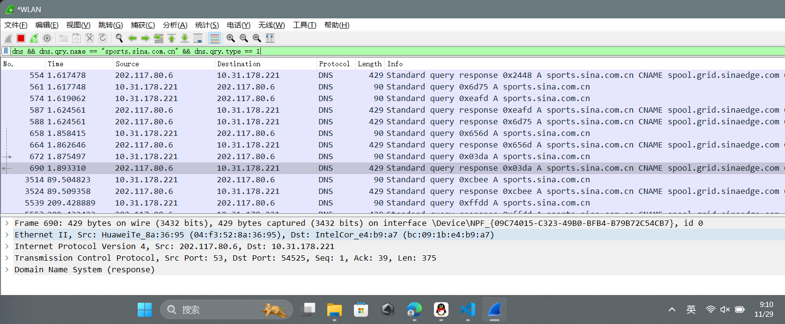

# 检查点

## 检查点一

### 1.DNS请求报文/应答报文的时序


dns && (dns.qry.name == "sports.sina.com.cn")

#### **请求与应答报文关系**

1. **请求报文：**
   - **报文编号 63**：
     - **源地址**：`10.31.178.221`（本地客户端）。
     - **目的地址**：`202.117.80.6`（DNS服务器）。
     - **查询域名**：`sports.sina.com.cn`。
     - **事务ID**：`0xd206`。

   - **报文编号 65**：
     - **源地址**：`10.31.178.221`。
     - **目的地址**：`202.117.80.6`。
     - **查询域名**：`www.sina.com.cn`。
     - **事务ID**：`0xc4ae`。

2. **应答报文：**
   - **报文编号 90**：
     - **源地址**：`202.117.80.6`（DNS服务器）。
     - **目的地址**：`10.31.178.221`（本地客户端）。
     - **响应域名**：`sports.sina.com.cn`。
     - **事务ID**：`0xd206`，与报文 `63` 匹配。
     - **解析结果**：
       - CNAME（别名）：`spool.grid.sinaedge.com`。
       - 子别名：`ww1.sinaedge.com`。

   - **报文编号 89**：
     - **源地址**：`202.117.80.6`。
     - **目的地址**：`10.31.178.221`。
     - **响应域名**：`www.sina.com.cn`。
     - **事务ID**：`0xc4ae`，与报文 `65` 匹配。
     - **解析结果**：
       - CNAME（别名）：`spool.grid.sina.com.cn`。

#### **时序关系**

1. **`sports.sina.com.cn` 的时序**：
   - 请求（报文 `63`）：时间为 `1.153461` 秒。
   - 应答（报文 `90`）：时间为 `1.168071` 秒。
   - **DNS时延**：`1.168071 - 1.153461 = 0.01461 秒`（约 14.61 毫秒）。

2. **`www.sina.com.cn` 的时序**：
   - 请求（报文 `65`）：时间为 `1.153534` 秒。
   - 应答（报文 `89`）：时间为 `1.168071` 秒。
   - **DNS时延**：`1.168071 - 1.153534 = 0.014537 秒`（约 14.54 毫秒）。

---

### 2.ARP请求报文/应答报文的时序


dns && dns.qry.name contains "sina.com.cn"

#### **请求报文**

1. **报文编号 1534**：
   - **类型**：ARP 请求 (`Who has 10.31.178.221? Tell 10.31.0.1`)。
   - **源 MAC 地址**：`HuaweiTe_8a:36:95`。
   - **目标 MAC 地址**：广播地址 `ff:ff:ff:ff:ff:ff`。
   - **源 IP 地址**：`10.31.0.1`。
   - **目标 IP 地址**：`10.31.178.221`。
   - **时间戳**：`12.439085` 秒。

2. **其他请求报文**：
   - 如报文编号 `2479` 和 `3555`，格式相同，分别请求目标设备的MAC地址。

---

#### **应答报文**

1. **报文编号 1535**：
   - **类型**：ARP 应答 (`10.31.178.221 is at bc:09:1b:e4:b9:a7`)。
   - **源 MAC 地址**：`IntelCor_e4:b9:a7`。
   - **目标 MAC 地址**：`HuaweiTe_8a:36:95`。
   - **源 IP 地址**：`10.31.178.221`。
   - **目标 IP 地址**：`10.31.0.1`。
   - **时间戳**：`12.439121` 秒。

2. **其他应答报文**：
   - 如报文编号 `2480` 和 `3556`，均返回相同的源 IP 和 MAC 地址信息。

---

#### **时序分析**

1. **ARP请求到应答的时延计算**：
   - 对于请求 `1534` 和应答 `1535`：
     - 应答时间：`12.439121` 秒。
     - 请求时间：`12.439085` 秒。
     - **时延**：`12.439121 - 12.439085 = 0.000036 秒（36 微秒）`。

2. **其他请求与应答时延**：
   - 请求 `2479` 与应答 `2480`。
   - 请求 `3555` 与应答 `3556`。
   - 每对请求和应答的时延均可以用同样的方法计算。

---

#### **总结信息**

1. **ARP 请求报文**：
   - 示例：编号 `1534`，查询 `10.31.178.221` 的 MAC 地址。
   - 源设备：`10.31.0.1`，MAC 地址 `HuaweiTe_8a:36:95`。

2. **ARP 应答报文**：
   - 示例：编号 `1535`，返回 `10.31.178.221` 的 MAC 地址 `bc:09:1b:e4:b9:a7`。
   - 源设备：`10.31.178.221`。

3. **时序**：
   - 示例：编号 `1534` 和 `1535` 之间的时延为 `36 微秒`。

### 3.建立TCP连接三次握手的时序



dns && dns.qry.name == "sports.sina.com.cn" && dns.qry.type == 1


tcp && ip.addr == 202.117.80.6

通过筛选 `tcp && ip.addr == 202.117.80.6`，我们可以找到目标IP地址的TCP流量，以下为三次握手的关键报文：

#### **1. SYN报文**

- **编号**：`601`
- **时间**：`1.631154 秒`
- **源地址**：`10.31.178.221`（客户端）
- **目标地址**：`202.117.80.6`（服务器）
- **信息**：

```wireshark
  [SYN] Seq=0 Win=64240 Len=0 MSS=1460 SACK_PERM=1
```

#### **2. SYN-ACK报文**

- **编号**：`602`
- **时间**：`1.631219 秒`
- **源地址**：`202.117.80.6`（服务器）
- **目标地址**：`10.31.178.221`（客户端）
- **信息**：

```wireshark
  [SYN, ACK] Seq=0 Ack=1 Win=64240 Len=0 MSS=1460 SACK_PERM=1
```

#### **3. ACK报文**

- **编号**：`604`
- **时间**：`1.631247 秒`
- **源地址**：`10.31.178.221`（客户端）
- **目标地址**：`202.117.80.6`（服务器）
- **信息**：

```wireshark
  [ACK] Seq=1 Ack=1 Win=130816 Len=0
```

#### **时序计算**

根据报文时间戳计算三次握手的时延：

1. **SYN -> SYN-ACK 时延**：

```math
   1.631219 - 1.631154 = 0.000065 秒（65 微秒）
```

1. **SYN-ACK -> ACK 时延**：

```math
   1.631247 - 1.631219 = 0.000028 秒（28 微秒）
```

1. **总握手时延**：

```math
   1.631247 - 1.631154 = 0.000093 秒（93 微秒）
```

---

#### **总结分析**

1. **三次握手报文信息**：
   - **SYN**：编号 `601`，时间 `1.631154` 秒，客户端发起连接请求。
   - **SYN-ACK**：编号 `602`，时间 `1.631219` 秒，服务器响应连接请求。
   - **ACK**：编号 `604`，时间 `1.631247` 秒，客户端确认连接。

2. **时延**：
   - **SYN -> SYN-ACK**：65 微秒。
   - **SYN-ACK -> ACK**：28 微秒。
   - **总时延**：93 微秒。

---

## 检查点二

发送端脚本

```python
import socket

# 创建UDP套接字
sock = socket.socket(socket.AF_INET, socket.SOCK_DGRAM)
sock.setsockopt(socket.SOL_SOCKET, socket.SO_BROADCAST, 1)

# 广播的目标地址和端口
broadcast_address = "192.168.213.255"  # 广播地址
port = 9999  # 广播的端口号

# 广播内容
message = b"This is a test broadcast from 192.168.213.192"
sock.sendto(message, (broadcast_address, port))

print(f"Broadcast message sent to {broadcast_address}:{port}")

```


根据截图内容，这里是对捕获数据包的详细分析：

---

### **关键数据包信息**

**目标包编号**：`2643`  
**协议**：`UDP`  
**源地址**：`192.168.213.192`（发送端）  
**目标地址**：`192.168.213.255`（广播地址）  
**目标MAC地址**：`FF:FF:FF:FF:FF:FF`（广播MAC地址）  
**源MAC地址**：`08-8E-90-F4-67-3F`（发送端的MAC地址）  
**目标端口**：`9999`（发送程序指定的端口）  
**数据长度**：`45 bytes`  
**消息内容**：`This is a test broadcast from 192.168.213.192`  

#### **1. Ethernet II 层（以太网层）**

- **源MAC地址**：`08-8E-90-F4-67-3F`
  - 发送端的网卡物理地址。
- **目标MAC地址**：`FF:FF:FF:FF:FF:FF`
  - 典型广播地址，表示数据包将被子网内的所有设备接收。
- **类型**：`IPv4`
  - 说明这是一个IPv4数据包。

---

#### **2. IPv4 层**

- **源IP地址**：`192.168.213.192`
  - 发送端的IP地址。
- **目标IP地址**：`192.168.213.255`
  - 子网广播地址（由子网掩码 `255.255.255.0` 计算得出）。
- **协议类型**：`UDP`
  - 数据包使用UDP协议传输。

---

#### **3. UDP 层**

- **源端口**：`56541`
  - 发送端随机分配的临时端口。
- **目标端口**：`9999`
  - 数据包发送到的端口号，由广播程序指定。
- **数据长度**：`45 bytes`
  - 包含UDP头和数据部分。

---

#### **4. 数据层**

- 数据内容：`This is a test broadcast from 192.168.213.192`
  - 表示发送端广播的数据内容，清楚地标识了发送端的来源。

---

#### **捕获内容验证**

1. **广播流量验证**：
   - **目标MAC地址**是广播地址 `FF:FF:FF:FF:FF:FF`，目标IP地址是 `192.168.213.255`，符合广播的特征。
   - 数据包成功到达接收端并被捕获，说明广播发送和接收功能正常。

2. **协议完整性验证**：
   - Ethernet II 层 -> IPv4 层 -> UDP 层 -> 数据层，协议栈信息完整且无错误。
   - UDP包的源端口和目标端口正常，数据长度符合预期。

3. **数据内容验证**：
   - 数据内容 `This is a test broadcast from 192.168.213.192` 与发送程序中的广播消息一致。

---

