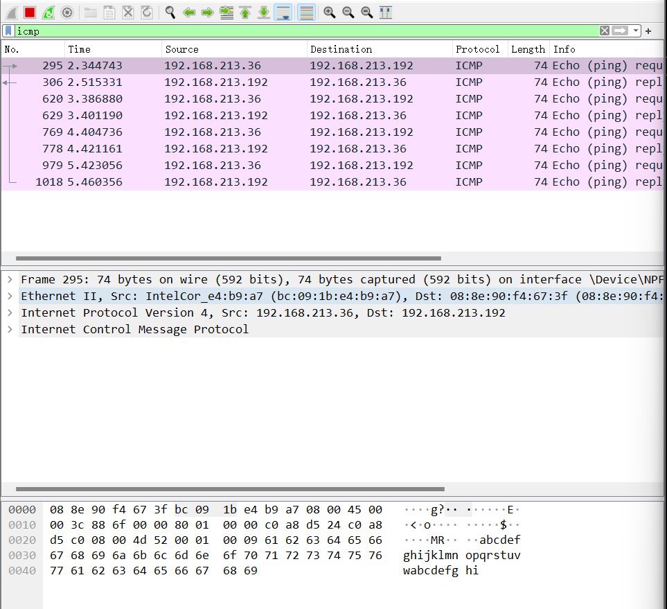
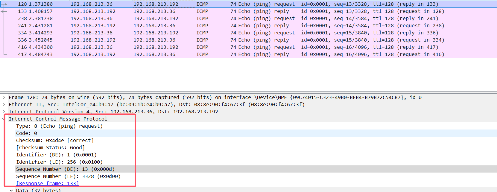
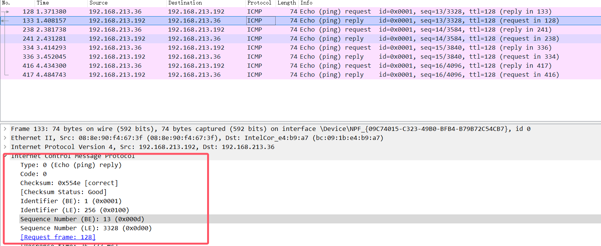

# 计网实验四

 
---

### 检查点一

#### 1. 使用wireshark抓取数据包

检查点一内容如下：

双方的ip地址分别是：

192.168.213.192
192.168.213.36

使用icmp过滤条件

根据截图中的信息，以下是完成检查点一的详细步骤：

#### 1.1
1. **捕获 ICMP 报文**
   - 使用 Wireshark 过滤器 `icmp`，找到 ICMP ECHO 请求和回复报文。

2. **查看报文详情**
   - 选择一个 ICMP ECHO 请求报文（如图中第一条time：295）。
  
3. **分析 IP 报文首部**
   - **源 IP 地址**: 192.168.213.36
   - **目标 IP 地址**: 192.168.213.192
   - **TTL（生存时间）**: 检查 TTL 值为128，取决于操作系统

4. **分析 ICMP 报文首部**
   - **类型**: 8（表示 ECHO 请求）
   - **代码**: 0
   - **校验和**: 验证校验和是否正确。

5. **数据部分**
   - 检查数据部分的内容，通常是一些字母或数字（如图中显示的 `abcdef...`）。

6. **验证一致性**
   - 确认发送的 ICMP ECHO 请求报文与接收到的报文在字段上是否一致。
   - 检查 IP 报文首部的变化，特别是 TTL 值是否减少。

根据截图中的信息，以下是对第一个 ICMP ECHO 请求报文和其回复的分析：

#### 1.2

1. **ICMP ECHO 请求报文**
   - **源 IP 地址**: 192.168.213.36
   - **目标 IP 地址**: 192.168.213.192
   - **类型**: 8（ECHO 请求）
   - **序列号**: 13
   - **TTL**: 128

2. **ICMP ECHO 回复报文**
   - **源 IP 地址**: 192.168.213.192
   - **目标 IP 地址**: 192.168.213.36
   - **类型**: 0（ECHO 回复）
   - **序列号**: 13
   - **TTL**: 128

一致性验证

- **IP 地址**: 请求和回复的源和目标 IP 地址互换，符合 ICMP 协议的预期行为。
- **类型和代码**: 请求为类型 8，代码 0；回复为类型 0，代码 0，符合 ICMP ECHO 请求/回复的标准。
- **序列号**: 请求和回复的序列号一致（9），表明是同一对请求和回复。
- **TTL**: 请求和回复的 TTL 值相同（128），表示在同一网络中传输，没有经过路由器。

 

