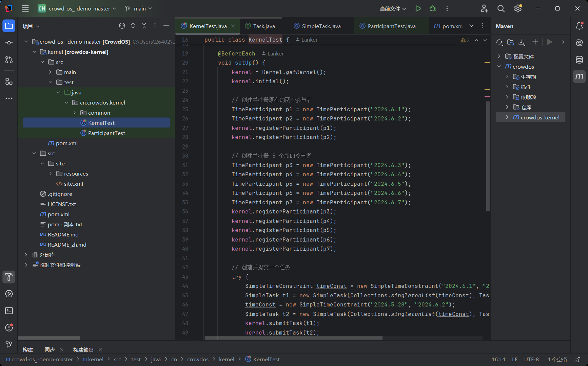
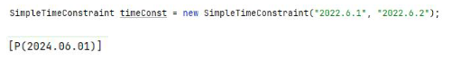

# 群智计算系统实验第一周总结报告

 

---


## 1. 实验目的

1. 配置 Java 开发环境及开发工具。
2. 使用 Java 编程语言实现简单的任务分配系统。
3. 熟悉 CrowdOS 系统框架，并实现基于时间和 POI（兴趣点）条件的任务分配。
4. 掌握任务调度与分配算法的原理及其实现。

## 2. 实验环境

- **操作系统**：Windows 10
- **开发工具**：IntelliJ IDEA Community Edition
- **编程语言**：Java 21
- **其他软件**：CrowdOS demo，JDK 21

## 3. 实验步骤

### 3.1 配置开发环境

1. **安装 JDK**：下载并安装 JDK 21，配置环境变量 `JAVA_HOME` 和 `CLASSPATH`，确保可以在命令行中正常运行 `java --version`。
2. **安装 IDEA**：下载并安装 IntelliJ IDEA 社区版，用于编写和调试 Java 代码。
3. **下载 CrowdOS**：从 Gitee 下载 CrowdOS 的 demo 项目，并在 IDEA 中打开该项目。

### 3.2 简单任务——熟悉 Java 与面向对象

1. 创建一个 `Task` 类，包含任务名称、参与者和任务进行的时间段。
2. 创建一个 `Participant` 类，包含名字、空闲时间等属性，并实现 `toString` 方法。
3. 为 `Task` 类设计方法：
   - `canAssignTo()`：判断参与者是否可以参与任务，基于参与者的空闲时间与任务时间段的对比。
   - `addParticipant()`：将满足条件的参与者添加到任务的参与者列表中。
4. 设计一个主函数，用于创建任务与参与者并进行任务分配。

### 3.3 任务 2——熟悉 CrowdOS

1. 打开 `CrowdOS_Demo` 项目，熟悉项目结构，并创建多个 `TimeParticipant` 对象，注册到 `CrowdKernel` 中。
2. 创建并提交任务，设置时间约束，并查看任务推荐情况。
3. 通过调试代码，了解任务分配的逻辑，重点分析 `Kernel`、`Scheduler`、`AlgoFactoryAdapter` 等类中的方法。

### 3.4 任务 3——POI 限制的任务分配

1. 创建 `PoiParticipant` 类，该类基于参与者的地理位置（经纬度）来参与任务。
2. 在 `ParticipantTest` 类中实现 POI 限制的任务分配，将 POI 条件与参与者状态进行匹配。
3. 根据任务的需求，选择合适的参与者，并进行任务分配。

### 3.5 附加任务

在完成基本任务后，尝试自定义更复杂的任务分配条件，例如同时限制时间和地点，探究任务分配的深层逻辑。

## 4. 代码实现

### 4.1 TimeParticipant 类代码实现

```java
public class TimeParticipant extends AbstractParticipant {
    @ability
    final DateCondition activeTime;
    private final SimpleDateFormat format;

    public TimeParticipant(String time) {
        format = new SimpleDateFormat("yyyy.MM.dd");
        try {
            this.activeTime = new DateCondition(format.parse(time).getTime());
        } catch (ParseException e) {
            throw new RuntimeException(e);
        }
        status = ParticipantStatus.AVAILABLE;
    }

    @Override
    public boolean hasAbility(Class<? extends Condition> conditionClass) {
        return conditionClass == DateCondition.class;
    }

    @Override
    public Condition getAbility(Class<? extends Condition> conditionClass) {
        if (!hasAbility(conditionClass))
            return null;
        else return activeTime;
    }

    @Override
    public String toString() {
        return "P(" + format.format(activeTime) + ")";
    }
}
```

### 4.2 PoiParticipant 类代码实现

```java
public class PoiParticipant extends AbstractParticipant {
    @ability
    final PoiCondition activePoi; // POI条件

    public PoiParticipant(double latitude, double longitude) {
        this.activePoi = new PoiCondition(latitude, longitude); // 初始化 POI 条件
        status = ParticipantStatus.AVAILABLE;
    }

    @Override
    public boolean hasAbility(Class<? extends Condition> conditionClass) {
        return conditionClass == PoiCondition.class;
    }

    @Override
    public Condition getAbility(Class<? extends Condition> conditionClass) {
        if (!hasAbility(conditionClass)) 
            return null;
        else return activePoi; 
    }

    @Override
    public String toString() {
        return "PoiParticipant{" + "latitude=" + activePoi.getLatitude() + ", longitude=" + activePoi.getLongitude() + "}";
    }
}
```

## 5. 实验结果

通过以上实验步骤，使用 CrowdOS 框架时，能够通过 POI 和时间条件进行任务分配，并根据实际的参与者能力判断是否可以参与任务。

代码示例：



## 6. 实验总结

本实验使我深入理解了 Java 面向对象的基本概念以及如何将这些概念应用到实际的任务分配系统中。在实验过程中，我不仅学会了如何配置开发环境，还通过任务分配系统的实现，掌握了如何通过条件（时间和地点）来选择参与者进行任务分配。同时，通过调试 CrowdOS 源码，我加深了对任务调度与分配逻辑的理解。


## 7.探究问题

如图所示，为什么任务要求时间是”2024.6.1-2024.6.2”,推荐结果只有”P(2024.6.1)”1 个参与者？试着找出对应代码段！



解：
 
## 问题分析：
 

1. **日期解析和比较**：
   在 `SimpleTimeConstraint` 构造函数中，日期字符串被解析为 `Date` 对象后，进行比较以确保 `startDate` 小于 `endDate`：

   ```java
   if (startDate.compareTo(endDate) >= 0) throw new InvalidConstraintException();
   ```

   如果参与者的时间不在任务的日期范围内，系统不会将其分配给该任务。比如，若任务的时间要求为 `"2024.6.1-2024.6.2"`，而参与者的时间为 `"2024.6.1"`，只有当参与者的时间准确匹配任务的时间段时，才会被分配到该任务。

3. **任务推荐与参与者匹配**：
   由于只有一个参与者时间 `"2024.6.1"`，且任务时间范围也是从 `"2024.6.1"` 开始到 `"2024.6.2"`，所以推荐结果中仅有这个参与者。这是因为任务和参与者的时间段有交集，而任务推荐算法根据这个交集进行了分配。

## 解决方法：
1. **修正日期格式**：
   为了正确解析类似 `"2024.6.1"` 这样的日期字符串，可以修改 `SimpleDateFormat` 为适应这种格式，使用 `"yyyy.M.d"` 作为日期格式：

   ```java
   SimpleDateFormat simpleDateFormat = new SimpleDateFormat("yyyy.M.d");
   ```

   这样，`2024.6.1` 和 `2024.6.2` 就可以被正确解析为 `Date` 对象。