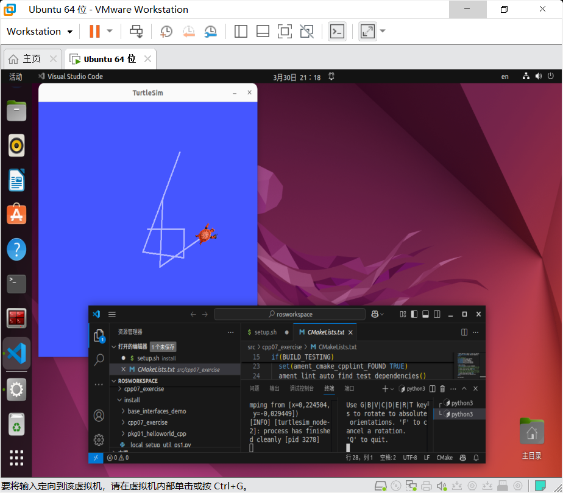
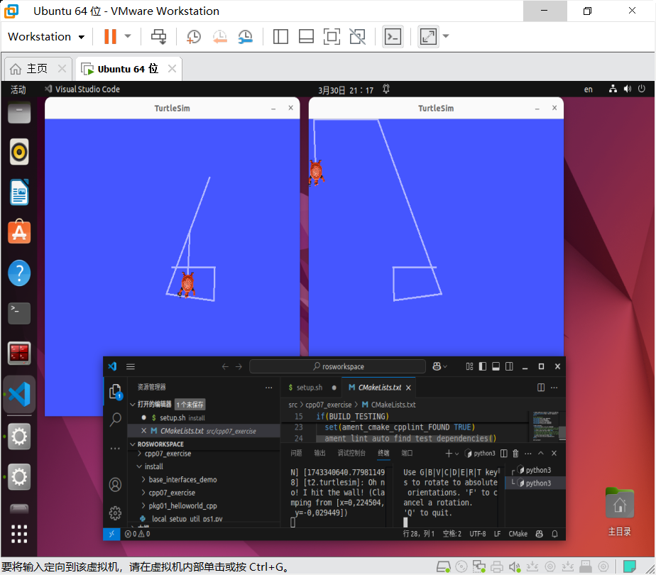

# 群智计算系统实验第二周总结报告


## 实验目的
1. 掌握虚拟机环境搭建与配置
2. 完成Ubuntu系统的安装部署
3. 实现ROS2开发环境配置
4. 验证群智计算系统基础组件的协同工作

---

## 实验环境准备

### 1. 虚拟机环境准备
```bash
# 下载虚拟机
https://www.vmware.com/products/desktop-hypervisor/workstation-and-fusion
```

### 2. Ubuntu22.04+ ROS 2 Humble Hawksbill 
```bash
# 使用中科大镜像
https://mirrors.ustc.edu.cn/ubuntu-releases/22.04.5/
# 启动仿真控制台
ROS 2 Humble Hawksbill文档
https://docs.ros.org/en/humble/Installation/Ubuntu-Install-Debs.html
```

以下总结了一个安装文档：

[ros2安装文档](./src/ros2安装.md)

  
---

## 实验步骤
  
 
## 一、基础环境验证

### 1.1 小乌龟案例测试
```bash
# 终端1 - 启动乌龟仿真器
ros2 run turtlesim turtlesim_node

# 终端2 - 启动键盘控制节点
ros2 run turtlesim turtle_teleop_key
```


**操作说明**：保持终端2焦点，使用方向键控制乌龟移动


## 二、开发环境配置

### 2.1 安装构建工具
```bash
sudo apt install python3-colcon-common-extensions
```

### 2.2 VSCode插件推荐
1. C++ 扩展包
2. Python 扩展
3. ROS 插件
4. CMake Tools

## 三、工作空间创建

### 3.1 初始化工作空间
```bash
mkdir -p ~/rosworkspace/src
cd ~/rosworkspace
colcon build
```

目录结构说明：
```
rosworkspace/
├── build/    # 编译中间文件
├── install/  # 安装目录
├── log/      # 日志文件
└── src/      # 源码目录
```

## 四、HelloWorld案例实现

### 4.1 C++版本实现

#### 创建功能包
```bash
cd ~/rosworkspace/src
ros2 pkg create demo_cpp --build-type ament_cmake --dependencies rclcpp
```

#### 关键代码 (`src/helloworld.cpp`)
```cpp
#include "rclcpp/rclcpp.hpp"

class HelloWorldNode : public rclcpp::Node {
public:
    HelloWorldNode() : Node("hello_world") {
        RCLCPP_INFO(this->get_logger(), "Hello ROS 2!");
    }
};

int main(int argc, char ** argv) {
    rclcpp::init(argc, argv);
    auto node = std::make_shared<HelloWorldNode>();
    rclcpp::spin(node);
    rclcpp::shutdown();
    return 0;
}
```

#### 编译与运行
```bash
colcon build --packages-select demo_cpp
source install/setup.bash
ros2 run demo_cpp hello_world
```

## 五、进阶案例：镜像乌龟控制

### 5.1 创建功能包
```bash
ros2 pkg create mirror_turtle --build-type ament_cmake \
--dependencies rclcpp turtlesim geometry_msgs
```

### 5.2 核心逻辑实现

#### 订阅者-发布者模式
```cpp
// 订阅turtle1的位姿
auto pose_sub = create_subscription<turtlesim::msg::Pose>(
    "/turtle1/pose", 10,
    [this](const turtlesim::msg::Pose::SharedPtr msg) {
        // 发布反向控制指令到turtle2
        auto twist = geometry_msgs::msg::Twist();
        twist.linear.x = msg->linear_velocity;
        twist.angular.z = -msg->angular_velocity; // 反向
        cmd_pub_->publish(twist);
    });
```

### 5.3 Launch文件集成
```python
from launch import LaunchDescription
from launch_ros.actions import Node

def generate_launch_description():
    return LaunchDescription([
        Node(
            package='turtlesim',
            executable='turtlesim_node',
            name='turtle1'
        ),
        Node(
            package='turtlesim',
            executable='turtlesim_node',
            namespace='turtle2'
        ),
        Node(
            package='mirror_turtle',
            executable='mirror_node'
        )
    ])
```

### 5.4 编译与测试
```bash
colcon build --packages-select mirror_turtle
ros2 launch mirror_turtle mirror.launch.py
# 新终端运行键盘控制
ros2 run turtlesim turtle_teleop_key
```



## 六、调试技巧

### 6.1 常用调试命令
```bash
# 查看节点列表
ros2 node list

# 查看话题列表
ros2 topic list

# 查看话题内容
ros2 topic echo /turtle1/pose

# 可视化计算图
rqt_graph

```

### 6.2 VSCode调试配置

1. 添加`launch.json`配置
2. 使用`CMake Tools`配置构建任务
3. 利用ROS插件查看节点拓扑


## 七、常见问题解决

1. **依赖缺失**：通过`rosdep install`安装缺失依赖
2. **编译错误**：检查`CMakeLists.txt`和`package.xml`的依赖声明
3. **节点通信失败**：确认话题名称和类型匹配
4. **Launch文件错误**：使用`--debug`参数调试

 
---
 
 

## 常见问题解决
1. **虚拟机打开就蓝屏win报错为SYSTEM_SERVICE_EXCEPTION**
   - 解决方案：参考下面链接中的解决
   [虚拟机蓝屏报错解决]([https://blog.csdn.net/m0_49019274/article/details/120176784 "蓝屏solution")
    

2. **APT软件包依赖问题**
   ```bash
   # 修复损坏的软件包
   sudo apt-get install -f
   # 清理缓存并更新
   sudo apt-get clean && sudo apt-get update
   ```

3. **ROS2环境变量失效**
   ```bash
   echo "source /opt/ros/humble/setup.bash" >> ~/.bashrc
   ```


---

Author: **liulanker**  
Date: 2025-03-30  
Contact: liulanker@gmail.com
 