# 群智计算系统第三周实验-基于Android的群智计算管理APP

 

---

### 实验目的

- 熟悉群智感知计算框架与原理
- 熟悉Android Stdio设计app应用
- 熟悉Cursor，cline等AIagent进行协助编程


### 实验配置

- AndroidAPI版本 : API21，支持Android5.0及以上（涵盖99.7%的机型）
- 编写语言：Java
- 虚拟机设置：x86_64架构
- 构建配置语言：Kotlin DSL (build.gradle.kts) [Recommended]

### 项目架构
- 实验要求编写一个基于Android的群智计算管理APP，在参考福州大学的移动群智app后，我结合自己的理解设计了如下的app架构：

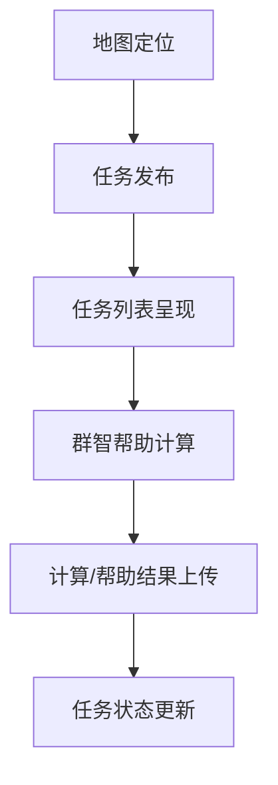

 
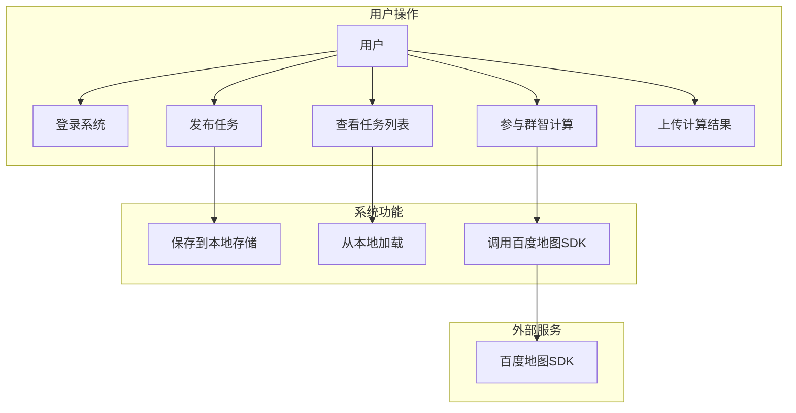
### 实验步骤

1. 下载安装Android Stdio

通过参考博客[Android Stdio下载安装教程](https://blog.csdn.net/qq_40280673/article/details/137072948?fromshare=blogdetail&sharetype=blogdetail&sharerId=137072948&sharerefer=PC&sharesource=LLH004&sharefrom=from_link)完成工具的安装与下载

2. 配置对应ide，由于Cursor在版本更新后，使用AIagent代理调用api会出现访问次数的限制和账号的限制，这里可以结合AS中自带的Gemini和VScode中配置Cline插件，导入deepseek的api对deepseek-r1进行调用，用来完成编码任务：

效果如下：

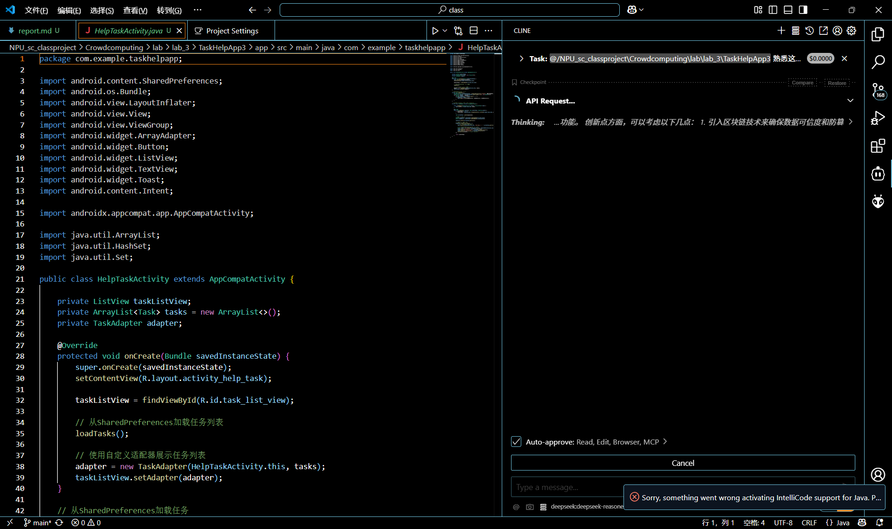

来助力编程


3.在as中创建空项目，等待依赖下载完毕后，设计对应的app架构，依靠ai进行协助编程

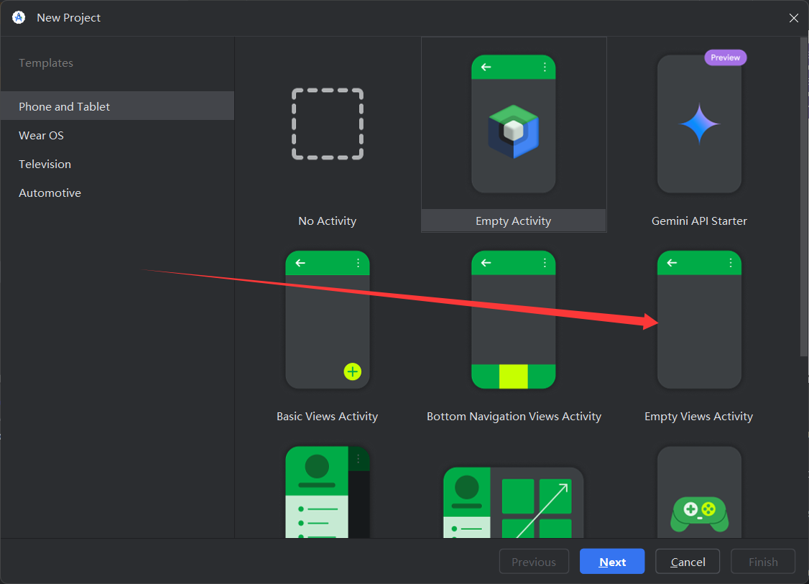 

详细配置如下

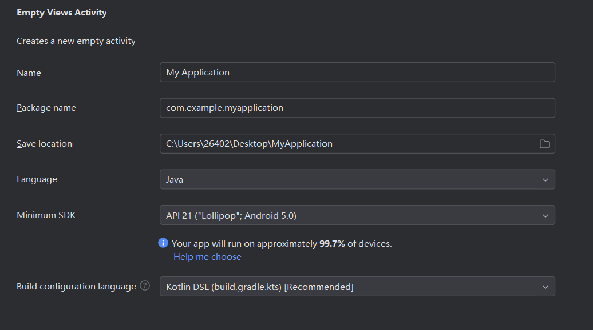  


4.由于百度的sdk开发包申请需要1-3个工作日，所以我先行对布局进行设计，

初版的设计如下：

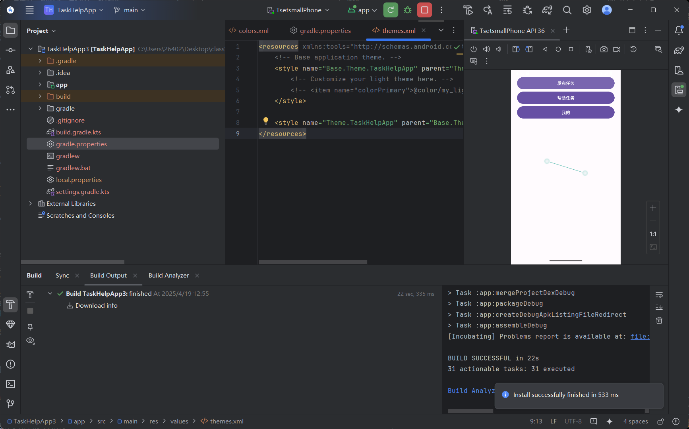  

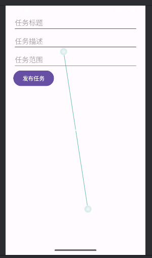
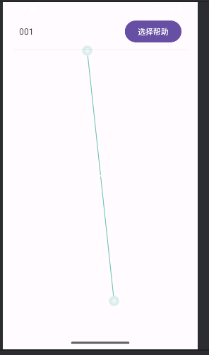
 

前端方面：

- 完成主要模块按钮的布局设计
- 完成主要的功能页面跳转

后端方面:
- 实现了基于SharedPreferences的本地任务存储系统，支持任务数据的持久化
```Java
// 从SharedPreferences加载任务
    private void loadTasks() {
        SharedPreferences sharedPreferences = getSharedPreferences("TaskData", MODE_PRIVATE);
        Set<String> tasksSet = sharedPreferences.getStringSet("tasks", new HashSet<>());
        for (String taskData : tasksSet) {
            String[] taskDetails = taskData.split(" \\| ");
            if (taskDetails.length == 3) {
                tasks.add(new Task(taskDetails[0], taskDetails[1], taskDetails[2]));
            }
        }
    }

```

- 完成Task数据模型封装，包含标题、描述、位置三要素

```Java
public class Task {
    private String title;
    private String description;
    private String location;

    public Task(String title, String description, String location) {
        this.title = title;
        this.description = description;
        this.location = location;
    }

    public String getTitle() {
        return title;
    }

    public String getDescription() {
        return description;
    }

    public String getLocation() {
        return location;
    }
}

 
```
- 构建自定义TaskAdapter实现动态任务列表渲染


```Java
public View getView(int position, View convertView, ViewGroup parent) {
        if (convertView == null) {
            convertView = LayoutInflater.from(context).inflate(R.layout.task_item_layout, parent, false);
        }

        Task task = tasks.get(position);

        TextView taskTitleTextView = convertView.findViewById(R.id.task_title);
        TextView taskDescriptionTextView = convertView.findViewById(R.id.task_description);
        TextView taskLocationTextView = convertView.findViewById(R.id.task_location);
        CheckBox taskCheckBox = convertView.findViewById(R.id.task_checkbox);

        taskTitleTextView.setText(task.getTitle());
        taskDescriptionTextView.setText(task.getDescription());
        taskLocationTextView.setText(task.getLocation());

        taskCheckBox.setChecked(false); // 默认不选中

        return convertView;
    }

```
- 实现任务状态管理机制，通过Intent进行跨Activity数据传递

```Java
private void publishTask() {
        String taskTitle = taskTitleEditText.getText().toString();
        String taskDescription = taskDescriptionEditText.getText().toString();
        String taskRange = taskRangeEditText.getText().toString();

        if (taskTitle.isEmpty() || taskDescription.isEmpty() || taskRange.isEmpty()) {
            Toast.makeText(this, "请填写完整任务信息", Toast.LENGTH_SHORT).show();
            return;
        }

        // 将任务保存到SharedPreferences
        SharedPreferences sharedPreferences = getSharedPreferences("TaskData", MODE_PRIVATE);
        SharedPreferences.Editor editor = sharedPreferences.edit();

        // 获取已存在的任务列表
        Set<String> tasksSet = sharedPreferences.getStringSet("tasks", new HashSet<>());
        tasksSet.add(taskTitle + " | " + taskDescription + " | " + taskRange);

        // 保存更新后的任务列表
        editor.putStringSet("tasks", tasksSet);
        editor.apply();

        // 任务发布后返回主界面
        Toast.makeText(this, "任务 '" + taskTitle + "' 发布成功!", Toast.LENGTH_SHORT).show();
        finish(); // 结束当前Activity，返回主界面
    }
}

```
- 开发任务详情查看功能，支持任务参数的序列化传输
```Java
// HelpTaskDetailActivity.java 接收任务参数
public class HelpTaskDetailActivity extends AppCompatActivity {
    @Override
    protected void onCreate(Bundle savedInstanceState) {
        super.onCreate(savedInstanceState);
        setContentView(R.layout.activity_task_detail);

        TextView titleView = findViewById(R.id.task_title);
        TextView descView = findViewById(R.id.task_description);
        TextView locView = findViewById(R.id.task_location);

        // 从Intent获取序列化参数
        Intent intent = getIntent();
        titleView.setText(intent.getStringExtra("taskTitle"));
        descView.setText(intent.getStringExtra("taskDescription"));
        locView.setText(intent.getStringExtra("taskLocation"));
    }
}
```

- 建立基于HashSet的任务去重机制，避免重复任务加载
```Java
// 使用HashSet特性自动去重
Set<String> tasksSet = new HashSet<>(sharedPreferences.getStringSet("tasks", new HashSet<>()));

// 添加新任务时自动过滤重复项
if (!tasksSet.contains(taskIdentifier)) {
    tasksSet.add(taskIdentifier);
    editor.putStringSet("tasks", tasksSet);
}
```


5.经过优化设计，添加用户登录界面处理：

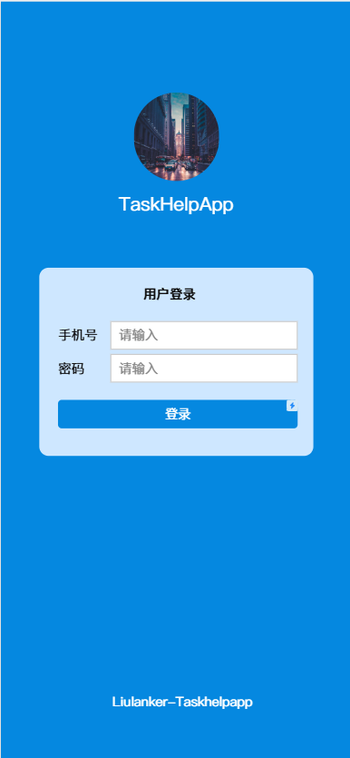

再对主界面的布局进行优化，考虑后续加入地图框架进行定位：

为百度地图预留地图显示位置：

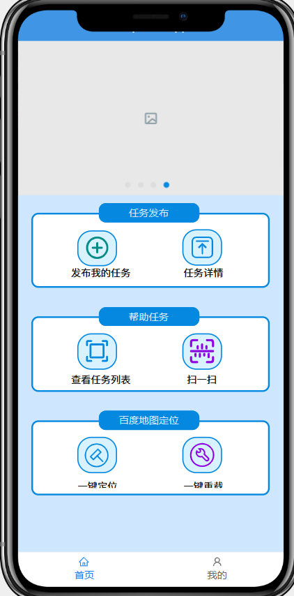

6. 在百度开发sdk平台申请sdk，注册个体并进行实名认证，以学生身份获得免费的AK进行app开发：


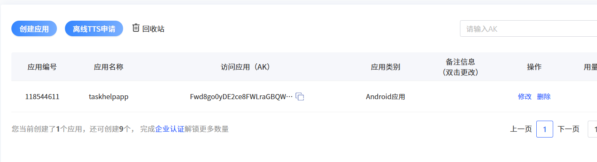


在下载后解压导入到app/lib中，并在配置中加入百度jar依赖
```json
dependencies {
    // 引入百度 SDK JAR 文件
    implementation(files("libs/BaiduLBS_Android.jar"))

    implementation("androidx.appcompat:appcompat:1.3.1")
    implementation("com.google.android.material:material:1.6.0") // 更新为支持 Material3 的版本
    implementation("androidx.constraintlayout:constraintlayout:2.1.0")
    implementation("androidx.recyclerview:recyclerview:1.2.1")
    testImplementation("junit:junit:4.13.2")
    androidTestImplementation("androidx.test.ext:junit:1.1.3")
    androidTestImplementation("androidx.test.espresso:espresso-core:3.4.0")
}
```

同时，阅读百度定位sdk的调用接口文档，后端更新对应的定位逻辑

```Java
import com.baidu.mapapi.map.BaiduMap;
import com.baidu.mapapi.map.MapView;
import com.baidu.mapapi.map.MyLocationConfiguration;
import com.baidu.mapapi.map.MyLocationData;
import com.baidu.mapapi.model.LatLng;
import com.baidu.mapapi.map.MapStatus;
import com.baidu.mapapi.map.MapStatusUpdateFactory;
import com.baidu.mapapi.CoordType;
import com.baidu.mapapi.SDKInitializer;
import com.baidu.location.BDLocation;
import com.baidu.location.BDLocationListener;
import com.baidu.location.LocationClient;
import com.baidu.location.LocationClientOption;

public class MainActivity extends AppCompatActivity {

    static {
        System.loadLibrary("BaiduMapSDK_base_v7_6_4");
        System.loadLibrary("BaiduMapSDK_map_v7_6_4"); // 如果需要，也加载地图相关的库
    }

    private Button publishTaskButton;
    private Button helpTaskButton;
    private Button profileButton;
    private Button locateButton;  // 定位按钮
    private MapView mapView;
    private BaiduMap baiduMap;

    // 定位相关
    private LocationClient mLocationClient;
    private BDLocationListener mBDLocationListener;

    @Override
    protected void onCreate(Bundle savedInstanceState) {
        super.onCreate(savedInstanceState);
        setContentView(R.layout.activity_main);

        // 百度地图 SDK 初始化
        SDKInitializer.initialize(getApplicationContext());
        SDKInitializer.setCoordType(CoordType.BD09LL);  // 设置坐标类型为 BD09

        // 获取控件
        publishTaskButton = findViewById(R.id.publish_task_button);
        helpTaskButton = findViewById(R.id.help_task_button);
        profileButton = findViewById(R.id.profile_button);
        locateButton = findViewById(R.id.locate_button);  // 定位按钮

        // 初始化地图
        mapView = findViewById(R.id.map_view);
        baiduMap = mapView.getMap();
        baiduMap.setMyLocationEnabled(true);

        // 设置定位模式
        baiduMap.setMyLocationConfiguration(new MyLocationConfiguration(
                MyLocationConfiguration.LocationMode.NORMAL, true, null));

        // 初始化定位客户端
        try {
            mLocationClient = new LocationClient(getApplicationContext());
        } catch (Exception e) {
            throw new RuntimeException(e);
        }


```

前端为map的展示预留窗口设计：

```xml
<!-- 添加 MapView 控件 -->

    <!-- 定位按钮 -->
    <com.baidu.mapapi.map.MapView
        android:id="@+id/map_view"
        android:layout_width="match_parent"
        android:layout_height="443dp" />

    <Button
        android:id="@+id/locate_button"
        android:text="定位"
        android:layout_width="match_parent"
        android:layout_height="wrap_content"
        android:layout_marginTop="20dp" />


```

但在开发过程中，发现出现问题：

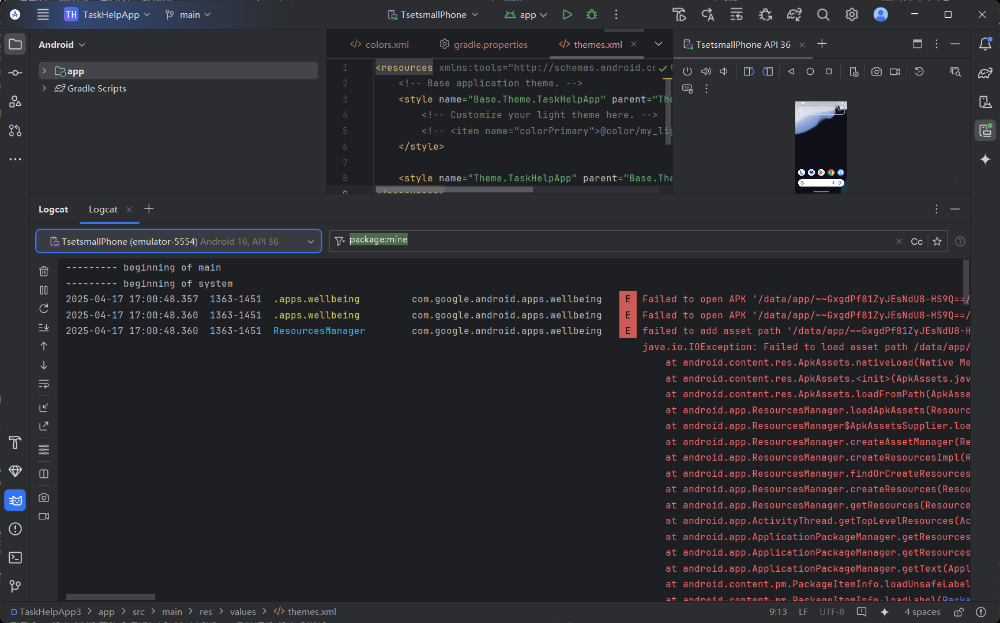
```bash
Failed to resolve: com.baidu.mapapi:map-sdk:6.3.0
<a href="open.dependency.in.project.structure">Show in Project Structure dialog</a>
<a href="Unresolved dependencies">Show Details</a>
Affected Modules: <a href="openFile:C:/Users/26402/Desktop/AndroidPro/MyApplication2/app/build.gradle.kts">app</a>
<a href="explain.issue">>> Ask Gemini</a>
```

询问gpt：

        从你提供的日志信息来看，问题出在应用启动时的布局文件中 MapView 组件的初始化。
        具体的错误是 Error inflating class com.baidu.mapapi.map.MapView，
        这通常发生在应用尝试加载地图视图时，但由于百度地图 SDK 已被禁用，MapView 
        类无法正确加载，从而导致 InflateException。

多次调试仍然无法正确连接baidu定位sdk，目前app设计在一周后停留在地图的嵌入阶段；

---


## 实验反思：

- Android开发需要兼容map定位相关的sdk时，因为限制原因往往无法调用google原生的map定位系统，这使得新手地图开发任务出现很大的困难。
- 商用的企业sdk申请周期长，调用复杂，稳定性不高，在借助ai辅助开发时，其接口设计与原生Google存在差异，这也是Ai无法正确编译代码的主要原因。同时加密验证机制过多：即需要AK注册也需要sha1+package包名验证，学习成本高

- 布局设计方面可以通过使用开源在线设计网站对界面进行设计，这样大大简化了设计流程与学习成本，也能提高应用的美观性
- 后端开发主要是需要对类的封装与调用逻辑，在publishtask类中，因为多次初始化task，很容易出现内存泄漏，而在任务列表中无法加载或者导致虚拟机崩溃，因此需要注意类的接口设计与初始化次数
    - 解决方法：在主活动类中初始化一次，只留给其他接口函数调用添加或者删除任务信息即可

---


## 探索点：

在app设计中：

- 通过调用Baidu地图的开发工具sdk，使用其中的地图定位功能
- 通过对as设计app的理解与运用，对app布局用xml语言进行设计与架构
- 抓取localcat的调试报错详细，向AI提问修改

任务管理与存储机制： 

- 基于SharedPreferences实现本地任务存储，支持任务的去重和状态管理。

---


## 实验收获

&nbsp;&nbsp;&nbsp;&nbsp;&nbsp;&nbsp;通过本次实验，掌握了Android开发中任务管理系统的设计与基本实现，尤其是如何在Android Studio中进行SDK集成与调试。了解了使用百度地图SDK的开发流程，尽管遇到了一些技术难题，但也为后续开发积累了宝贵经验。


---

