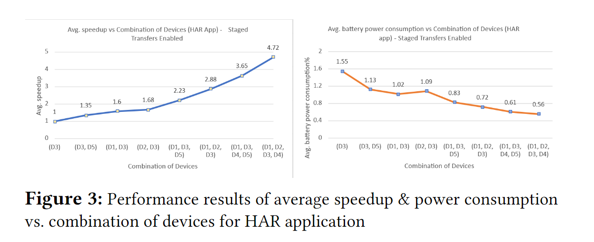

# 论文分析作业
 

---

### 论文解读

&nbsp;&nbsp;&nbsp;&nbsp;&nbsp;&nbsp;这篇论文介绍了一种名为**Honeybee-T**的协作移动众计算框架，旨在解决移动设备在执行复杂任务时的资源限制问题。通过利用周围移动设备的计算资源，Honeybee-T框架能够在没有持续互联网连接或中央基础设施支持的情况下，实现任务的分布式计算。实验结果表明，与单一执行大型计算密集型任务相比，使用Honeybee-T框架可以显著提高性能并节省能源。

#### Honeybee-T 框架介绍

**Honeybee-T** 是一个协作式移动众计算框架，旨在解决移动设备在执行复杂任务时的资源限制问题。该框架通过利用周围移动设备的计算资源，实现任务的分布式计算，特别适用于网络连接不稳定或边缘计算资源不可用的场景。

- 1.**框架背景**

    移动设备的计算能力和电池寿命有限，尤其是在执行复杂任务（如视频编辑、数据分析等）时，资源需求较高。传统的解决方案是将任务卸载到云端或边缘计算资源，但这些方法存在延迟、带宽限制、高成本和网络连接不稳定等问题。Honeybee-T 提出了一种新的解决方案，即通过移动设备之间的协作计算，形成一个本地移动设备资源云（Mobile Crowd Computing, MCdC），充分利用周围设备的计算能力。

- 2.**核心思想**

    Honeybee-T 的核心思想是通过**工作窃取算法**（Work-Stealing Algorithm）实现任务的动态分配和执行。具体来说，框架将一个复杂的计算任务分解为多个小任务（jobs），并将这些任务放入一个共享的**任务池**（job pool）中。周围的移动设备（称为**工作设备**，workers）可以从任务池中"窃取"任务块，并根据自身的计算能力执行这些任务。任务执行完成后，结果会返回给**委托设备**（delegator），委托设备负责整合所有结果并继续调度剩余任务。

-  3.**任务依赖性的处理**

    Honeybee-T 的一个重要创新是引入了**任务依赖性**的概念。在许多实际应用中，任务之间可能存在依赖关系，即某些任务的执行依赖于其他任务的结果。Honeybee-T 通过任务依赖性的管理，确保在任务调度时能够正确处理任务间的依赖关系，避免任务阻塞。具体来说，框架会确保依赖任务在前置任务完成后才能被调度执行。

- 4.**系统组件**

    - **任务池（Job Pool）**：用于存储分解后的小任务（jobs）。委托设备将复杂任务分解为多个小任务，并将这些任务放入任务池中，供工作设备窃取和执行。
  
    - **握手协议（Handshake）**：用于设备之间的通信和任务分配。工作设备通过握手协议与委托设备建立连接，并从任务池中窃取任务块。委托设备和工作设备之间通过握手协议保持通信，确保任务的动态分配和结果的返回。

- 5.**工作流程**

    1. **任务分解**：委托设备将复杂的计算任务分解为多个小任务，并将这些任务放入任务池中。
   
    2. **任务窃取**：工作设备从任务池中窃取任务块，并根据自身的计算能力执行这些任务。任务窃取的顺序和数量取决于设备的计算能力和任务的依赖性。

    3. **任务执行**：工作设备执行窃取的任务，并在任务完成后将结果返回给委托设备。

    4. **结果整合**：委托设备接收所有工作设备返回的结果，并整合这些结果以完成整个任务。

    5. **任务调度**：在任务存在依赖关系时，确保依赖任务在前置任务完成后才能被调度执行。

- 6.**应用场景**

    Honeybee-T 框架适用于多种需要分布式计算的场景，特别是在网络连接不稳定或边缘计算资源不可用的情况下。论文中通过一个**人类活动识别（HAR）**任务展示了 Honeybee-T 的应用。HAR 任务涉及多个阶段的数据处理（如数据预处理、特征提取和机器学习模型推理），这些阶段之间存在依赖关系。通过 Honeybee-T 框架，多个移动设备可以协作完成这些任务，显著提升了计算速度和能效。

#### 总结   

&nbsp;&nbsp;&nbsp;&nbsp;&nbsp;&nbsp;Honeybee-T框架通过引入任务依赖性和工作窃取算法，解决了移动设备在执行复杂任务时的资源限制问题。其创新点在于能够动态分配任务并处理任务间的依赖关系，从而在提升计算性能的同时降低能耗。该框架特别适用于网络连接不稳定或边缘资源不可用的场景，展示了移动众计算在实际应用中的潜力。

---

 

### 个人思考

&nbsp;&nbsp;&nbsp;&nbsp;&nbsp;&nbsp;论文中提到了通过**Honeybee-T**框架引入任务依赖性和工作窃取算法来优化移动设备在执行复杂任务时的资源限制问题。极大的发挥了移动设备群体计算的优势。通过对论文相关知识点的检索与研究，我有如下看法：

- 任务依赖性算法的实现原理是基于有向无环图（DAG）来体现任务块之间的关系与依赖性，但是，job池中的任务块的划分方面也需要成本，即需要委托机对所需要完成的任务进行分解与分析，首先需要委托机将总体的任务分解，而后进行DAG的生成，设想是能否对任务分解方面的算法做出优化，又或者是在框架下直接由委托机发布任务，在群智计算下将任务分解并由**Honeybee-T**框架进行DAG的构建与job池的分配，这样或更能有效地发挥群智设备**智能**的特点以及群智设备能发挥更加全面的计算能力，

基于这个想法，我搜索资料并查询了相关技术，以下给出了可能实现这个功能的可能性与技术应用

#### 1. **实现所需的技术**

##### （1）**分布式任务分解算法**
- **技术需求**：需要设计一种分布式算法，允许群智设备协同完成任务的分解和依赖关系分析。
- **实现方式**：
  - 委托设备发布一个高层次的任务描述（例如任务的目标、输入数据和输出要求）。
  - 群智设备根据任务描述，协作完成任务的分解和依赖关系分析。
  - 每个设备可以负责分解任务的一部分，并将分解结果返回给委托设备或共享给其他设备。
- **关键技术**：
  - **分布式计算框架**：如Apache Spark、Ray等，支持分布式任务分解和依赖关系分析。
  - **任务描述语言**：定义一种标准化的任务描述语言，便于群智设备理解和分解任务。

##### （2）**动态DAG构建**
- **技术需求**：在任务分解过程中，动态构建DAG，并实时更新任务依赖关系。
- **实现方式**：
  - 群智设备在分解任务时，同时生成任务的依赖关系，并将这些依赖关系发送给委托设备。
  - 委托设备负责整合所有设备生成的依赖关系，构建全局的DAG。
  - DAG的构建过程可以是分布式的，每个设备负责维护其本地DAG，并通过共识算法（如Paxos、Raft）确保全局DAG的一致性。
- **关键技术**：
  - **图计算引擎**：如Apache Giraph、Neo4j等，支持分布式图构建和更新。
  - **共识算法**：确保多个设备在分布式环境下对DAG的一致性达成共识。

##### （3）**任务分配与调度优化**
- **技术需求**：在任务分解和DAG构建完成后，优化任务的分配和调度，以充分利用群智设备的计算能力。
- **实现方式**：
  - 根据群智设备的计算能力和任务依赖关系，动态分配任务。
  - 使用强化学习或遗传算法等优化算法，优化任务分配策略，以最小化任务完成时间或能耗。
- **关键技术**：
  - **任务调度算法**：如工作窃取算法、遗传算法、强化学习等。
  - **设备能力评估**：实时评估群智设备的计算能力、网络带宽和能耗，以优化任务分配。

##### （4）**通信与协同机制**
  &nbsp;&nbsp;&nbsp;&nbsp;&nbsp;&nbsp;这边的技术栈应用和原框架没有差别，因为问题的背景是没有持续互联网连接或中央基础设施支持的情况下的任务分工，因此最适合的还是局域网中或者适用于移动设备短距低延迟的相互通信。框架中应用的是（Bluetooth、WiFi-Direct）

- **技术需求**：确保群智设备之间的高效通信和协同，以支持分布式任务分解和DAG构建。
- **实现方式**：
  - 使用P2P通信协议（如Bluetooth、WiFi-Direct）实现设备之间的直接通信。
  - 使用消息队列（如Kafka、RabbitMQ）或分布式数据库（如Cassandra、Redis）实现任务和依赖关系的共享。
- **关键技术**：
  - **P2P通信技术**：支持设备之间的高效通信。
  - **分布式数据存储**：支持任务和依赖关系的共享与同步。

---

#### 2. **实现的可能性**

##### （1）**技术可行性**
- 目前已有许多分布式计算框架（如Apache Spark、Ray）和图计算引擎（如Apache Giraph、Neo4j），可以支持分布式任务分解和DAG构建。
- 共识算法（如Paxos、Raft）和P2P通信技术（如WebRTC、Bluetooth）已经成熟，可以用于实现设备之间的协同和DAG的一致性维护。
- 强化学习和遗传算法等优化算法可以用于任务分配和调度的优化。

##### （2）**性能与效率**
- 分布式任务分解和DAG构建可以显著减少委托设备的负担，同时充分利用群智设备的计算能力。
- 通过优化任务分配和调度，可以进一步减少任务完成时间和能耗。

##### （3）**实际应用场景**
- 这种分布式任务分解和DAG构建的方式特别适用于以下场景：
  - **大规模分布式计算**：如物联网（IoT）环境下的数据处理和分析。
  - **边缘计算**：在网络连接不稳定或边缘资源有限的情况下，利用群智设备完成复杂任务。
  - **智能城市**：如交通监控、环境监测等需要大量设备协同完成的任务。

---

#### 3.优化后的可能的**实现步骤**如下：

        - 任务发布与描述
       |
        - 分布式任务分解
       |
        - 动态DAG构建
       |
        - 任务分配与调度
       |
        - 任务执行与结果整合

---

### 4. **总结**

&nbsp;&nbsp;&nbsp;&nbsp;&nbsp;&nbsp;通过将任务分解和DAG构建过程分布到群智设备中，可以更好地发挥群智设备的智能和计算能力。实现这一设想需要分布式任务分解算法、动态DAG构建、任务分配与调度优化以及高效的通信与协同机制。目前已有许多成熟的技术可以支持这一设想的实现，如分布式计算框架、图计算引擎、共识算法和P2P通信技术。通过优化任务分配和调度，可以显著提升任务完成效率和能耗表现。这一设想在大规模分布式计算、边缘计算和智能城市等场景中具有广泛的应用前景。

### 论文译文

&nbsp;&nbsp;&nbsp;&nbsp;&nbsp;&nbsp;在分析论文过程中，我采用了wps全文机翻来生成论文译文帮助理解论文，以下是论文译文pdf
[论文译文pdf](https://github.com/liulh04/Myshared_files/blob/2ab223b01b338769a9bff159264ef4cbe7cf7981/Honeybee-T%E8%AE%BA%E6%96%87%E8%AF%91%E6%96%87.pdf)

---

© 2025 liulanker | [联系作者](liulanker@gmail.com)

