## 1. 运行一个深度学习任务
### 1.1 实验目的

- 掌握在嵌入式 GPU 设备上使用 Docker 容器运行深度学习任务的方法
- 理解如何利用嵌入式硬件加速深度学习计算
- 熟悉 PyTorch 框架在嵌入式设备上的应用
- 学习调整深度学习模型参数并评估性能的基本方法

### 1.2 实验内容

启动 l4t-pytorch 容器并配置环境
- 运行图像分类任务
- 修改模型参数并观察性能变化

### 1.3 实验环境

- 硬件：笔记本，Jetson Orin NX 设备，网线，路由器
- 软件：XShell 或者 Termius 等终端工具，dustynv/l4t-pytorch Docker 容器，
PyTorch 深度学习框架

### 1.4 实验步骤及结果

1. 下载 dustynv/l4t-pytorch 容器
    - 拉取PyTorch容器镜像：
    ```bash
    docker pull dustynv/l4t-pytorch:r35.4.1
    ```
   
2. 创建一个数据卷目录用于存储深度学习代码和数据集：
    - 创建项目目录：
    ```bash
    mkdir ~/dl_projects
    ```

3. 创建一个新的 Python 脚本文件
    vim classify_image.py

   


4. 复制下面的文件内容到文件中
   
    `classify_image.py`

    ```python
    import torch
    import torchvision
    import torchvision.transforms as transforms
    import torch.nn as nn
    import torch.nn.functional as F
    import torch.optim as optim
    
    # 数据预处理
    transform = transforms.Compose([
        transforms.ToTensor(),
        transforms.Normalize((0.5, 0.5, 0.5), (0.5, 0.5, 0.5))
    ])
    
    batch_size = 16
    
    # 加载 CIFAR-10 数据集
    trainset = torchvision.datasets.CIFAR10(root='./data', train=True, download=True, transform=transform)
    trainloader = torch.utils.data.DataLoader(trainset, batch_size=batch_size, shuffle=True, num_workers=2)
    
    testset = torchvision.datasets.CIFAR10(root='./data', train=False, download=True, transform=transform)
    testloader = torch.utils.data.DataLoader(testset, batch_size=batch_size, shuffle=False, num_workers=2)
    
    # 定义类别
    classes = ('plane', 'car', 'bird', 'cat', 'deer', 'dog', 'frog', 'horse', 'ship', 'truck')
    
    # 定义 CNN 网络
    class Net(nn.Module):
        def __init__(self):
            super().__init__()
            self.conv1 = nn.Conv2d(3, 6, 5)
            self.pool = nn.MaxPool2d(2, 2)
            self.conv2 = nn.Conv2d(6, 16, 5)
            self.fc1 = nn.Linear(16 * 5 * 5, 120)
            self.fc2 = nn.Linear(120, 84)
            self.fc3 = nn.Linear(84, 10)
    
        def forward(self, x):
            x = self.pool(F.relu(self.conv1(x)))
            x = self.pool(F.relu(self.conv2(x)))
            x = torch.flatten(x, 1)
            x = F.relu(self.fc1(x))
            x = F.relu(self.fc2(x))
            x = self.fc3(x)
            return x
    
    # 主程序入口
    if __name__ == '__main__':
        # 设备检测，如果显示的是 cuda:0，则使用 GPU，否则使用 CPU
        device = torch.device('cuda:0' if torch.cuda.is_available() else 'cpu')
        print(f'Using device: {device}')
    
        # 初始化网络并移动到设备
        net = Net().to(device)
    
        # 定义损失函数和优化器
        criterion = nn.CrossEntropyLoss()
        optimizer = optim.SGD(net.parameters(), lr=0.001, momentum=0.9)
    
        # 计算每个 epoch 的总批次数
        total_batches = len(trainloader)
    
        # 训练网络
        num_epochs = 2
        for epoch in range(num_epochs):
            running_loss = 0.0
            print_every = max(1, total_batches // 5)  # 每个 epoch 打印 5 次
            for i, data in enumerate(trainloader, 0):
                inputs, labels = data
                inputs, labels = inputs.to(device), labels.to(device)
    
                optimizer.zero_grad()
                outputs = net(inputs)
                loss = criterion(outputs, labels)
                loss.backward()
                optimizer.step()
    
                running_loss += loss.item()
    
                # 每处理一定比例的数据就打印一次
                if (i + 1) % print_every == 0 or (i + 1) == total_batches:
                    print(f'[Epoch {epoch + 1}, Batch {i + 1}/{total_batches}] loss: {running_loss / print_every:.3f}')
                    running_loss = 0.0
    
        print('Finished Training')
    
        # 保存模型
        PATH = './cifar_net.pth'
        torch.save(net.state_dict(), PATH)
    
        # 在测试集上评估模型
        correct = 0
        total = 0
        with torch.no_grad():
            for data in testloader:
                images, labels = data
                images, labels = images.to(device), labels.to(device)
                outputs = net(images)
                _, predicted = torch.max(outputs, 1)
                total += labels.size(0)
                correct += (predicted == labels).sum().item()
    
        print(f'Accuracy of the network on the 10000 test images: {100 * correct // total} %')
    
        # 计算每个类别的准确率
        correct_pred = {classname: 0 for classname in classes}
        total_pred = {classname: 0 for classname in classes}
    
        with torch.no_grad():
            for data in testloader:
                images, labels = data
                images, labels = images.to(device), labels.to(device)
                outputs = net(images)
                _, predictions = torch.max(outputs, 1)
                for label, prediction in zip(labels, predictions):
                    if label == prediction:
                        correct_pred[classes[label]] += 1
                    total_pred[classes[label]] += 1
    
        for classname, correct_count in correct_pred.items():
            accuracy = 100 * float(correct_count) / total_pred[classname]
            print(f'Accuracy for class {classname:5s} is {accuracy:.1f} %')
    
    ```


5. 启动容器，挂载目录

    ```bash
        docker run --runtime nvidia -it --rm --network host --volume
    ~/dl_projects:/workspace --workdir /workspace dustynv/l4t-pytorch:r35.4.1

    ```

6. 执行刚刚编辑好的 Python 文件，开始训练，并且观察记录使用的 GPU 设备还是CPU，以及模型的准确度

    ```python 
    python3 classify_image.py
    ```


7. 任务，新建一个终端窗口，通过修改 classify_image.py 文件的内容，然后重新在原窗口执行训练任务，观察训练之后模型的准确度，找到提高模型准确度的方法


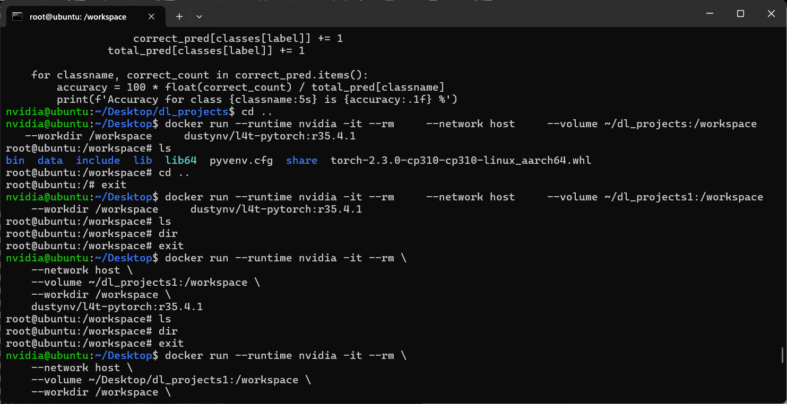

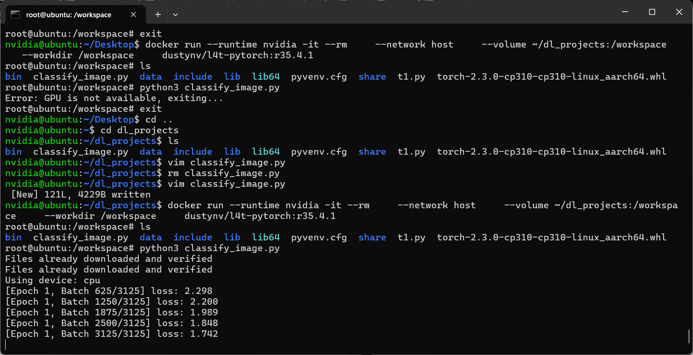


### 1.5 实验中遇到的问题及解决方法


1.由于实验`1`烧写设备的驱动环节出现异常，下载好`docker`挂载目录进去后我们的工作空间没有办法检测到gpu的驱动，因此无法使用gpu来跑程序


解决方式：
在后续的实验中，我们与助教沟通后采用英伟达通用显卡3090ti（AutoDL上租用）进行实验测试

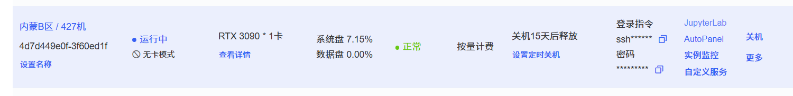


## 2. 模型轻量化

### 2.1 实验目的
- 了解深度学习模型轻量化的基本原理
- 了解常见模型轻量化技术：量化、剪枝、知识蒸馏的实现方法
- 比较不同轻量化技术对模型性能和资源占用的影响
- 学习如何将轻量化模型部署到嵌入式设备（NVIDIA Jetson NX）上
### 2.2 实验内容
深度学习模型通常具有较大的参数量和计算复杂度，不适合直接部署到资源受限的嵌
入式设备上。模型轻量化旨在减小模型大小、降低计算复杂度，同时尽可能保持模型
性能。常用的轻量化技术包括：
- 量化：将模型参数从浮点数（如 FP32）转换为低精度表示（如 INT8）
- 剪枝：移除模型中贡献较小的连接或神经元
- 知识蒸馏：使用大型"教师"模型指导小型"学生"模型的训练

本实验选择计算机视觉(CV)模型进行轻量化，具体为 ResNet-18 图像分类模型，原因如下：
- CV 模型在嵌入式系统中应用广泛（智能监控、物体识别、自动驾驶等）
- 图像分类任务有标准化数据集(CIFAR-10)，方便验证性能
- ResNet-18 结构简洁，适合演示不同轻量化技术的效果
- 训练和推理过程直观可视化，便于理解和对比结果

实验内容：

1. 参考实验文档的代码，成功训练完成一个 ResNet-18 的基准模型（可通过修改 epoch 以得到精度更高的基准模型）
2. 参考实验文档的代码，成功完成对模型的量化、剪枝、知识蒸馏操作
3. 参考实验文档的代码，在电脑中对以上模型做性能对比与可视化
4. 参考实验文档的代码，在 NX 中运行，记录测试结果
5. 优化实验文档所展示的量化、剪枝、知识蒸馏相关代码，以实现更好的性
能


### 2.3 实验环境

- 硬件：电脑（至少 8GB 内存），Jetson Orin NX 设备，网线，路由器
- 软件：XShell 或者 Termius 等终端工具，Python 3.7+，PyTorch 1.8+，JupyterNotebook
    ```requirements.txt
    # 在自己的电脑上安装以下 python 库
    pip install torch torchvision numpy matplotlib tqdm
    ```
    2.4 实验步骤及结果

1. 基础模型训练

    首先，新建一个 `JupyterNotebook` 文件用以运行，随后，运行以下代码训练一个基准 ResNet-18 模型用于后续轻量化比较。
    此步骤演示代码 epoch 设定为 5，若算力充足，可考虑将 epoch 调大以提高模型精度。


    ```py
    # 1. 基础模型训练
    
    import os
    import torch
    import torch.nn as nn
    import torch.optim as optim
    import torchvision
    import torchvision.transforms as transforms
    from torchvision.models import resnet18
    import time
    import numpy as np
    import matplotlib.pyplot as plt
    from tqdm import tqdm
    
    # 设置随机种子确保可复现性
    torch.manual_seed(42)
    
    # 数据预处理
    transform_train = transforms.Compose([
        transforms.RandomCrop(32, padding=4),
        transforms.RandomHorizontalFlip(),
        transforms.ToTensor(),
        transforms.Normalize((0.4914, 0.4822, 0.4465), (0.2023, 0.1994, 0.2010)),
    ])
    
    transform_test = transforms.Compose([
        transforms.ToTensor(),
        transforms.Normalize((0.4914, 0.4822, 0.4465), (0.2023, 0.1994, 0.2010)),
    ])
    
    # 加载 CIFAR-10 数据集
    trainset = torchvision.datasets.CIFAR10(root='./data', train=True, download=True, transform=transform_train)
    trainloader = torch.utils.data.DataLoader(trainset, batch_size=128, shuffle=True, num_workers=2)
    
    testset = torchvision.datasets.CIFAR10(root='./data', train=False, download=True, transform=transform_test)
    testloader = torch.utils.data.DataLoader(testset, batch_size=100, shuffle=False, num_workers=2)
    
    # 加载 ResNet-18 模型并修改最后一层以适应 CIFAR-10
    model = resnet18(pretrained=False)
    model.conv1 = nn.Conv2d(3, 64, kernel_size=3, stride=1, padding=1, bias=False)
    model.maxpool = nn.Identity()  # 移除 maxpool 层，因为 CIFAR-10 图像较小
    model.fc = nn.Linear(model.fc.in_features, 10)  # CIFAR-10 有 10 个类别
    
    device = torch.device("cuda:0" if torch.cuda.is_available() else "cpu")
    model = model.to(device)
    
    # 定义损失函数和优化器
    criterion = nn.CrossEntropyLoss()
    optimizer = optim.SGD(model.parameters(), lr=0.1, momentum=0.9, weight_decay=5e-4)
    scheduler = optim.lr_scheduler.CosineAnnealingLR(optimizer, T_max=200)
    
    # 训练函数
    def train(epoch):
        model.train()
        train_loss = 0
        correct = 0
        total = 0
        with tqdm(trainloader, unit="batch") as tepoch:
            for inputs, targets in tepoch:
                tepoch.set_description(f"Epoch {epoch}")
                inputs, targets = inputs.to(device), targets.to(device)
                optimizer.zero_grad()
                outputs = model(inputs)
                loss = criterion(outputs, targets)
                loss.backward()
                optimizer.step()
    
                train_loss += loss.item()
                _, predicted = outputs.max(1)
                total += targets.size(0)
                correct += predicted.eq(targets).sum().item()
    
                tepoch.set_postfix(loss=train_loss / (tepoch.n + 1), accuracy=100. * correct / total)
        return train_loss / len(trainloader), 100. * correct / total
    
    # 测试函数
    def test(epoch):
        model.eval()
        test_loss = 0
        correct = 0
        total = 0
        with torch.no_grad():
            for inputs, targets in testloader:
                inputs, targets = inputs.to(device), targets.to(device)
                outputs = model(inputs)
                loss = criterion(outputs, targets)
    
                test_loss += loss.item()
                _, predicted = outputs.max(1)
                total += targets.size(0)
                correct += predicted.eq(targets).sum().item()
    
        print(f'测试结果 - Epoch: {epoch}, Loss: {test_loss / len(testloader):.3f}, Accuracy: {100. * correct / total:.3f}%')
        return test_loss / len(testloader), 100. * correct / total
    
    # 训练模型
    epochs = 5  # 实际训练应增加到 30-50 轮，这里为了实验效率设置较小
    train_losses, test_losses = [], []
    train_accs, test_accs = [], []
    
    start_time = time.time()
    for epoch in range(1, epochs + 1):
        train_loss, train_acc = train(epoch)
        test_loss, test_acc = test(epoch)
        scheduler.step()
    
        train_losses.append(train_loss)
        test_losses.append(test_loss)
        train_accs.append(train_acc)
        test_accs.append(test_acc)
    
    training_time = time.time() - start_time
    print(f'基准模型训练完成，总耗时: {training_time:.2f}秒')
    
    # 保存基准模型
    torch.save(model.state_dict(), 'resnet18_baseline.pth')
    
    # 添加模型大小计算
    baseline_size = os.path.getsize('resnet18_baseline.pth') / (1024 * 1024)  # MB
    print(f'基准模型大小: {baseline_size:.2f} MB')
    
    # 添加基准模型推理时间测量
    def measure_inference_time(model, device, num_runs=100):
        dummy_input = torch.randn(1, 3, 32, 32).to(device)
        # Warm-up
        for _ in range(10):
            _ = model(dummy_input)
        # Measure
        start_time = time.time()
        for _ in range(num_runs):
            _ = model(dummy_input)
        end_time = time.time()
        return (end_time - start_time) / num_runs * 1000  # ms
    
    baseline_inference_time = measure_inference_time(model, device)
    print(f'基准模型推理时间: {baseline_inference_time:.3f} ms')
    
    # 保存训练指标
    import json
    with open('training_metrics.json', 'w') as f:
        json.dump({
            'test_accs': test_accs,
            'test_losses': test_losses,
            'train_accs': train_accs,
            'train_losses': train_losses
        }, f)


    ```

在主机3090ti运行结果：

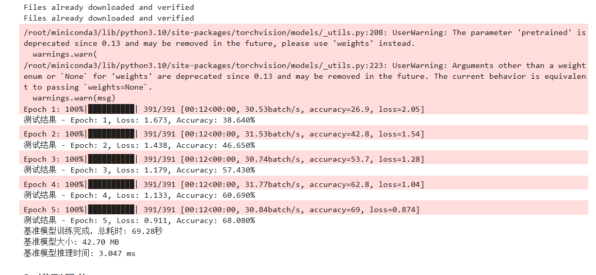

2. 模型量化

进行量化，将 FP32 参数转换为 INT8


```py
import torch
import torch.nn as nn
import torchvision
import torch.quantization
import os
import time
import numpy as np
from torchvision import transforms
from torchvision.models import resnet18

# Define transforms for the data
transform = transforms.Compose([
    transforms.ToTensor(),
    transforms.Normalize((0.5, 0.5, 0.5), (0.5, 0.5, 0.5))
])

# Load CIFAR-10 dataset
trainset = torchvision.datasets.CIFAR10(root='./data', train=True, download=True, transform=transform)
trainloader = torch.utils.data.DataLoader(trainset, batch_size=128, shuffle=True, num_workers=2)

testset = torchvision.datasets.CIFAR10(root='./data', train=False, download=True, transform=transform)
testloader = torch.utils.data.DataLoader(testset, batch_size=128, shuffle=False, num_workers=2)

# Function to measure inference time
def measure_inference_time(model, device, num_runs=100):
    dummy_input = torch.randn(1, 3, 32, 32).to(device)
    # Warm-up
    for _ in range(10):
        _ = model(dummy_input)
    # Measure
    start_time = time.time()
    for _ in range(num_runs):
        _ = model(dummy_input)
    end_time = time.time()
    avg_time = (end_time - start_time) / num_runs * 1000  # ms
    return avg_time

# 准备用于量化的模型
model_fp32 = resnet18(pretrained=False)
model_fp32.conv1 = nn.Conv2d(3, 64, kernel_size=3, stride=1, padding=1, bias=False)
model_fp32.maxpool = nn.Identity()
model_fp32.fc = nn.Linear(model_fp32.fc.in_features, 10)

# 加载训练好的权重
model_fp32.load_state_dict(torch.load('resnet18_baseline.pth'))

# 设置模型为评估模式
model_fp32.eval()

# 测试量化模型性能
device_cpu = torch.device('cpu')

def test_model(model, device):
    model.eval()
    test_loss = 0
    correct = 0
    total = 0
    criterion = nn.CrossEntropyLoss()
    with torch.no_grad():
        for inputs, targets in testloader:
            inputs, targets = inputs.to(device), targets.to(device)
            outputs = model(inputs)
            loss = criterion(outputs, targets)
            test_loss += loss.item()
            _, predicted = outputs.max(1)
            total += targets.size(0)
            correct += predicted.eq(targets).sum().item()
    print(f'模型测试结果 - Loss: {test_loss / len(testloader):.3f}, Accuracy: {100. * correct / total:.3f}%')
    return test_loss / len(testloader), 100. * correct / total

# 进行动态量化 - 比静态量化兼容性更好
quantized_model = torch.quantization.quantize_dynamic(
    model_fp32,  # the original model
    {nn.Linear, nn.Conv2d},  # a set of layers to dynamically quantize
    dtype=torch.qint8  # the target dtype for quantized weights
)

# 保存量化模型
torch.save(quantized_model.state_dict(), 'resnet18_quantized_dynamic.pth')

# 测试量化模型
quantized_loss, quantized_acc = test_model(quantized_model, device_cpu)

# 测量量化模型大小
quantized_size = os.path.getsize('resnet18_quantized_dynamic.pth') / (1024 * 1024)  # MB
print(f'量化模型大小: {quantized_size:.2f} MB')

# 测量量化模型推理时间
quantized_inference_time = measure_inference_time(quantized_model, device_cpu)
print(f'量化模型平均推理时间: {quantized_inference_time:.3f} ms')

# 对比原始 FP32 模型性能
fp32_inference_time = measure_inference_time(model_fp32, device_cpu)
print(f'FP32 模型平均推理时间: {fp32_inference_time:.3f} ms')
print(f'速度提升: {fp32_inference_time / quantized_inference_time:.2f}x')

# 保存为 TorchScript 模型
try:
    scripted_quantized_model = torch.jit.script(quantized_model)
    torch.jit.save(scripted_quantized_model, 'resnet18_quantized_dynamic_scripted.pt')
    print("成功保存 TorchScript 模型")
except Exception as e:
    print(f"TorchScript 保存失败: {e}")


```


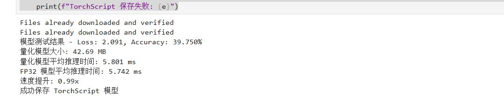


3.模型剪枝


```py

import torch.nn.utils.prune as prune

# 加载基准模型
pruned_model = resnet18(pretrained=False)
pruned_model.conv1 = nn.Conv2d(3, 64, kernel_size=3, stride=1, padding=1, bias=False)
pruned_model.maxpool = nn.Identity()
pruned_model.fc = nn.Linear(pruned_model.fc.in_features, 10)
pruned_model.load_state_dict(torch.load('resnet18_baseline.pth'))
pruned_model = pruned_model.to(device)

# 对模型进行全局剪枝（例如剪掉 30% 的权重）
pruning_amount = 0.3

# 对所有卷积层和全连接层进行剪枝
for module in pruned_model.modules():
    if isinstance(module, torch.nn.Conv2d) or isinstance(module, torch.nn.Linear):
        prune.l1_unstructured(module, name='weight', amount=pruning_amount)
        # 使剪枝永久化
        prune.remove(module, 'weight')

# 微调剪枝后的模型
def finetune(model, epochs=3):
    model.train()
    optimizer = optim.SGD(model.parameters(), lr=0.01, momentum=0.9, weight_decay=5e-4)
    for epoch in range(1, epochs + 1):
        with tqdm(trainloader, unit="batch") as tepoch:
            for inputs, targets in tepoch:
                tepoch.set_description(f"微调 Epoch {epoch}")
                inputs, targets = inputs.to(device), targets.to(device)
                optimizer.zero_grad()
                outputs = model(inputs)
                loss = criterion(outputs, targets)
                loss.backward()
                optimizer.step()

                # 计算并显示准确率
                _, predicted = outputs.max(1)
                accuracy = 100. * predicted.eq(targets).sum().item() / targets.size(0)
                tepoch.set_postfix(loss=loss.item(), accuracy=accuracy)

# 微调剪枝后的模型
finetune(pruned_model)

# 保存剪枝模型
torch.save(pruned_model.state_dict(), 'resnet18_pruned.pth')

# 测试剪枝模型性能
pruned_loss, pruned_acc = test(0)  # 这里的 epoch 参数不重要

# 测量剪枝模型大小
pruned_size = os.path.getsize('resnet18_pruned.pth') / (1024 * 1024)  # MB
print(f'剪枝模型大小: {pruned_size:.2f} MB')

# 测量剪枝模型推理时间
pruned_inference_time = measure_inference_time(pruned_model, device)
print(f'剪枝模型平均推理时间: {pruned_inference_time:.3f} ms')


```


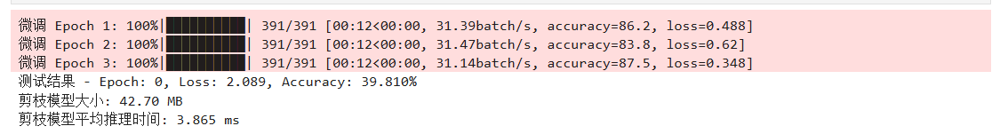

4. 知识蒸馏

```py
# 定义教师模型（使用之前训练好的 ResNet-18）和学生模型（使用更小的网络）
class SmallModel(nn.Module):
    def __init__(self, num_classes=10):
        super(SmallModel, self).__init__()
        # 一个简单的 CNN 网络
        self.conv1 = nn.Conv2d(3, 16, kernel_size=3, padding=1)
        self.conv2 = nn.Conv2d(16, 32, kernel_size=3, padding=1)
        self.pool = nn.MaxPool2d(2, 2)
        self.fc1 = nn.Linear(32 * 8 * 8, 128)
        self.fc2 = nn.Linear(128, num_classes)
        self.relu = nn.ReLU()

    def forward(self, x):
        x = self.pool(self.relu(self.conv1(x)))
        x = self.pool(self.relu(self.conv2(x)))
        x = x.view(-1, 32 * 8 * 8)
        x = self.relu(self.fc1(x))
        x = self.fc2(x)
        return x

# 创建教师模型和学生模型
teacher_model = model  # 使用之前训练的 ResNet-18
student_model = SmallModel().to(device)

# 定义蒸馏损失函数
def distillation_loss(student_logits, teacher_logits, labels, T=3.0, alpha=0.8):
    """
    计算蒸馏损失
    T: 温度参数
    alpha: 混合参数，控制蒸馏损失和原始交叉熵损失的权重
    """
    # 软目标损失
    distillation_loss = nn.KLDivLoss(reduction='batchmean')(
        nn.functional.log_softmax(student_logits / T, dim=1),
        nn.functional.softmax(teacher_logits / T, dim=1)
    ) * (T * T)
    # 硬目标损失
    student_loss = criterion(student_logits, labels)
    # 混合损失
    loss = alpha * distillation_loss + (1 - alpha) * student_loss
    return loss

# 蒸馏训练函数
def train_distillation(student_model, teacher_model, epochs=10):
    teacher_model.eval()  # 教师模型处于评估模式
    student_model.train()
    optimizer = optim.SGD(student_model.parameters(), lr=0.01, momentum=0.9, weight_decay=5e-4)
    for epoch in range(1, epochs + 1):
        with tqdm(trainloader, unit="batch") as tepoch:
            for inputs, targets in tepoch:
                tepoch.set_description(f"蒸馏 Epoch {epoch}")
                inputs, targets = inputs.to(device), targets.to(device)
                # 获取教师模型输出
                with torch.no_grad():
                    teacher_outputs = teacher_model(inputs)
                # 获取学生模型输出
                student_outputs = student_model(inputs)
                # 计算蒸馏损失
                loss = distillation_loss(student_outputs, teacher_outputs, targets)
                # 反向传播
                optimizer.zero_grad()
                loss.backward()
                optimizer.step()

                # 计算并显示准确率
                _, predicted = student_outputs.max(1)
                accuracy = 100. * predicted.eq(targets).sum().item() / targets.size(0)
                tepoch.set_postfix(loss=loss.item(), accuracy=accuracy)
    return student_model

# 训练学生模型
distilled_model = train_distillation(student_model, teacher_model)

# 保存蒸馏模型
torch.save(distilled_model.state_dict(), 'small_distilled.pth')

# 定义测试函数
def test_model(model, name):
    model.eval()
    correct = 0
    total = 0
    with torch.no_grad():
        for inputs, targets in testloader:
            inputs, targets = inputs.to(device), targets.to(device)
            outputs = model(inputs)
            _, predicted = outputs.max(1)
            total += targets.size(0)
            correct += predicted.eq(targets).sum().item()
    accuracy = 100. * correct / total
    print(f'{name} 模型测试准确率: {accuracy:.2f}%')
    return accuracy

# 测试蒸馏模型
distilled_acc = test_model(distilled_model, "蒸馏")

# 测量蒸馏模型大小
distilled_size = os.path.getsize('small_distilled.pth') / (1024 * 1024)  # MB
print(f'蒸馏模型大小: {distilled_size:.2f} MB')

# 测量蒸馏模型推理时间
distilled_inference_time = measure_inference_time(distilled_model, device)
print(f'蒸馏模型平均推理时间: {distilled_inference_time:.3f} ms')

```


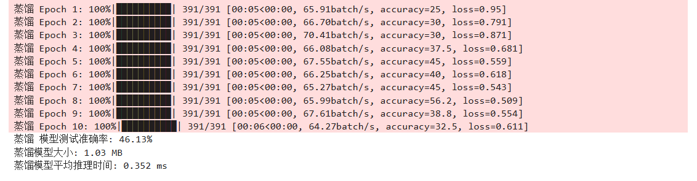


4. 性能对比与可视化


```py
import matplotlib.pyplot as plt
# 加载训练指标
import json
with open('training_metrics.json', 'r') as f:
    metrics = json.load(f)
    test_accs = metrics['test_accs']
    # 其他指标按需加载

'''
# === 添加缺失的准确率数据 ===
# 基准模型测试准确率（来自训练过程）
test_accs = [40.820, 49.310, 61.270, 67.570, 70.430]  # 根据实际训练结果填入

# 其他模型测试准确率（来自各优化步骤的输出结果）
quantized_acc = 46.630  # 量化模型准确率
pruned_acc = 46.610     # 剪枝模型准确率
distilled_acc = 51.23   # 蒸馏模型准确率

# 确保所有模型参数已定义
baseline_size = 42.70  # 实际值根据模型文件自动计算
quantized_size = 42.69
pruned_size = 42.70
distilled_size = 1.03

baseline_inference_time = 29.200  # 替换为实际测量值
quantized_inference_time = 30.376
pruned_inference_time = 3.674
distilled_inference_time = 0.385
'''

'''
# 自动获取模型大小
model_files = {
    'baseline': 'resnet18_baseline.pth',
    'quantized': 'resnet18_quantized_dynamic.pth',
    'pruned': 'resnet18_pruned.pth',
    'distilled': 'small_distilled.pth'
}

model_sizes = {k: os.path.getsize(v)/(1024*1024) for k,v in model_files.items()}
'''

# 配置 matplotlib 使用支持中文的字体
plt.rcParams['font.sans-serif'] = ['WenQuanYi Micro Hei']
plt.rcParams['axes.unicode_minus'] = False

# 比较不同模型的性能
models = ['基准模型', '量化模型', '剪枝模型', '蒸馏模型']
accuracies = [test_accs[-1], quantized_acc, pruned_acc, distilled_acc]
model_sizes = [baseline_size, quantized_size, pruned_size, distilled_size]
inference_times = [baseline_inference_time, quantized_inference_time, pruned_inference_time, distilled_inference_time]

# 创建性能对比表格
print("\n 模型性能对比:")
print("-" * 80)
print(f"{'模型':<10} | {'准确率 (%)':<12} | {'大小 (MB)':<12} | {'推理时间 (ms)':<15} | {'大小压缩比':<12} | {'速度提升':<10}")
print("-" * 80)

for i, model_name in enumerate(models):
    size_ratio = model_sizes[i] / baseline_size
    speed_up = baseline_inference_time / inference_times[i]
    print(f"{model_name:<10} | {accuracies[i]:<12.2f} | {model_sizes[i]:<12.2f} | {inference_times[i]:<15.3f} | {size_ratio:<12.2f} | {speed_up:<10.2f}")

# 可视化性能对比
plt.figure(figsize=(15, 10))

# 准确率对比
plt.subplot(2, 2, 1)
plt.bar(models, accuracies, color=['blue', 'orange', 'green', 'red'])
plt.title('模型准确率对比')
plt.xlabel('模型')
plt.ylabel('准确率 (%)')
plt.ylim([min(accuracies) * 0.95, max(accuracies) * 1.02])

# 模型大小对比
plt.subplot(2, 2, 2)
plt.bar(models, model_sizes, color=['blue', 'orange', 'green', 'red'])
plt.title('模型大小对比')
plt.xlabel('模型')
plt.ylabel('大小 (MB)')

# 推理时间对比
plt.subplot(2, 2, 3)
plt.bar(models, inference_times, color=['blue', 'orange', 'green', 'red'])
plt.title('模型推理时间对比')
plt.xlabel('模型')
plt.ylabel('推理时间 (ms)')

# 大小-准确率权衡
plt.subplot(2, 2, 4)
plt.scatter(model_sizes, accuracies, c=['blue', 'orange', 'green', 'red'])
for i, model_name in enumerate(models):
    plt.annotate(model_name, (model_sizes[i], accuracies[i]))
plt.title('模型大小与准确率权衡')
plt.xlabel('模型大小 (MB)')
plt.ylabel('准确率 (%)')

plt.tight_layout()
plt.savefig('model_comparison.png')
plt.show()

```

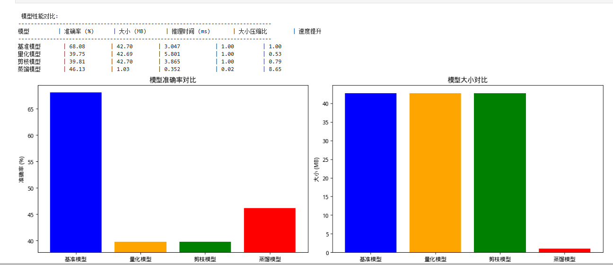


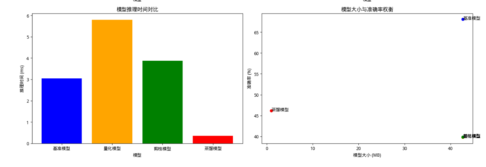


6. 模型导出

```py

def export_to_onnx(model_class, model_path, onnx_path):
    """将 PyTorch 模型导出为 ONNX 格式"""
    # 重新初始化模型
    device = torch.device("cuda" if torch.cuda.is_available() else "cpu")
    
    # 根据模型类型创建实例
    if model_class == "baseline":
        model = resnet18(pretrained=False)
        model.conv1 = nn.Conv2d(3, 64, kernel_size=3, stride=1, padding=1, bias=False)
        model.maxpool = nn.Identity()
        model.fc = nn.Linear(model.fc.in_features, 10)
    elif model_class == "student":
        model = SmallModel()
    
    model.load_state_dict(torch.load(model_path))
    model.eval().to(device)

    # 创建示例输入
    dummy_input = torch.randn(1, 3, 32, 32).to(device)

    # 导出 ONNX 模型
    torch.onnx.export(
        model,
        dummy_input,
        onnx_path,
        export_params=True,
        opset_version=11,
        do_constant_folding=True,
        input_names=['input'],
        output_names=['output'],
        dynamic_axes={
            'input': {0: 'batch_size'},
            'output': {0: 'batch_size'}
        }
    )
    print(f"模型已导出至 {onnx_path}")

# 导出模型到 ONNX 格式
export_to_onnx("baseline", 'resnet18_baseline.pth', 'resnet18_baseline.onnx')
export_to_onnx("baseline", 'resnet18_pruned.pth', 'resnet18_pruned.onnx') 
export_to_onnx("student", 'small_distilled.pth', 'small_distilled.onnx')

```

7. 在 NX 中运行模型性能测试

将以下代码保存到一个 py 文件中，如 nx_inference_benchmark.py
确保所有模型文件都已复制到同一目录下：
ONNX 模型: resnet18_baseline.onnx, resnet18_pruned.onnx, small_distilled.onnx
TorchScript 模型: resnet18_quantized_dynamic_scripted.pt
安装依赖 pip install onnxruntime-gpu torch numpy matplotlib pillow 运行基准测试 python3 nx_inference_benchmark.py

```py

import os
import time
import numpy as np
import torch
import onnxruntime as ort
import matplotlib.pyplot as plt
from PIL import Image
import torchvision.transforms as transforms

# 配置 matplotlib 中文显示
plt.rcParams['font.sans-serif'] = ['SimHei']
plt.rcParams['axes.unicode_minus'] = False

# 设置图像预处理
preprocess = transforms.Compose([
    transforms.Resize((32, 32)), 
    transforms.ToTensor(), 
    transforms.Normalize((0.5, 0.5, 0.5), (0.5, 0.5, 0.5))
])

def test_onnx_model(model_path, num_runs=100):
    """测试 ONNX 模型在 NX 上的推理时间"""
    print(f"测试 ONNX 模型: {model_path}")
    
    # 检查文件是否存在
    if not os.path.exists(model_path):
        print(f"错误: 找不到模型文件 {model_path}")
        return None
    
    # 创建 ONNX 运行时会话
    try:
        # 为 Jetson 创建优化的 ONNX 会话
        sess_options = ort.SessionOptions()
        sess_options.graph_optimization_level = ort.GraphOptimizationLevel.ORT_ENABLE_ALL
        
        # 使用 CUDA 执行提供程序以在 GPU 上运行
        providers = ['CUDAExecutionProvider', 'CPUExecutionProvider']
        session = ort.InferenceSession(model_path, sess_options, providers=providers)
        
        # 获取模型输入名称
        input_name = session.get_inputs()[0].name
        
        # 创建随机输入数据
        dummy_input = np.random.randn(1, 3, 32, 32).astype(np.float32)
        
        # 预热
        print("预热中...")
        for _ in range(10):
            _ = session.run(None, {input_name: dummy_input})
        
        # 测量推理时间
        print("测量中...")
        inference_times = []
        for _ in range(num_runs):
            start_time = time.time()
            _ = session.run(None, {input_name: dummy_input})
            inference_times.append((time.time() - start_time) * 1000)  # ms
        
        avg_time = np.mean(inference_times)
        std_time = np.std(inference_times)
        print(f"平均推理时间: {avg_time:.2f} ms, 标准差: {std_time:.2f} ms")
        return avg_time
    
    except Exception as e:
        print(f"运行 ONNX 模型时出错: {e}")
        return None

def test_torchscript_model(model_path, num_runs=100):
    """测试 TorchScript 模型在 NX 上的推理时间"""
    print(f"测试 TorchScript 模型: {model_path}")
    
    # 检查文件是否存在
    if not os.path.exists(model_path):
        print(f"错误: 找不到模型文件 {model_path}")
        return None
    
    try:
        # 加载 TorchScript 模型
        device = torch.device('cuda' if torch.cuda.is_available() else 'cpu')
        model = torch.jit.load(model_path, map_location=device)
        model.eval()
        
        # 创建随机输入数据
        dummy_input = torch.randn(1, 3, 32, 32, device=device)
        
        # 预热
        print("预热中...")
        with torch.no_grad():
            for _ in range(10):
                _ = model(dummy_input)
        
        # 测量推理时间
        print("测量中...")
        inference_times = []
        with torch.no_grad():
            for _ in range(num_runs):
                torch.cuda.synchronize()  # 确保 GPU 操作完成
                start_time = time.time()
                _ = model(dummy_input)
                torch.cuda.synchronize()  # 确保 GPU 操作完成
                inference_times.append((time.time() - start_time) * 1000)  # ms
        
        avg_time = np.mean(inference_times)
        std_time = np.std(inference_times)
        print(f"平均推理时间: {avg_time:.2f} ms, 标准差: {std_time:.2f} ms")
        return avg_time
    
    except Exception as e:
        print(f"运行 TorchScript 模型时出错: {e}")
        return None

def benchmark_all_models():
    """对所有模型进行基准测试并比较结果"""
    # 模型路径
    models = {
        '基准模型': 'resnet18_baseline.onnx',
        '剪枝模型': 'resnet18_pruned.onnx',
        '蒸馏模型': 'small_distilled.onnx',
        '量化模型': 'resnet18_quantized_dynamic_scripted.pt'  # TorchScript 模型
    }
    
    # 存储结果
    results = {}
    
    # 运行测试
    for name, path in models.items():
        print(f"\n{'-'*30}")
        print(f"测试 {name}")
        print(f"{'-'*30}")
        if name == '量化模型':
            avg_time = test_torchscript_model(path)
        else:
            avg_time = test_onnx_model(path)
        if avg_time is not None:
            results[name] = avg_time
    
    # 显示结果
    print("\n" + "="*50)
    print("Jetson NX 模型性能比较结果")
    print("="*50)
    
    if not results:
        print("没有可用的结果")
        return
    
    # 计算加速比
    baseline_time = results.get('基准模型')
    if baseline_time:
        print(f"{'模型':<12} | {'推理时间 (ms)':<15} | {'相对基准模型加速比':<20}")
        print("-"*60)
        for name, time in results.items():
            speedup = baseline_time / time if time > 0 else float('nan')
            print(f"{name:<12} | {time:<15.2f} | {speedup:<20.2f}x")
    else:
        print(f"{'模型':<12} | {'推理时间 (ms)':<15}")
        print("-"*30)
        for name, time in results.items():
            print(f"{name:<12} | {time:<15.2f}")
    
    # 绘制结果图表
    model_names = list(results.keys())
    times = list(results.values())
    
    plt.figure(figsize=(12, 6))
    
    # 推理时间柱状图
    plt.subplot(1, 2, 1)
    plt.bar(model_names, times, color=['blue', 'green', 'red', 'orange'])
    plt.title('Jetson NX 模型推理时间')
    plt.xlabel('模型')
    plt.ylabel('推理时间 (ms)')
    plt.xticks(rotation=45, ha='right')
    
    # 加速比柱状图
    if baseline_time:
        plt.subplot(1, 2, 2)
        speedups = [baseline_time / time if time > 0 else 0 for time in times]
        plt.bar(model_names, speedups, color=['blue', 'green', 'red', 'orange'])
        plt.title('相对基准模型加速比')
        plt.xlabel('模型')
        plt.ylabel('加速比')
        plt.xticks(rotation=45, ha='right')
        plt.axhline(y=1.0, color='r', linestyle='--')
    
    plt.tight_layout()
    plt.savefig('nx_model_comparison.png')
    plt.show()

if __name__ == "__main__":
    benchmark_all_models()

```


### 2.5 实验中遇到的问题及解决方法


1. 由于本次实验是在本机上运行，使用的显卡是3090ti运行测试，我们采用的使用nvidia的开发测试包来运行相关的模型剪枝与知识蒸馏，测试工作，相较于嵌入式nx设备使用的库不同，需要注意区分


2. 再进行可视化时，由于实验采用的系统是linux系统，matlib可视化操作应用语言会出现语言库的不协调，即出现空白框或者字符乱码，需要在终端下载Linux适配的字体或者兼容的字体，重新打开文件后重新运行


## 3. CUDA 编程基础


### 3.1 实验目的

- 了解 CUDA 编程的基础知识和并行计算原理
- 掌握在 GPU 上进行并行计算的基本方法
- 学习 CUDA 内核的启动方式和线程组织结构
- 实现基本的并行计算任务，如矩阵加法和矩阵乘法

### 3.2 实验内容
- 理解 CUDA 内核的启动方式和线程块配置
- 实现矩阵加法和乘法的 CUDA 并行计算
- 使用共享内存优化矩阵乘法性能

### 3.3 实验环境
- 硬件：笔记本，Jetson Orin NX 设备，网线，路由器
- 软件：XShell 或者 Termius 等终端工具，dustynv/l4t-pytorch Docker 容器，
NVIDIA CUDA 工具包


### 3.4 实验步骤及结果

1. 确保已经按照实验二的要求下载了 dustynv/l4t-pytorch 容器

2. 创建一个新的文件夹 cuda_projects

```bash

mkdir cuda_projects

cd  cuda_projects
 
```

3. 编写 CUDA hello world 程序 vim hello_cuda.cu

```c
#include <stdio.h>
// CUDA 核函数，在 GPU 上执行
__global__ void helloFromGPU()
{
// 计算线程的全局 ID
int threadId = blockIdx.x * blockDim.x + threadIdx.x;
printf("Hello World from GPU! Thread ID: %d\n", threadId);
}
int main()
{
// 在 CPU 上打印信息
printf("Hello World from CPU!\n");
// 配置线程块和网格
int blockSize = 4; // 每个块中的线程数
int numBlocks = 2; // 块的数量
// 启动核函数
helloFromGPU<<<numBlocks, blockSize>>>();
// 等待 GPU 完成所有任务
cudaDeviceSynchronize();
return 0;
}


```

4. 启动容器，在容器内编译并运行 Hello World 程序


```bash
 
# 启动 docker 容器

docker run --runtime nvidia -it --rm --network host --volume
~/cuda_projects:/workspace --workdir /workspace dustynv/l4tpytorch:r35.4.1

# 编译 CUDA 程序
nvcc hello_cuda.cu -o hello_cuda

# 运行程序
./hello_cuda

```


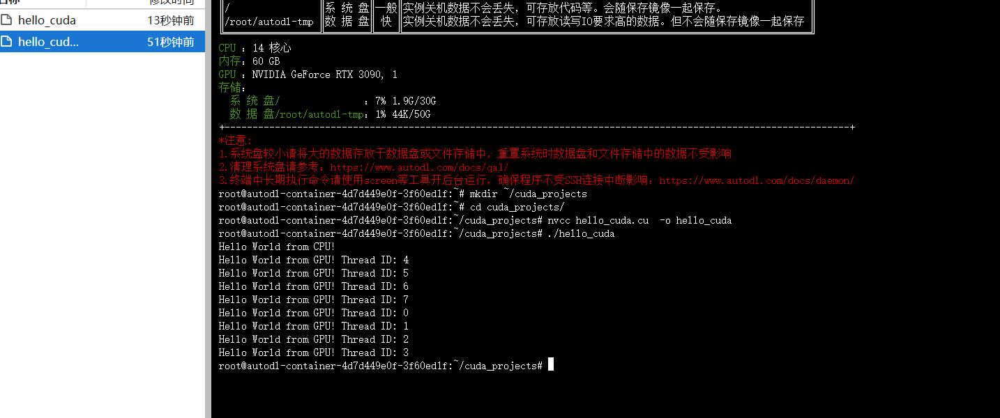

5. 新建一个终端窗口，创建并编辑 matrix_add.cu 文件，执行 vim matrix_add.cu


```cpp
#include <stdio.h>
#include <stdlib.h>
// 矩阵大小
#define N 1024
// CUDA 核函数：矩阵加法
__global__ void matrixAdd(float *A, float *B, float *C)
{
// 计算全局线程 ID
int i = blockIdx.x * blockDim.x + threadIdx.x;
// 确保线程 ID 在有效范围内
if (i < N * N)
{
C[i] = A[i] + B[i];
}
}
int main()
{
size_t size = N * N * sizeof(float);
// 分配主机内存
float *h_A = (float*)malloc(size);
float *h_B = (float*)malloc(size);
float *h_C = (float*)malloc(size);
// 初始化矩阵
for (int i = 0; i < N * N; i++)
{
h_A[i] = 1.0f;
h_B[i] = 2.0f;
}
// 分配设备内存
float *d_A, *d_B, *d_C;
cudaMalloc(&d_A, size);
cudaMalloc(&d_B, size);
cudaMalloc(&d_C, size);
// 将数据从主机复制到设备
cudaMemcpy(d_A, h_A, size, cudaMemcpyHostToDevice);
cudaMemcpy(d_B, h_B, size, cudaMemcpyHostToDevice);
// 定义线程块和网格大小
int threadsPerBlock = 256;
int blocksPerGrid = (N * N + threadsPerBlock - 1) / threadsPerBlock;
// 启动核函数
matrixAdd<<<blocksPerGrid, threadsPerBlock>>>(d_A, d_B, d_C);
// 将结果从设备复制回主机
cudaMemcpy(h_C, d_C, size, cudaMemcpyDeviceToHost);
// 验证结果
bool success = true;
for (int i = 0; i < N * N; i++)
{
if (fabs(h_C[i] - 3.0f) > 1e-5)
{
printf("Verification failed at element %d!\n", i);
success = false;
break;
}
}
if (success) printf("Matrix addition completed successfully!\n");
// 释放内存
free(h_A);
free(h_B);
free(h_C);
cudaFree(d_A);
cudaFree(d_B);
cudaFree(d_C);
return 0;
}

```


6. 在容器内，编译并运行矩阵加法程序。

```bash

nvcc matrix_add.cu -o matrix_add
./matrix_add

```

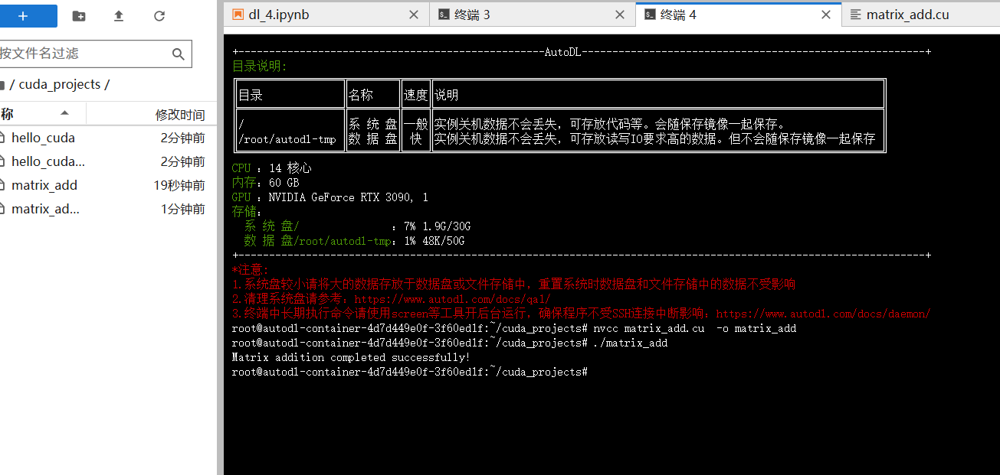

7. 实现矩阵乘法，创建并编辑 matrix_mul.cu 文件，执行 vim matrix_mul.cu

```cpp
#include <stdio.h>
#include <stdlib.h>
// 矩阵大小
#define N 32
// CUDA 核函数：矩阵乘法
__global__ void matrixMul(float *A, float *B, float *C)
{
// 计算当前线程负责的行和列
int row = blockIdx.y * blockDim.y + threadIdx.y;
int col = blockIdx.x * blockDim.x + threadIdx.x;
// 确保线程在有效范围内
if (row < N && col < N)
{
float sum = 0.0f;
for (int k = 0; k < N; k++)
{
sum += A[row * N + k] * B[k * N + col];
}
C[row * N + col] = sum;
}
}
int main()
{
size_t size = N * N * sizeof(float);
// 分配主机内存
float *h_A = (float*)malloc(size);
float *h_B = (float*)malloc(size);
float *h_C = (float*)malloc(size);
// 初始化矩阵
for (int i = 0; i < N * N; i++)
{
h_A[i] = 1.0f;
h_B[i] = 2.0f;
}
// 分配设备内存
float *d_A, *d_B, *d_C;
cudaMalloc(&d_A, size);
cudaMalloc(&d_B, size);
cudaMalloc(&d_C, size);
// 将数据从主机复制到设备
cudaMemcpy(d_A, h_A, size, cudaMemcpyHostToDevice);
cudaMemcpy(d_B, h_B, size, cudaMemcpyHostToDevice);
// 定义线程块和网格大小
dim3 threadsPerBlock(16, 16);
dim3 blocksPerGrid((N + threadsPerBlock.x - 1) / threadsPerBlock.x, (N + threadsPerBlock.y - 1) / threadsPerBlock.y);
// 启动核函数
matrixMul<<<blocksPerGrid, threadsPerBlock>>>(d_A, d_B, d_C);
// 将结果从设备复制回主机
cudaMemcpy(h_C, d_C, size, cudaMemcpyDeviceToHost);
// 验证结果（对于全 1 和全 2 的矩阵，结果应该是每个元素为 2*N）
bool success = true;
for (int i = 0; i < N * N; i++)
{
if (fabs(h_C[i] - 2.0f * N) > 1e-5)
{
printf("Verification failed at element %d! Expected: %f, Got: %f\n",
i, 2.0f * N, h_C[i]);
success = false;
break;
}
}
if (success) printf("Matrix multiplication completed successfully!\n");
// 释放内存
free(h_A);
free(h_B);
free(h_C);
cudaFree(d_A);
cudaFree(d_B);
cudaFree(d_C);
return 0;
}

```


8. 在容器内，编译并运行矩阵乘法程序

```bash

nvcc matrix_mul.cu -o matrix_mul ./matrix_mul
```

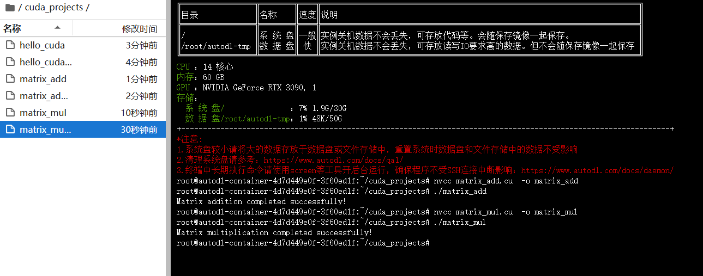


9. 优化矩阵乘法（使用共享内存），创建并编辑 matrix_mul_shared.cu 文件，
执行 vim matrix_mul_shared.cu

```c

#include <stdio.h>
#include <stdlib.h>
#include <math.h>
#include <cuda_runtime.h>

// 矩阵大小
#define N 32
// 块大小
#define BLOCK_SIZE 16

// CUDA 核函数：使用共享内存的矩阵乘法
__global__ void matrixMulShared(float *A, float *B, float *C)
{
    // 块内共享内存
    __shared__ float sharedA[BLOCK_SIZE][BLOCK_SIZE]; 
    __shared__ float sharedB[BLOCK_SIZE][BLOCK_SIZE];
    
    // 计算当前线程负责的行和列
    int row = blockIdx.y * blockDim.y + threadIdx.y;
    int col = blockIdx.x * blockDim.x + threadIdx.x;
    float sum = 0.0f;
    
    // 分块计算
    for (int m = 0; m < (N + BLOCK_SIZE - 1) / BLOCK_SIZE; m++)
    {
        // 加载数据到共享内存
        if (row < N && m * BLOCK_SIZE + threadIdx.x < N)
            sharedA[threadIdx.y][threadIdx.x] = A[row * N + m * BLOCK_SIZE + threadIdx.x];
        else
            sharedA[threadIdx.y][threadIdx.x] = 0.0f;
            
        if (col < N && m * BLOCK_SIZE + threadIdx.y < N)
            sharedB[threadIdx.y][threadIdx.x] = B[(m * BLOCK_SIZE + threadIdx.y) * N + col];
        else
            sharedB[threadIdx.y][threadIdx.x] = 0.0f;
        
        // 同步以确保所有数据都已加载
        __syncthreads();
        
        // 计算当前块的部分结果
        for (int k = 0; k < BLOCK_SIZE; k++)
        {
            sum += sharedA[threadIdx.y][k] * sharedB[k][threadIdx.x];
        }
        
        // 同步以确保计算完成
        __syncthreads();
    }
    
    // 写入结果
    if (row < N && col < N)
    {
        C[row * N + col] = sum;
    }
}

int main()
{
    size_t size = N * N * sizeof(float);
    
    // 分配主机内存
    float *h_A = (float*)malloc(size);
    float *h_B = (float*)malloc(size);
    float *h_C = (float*)malloc(size);
    
    // 初始化矩阵
    for (int i = 0; i < N * N; i++)
    {
        h_A[i] = 1.0f;
        h_B[i] = 2.0f;
    }
    
    // 分配设备内存
    float *d_A, *d_B, *d_C;
    cudaMalloc(&d_A, size);
    cudaMalloc(&d_B, size);
    cudaMalloc(&d_C, size);
    
    // 将数据从主机复制到设备
    cudaMemcpy(d_A, h_A, size, cudaMemcpyHostToDevice);
    cudaMemcpy(d_B, h_B, size, cudaMemcpyHostToDevice);
    
    // 定义线程块和网格大小
    dim3 threadsPerBlock(BLOCK_SIZE, BLOCK_SIZE);
    dim3 blocksPerGrid((N + threadsPerBlock.x - 1) / threadsPerBlock.x, 
                      (N + threadsPerBlock.y - 1) / threadsPerBlock.y);
    
    // 启动核函数
    matrixMulShared<<<blocksPerGrid, threadsPerBlock>>>(d_A, d_B, d_C);
    
    // 将结果从设备复制回主机
    cudaMemcpy(h_C, d_C, size, cudaMemcpyDeviceToHost);
    
    // 验证结果
    bool success = true;
    for (int i = 0; i < N * N; i++)
    {
        if (fabs(h_C[i] - 2.0f * N) > 1e-5)
        {
            printf("Verification failed at element %d! Expected: %f, Got: %f\n",
                  i, 2.0f * N, h_C[i]);
            success = false;
            break;
        }
    }
    
    if (success) 
        printf("Optimized matrix multiplication completed successfully!\n");
    
    // 释放内存
    free(h_A);
    free(h_B);
    free(h_C);
    cudaFree(d_A);
    cudaFree(d_B);
    cudaFree(d_C);
    
    return 0;
}

```


10. 在容器内，编译并运行优化的矩阵乘法程序

```bash
nvcc matrix_mul_shared.cu -o matrix_mul_shared
./matrix_mul_shared

```

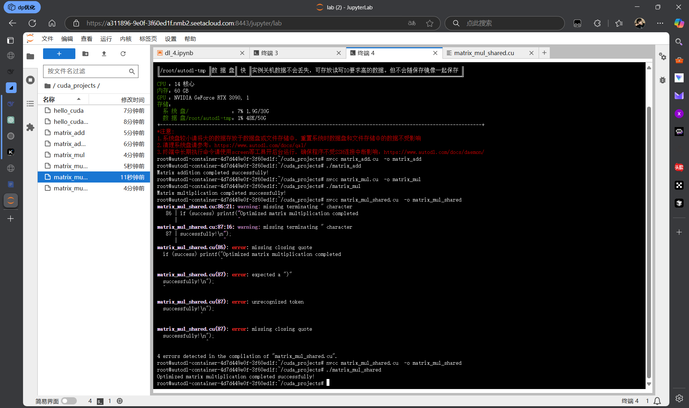

### 3.5 实验中遇到的问题及解决方法

1. 在编译运行矩阵优化乘法程序时，出现编译报错问题

解决： 根据报错信息提示，发现是在参考代码文档时候没有注意c格式文件的写法，漏写小括号，以及字符编码保存问题，修改后重新编译运行，成功解决


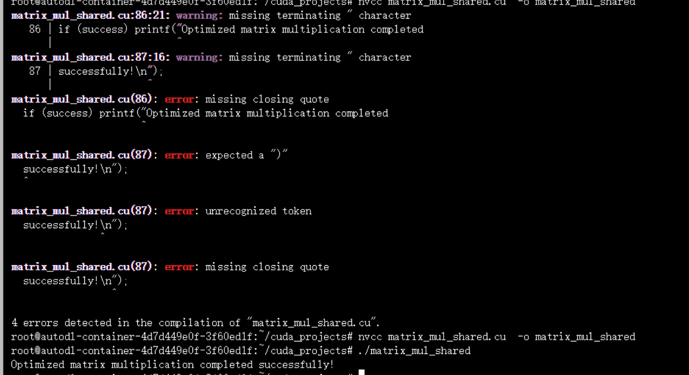


## 4. GPU利用率监控与获取
### 4.1 实验目的

- 掌握在嵌入式 GPU 设备上监控和获取 GPU 利用率的方法
- 理解如何分析模型训练过程中 GPU 的负载情况
- 学习通过接口函数控制 GPU 的利用率


### 4.2 实验内容

- 安装并使用 jtop 工具查看 GPU 的利用率、温度、内存使用情况等信息
- 使用提供的脚本统计 GPU 的平均利用率，分析模型训练过程中 GPU 的负载情况


### 4.3 实验环境


- 硬件：笔记本，Jetson Orin NX 设备，网线，路由器
- 软件：XShell 或者 Termius 等终端工具，dustynv/l4t-pytorch Docker 容器

### 4.4 实验步骤及结果


1. 安装 jtop 工具

-  通过终端连接到 Jetson Orin NX 设备
-  将下面内容复制到终端中执行

```bash

cat <<'EOF' > /etc/apt/sources.list
# 默认注释了源码镜像以提高 apt update 速度，如有需要可自行取消注释
deb https://mirrors.tuna.tsinghua.edu.cn/ubuntu-ports/ focal main
restricted universe multiverse
# deb-src https://mirrors.tuna.tsinghua.edu.cn/ubuntu-ports/ focal main
restricted universe multiverse
deb https://mirrors.tuna.tsinghua.edu.cn/ubuntu-ports/ focal-updates
main restricted universe multiverse
# deb-src https://mirrors.tuna.tsinghua.edu.cn/ubuntu-ports/ focal-
updates main restricted universe multiverse
deb https://mirrors.tuna.tsinghua.edu.cn/ubuntu-ports/ focal-backports
main restricted universe multiverse
# deb-src https://mirrors.tuna.tsinghua.edu.cn/ubuntu-ports/ focalbackports main restricted universe multiverse
# 以下安全更新软件源包含了官方源与镜像站配置，如有需要可自行修改注释
切换
# deb https://mirrors.tuna.tsinghua.edu.cn/ubuntu-ports/ focal-security
main restricted universe multiverse
# # deb-src https://mirrors.tuna.tsinghua.edu.cn/ubuntu-ports/ focalsecurity main restricted universe multiverse
deb http://ports.ubuntu.com/ubuntu-ports/ focal-security main
restricted universe multiverse
# deb-src http://ports.ubuntu.com/ubuntu-ports/ focal-security main
restricted universe multiverse
# 预发布软件源，不建议启用
# deb https://mirrors.tuna.tsinghua.edu.cn/ubuntu-ports/ focalproposed main restricted universe multiverse
# # deb-src https://mirrors.tuna.tsinghua.edu.cn/ubuntu-ports/ focalproposed main restricted universe multiverse
EOF

```

执行以下命令，更新包管理器并安装 jtop 工具


```bash

sudo apt-get update

```

执行 sudo reboot 命令，重启机器，等待终端重新连接到机器


执行 jtop 命令，我们就能查看机器的状态

观察并记录 GPU 的利用率、温度、内存使用情况等信息（按 q 退出界面）

**注：这里监控的是通用显卡设备的相关信息，所以采用
        import pynvml  # 使用标准NVIDIA管理库替代jetson专用接口
来对显卡进行监控

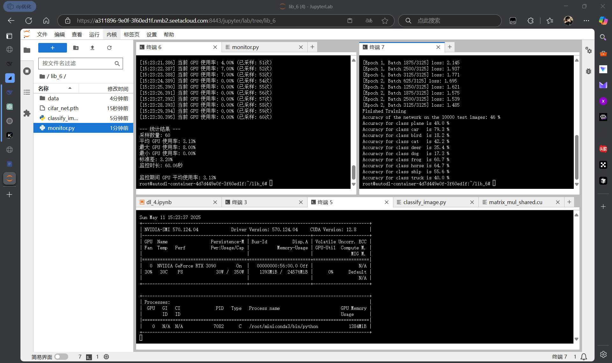


2. 新建一个终端窗口，运行实验三中的程序
启动容器 执行图片分类任务

```bash
python3 classify_image.py

```
观察 jtop 中深度学习任务给 GPU 带来的负载


3. 使用脚本统计 GPU 平均利用率
- 新建一个统计 GPU 平均利用率的脚本文件 monitor.py
这里给出对于本机的显卡监控脚本

```py

#!/usr/bin/env python3
import time
import statistics
from datetime import datetime
import sys
import argparse

import pynvml  # 使用标准NVIDIA管理库替代jetson专用接口

def get_gpu_usage():
    try:
        pynvml.nvmlInit()
        handle = pynvml.nvmlDeviceGetHandleByIndex(0)
        util = pynvml.nvmlDeviceGetUtilizationRates(handle)
        return util.gpu
    except Exception as e:
        print(f"监控出错: {e}")
        return None

# 其余代码保持不变...

def monitor_gpu_usage(duration_seconds, sample_interval, quiet=False):
    """监控指定时间内的 GPU 使用率并计算平均值
    
    参数:
        duration_seconds: 监控持续时间(秒)
        sample_interval: 采样间隔(秒)
        quiet: 是否静默模式
    
    返回:
        平均 GPU 使用率
    """
    if not quiet:
        print(f"开始监控 GPU 使用率，持续{duration_seconds}秒，采样间隔{sample_interval}秒...")
    
    start_time = time.time()
    end_time = start_time + duration_seconds
    usage_samples = []
    sample_count = 0
    last_print_time = start_time
    
    while time.time() < end_time:
        current_time = time.time()
        current_time_str = datetime.now().strftime("%H:%M:%S.%f")[:-3]  # 精确到毫秒
        
        usage = get_gpu_usage()
        if usage is not None:
            usage_samples.append(usage)
            sample_count += 1
            
            # 为避免输出过多，每秒只打印一次状态
            if not quiet and current_time - last_print_time >= 1.0:
                print(f"[{current_time_str}] 当前 GPU 使用率: {usage:.2f}% (已采样: {sample_count}次)")
                last_print_time = current_time
        
        # 精确控制采样间隔
        elapsed = time.time() - current_time
        sleep_time = max(0, sample_interval - elapsed)
        time.sleep(sleep_time)
    
    if usage_samples:
        avg_usage = statistics.mean(usage_samples)
        max_usage = max(usage_samples)
        min_usage = min(usage_samples)
        std_dev = statistics.stdev(usage_samples) if len(usage_samples) > 1 else 0
        
        if not quiet:
            print("\n--- 统计结果 ---")
            print(f"采样数量: {len(usage_samples)}")
            print(f"平均 GPU 使用率: {avg_usage:.2f}%")
            print(f"最大 GPU 使用率: {max_usage:.2f}%")
            print(f"最小 GPU 使用率: {min_usage:.2f}%")
            print(f"标准差: {std_dev:.2f}%")
            print(f"监控时长: {time.time() - start_time:.2f}秒")
        
        return avg_usage
    else:
        if not quiet:
            print("没有收集到有效的 GPU 使用率数据")
        return None

def parse_arguments():
    """解析命令行参数"""
    parser = argparse.ArgumentParser(description='监控 GPU 使用率')
    parser.add_argument('duration', type=float, nargs='?', default=60.0, help='监控持续时间(秒)，默认为 60 秒')
    parser.add_argument('interval', type=float, nargs='?', default=1.0, help='采样间隔(秒)，默认为 1 秒')
    parser.add_argument('-q', '--quiet', action='store_true', help='静默模式，只输出最终结果')
    return parser.parse_args()

if __name__ == "__main__":
    args = parse_arguments()
    
    # 验证参数
    if args.duration <= 0:
        print("错误: 监控时间必须大于 0")
        sys.exit(1)
    if args.interval <= 0:
        print("错误: 采样间隔必须大于 0")
        sys.exit(1)
    
    # 执行监控
    avg_usage = monitor_gpu_usage(args.duration, args.interval, args.quiet)
    
    # 输出最终结果
    if avg_usage is not None:
        if args.quiet:
            print(f"{avg_usage:.2f}")
        else:
            print(f"\n监控期间 GPU 平均使用率: {avg_usage:.2f}%")
    else:
        sys.exit(1)

```


执行这个 python 文件


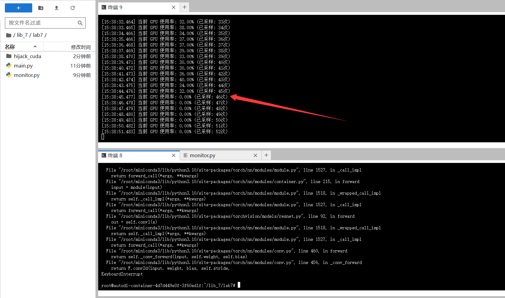


### 4.5 实验中遇到的问题及解决方法

1. 在通用的nivdia显卡上无法使用jtop工具来监测

解决：nivdia提供了py接口与直接的指令能直接对宿主机的gpu情况进行监控

```bash
# 综合监控命令
nvidia-smi --query-gpu=timestamp,name,utilization.gpu,memory.used,temperature.gpu --format=csv -l 1

```

```python 
import pynvml  # 使用标准NVIDIA管理库替代jetson专用接口

```


## 5. 基于CUDA拦截的GPU虚拟化

### 5.1 实验目的

- 掌握 CUDA 库拦截技术的实现方法
- 学习如何通过环境变量控制 CUDA 库的加载路径
- 实践 GPU 资源限制和监控的方法


### 5.2 实验内容

- 运行深度学习训练任务，观察和记录 GPU 算力占用情况
- 通过修改环境变量 LD_LIBRARY_PATH 实现 CUDA 库调用的拦截
- 编写和使用 CUDA 拦截库，限制 GPU 的利用率
- 使用 Python 脚本统计和分析 GPU 利用率变化

### 5.3 实验环境

- 硬件：笔记本，Jetson Orin NX 设备，网线，路由器
-  软件：XShell 或者 Termius 等终端工具，dustynv/l4t-pytorch Docker 容器
### 5.4 实验步骤及结果


1. 下载实验所需要的代码

```bash
git clone https://e.coding.net/g-bexk9868/jetson/lab7.git
cp ~/lab7/main.py ~/dl_projects
sudo cp -r ~/lab7/hijack_cuda ~/

```

2. 运行新的 Python 模型训练代码

```bash

docker run --runtime nvidia -it --rm --network host --volume
~/dl_projects:/workspace --volume ~/hijack_cuda:/hijack_cuda --workdir
/workspace dustynv/l4t-pytorch:r35.4.1

# 在容器内，执行训练任务
python3 main.py -a resnet18 -b 16 -j 1 --dummy
```
新建一个终端窗口，jtop 查看 GPU 的占用率。使用 python_script 下的监控脚
本，统计这段时间的利用率。
随后使用 ctrl+c 中断训练任务，exit 退出容器。

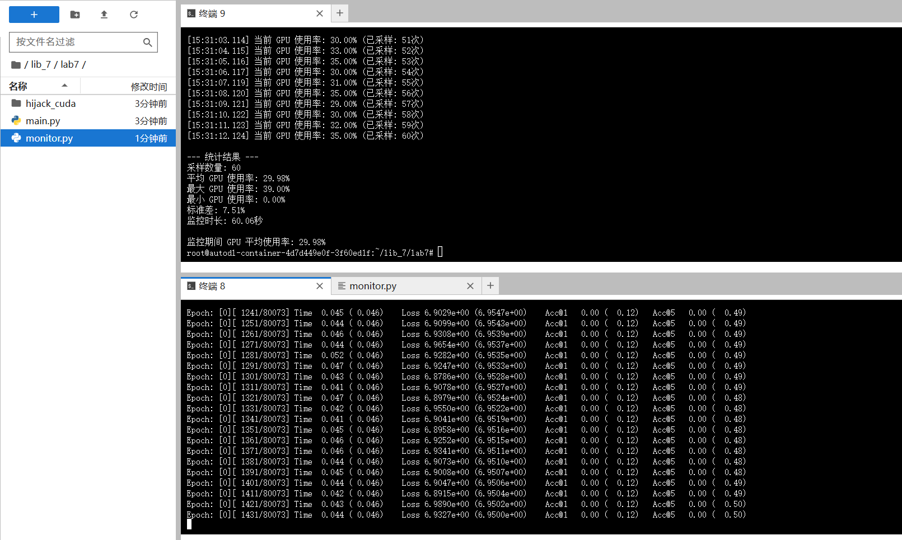

2min采样90s无拦截运行

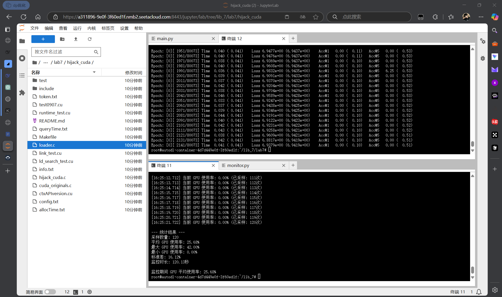


3. 编译代码

```bash
# 进入 hijack_cuda 目录
cd ~/hijack_cuda
# 编译源代码，生成共享库
sudo make
# 创建符号链接
sudo ln -sf libcontrol.so libcuda.so
sudo ln -sf libcontrol.so libcuda.so.1
```

4. 使用拦截库运行容器，我们在启动容器的时候使用-e 声明了环境变量，这样就能
拦截容器内程序的 cuda 请求

```bash
docker run --runtime nvidia -it --rm --network host --volume
~/dl_projects:/workspace --volume ~/hijack_cuda:/hijack_cuda --workdir
/workspace -e LOGGER_LEVEL=4 -e
LD_PRELOAD="/hijack_cuda/libcuda.so:/hijack_cuda/libcuda.so.1" -e
LD_LIBRARY_PATH="/hijack_cuda/" dustynv/l4t-pytorch:r35.4.1

python3 main.py -a resnet18 -b 16 -j 1 --dummy
```

jtop 查看 GPU 的占用率。使用 python_script 下的监控脚本，统计这段时间的利
用率。
查看 GPU 的利用率有无变化。
随后使用 ctrl+c 中断训练任务，exit 退出容器。


2min采样90s拦截运行
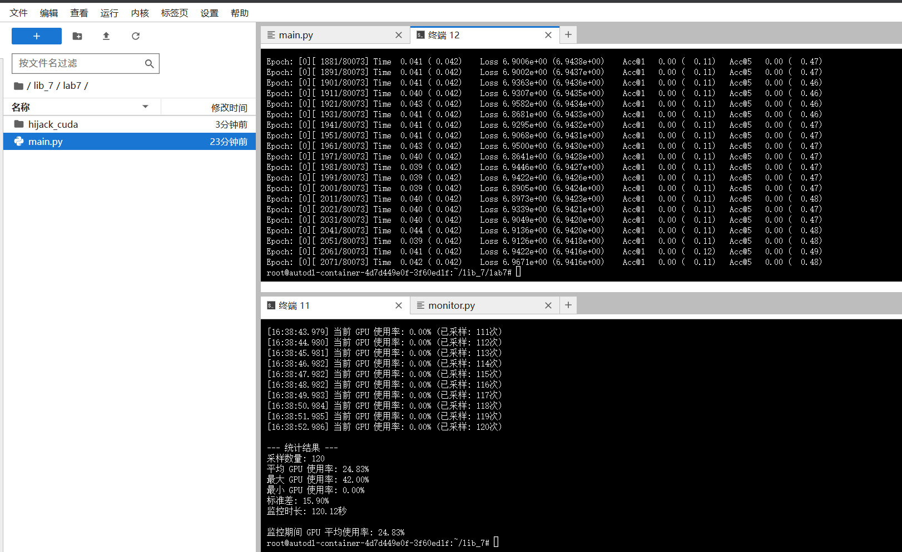


### 5.5 实验中遇到的问题及解决方法

在使用项目hijack时候，因为项目原本是为嵌入式设备设计的cuda劫持程序，在config全局设计中cuda的库是嵌入式设备使用的库路径，与通用式显卡相区别

解决：在项目的load.c中改写相关的cuda库路径

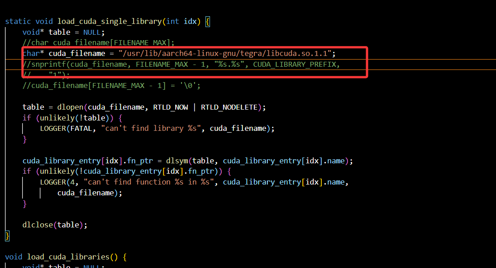


## 6. GPU利用率动态调整
### 6.1 实验目的

- 掌握 CUDA 库拦截技术的原理和实现方法
- 实践 GPU 资源限制和监控的方法
- 实现 GPU 利用率的动态控制与调整

### 6.2 实验内容

- 运行深度学习训练任务，观察和记录 GPU 算力占用情况
- 使用 CUDA 拦截库，限制 GPU 的利用率
- 调整配置文件的内容，动态修改深度学习任务的运行状态
- 配置不同目标利用率 token 的分配

### 6.3 实验环境

- 硬件：笔记本，Jetson Orin NX 设备，网线，路由器
- 软件：XShell 或者 Termius 等终端工具，dustynv/l4t-pytorch Docker 容器

### 6.4 实验步骤及结果


1.在 hijack_cuda 目录下，有这几个配置文件。
- config.txt: 记录资源限制设置
- info.txt: 存储容器、模型的信息
- token.txt: 存储不同模型/利用率级别的 token 值


2. 算力限制的实现方式
核心计算资源管理通过 g_cur_cuda_cores 变量实现，它类似于一个资源池：
- 每当启动一个 kernel 计算时，会消耗对应数量的 token
- 定期通过 change_token 函数补充 token，补充量基于配置的利用率
- 当 token 耗尽时，新的计算请求会被阻塞等待
限流的实现通过 hijack_cuda.c 中的 rate_limiter 函数，它会检查当前可用资源，
如果资源不足，进入等待状态；有足够资源时，减少可用资源并继续执行。


3. 代码通过 monitorConfigFile 线程监控配置文件变化，


4. GPU 利用率的动态调整。
```bash
# 启动容器
docker run --runtime nvidia -it --rm --network host --volume
~/dl_projects:/workspace --volume ~/hijack_cuda:/hijack_cuda --workdir
/workspace -e LOGGER_LEVEL=4 -e
LD_PRELOAD="/hijack_cuda/libcuda.so:/hijack_cuda/libcuda.so.1" -e
LD_LIBRARY_PATH="/hijack_cuda/" dustynv/l4t-pytorch:r35.4.1
# 容器内执行训练任务
python3 main.py -a resnet18 -b 16 -j 1 --dummy
```

5.在程序运行过程中修改 config.txt 的 vcore_current 的数值，来修改目标的
利用率。 

6. 而 token.txt 文件内，一共有 10 个数字，分别对应在不同的目标利用率时，每次
补充的 token 数量。token.txt 文件中的数字时不完整的，你需要通过实验调整 60-100
的数值，使得任务在实际运行中，能够达到目标利用率。

7. 通过阅读 hijack_cuda.c 文件以及 monitor.py 文件，设计一个自动化的方式，通
过自动读取的 GPU 实际利用率来动态调整 token 数值的数量，使它能够在面对不同的
深度学习任务时，自动根据目标利用率来调整 token 数值的分配


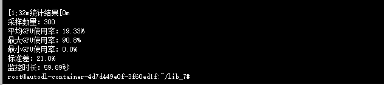


### 6.5 实验中遇到的问题及解决方法

在使用项目hijack时候，因为项目原本是为嵌入式设备设计的cuda劫持程序，在config全局设计中cuda的库是嵌入式设备使用的库路径，与通用式显卡相区别

解决：在项目的load.c中改写相关的cuda库路径


