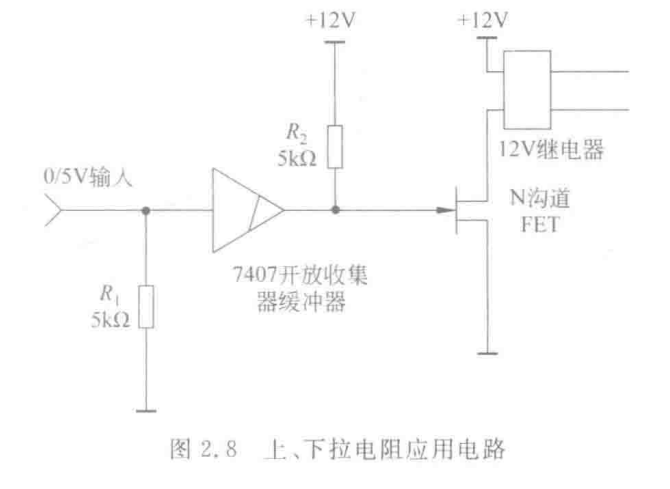
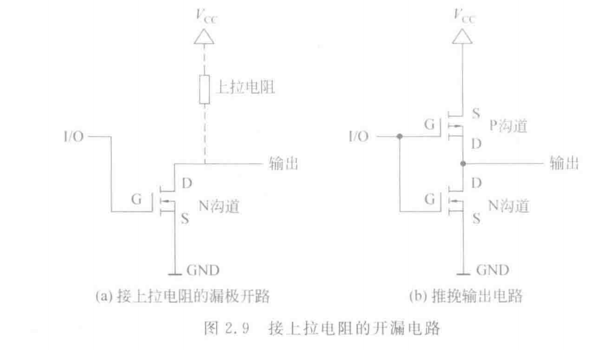
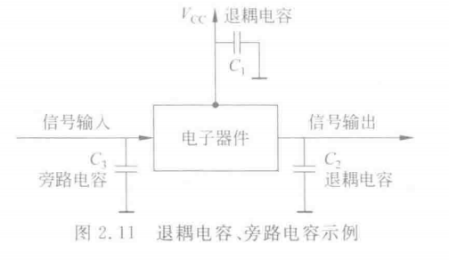

# -liulanker-第一次作业.md

## Author:liulanker    Date ： 2025-2-23

---

### 1. 简述TTL电平、CMOS电平和RS-232电平的逻辑表示和电压范围

1. TTL电平逻辑表示：  
    - 逻辑“0”：电压范围通常为 0V 到 0.8V。
        - 最小输入为：低电平<1.2V 
        - 最小输出为：低电平<0.8V 
    - 逻辑“1”：电压范围通常为 2V 到 5V。
        - 最小输入为：高电平>2.0V 
        - 最小输出为：高电平>2.4V
    - 噪声容限：0.4V 
    - 电压范围：TTL电平通常工作在 5V 电源电压下。逻辑“0”对应较低的电压，逻辑“1”对应较高的电压。

2. CMOS电平逻辑表示：  
    - 逻辑“0”：电压范围为 0V 到 1/3Vcc
        - 最小输入为：低电平<3.6V 
        - 最小输出为：低电平<1.2V
    - 逻辑“1”：电压范围为 2/3Vcc 到 Vcc
        - 最小输入为：高电平>8.4V 
        - 最小输出为：低电平>10.8V
    - 噪声容限：2.4V 
    - 电压范围：CMOS电平取决于工作电压（Vcc），通常在12V下工作，且在这些电压范围内判定逻辑“0”和逻辑“1”。

3. RS232电平逻辑表示：（负逻辑电平）  
    - 逻辑“0”：通常表示为正电压，通常在 +3V 到 +12V 之间。
    - 逻辑“1”：通常表示为负电压，通常在 -12V 到 -3V 之间。
    - 电压范围：-12V~12V

---

### 2. 阐述电路中上/下拉电阻的用途和基本工作原理
如图所示：

#### 上拉电阻 
- **用途**：将输入信号引脚拉到 **高电平**。这通常用于确保电路中的输入端处于已知的 **高电平** 状态，以避免浮空（即没有信号输入时，电平不确定）。
- **工作原理**：上拉电阻将输入端连接到电源电压（如 Vcc），通常通过电阻连接到正电源（例如 +5V 或 +12V）。当输入信号端没有驱动电流时，电压被拉至高电平。
- **电阻值**：上拉电阻的电阻值通常在 1kΩ 到 10kΩ 之间，过大的电阻会导致信号延迟，过小则可能增加功耗。

在图中提到的 **7407**（TTL门电路）中，输入端的上拉电阻用于保持低电平状态，避免在没有输入信号时引起误动作。

#### 下拉电阻
- **用途**：将输入信号引脚拉到 **低电平**。这通常用于确保电路中的输入端处于已知的 **低电平** 状态，避免浮空。
- **工作原理**：下拉电阻将输入端连接到地（GND），当输入信号端没有驱动电流时，电压被拉至低电平。
  
图中的应用示例提到，7407芯片的输入信号通常需要通过下拉电阻与地相连，确保信号处于已知的低电平。

#### 总结：
- **上拉电阻** 用于将输入信号拉高，防止浮空导致的电平不确定。
- **下拉电阻** 用于将输入信号拉低，确保输入端在浮空状态时保持低电平。

---

### 3. 解释为何多个漏极开路器件的输出可以进行“线与”连接，而多个推挽电路则不行

如图所示：

#### 漏极开路（Open Drain, OD）器件的输出连接
- **工作原理**：漏极开路电路是一种输出方式，其中输出端只有一个开关（通常是一个 MOSFET）。在这种情况下，输出端是开路的，即只有一个方向的电流流动，通常是将信号输出拉低，而没有主动提供高电平。
- **多个输出线与连接**：多个漏极开路器件的输出可以通过**线与连接**的方式连接，因为当一个输出为低电平时，其他输出没有强制要求输出高电平，它们的输出只是“开路”或处于高阻状态。因此，多个漏极开路器件可以共享一个公共输出线路。**当所有输出为低时，共同拉低线路；当任何一个输出为高阻状态时，不会影响其它输出**，从而实现了“线与”连接。

#### 推挽电路（Push-Pull Circuit）器件的输出连接
- **工作原理**：推挽电路的输出有两个主动器件（通常是 N-MOS 和 P-MOS）交替工作，分别提供高电平和低电平输出。输出信号是通过这两个器件的组合来提供的，即当一个器件导通时，另一个器件关闭。
- **多个输出不能连接**：在多个推挽电路的输出端进行连接时，如果两个推挽电路同时输出不同的电平（一个输出高电平，一个输出低电平），就会产生短路现象。**这样会导致电流异常增大，可能损坏电路**。因为推挽电路输出是主动的，两个器件无法协调工作从而避免电流冲突，导致无法进行“线与”连接。

---

### 4. 旁路电容和退耦电容的作用是什么，怎么布放

#### 1. **旁路电容（Bypass Capacitor）**：
- **作用**：旁路电容主要用于过滤电路中的高频噪声，抑制信号中的高频干扰。它通过将这些高频信号引导至地，防止噪声信号对电路的正常工作产生影响。
- **工作原理**：旁路电容被放置在电源与地之间，它的工作原理是当输入信号中存在高频信号时，电容为高频信号提供低阻抗路径，将这些不需要的高频成分“旁路”到地，从而净化信号。
- **布放方式**：旁路电容通常放置在信号输入端或电源端口附近，确保电路中的高频信号被及时过滤。根据电路要求，旁路电容可以与其他电容并联，选择适当的电容值来满足电路的需求。

#### 2. **退耦电容（Decoupling Capacitor）**：
- **作用**：退耦电容主要用于消除电源噪声和稳定电源电压。它有助于减少电源波动对电路性能的影响，特别是在高频电路中。
- **工作原理**：退耦电容通常放置在电源和电路的接入点之间，它帮助吸收电源线路中的电压波动或干扰信号，提供一个稳定的电源电压给电路。它起到了平滑电源信号的作用，避免电源电压的波动对电路造成影响。
- **布放方式**：退耦电容通常布放在电源与电路的接入点附近，尤其是集成电路（IC）等需要稳定电源的元件旁边。为了提高退耦效果，退耦电容常常以多个电容并联的形式使用，针对不同频率的干扰信号选择不同的电容值。

#### 布放如下：

退耦一般放在电源接入点与信号输出之间，旁路电容一般在信号输入端
