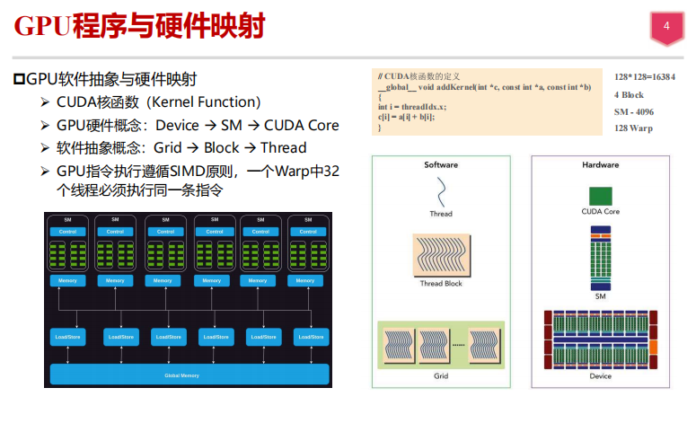
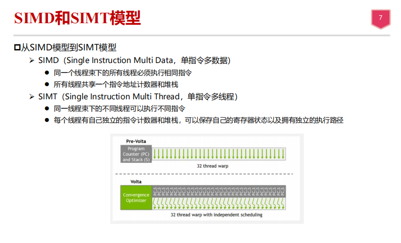
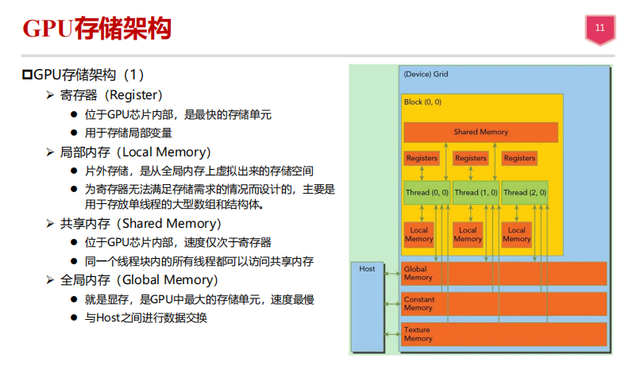
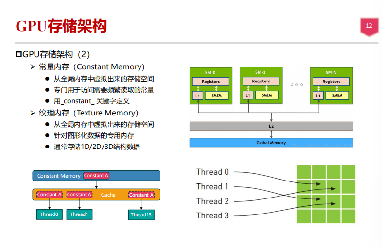

# -liulanker-第二次作业.md

## Author:liulanker    Date ： 2025-3-2

---

### 1.简述MCU、MPU和SOC的区别

解：
   -  MCU ：集成了中央处理单元、内存（RAM、ROM）采用RISC指令集，多级流水体系，常用于嵌入式应用中，低功耗，重在控制，因此，又称单片微型计算机
   例如：手机、PC外围、遥控器，至汽车电子、工业上的步进马达、机器手臂的控制等，都可见到MCU的身影。
   -  MPU ：仅包含中央处理单元（CPU），没有集成内存和外设接口，需要外部存储器和外设，性能较高，适用于一般计算任务。是构成微机的核心部件，也可以说是微机的心脏。它起到控制整个微型计算机工作的作用，产生控制信号对相应的部件进行控制，并执行相应的操作。
   - SOC ：将多个功能（如CPU、GPU、内存、I/O接口等）集成在一个芯片上，具备较强的计算和通信能力，称为系统级芯片，也有称片上系统，意指它是一个产品，是一个有专用目标的集成电路，其中包含完整系统并有嵌入软件的全部内容。常见于智能手机、平板等消费电子设备。

### 2. GPU软件抽象与GPU硬件架构的对应关系是什么？

如图，GPU软件抽象与GPU硬件架构的对应关系如下：
  **GPU软件抽象**：
   - **CUDA函数**：程序中的函数，在GPU上并行执行。
   - **线程**：最基本的执行单元，CUDA程序通过线程并行运行。
   - **线程块**：由多个线程组成的一个组，线程块可以在SM 上并行执行。
   - **网格**：由多个线程块组成，表示整个计算任务的结构。
    **GPU硬件架构**：
   - **设备**：整个GPU硬件平台，包含多个计算单元。
   - **SM**：硬件的计算核心，负责执行多个线程块。
   - **CUDA Core**：SM中的计算核心，负责执行具体的计算任务。
   - **全局内存**：设备的全局内存，线程间可以共享数据。

**映射关系**：
- GPU的软件抽象层（如Grid、Block、Thread）与硬件架构（如Device、SM、CUDA Core）之间的关系是：  
  - **线程（Thread）**对应**CUDA Core**，每个线程执行具体的操作。
  - **线程块（Thread Block）**对应**SM（Streaming Multiprocessor）**，一个SM可以执行多个线程块。
  - **网格（Grid）**对应**Device**，一个网格包含多个线程块，最终在整个GPU设备上执行。
  
此外，**每个Warp**（32个线程）在GPU上会被分配到一个CUDA Core中执行，并按照SIMD（单指令多数据）规则执行相同的指令。

 

### 3. 简述SIMD和SIMT模型的区别
    
如图：

1. **SIMD（单指令多数据）**：
   - **相同指令执行**：同一条指令在多个处理单元上并行执行，所有线程必须执行相同的指令。
   - **共享硬件资源**：所有线程共享相同的指令集和硬件资源，适用于相同数据的并行计算任务。
   
2. **SIMT（单指令多线程）**：
   - **独立线程执行**：每个线程可以执行不同的指令，即使它们处于同一执行单元中。
   - **独立的硬件资源**：每个线程拥有自己的指令计数器和寄存器，能够保持自己的执行状态，并可以独立调度。每个Warp（32个线程）可以独立调度执行。

**SIMD**是针对数据并行的模型，要求所有线程执行相同的指令；而**SIMT**则允许每个线程在同一时间执行不同的指令，并且每个线程可以有自己的状态和调度。
 
### 4.DRAM复用地址线采用的是什么技术？

解：DRAM 普遍采用的是行与列地址分时复用技术进行寻址。在 DRAM 的矩阵存储单元中，地址可以分成行地址和列地址。在寻址时，必须先进行行寻址然后在进行列寻址，这是由 DRAM 的硬件电路所决定的。所以，对行地址线和列地址线进行共用，既节省了地址线，也不会降低 DRAM 原有的工作速率（因为 DRAM 的行地址和列地址就是要分时传送的）。
 

### 5.CPU访问DRAM会产生延时，请简述延时产生的机理。有哪些方法可以解决?

**CPU访问DRAM产生延时的机理：**

1. **访问速度差异**：DRAM的访问速度比CPU的处理速度慢，因此，当CPU访问DRAM时，会遇到较长的延时。CPU的高速处理和DRAM的低速存储之间的差距导致了延时。
   
2. **行列地址选择**：DRAM的存储结构通常采用行列地址选择的方式进行数据存取。首先需要选择行地址，然后选择列地址，这个过程需要额外的时间来进行地址解码和访问控制。

3. **内存带宽**：DRAM的带宽有限，当多个CPU请求内存访问时，带宽的限制会导致竞争，从而产生延时。

4. **缓存未命中**：CPU需要从内存中读取数据时，如果缓存中没有所需数据（即缓存未命中），必须访问主存，这会产生较大的延时。

**解决方法：**

1. **缓存（Cache）**：通过引入缓存，将频繁访问的数据存储在离CPU更近的高速缓存中，减少直接访问DRAM的需求，减少延时。
   
2. **预取（Prefetch）**：CPU可以预取可能需要的数据到缓存中，提前进行数据加载，从而减少数据等待的时间。

3. **多级缓存（Multilevel Cache）**：使用多级缓存（L1、L2、L3等），在不同的缓存级别上存储数据，进一步减少访问延时。

4. **内存并行性（Memory Parallelism）**：通过多通道内存和多核并行访问来增加内存带宽，提高整体性能，减少访问延时。

5. **内存访问重排（Memory Access Reordering）**：通过合理的内存访问调度和重排，避免多个访问冲突，提高内存访问效率。

6. **延迟隐藏技术（Latency Hiding）**：使用技术如流水线、延迟补偿等隐藏内存访问的延迟，增强CPU处理其他任务的能力，减少因内存访问引起的性能瓶颈。

### 6. 两个处理器在读写双端口RAM时可能产生的冲突解决方法   
- 仲裁机制：通过仲裁器决定哪个处理器优先访问RAM。
- 时间片轮转：为每个处理器分配固定的时间片，轮流访问RAM。
- 优先级设置：为处理器设定不同优先级，高优先级处理器优先访问。
- 硬件信号：使用互斥信号量或硬件锁确保同一时间只有一个处理器访问RAM。
- 双端口RAM：使用真正的双端口RAM，允许两个处理器同时访问不同地址。

### 7. GPU存储架构中具有存储器实体的是哪些？哪些内存是从显存里虚拟出来的？ 

- **具有存储器实体的存储**：
  - **寄存器（Register）**：位于GPU芯片内部，是最快的存储单元。
  - **共享内存（Shared Memory）**：位于GPU芯片内部，速度仅次于寄存器。
  - **全局内存（Global Memory）**：即显存，是GPU中最大的存储单元，速度最慢。

- **从显存虚拟出来的内存**：
  - **局部内存（Local Memory）**：从全局内存上虚拟出来的存储空间，用于存放单线程的大型数组和结构体。
  - **常量内存（Constant Memory）**：从全局内存中虚拟出来的存储空间，专门用于访问需要频繁读取的常量。
  - **纹理内存（Texture Memory）**：从全局内存中虚拟出来的存储空间，针对图形化数据的专用内存。
 
