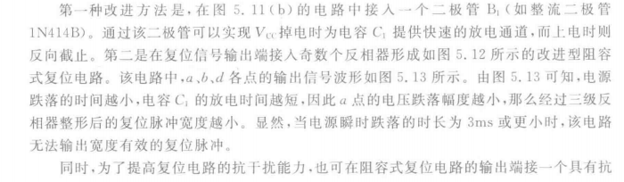
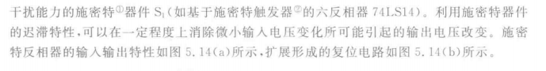

# -liulanker-第三次作业.md

## Author:liulanker    Date ： 2025-3-10

---

### 1. **简述直流稳压电源电路组成，其中将交流转为直流的是那部分?**
   直流稳压电源的主要组成部分包括：电源变压器、整流电路、滤波电路和稳压电路。将交流转为直流的是整流电路。

### 2. **影响嵌入式处理器运行时功耗的主要因素有哪些?**
   嵌入式处理器运行时功耗的主要因素包括：  
   - **时钟频率**：时钟频率越高，功耗越大。
   - **工作电压**：电压越高，功耗也越高。
   - **处理器的指令执行效率**：指令执行次数多会导致功耗增加。
   - **工作模式**：某些处理器支持低功耗模式，低功耗模式下，处理器的功耗较低。
   - **外设和I/O操作**：外设的活动和I/O操作也会影响整体功耗。
   - **温度**：高温会导致功耗增大。

### 3. **为了提高阻容式复位电路在系统掉电时的放电能力，该怎么做?**

由图可知：

1. **接入二极管**：通过在电路中添加二极管，可以提高系统的放电速度，使得电路在掉电时能够快速响应，减少电压的恢复时间。上电时可以反向截至
   
2. **输出端接入奇数个反向器**：通过调整电路中的电容与电阻参数（如调整电容的大小和放电路径），可以提高电容的放电能力，确保在系统掉电后，电容可以更快速地放电，从而确保复位信号的可靠生成。

### 4. **简述看门狗电路的工作原理**
   看门狗电路的工作原理是通过定时器监控系统的正常运行。看门狗电路会定期接收主控系统的“喂狗”信号（即RST复位信号）。如果在规定的时间内没有接收到“喂狗”信号，表示系统可能出现故障或停滞，电路会触发复位操作，重新启动系统，防止系统死机或崩溃。

### 5. **比较RS232和RS422的异同。RS422为什么可以在同等速率下提升数据的发送距离？**
   - **异同**：
     - **RS232**是单端信号传输，只使用两个信号线，数据传输通常在短距离内进行，常见于串口通信，适用于较低的数据速率。
     - **RS422**是差分信号传输，使用一对信号线进行数据传输，相较于RS232，其抗干扰能力强，适合于远距离高速传输。
   
   - **RS422可以提升数据发送距离的原因**：RS422采用差分信号传输，两根信号线上的电压相反，采用双绞线，因此在传输过程中互相抵消电磁干扰，具有较强的抗干扰能力，这使得它在相同的数据速率下能够有效传输更长距离的数据。

### 6. **简述嵌入式系统启动的过程（有操作系统的环境下）。**
   嵌入式系统启动的过程通常包括以下几个阶段：
   - **上电启动**：系统加电后，首先进行硬件复位，初始化硬件设备，配置寄存器等。
   - **引导程序加载**：在嵌入式系统中，一般会有一个小型的引导程序（Bootloader），它负责加载操作系统内核或操作系统镜像。
   - **操作系统启动**：引导程序将操作系统内核加载到内存，并将控制权交给操作系统。
   - **操作系统初始化**：操作系统内核初始化系统资源（如内存、进程、设备等），并开始调度任务。
   - **应用程序启动**：操作系统完成初始化后，启动用户应用程序，系统进入正常运行状态。