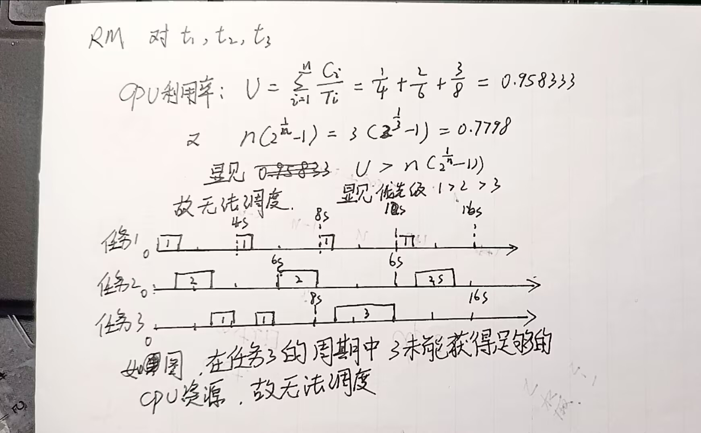
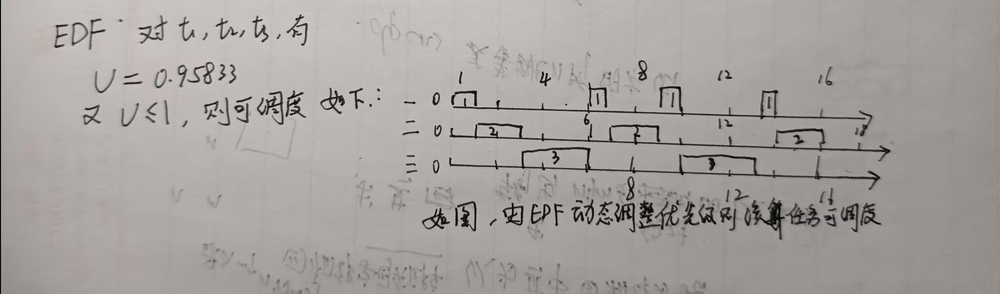
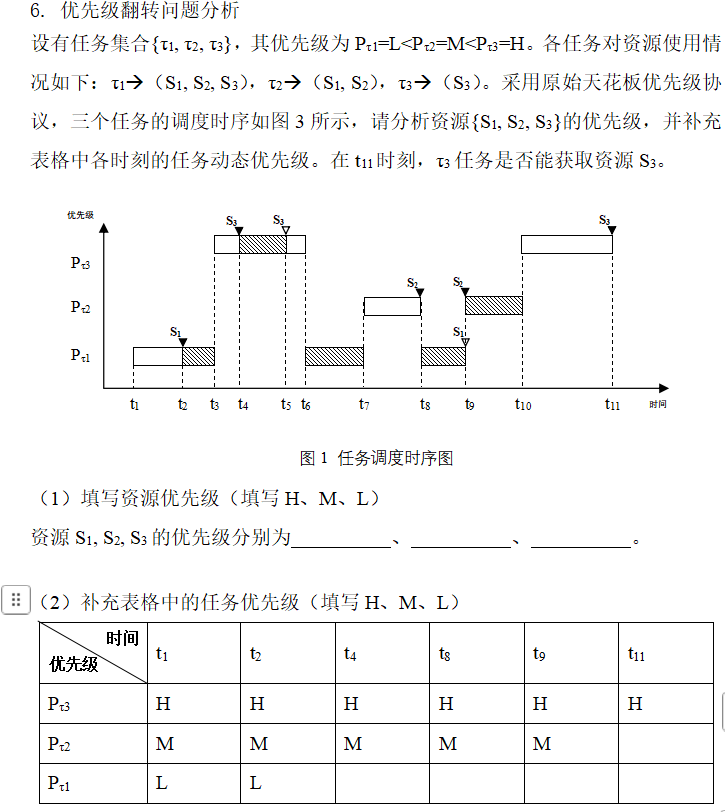

# -liulanker-第四次作业.md

## Author:liulanker    Date ： 2025-3-16

---

### 1.相较于宏内核操作系统架构，微内核操作系统架构的优势有哪些?

解：
微内核操作系统架构相较于宏内核操作系统架构有以下几个优势：

- 1. **模块化和可扩展性**：
   微内核架构将操作系统核心功能（如进程管理、内存管理、硬件抽象等）最小化，并通过用户态的服务实现其他功能。这样可以更容易地扩展和更新系统的各个模块，而无需修改内核本身。增强了系统的灵活性。

- 2. **更好的系统稳定性和安全性**：
   由于微内核将大部分操作系统功能移到用户态运行，内核本身的功能被简化到最小，因此出现故障时，用户空间的服务可以独立崩溃，而不会导致整个系统崩溃。这种设计降低了系统中某个部分失败时对整体系统的影响，从而增强了稳定性和安全性。

- 3. **更容易的错误隔离**：
   微内核架构将各个服务模块隔离在用户空间，这样，单个模块的故障不会直接影响到其他模块或内核本身。这种隔离机制有效地提高了系统的容错能力，尤其是在复杂的系统环境下。

- 4. **硬件独立性**：
   微内核架构通常依赖于更少的硬件驱动程序，在用户空间中提供更多的硬件支持模块。因此，相较于宏内核，微内核架构可以更容易地支持不同平台和硬件的兼容性。保证了嵌入式系统的可定制能力，可以满足不同系统的开发需要。

---

### 2.什么是实时操作系统?硬实时和软实时有什么差别?

- 硬实时：
   硬实时系统要求任务必须在规定的时间内完成，如果无法满足时间要求，可能会导致系统的严重故障或失败。在这种系统中，所有任务的时间限制都必须严格遵守，任务超时将被视为失败，并可能带来严重后果。例如，飞行控制系统、航天系统等都属于硬实时系统，延迟可能会导致灾难性后果。

- 软实时：
   软实时系统要求相对宽松，虽然任务也有时间限制，但允许任务在特定条件下稍有延迟，而不至于影响系统的整体功能和性能。软实时系统的关键特性是任务超时不会导致系统崩溃，只是可能影响性能。例如，网络系统、视频流媒体应用等都属于软实时系统，虽然延迟会降低体验，但不会造成系统的失效。

- 主要区别：
- **时间要求**：硬实时系统要求任务必须严格按时完成，否则会导致系统失败；而软实时系统可以容忍一定程度的延迟，任务延迟不会导致系统崩溃。
- **容错性**：硬实时系统对时间的要求非常严格，不能容忍任何延迟；软实时系统则允许有一定的延迟，只是影响性能。

 
---

### 3.影响实时的因素有哪些?
 

1. **任务调度和资源获取**：
   - 在实时操作系统中，当任务请求 CPU 或其他资源时，如果资源不能及时获得，任务就无法执行，系统响应会变慢或失败。因此，任务的调度机制和资源获取方式对实时性有很大影响。

2. **任务发生异常时的处理**：
   - 如果任务出现异常，实时操作系统应能够及时处理异常并采取必要的措施，以防任务继续执行导致系统的不稳定。异常的处理能力直接影响系统的响应速度和实时性。

3. **外部事件的响应**：
   - 系统的外部事件响应速度是影响实时性的关键因素。例如，任务必须能在最短时间内响应外部事件。外部中断或设备请求可能会打断当前任务，系统的响应时间应尽量快，以保证任务按时完成。

4. **任务的优先级调度**：
   - 在实时操作系统中，任务通常会根据优先级进行调度。优先级较高的任务会先执行，而低优先级任务则会被延迟。实时操作系统采用合适的调度算法（如FIFO、RR等）来确保高优先级任务优先执行，且任务不被过多延迟。

5. **I/O操作和调度**：
   - 输入/输出操作也是影响实时性的一个因素。I/O操作涉及与外部设备的通信，其延迟可能会影响任务的执行时间。因此，I/O操作的效率和调度策略对于保持系统的实时性非常重要。

6. **资源的合理分配**：
   - 在实时操作系统中，资源的合理分配非常重要。为确保系统的高效性和实时性，必须为任务分配充足的计算资源，并避免不必要的资源浪费。资源不足或配置不当可能导致系统延迟或任务无法按时完成。

---

### 4.有同时到来的周期任务组:t1， t2， t3，其(执行时间,周期)参数依次为(1s，4s)(2s，6s)(3s，8s),请分析采用RM 和 EDF 调度算法时是否可调度?请画出两种调度算法在该任务组上的调度过程分析。

1.RM（单调速率调度）
如图，不能调度

2.EDF(最早截止期调度)

---

5.任务间通信机制有哪些，请按照支持任务间数据交互和任务间行为协同两大类分别列举。

解：

- 1. 支持任务间数据交互的通信机制：允许不同任务之间共享和交换数据。 

- **共享内存（Shared Memory）**  
  任务间通过共享同一块内存区域来交换数据。任务可以直接读写共享内存中的数据。共享内存通常用于高效的跨任务通信，但需要避免并发访问引发的数据一致性问题。
  
- **消息队列（Message Queue）**  
  任务可以通过消息队列发送和接收数据。每个任务通过发送消息到队列中，另一个任务从队列中取出消息进行处理。半双工通信，消息队列通常是先进先出（FIFO）的，但也可以根据需求实现优先级队列。

- **管道（Pipe）**  
  管道允许一个任务将数据流向另一个任务。优点是数据传输的长度可变，通常管道是单向的，适用于较简单的任务间数据传输。

- **套接字（Socket）**  
  套接字是一种网络通信机制，可以支持任务间在同一系统或不同系统之间进行数据传输。套接字可以使用不同的协议（如 TCP、UDP）来实现任务间的数据交换。

- 2. 支持任务间行为协同的通信机制
这些机制用于任务之间的行为协调和同步，确保任务按预定的顺序或条件进行协作。常见的任务间行为协同机制包括：

- **信号量（Semaphore）**  
  除了用于数据交换，信号量还可以用来同步任务。通过对信号量的“P（等待）”和“V（释放）”操作，任务可以协调执行的时序，避免冲突和数据竞争。

- **互斥锁（Mutex）**  
  互斥锁用于保证同一时刻只有一个任务能够访问共享资源。多个任务需要协调访问共享资源时，可以通过互斥锁进行锁定和释放。

- **条件变量（Condition Variable）**  
  条件变量允许一个任务等待某个条件发生（例如数据准备好、某个事件发生等），其他任务可以通知等待的任务继续执行。它常常配合互斥锁使用，确保条件判断和资源访问是同步的。

- **屏障（Barrier）**  
  屏障用于同步多个任务的行为。任务通过屏障等待，直到所有参与任务都达到屏障位置，屏障才会释放，所有任务继续执行。屏障常用于并行计算和同步任务阶段。

#### 总结

任务间通信机制按照功能分类，主要有两类：
1. **数据交互机制**，如共享内存、消息队列、管道、套接字等；
2. **行为协同机制**，如信号量、互斥锁、条件变量、屏障等。

6.优先级翻转问题分析
$设有任务集合{τ1, τ2, τ3}，其优先级为P_{τ1}=L<P_{τ2}=M<P_{τ3}=H。各任务对资源使用情况如下：τ1->（S1, S2, S3），τ2->（S1, S2），τ3->（S3）。采用原始天花板优先级协议，三个任务的调度时序如图3所示，请分析资源{S1, S2, S3}的优先级，并补充表格中各时刻的任务动态优先级。在t11时刻，τ3任务是否能获取资源S3$。

图1 任务调度时序图
（1）填写资源优先级（填写H、M、L）
资源S1, S2, S3的优先级分别为  **M  ,  M  ,  H**

（2）补充表格中的任务优先级（填写H、M、L）
 
优先级\时间|	t1|	t2|	t4|	t8|	t9|	t11|
|-|-|-|-|-|-|-|
$P_{τ3}	$	|H|	H| H| H| H|	H|
$P_{τ2}	$  |M|	M|	M|	M|	M|	M|
$P_{τ1}	$  |L|	L| L| M| L| L|		

如图所示

（3）在t11时刻，τ3任务是否能获取资源S3，请说明为什么。

  
**可以**，因为根据天花板优先级协议，任务 \( \tau_3 \) 会提升到资源 \( S_3 \) 的天花板优先级 \( H \)，并且 \( \tau_3 \) 可以获得该资源。
 