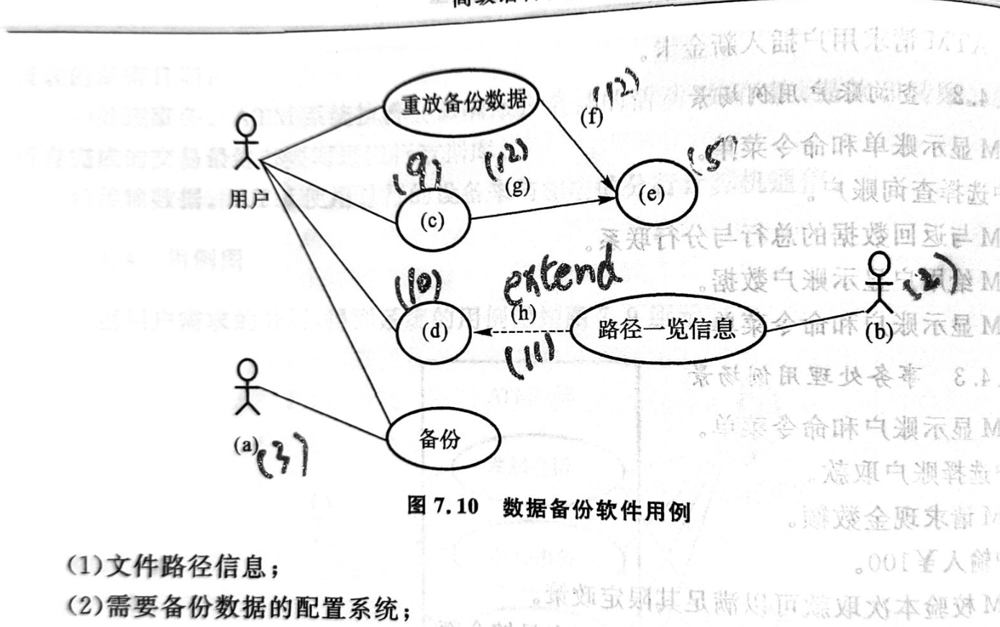
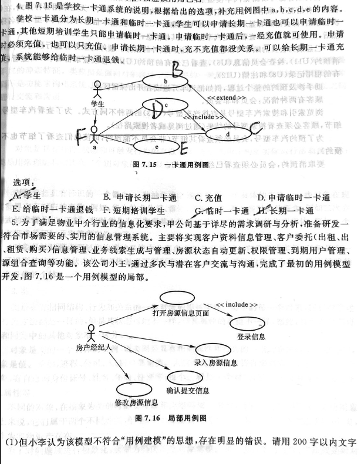

# Java第五次作业
第五章
---

---
### 1.classB是classA的子类,那么语句 classA  a = new classB()中,关于对象a的描述正确的是（ ）。
A.变量a的类型进行向上转换
B.对象a无法正确创建,因为类型不对
C.变量a编译时类型为classB
D.变量a运行时类型为classA

解： 选A

---

### 2.关于Java多态,下面描述正确的是(   )
A.多态不仅可以减少代码量,还可以提高代码的可扩展性和可维护性
B.把子类转换为父类,称为向下转换,自动进行
C.多态是指对同一个接口,使用不同的实制而执行不同的操作
D.继承是多态的基础,没有继承就没有多态

解： 选A

---  

### 3.
(1).定义三个类：Student,MiddleStudent,PrimaryStudent.其中Student为抽象类。
(2).根据上面的描述，定义一个主类TestStudent，其中利用数组保存创建的4名学生对象，分别为中学生2名，小学生2名（姓名和成绩随机）。然后显示数组中的所有学生信息，格式：
如果是PrimaryStudent,显示"Name：xxx，ChineseScore：xxx，MathScore：xxx"

如果是MiddleStudent,显示"Name：xxx，ChineseScore：xxx，MathScore：xxx，EnglishScore:xxx"

解：
```
abstract class Student {
    private String name;
    private double chineseScore;
    private double mathScore;

    public Student(String name, double chineseScore, double mathScore) {
        this.name = name;
        this.chineseScore = chineseScore;
        this.mathScore = mathScore;
    }

    public abstract double getAverageScore();

    public String getName() {
        return name;
    }

    public double getChineseScore() {
        return chineseScore;
    }

    public double getMathScore() {
        return mathScore;
    }
}

class PrimaryStudent extends Student {
    public PrimaryStudent(String name, double chineseScore, double mathScore) {
        super(name, chineseScore, mathScore);
    }

    public double getAverageScore() {
        return (getChineseScore() + getMathScore()) / 2;
    }
}

class MiddleStudent extends Student {
    private double englishScore;

    public MiddleStudent(String name, double chineseScore, double mathScore, double englishScore) {
        super(name, chineseScore, mathScore);
        this.englishScore = englishScore;
    }

    public double getAverageScore() {
        return (getChineseScore() + getMathScore() + englishScore) / 3;
    }

    public double getEnglishScore() {
        return englishScore;
    }
}

public class Main{
    public static void main(String[] args) {
        Student[] students = new Student[4];

        // 创建学生对象并保存到数组中
        students[0] = new MiddleStudent("张三", 80, 90, 85);
        students[1] = new MiddleStudent("李四", 75, 85, 90);
        students[2] = new PrimaryStudent("王五", 90, 95);
        students[3] = new PrimaryStudent("赵六", 85, 92);

        // 显示学生信息
        for (Student student : students) {
            if (student instanceof PrimaryStudent) {
                System.out.println("Name: " + student.getName() + ", ChineseScore: " + student.getChineseScore() + ", MathScore: " + student.getMathScore());
            } else if (student instanceof MiddleStudent) {
                MiddleStudent middleStudent = (MiddleStudent) student;
                System.out.println("Name: " + middleStudent.getName() + ", ChineseScore: " + middleStudent.getChineseScore() + ", MathScore: " + middleStudent.getMathScore()
                        + ", EnglishScore: " + middleStudent.getEnglishScore());
            }
        }
    }
}


```


(3)查找平均分最高的学生并显示该学生信息。如果最高分有多个，那么显示一个即可。

解：
```
abstract class Student {
    private String name;
    private double chineseScore;
    private double mathScore;

    public Student(String name, double chineseScore, double mathScore) {
        this.name = name;
        this.chineseScore = chineseScore;
        this.mathScore = mathScore;
    }

    public abstract double getAverageScore();

    public String getName() {
        return name;
    }

    public double getChineseScore() {
        return chineseScore;
    }

    public double getMathScore() {
        return mathScore;
    }
}

class PrimaryStudent extends Student {
    public PrimaryStudent(String name, double chineseScore, double mathScore) {
        super(name, chineseScore, mathScore);
    }

    public double getAverageScore() {
        return (getChineseScore() + getMathScore()) / 2;
    }
}

class MiddleStudent extends Student {
    private double englishScore;

    public MiddleStudent(String name, double chineseScore, double mathScore, double englishScore) {
        super(name, chineseScore, mathScore);
        this.englishScore = englishScore;
    }

    public double getAverageScore() {
        return (getChineseScore() + getMathScore() + englishScore) / 3;
    }

    public double getEnglishScore() {
        return englishScore;
    }
}
public class Main{
    public static void main(String[] args) {
        Student[] students = new Student[4];

        // 创建学生对象并保存到数组中
        students[0] = new MiddleStudent("张三", 80, 90, 85);
        students[1] = new MiddleStudent("李四", 75, 85, 90);
        students[2] = new PrimaryStudent("王五", 90, 95);
        students[3] = new PrimaryStudent("赵六", 85, 92);

        // 查找平均分最高的学生
        Student highestScoringStudent = students[0];
        for (int i = 1; i < students.length; i++) {
            if (students[i].getAverageScore() > highestScoringStudent.getAverageScore()) {
                highestScoringStudent = students[i];
            }
        }

        // 显示最高分学生的信息
        if (highestScoringStudent instanceof PrimaryStudent) {
            System.out.println("Name: " + highestScoringStudent.getName() + ", ChineseScore: " + highestScoringStudent.getChineseScore() + ", MathScore: " + highestScoringStudent.getMathScore());
        } else if (highestScoringStudent instanceof MiddleStudent) {
            MiddleStudent middleStudent = (MiddleStudent) highestScoringStudent;
            System.out.println("Name: " + middleStudent.getName() + ", ChineseScore: " + middleStudent.getChineseScore() + ", MathScore: " + middleStudent.getMathScore()
                    + ", EnglishScore: " + middleStudent.getEnglishScore());
        }
    }
}
```


# 第七章 

### 练习一


### 习题4，5



### 5.

- (1)解:用例图首先没有绘制出信息管理系统的系统边界；参与者和用例的关联应当是实线不带箭头表示；用例之间的关系存在错误，应当是打开房源信息包含了{登录信息，录入信息{确认提交信息}，修改信息}；存在用例之间逻辑问题的构建漏洞；
- (2)解：<<indclude>>是指用例的包含关系，由源用例引出虚线箭头指向目标（被包含）的用例，表示两个用例的包含关系；而<<extend>>可视为拓展关系，拓展关系链接拓展用例和基用例，不能单独出现，反方向看很像包含关系


---


© 2025 liulanker | [联系作者]( liulanker@gmail.com)