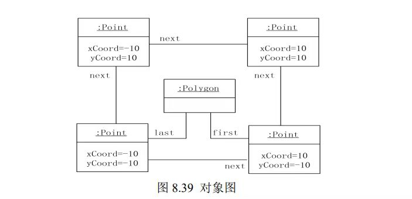

# Java第六次作业
第八章
---
 

---

### 1.

解：如图

(a) - (7) ; (b) - (8) ; (c) - (1) ; (d) - (6) ; (e) - (3) ; (f) - (4) ; 
(g) - (15) ;

---

### 2.

解：如图

(a) - (5) ; (b) - (13) ; (c) - (4) ; (d) - (12) ; 
(e) - (6) ; (f) - (1) ; (g) - (15) ; (h) - (14) ;

### 3.

解：该对象图的类图如下：

  

---

© 2025 liulanker | [联系作者]( liulanker@gmail.com)