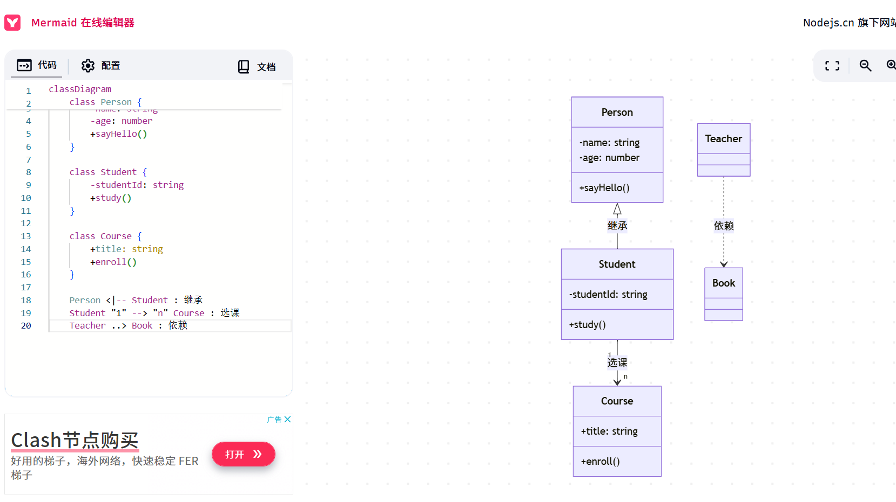
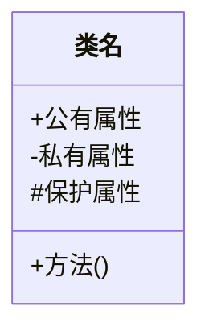
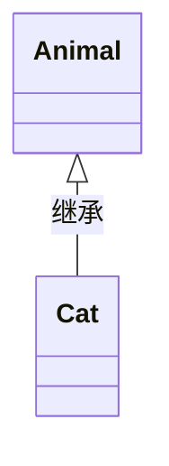
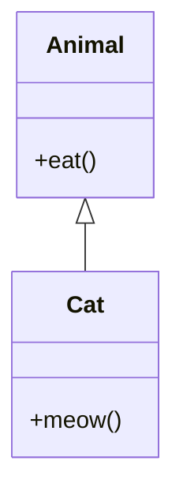
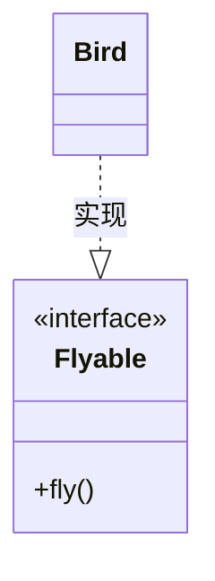
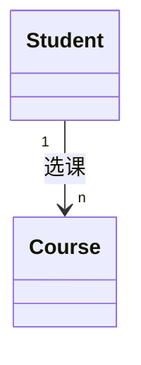
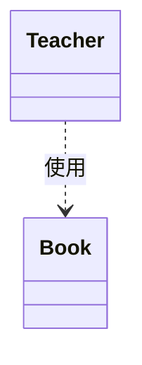
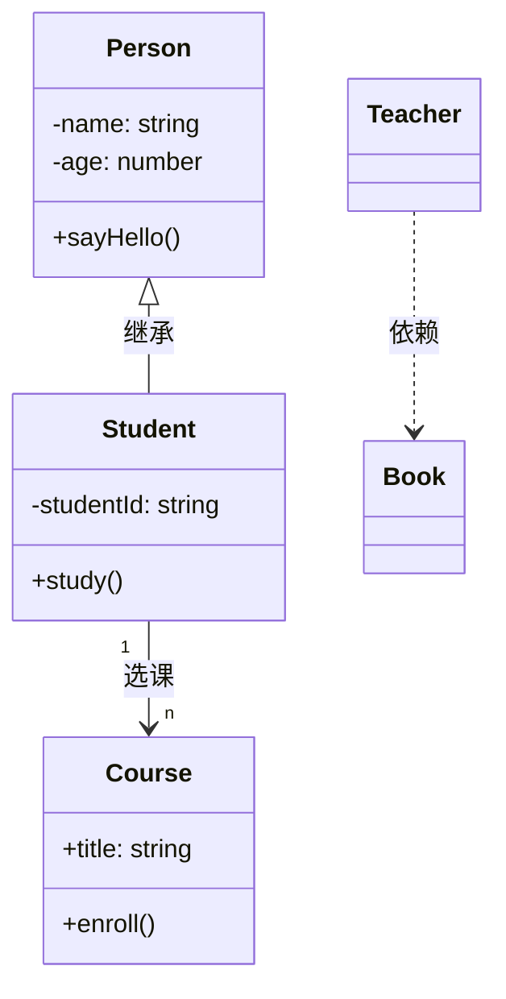
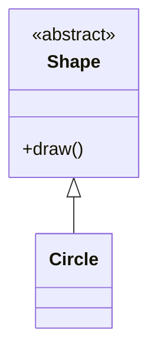

# 高级语言程序设计（Java）课程介绍 📚

本课程通过四个综合性实验，系统培养学生Java编程能力和UML建模能力。课程内容涵盖面向对象编程核心概念，每个实验都设计为帮助学生从语法基础逐步过渡到复杂系统开发。

 

## 目录
- [实验一：J01-J05](./Java实验/lab_1/)
- [实验二：J06-J07&&U01-U02](./Java实验/lab_2/) 
- [实验三：U03-U06](./Java实验/lab_3/)
- [实验四：U07-U10](./Java实验/lab_4/)
- [课程评价](#课程评价)
- [实验要求](./Java实验/实验要求/)

## 实验要求与指导

详细罗列了Java实验中的实验内容与指导，包含一些重要的思考题与报告的提交格式

## 实验一：J01-J05 🖥️  
通过五个循序渐进的任务，学生将掌握Java编程基础语法，实验涵盖变量、流程控制、异常处理等核心概念，并通过实际案例培养面向对象设计思维。具体包括：
- 基础语法训练（J01-J03）
- 异常处理机制（J04）
- 简单类设计实践（J05）
- 配套UML类图绘制

## 实验二：J06-J07&&U01-U02 🌐  
本实验重点训练封装、继承、多态三大特性。通过实现学生信息管理系统：
1. 完成核心类设计与实现（J06-J07）
2. 绘制系统序列图（U01）
3. 构建状态转移图（U02）
4. 使用集合框架管理数据

## 实验三：U03-U06 🔍  
使用Swing框架开发图形界面应用：
- 窗体组件布局与事件监听（U03）
- 数据持久化存储实现（U04）
- 报表生成功能开发（U05）
- 系统业务流程活动图绘制（U06）

## 实验四：U07-U10 ⚙️
UML综合设计实践：
- 状态图描述对象生命周期（U07）
- 顺序图展示模块交互（U08）
- 类图构建系统架构（U09）
- 活动图规划业务流程（U10）

## 课程评价 💬
这门课的难度不是很高，目前22级理论课为纸质答卷考核方式，平时需要按时出勤，老师会布置作业，内容也很简单，其实实验内容上涉及Java语言程序设计与UML语言交互设计，需要对有Java，UML，语言具备理解能力。

## 个人推荐

- **飞书**软件用来绘制UML图，或者使用**Xmind**自，这类软件更适合当前公司开发岗位的使用环境，使用起来也比老款更加舒适精准.

以及飞书中流程图的使用方法:

[飞书绘制UML图](./飞书UML图示范.pdf)

- Mermaid语法也能绘制相关的UML图，如下:

这里主要使用的是Mermaid 语法绘制类图
以下基础语法和示例：

---

### **1. 类图基础语法**
Mermaid 使用 `classDiagram` 标识类图，基本结构如下：

#### **符号说明**
| 符号 | 含义           | 示例              |
|------|----------------|-------------------|
| `+`  | 公有（public）  | `+name: string`   |
| `-`  | 私有（private） | `-id: number`     |
| `#`  | 保护（protected）| `#calculate()`    |

---

### **2. 类之间的关系**
#### **(1) 继承（泛化）**

#### **(2) 实现接口**

#### **(3) 关联（引用）**

#### **(4) 依赖（临时使用）**

---

### **3. 完整示例**

---

### **4. 高级用法**
#### **(1) 注释**

#### **(2) 抽象类/接口**

---

### **5. 工具支持**
- **VS Code**：安装 `Mermaid Preview` 插件实时渲染。
- **Typora**：直接粘贴代码块。
- **在线编辑器**：[mermaid-live](https://mermaid-live.nodejs.cn/)

---

© 2025 liulanker | [联系作者]( liulanker@gmail.com)
