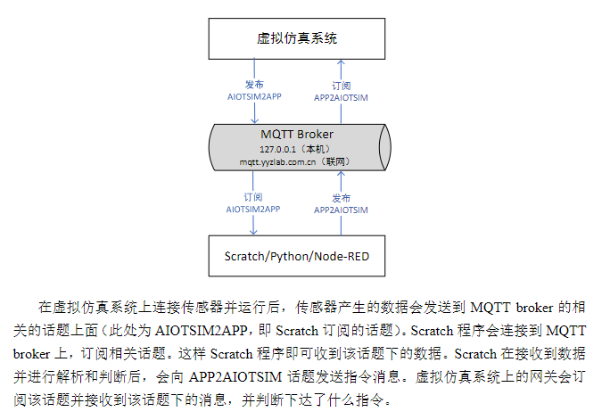
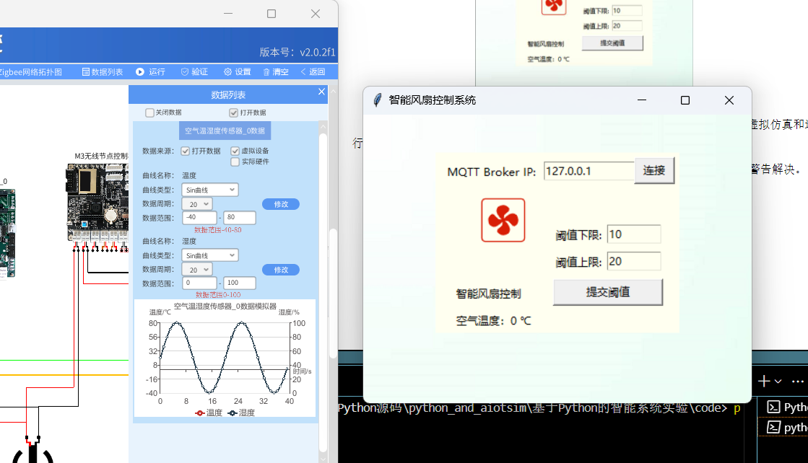
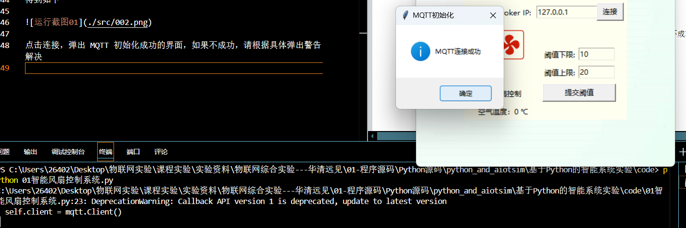
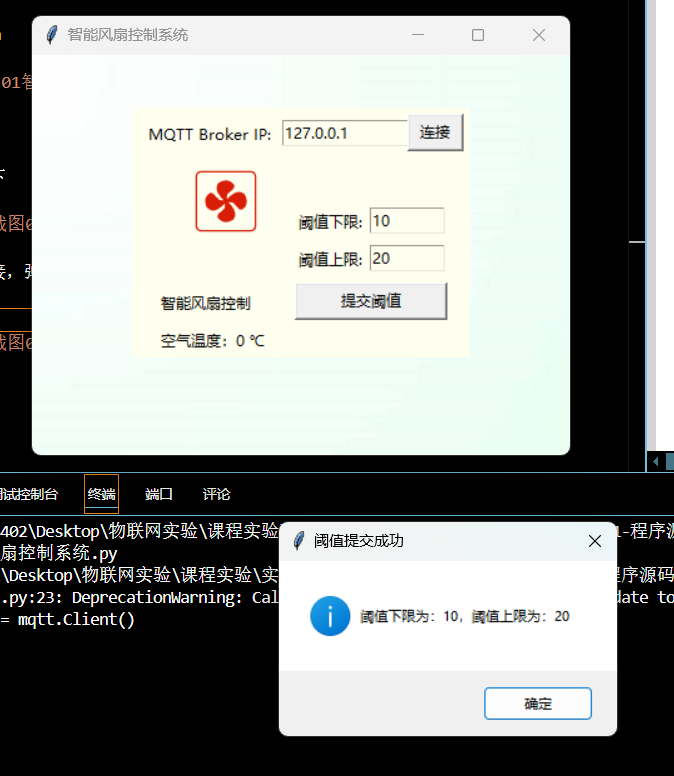
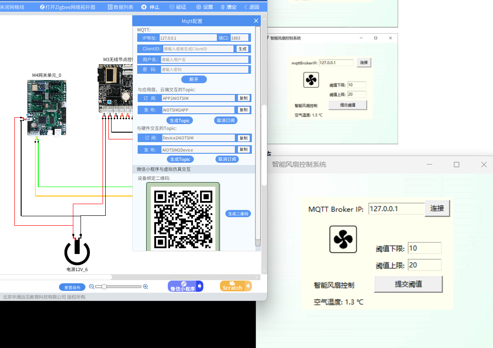
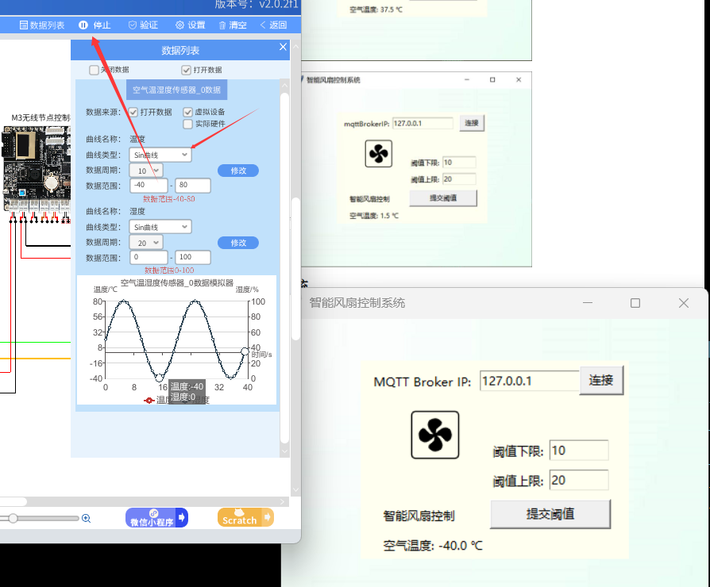
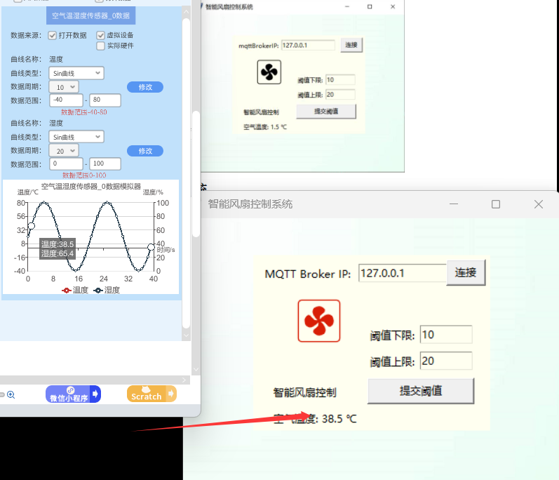

# lab_1 智能风扇控制系统

## Author:liulanker     Date: 2025-03-31

---


## 实验目的

学习 Scratch 编程实现智能风扇控制系统中空气温湿度数据采集及风扇的联动控制，及同步生成 Python 代码运行实现同样功能。

---

## 实验参考

[实验指导书P122](../../实验资料/物联网综合实验---华清远见/02-使用手册/物联网虚拟仿真实验-Python部分231221.pdf)

[实验指导书P186](../../实验资料/物联网综合实验---华清远见/02-使用手册/物联网虚拟仿真实验-Scratch部分231220.pdf)

[Python程序源码](../../实验资料/物联网综合实验---华清远见/01-程序源码/Python源码/python_and_aiotsim/基于Python的智能系统实验/code/01智能风扇控制系统.py)

Tips:可以通过检索关键字获得

```Python

from tkinter import *
import tkinter.messagebox
import paho.mqtt.client as mqtt
import threading
import json


class MQTTClient:
    """
    mqtt
    """
    def __init__(self):
        self.message = ""

    def param_set(self, target_ip, default_port, sub_topic, pub_topic):
        """
        初始化
        :param target_ip: mqtt服务器IP
        :param default_port: mqtt端口号
        :param sub_topic: sub的topic
        :param pub_topic: pub的topic
        """
        self.client = mqtt.Client()
        self.client.on_connect = self.on_connect
        self.client.on_message = self.on_message
        self.client.connect(target_ip, default_port, 5)
        self.pub_topic = pub_topic
        self.client.subscribe(sub_topic, qos=0)
        self.client.loop_start()

    def on_connect(self, client, userdata, flags, rc):
        """
        连接功能
        :param client:
        :param userdata:
        :param flags:
        :param rc:
        :return:
        """
        tkinter.messagebox.showinfo("MQTT初始化", "MQTT连接成功")

    def on_message(self, client, userdata, msg):
        """
        接收数据
        :param client:
        :param userdata:
        :param msg: 接收到的信息
        :return: none
        """
        msg = json.loads(str(msg.payload.decode('utf-8')))
        try:
            self.message = msg['tem']
        except Exception as e:
            pass

    def send_mqtt(self, data):
        """
        发送mqtt
        :param data: 发送的数据，字符串
        :return: none
        """
        self.client.publish(self.pub_topic, payload="{}".format(data), qos=0)


class InterfaceStyle:
    def __init__(self):
        self.ip = ""
        self.end_of_code = True
        self.lower = 0
        self.upper = 0

    def on_closing(self):
        if tkinter.messagebox.askokcancel("退出", "确定要退出吗?"):
            self.end_of_code = False
            self.root.destroy()


    def type(self):
        self.root = Tk()
        self.root.title("智能风扇控制系统")
        self.root.geometry("430x320")
        self.type_text = "智能风扇控制"
        # 背景设置
        background_img = PhotoImage(file="image/背景.png")
        background_label = Label(self.root, image=background_img)
        background_label.pack()

        frame = Frame(self.root, bd=10, width=270, height=200, bg="ivory")
        frame.place(x=80, y=42)

        self.var = StringVar(frame, "空气温度：0 ℃")

        name = Label(frame, text=self.type_text, bg="ivory")
        name.place(x=10, y=135)

        value = Label(frame, textvariable=self.var, bg="ivory")
        value.place(x=10, y=165)

        img_fan_close = PhotoImage(file="image/风扇关.png")
        img_fan_open = PhotoImage(file="image/风扇开.png")
        self.fan_close = Label(frame, image=img_fan_close, height=110, width=110, bg="ivory")
        self.fan_close.place(x=10, y=10, height=110, width=110)
        self.fan_open = Label(frame, image=img_fan_open, height=110, width=110, bg="ivory")
        self.fan_open.place(x=10, y=10, height=110, width=110)

        mqtt_broker = Label(frame, text="MQTT Broker IP:", bg="ivory")
        mqtt_broker.place(x=0, y=0)

        self.mqtt_broker_ip = Entry(frame, width=15, bg="ivory")
        self.mqtt_broker_ip.place(x=110, y=0)
        self.mqtt_broker_ip.insert(0, "127.0.0.1")

        mqtt_button = Button(frame, text="连接", width=5, command=self.mqtt_init)
        mqtt_button.place(x=210, y=-5)

        lower_threshold_text = Label(frame, text="阈值下限:", bg="ivory")
        lower_threshold_text.place(x=120, y=70)
        self.lower_threshold = Entry(frame, width=8, bg="ivory")
        self.lower_threshold.place(x=180, y=70)
        self.lower_threshold.insert(0, "10")
        upper_threshold_text = Label(frame, text="阈值上限:", bg="ivory")
        upper_threshold_text.place(x=120, y=100)
        self.upper_threshold = Entry(frame, width=8, bg="ivory")
        self.upper_threshold.place(x=180, y=100)
        self.upper_threshold.insert(0, "20")

        mqtt_button = Button(frame, text="提交阈值", width=16, command=self.submit)
        mqtt_button.place(x=120, y=130)

        self.root.protocol("WM_DELETE_WINDOW", self.on_closing)

        self.root.mainloop()

    def mqtt_init(self):
        self.ip = self.mqtt_broker_ip.get()

    def submit(self):
        try:
            lower = int(self.lower_threshold.get())
            upper = int(self.upper_threshold.get())
            if upper < lower or upper <= 0 or lower <= 0:
                tkinter.messagebox.showwarning("阈值提交失败", "注意阈值内容")
                return
        except Exception as e:
            tkinter.messagebox.showwarning("阈值提交失败", "注意填写阈值")
            return
        self.lower = lower
        self.upper = upper
        tkinter.messagebox.showinfo("阈值提交成功", "阈值下限为：{}，阈值上限为：{}".format(self.lower, self.upper))

    def display_and_control_device(self, status):
        if status:
            self.fan_close.place_forget()
            self.fan_open.place(x=10, y=10, height=110, width=110)
        else:
            self.fan_open.place_forget()
            self.fan_close.place(x=10, y=10, height=110, width=110)


if __name__ == '__main__':
    interface_style = InterfaceStyle()
    t_interface_style = threading.Thread(target=interface_style.type)
    t_interface_style.start()
    mqtt_client = MQTTClient()
    while interface_style.end_of_code:
        if interface_style.ip != "":
            try:
                mqtt_client.param_set(interface_style.ip, 1883, "AIOTSIM2APP", "APP2AIOTSIM")
            except Exception as e:
                tkinter.messagebox.showwarning("MQTT初始化失败", e)
            interface_style.ip = ""
        if mqtt_client.message != "":
            tempval = "空气温度: {} ℃".format(mqtt_client.message)
            interface_style.var.set(tempval)
            if int(mqtt_client.message) <= interface_style.lower:
                interface_style.display_and_control_device(False)
                mqtt_client.send_mqtt("{\"fan\":False}")
            elif int(mqtt_client.message) >= interface_style.upper:
                interface_style.display_and_control_device(True)
                mqtt_client.send_mqtt("{\"fan\":True}")
            mqtt_client.message = ""


```

---

## 实验原理



---

## 实验步骤

如果是第一次做Python部分的实验需要先下载安装Python环境（略过）

需要下载程序运行所需要的模块

```bash
pip install paho-mqtt

```

#### 问题解决：出现报错如**You are using pip version 21.2.3; however, version 25.0.1 is available**通过键入以下指令来解决

```bash
python -m pip install --upgrade pip
```

在code文件夹目录下打开shell或者终端,键入来运行程序

```bash
python 01智能风扇控制系统.py  
```

得到如下



点击连接，弹出 MQTT 初始化成功的界面，如果不成功，请根据具体弹出警告解决


 
之后会发现,如果程序中的”空气温度”高于 20℃,那么风扇标志会变红,如果程序中的”空
气温度”低于 10℃,那么风扇标志会变黑



在虚拟系统界面需要对网关进行编辑，进入网关，点击M4网关单元，点击mqtt配置
```op
链接Mqtt
订阅
```

结果如下：



然后点击运行按钮，会发现弹窗风扇的变化
之后会发现,如果程序中的”空气温度”高于 20℃,那么风扇标志会变红,如果程序中的”空气温度”低于10℃,那么风扇标志会变黑






---


## 实验总结 

### 1. 实验成果
- 成功通过Python实现MQTT协议通信，建立虚拟仿真环境与本地控制程序的实时数据交互
- 开发了具备温度监测、阈值控制、设备状态可视化功能的GUI界面
- 实现智能风扇的自动化控制：温度≥20℃自动启动，≤10℃自动停止
- 验证了物联网系统中"感知-传输-控制"的完整闭环流程

### 2. 关键技术点
- 采用多线程架构分离界面渲染与设备控制逻辑
- 使用JSON格式进行MQTT消息编解码
- 通过tkinter实现动态界面元素更新
- 异常处理机制保障系统稳定性

### 3. 问题与解决
- **环境配置问题**：通过`python -m pip install --upgrade pip`更新包管理工具
- **版本兼容问题**：明确要求paho-mqtt==1.6.1版本
- **连接异常处理**：增加try-except块捕获网络错误
- **阈值逻辑漏洞**：添加上下限数值校验（upper ≥ lower）

### 4. 物联网系统认知
- 深刻理解设备端(Edge)与平台端(Cloud)的协同工作原理
- 掌握物联网通信协议(MQTT)在实际场景中的应用
- 认识到数据可视化在设备监控中的重要性
- 体会到异常处理机制对工业控制系统可靠性的关键作用

---

© 2025 liulanker | [联系作者](liulanker@gmail.com)