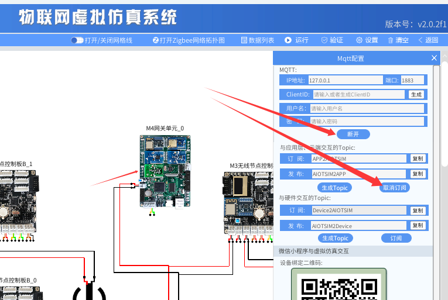
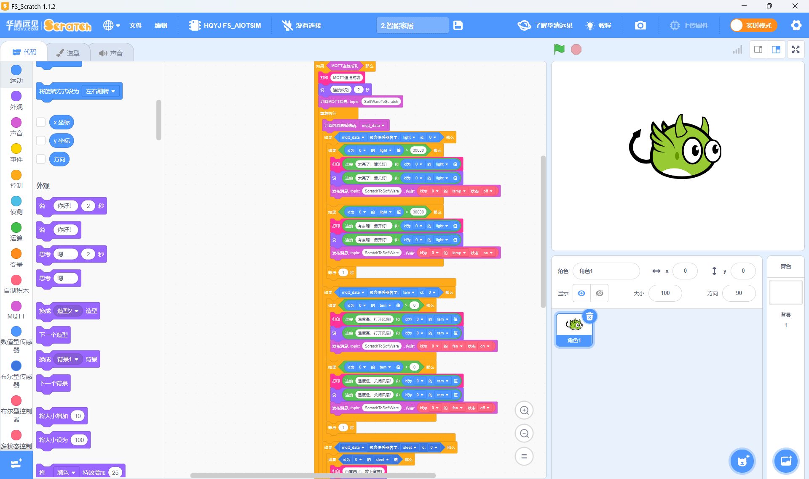
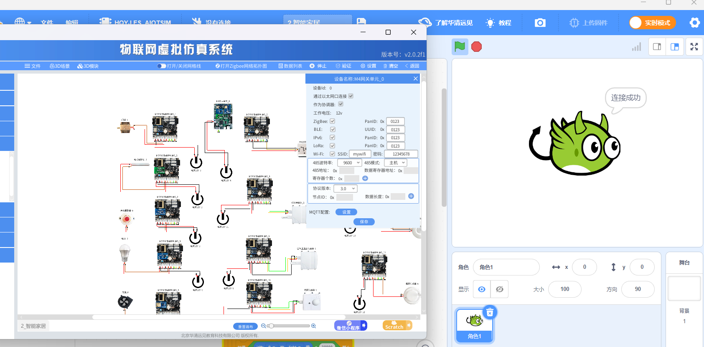
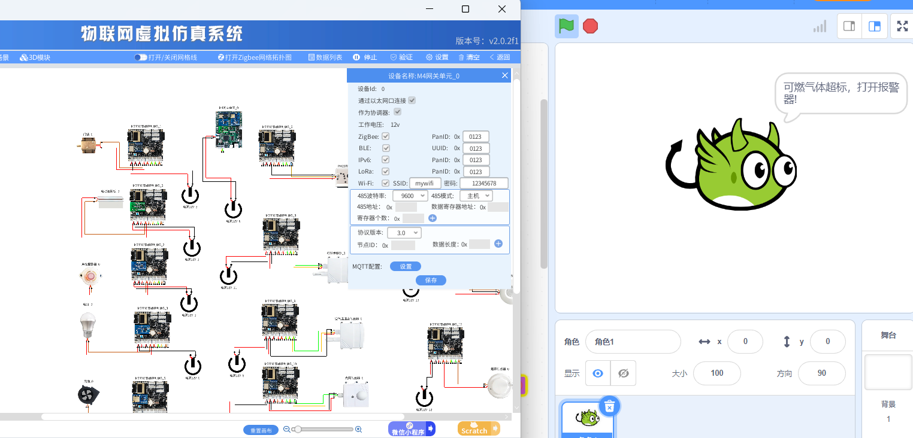
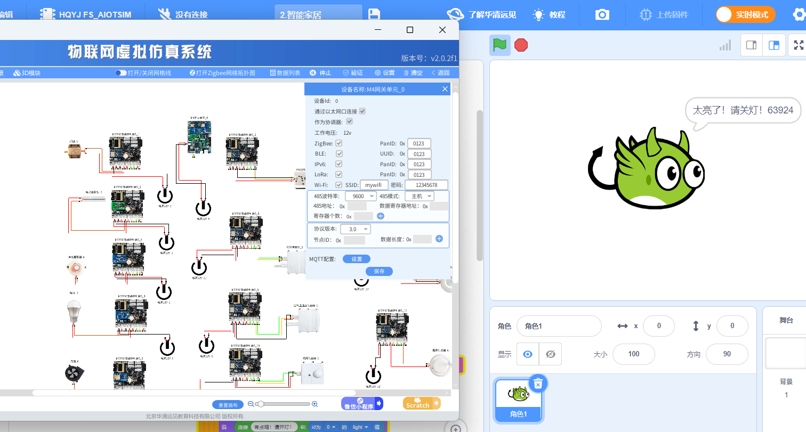
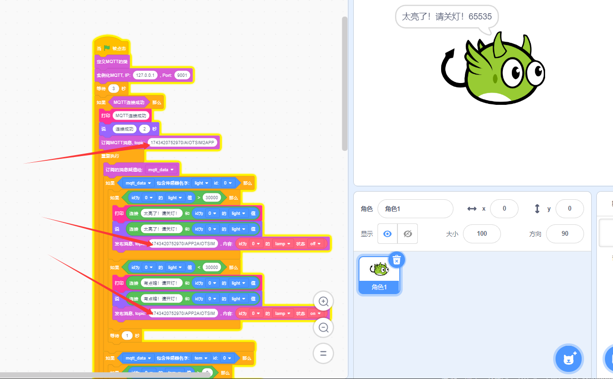
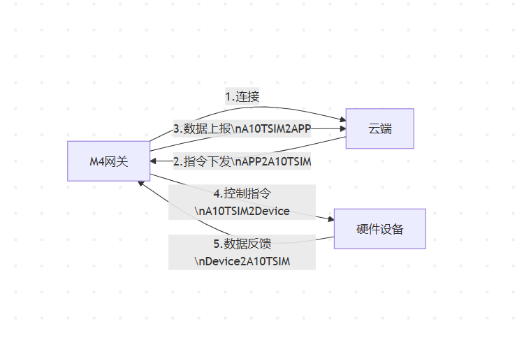

# lab_2 智能家居

## Author: liulanker   Date: 2025-03-31

---

## 实验目的

利用 Scratch 和 MQTT 收集多个智能家居传感器的数值，并依据这些数值控制智能家居的执行器。

---

## 实验参考

- [实验指导书P228](../../实验资料/物联网综合实验---华清远见/02-使用手册/物联网虚拟仿真实验-Scratch部分231220.pdf)

---

## 实验步骤

1. 进入实验模拟。
2. 点击 M4 网关，配置 Mqtt。

   

3. 点击数据列表，打开数据。
4. 点击 Scratch 进行编写代码，具体可以参考

   [代码参考](../../实验资料/物联网综合实验---华清远见/01-程序源码/预设实验Scartch/2.智能家居.ob)

   结果如下：

   

5. 点击运行，结果如下：

   
   
   

---

### 问题解决

#### **如果只出现连接成功，后面角色不再返回信息，则代表 Mqtt 订阅问题**

- 解决方法：进入 M4 网关的 mqtt 设置，查看订阅与发布的 topic：

  

  复制相应的内容，然后进入 Scratch 改一下对应部分，如下：

  

  这里只列举了部分改动点，需要改动的部分比较多，注意区分什么是订阅 topic 什么是发布 topic。

  画一个关系图来表示一下，方便理解：

  

---

## 实验总结

### 1. 实验成果

- 成功通过 Scratch 编程实现了智能家居系统的数据采集与执行器控制。
- 配置了 M4 网关的 MQTT 订阅/发布主题（AIOTSIM2APP/APP2AIOTSIM），实现了传感器数据的实时获取与执行器的联动。
- 通过 MQTT 协议建立了智能家居设备的互联互通。

### 2. 关键技术点

- 使用 Scratch 编程环境实现智能家居系统中的传感器数据收集和执行器控制。
- 配置 MQTT 协议中的订阅/发布主题，确保数据的双向通信。
- 解决了 MQTT 订阅异常问题，确保系统稳定运行。

### 3. 问题与解决

- **MQTT 订阅问题**：通过检查 M4 网关的 MQTT 配置，确保订阅和发布的 topic 正确设置，并在 Scratch 代码中做了相应的调整，解决了通信问题。

### 4. 物联网系统认知

- 通过本次实验，深入了解了 MQTT 协议在物联网中的应用，尤其是在多设备协同和数据双向通信中的关键作用。
- 体会到 MQTT 协议配置对系统稳定性和数据流转的重要性。
- 理解了智能家居系统中的环境监测和设备控制如何实现信息的实时采集与反馈。

---

© 2025 liulanker | [联系作者](liulanker@gmail.com)