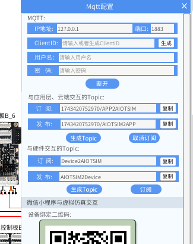
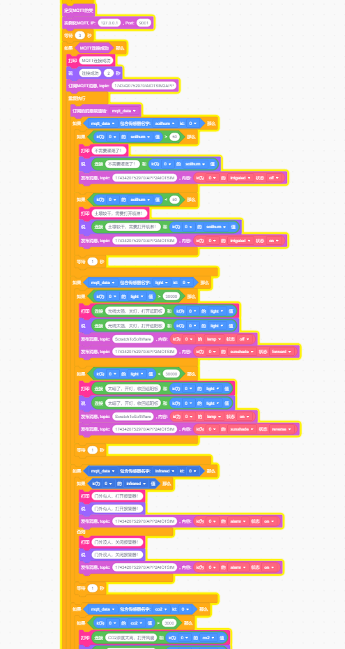
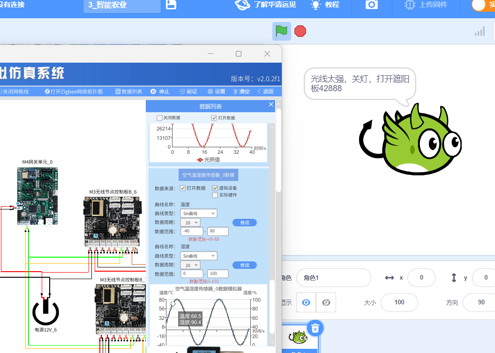
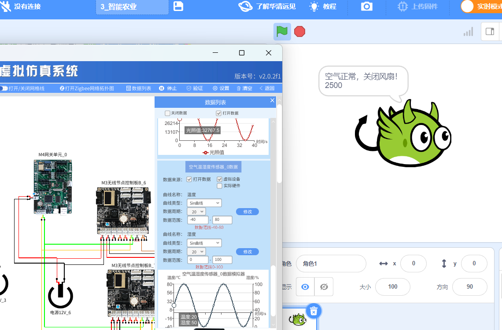
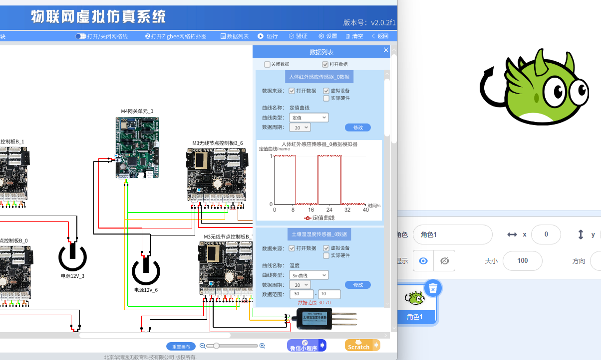

# lab_3 智能农业

## Author: liulanker   Date: 2025-03-31

---

## 实验目的

利用 Scratch 和 MQTT 收集多个智能农业传感器的数值，并依据这些数值控制智能农业的执行器。

---

## 实验参考

- [实验指导书P233](../../实验资料/物联网综合实验---华清远见/02-使用手册/物联网虚拟仿真实验-Scratch部分231220.pdf)

---

## 实验步骤

1. 进入实验模拟。
2. 点击 M4 网关，配置 Mqtt。

   

3. 点击数据列表，打开数据。
4. 点击 Scratch 进行编写代码，具体可以参考

   [代码参考](../../实验资料/物联网综合实验---华清远见/01-程序源码/预设实验Scartch/2.智能农业.ob)

   结果如下：

   

5. 点击运行，结果如下：

   
   
   

---

### 问题解决

#### **如果只出现连接成功，后面角色不再返回信息，则代表 Mqtt 订阅问题**

- 解决方法：参考前置实验智能家居中的解决方案。

  [智能家居.md](../lab_2/智能家居.md)

---

## **实验总结**

### **1. 实验目标达成情况**

本次实验成功利用 **Scratch** 和 **MQTT 协议** 实现了智能农业系统的仿真，主要功能包括：
- 通过 M4 网关连接云端（IP: `127.0.0.1`，端口: `1883`），完成用户认证与 Topic 配置。
- 订阅云端指令（`1743420752970/APP2AIOTSIM`）和硬件数据（`Device2AIOTSIM`），发布传感器数据（`AIOTSIM2APP`）和控制指令（`AIOTSIM2Device`）。
- 在 Scratch 中编写逻辑，实现传感器数据采集（如温湿度）与执行器控制（如灌溉开关）。

### **2. 关键技术与方法**

- **MQTT 通信**：
  - 采用轻量级发布/订阅模式，确保低功耗设备与云端的高效交互。
  - 通过动态生成 `ClientID` 和 Topic（如 `1743420752970/AIOTSIM2APP`）区分不同设备和数据流向。

- **Scratch 编程**：
  - 使用事件驱动逻辑（如“当接收到MQTT消息”）触发农业控制动作。
  - 结合传感器模拟数据，动态调整执行器状态（如风扇、水泵）。

---

© 2025 liulanker | [联系作者](liulanker@gmail.com)
