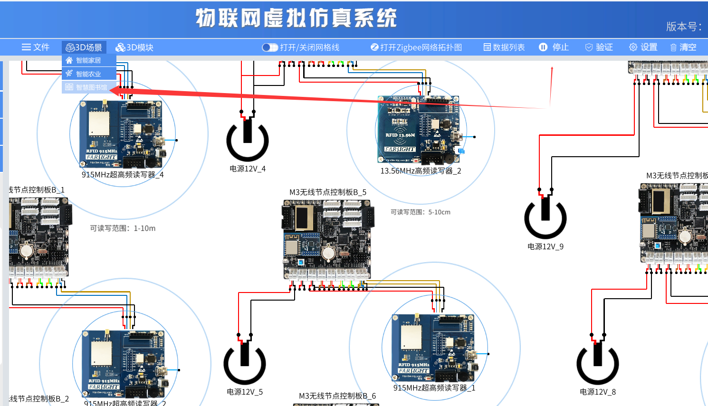
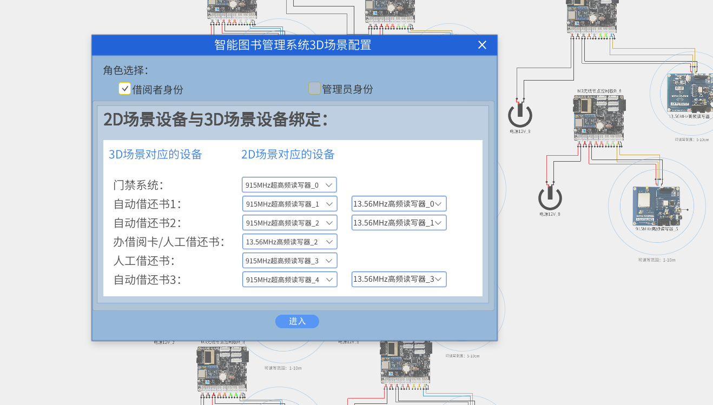
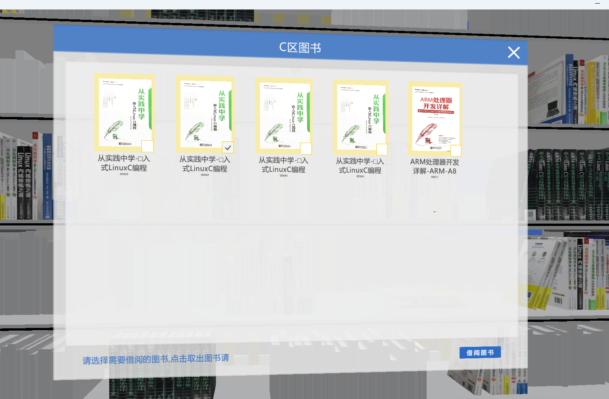
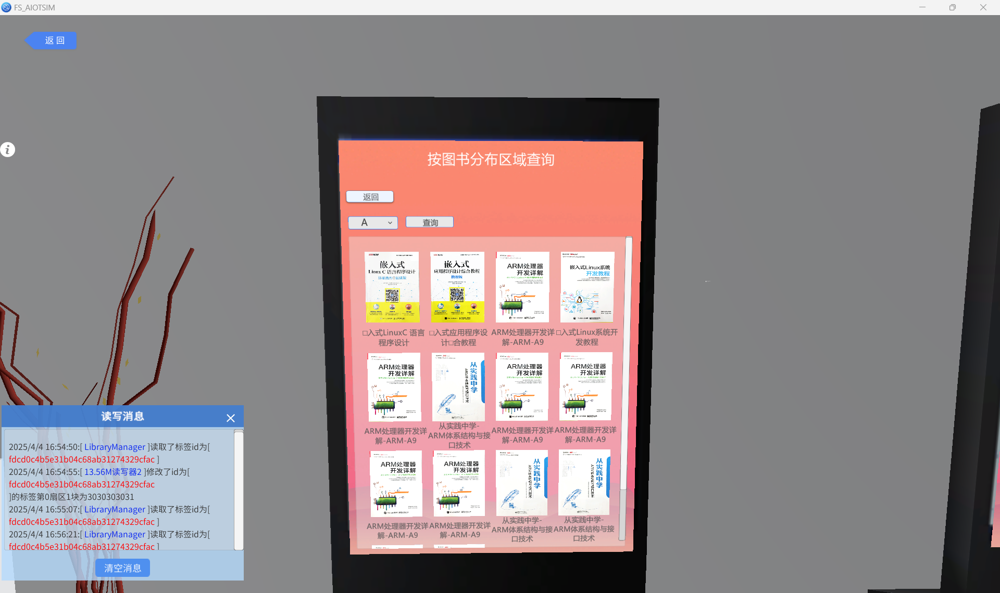
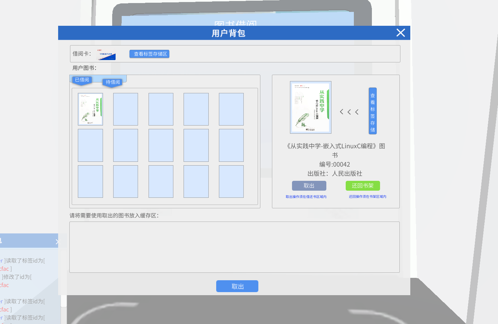
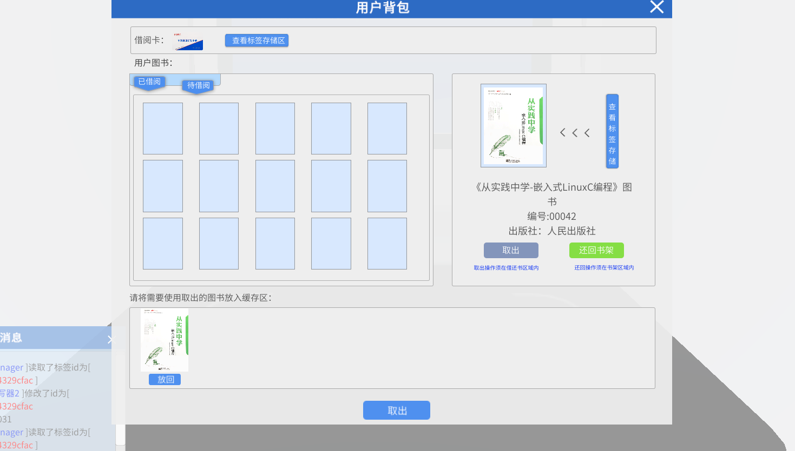
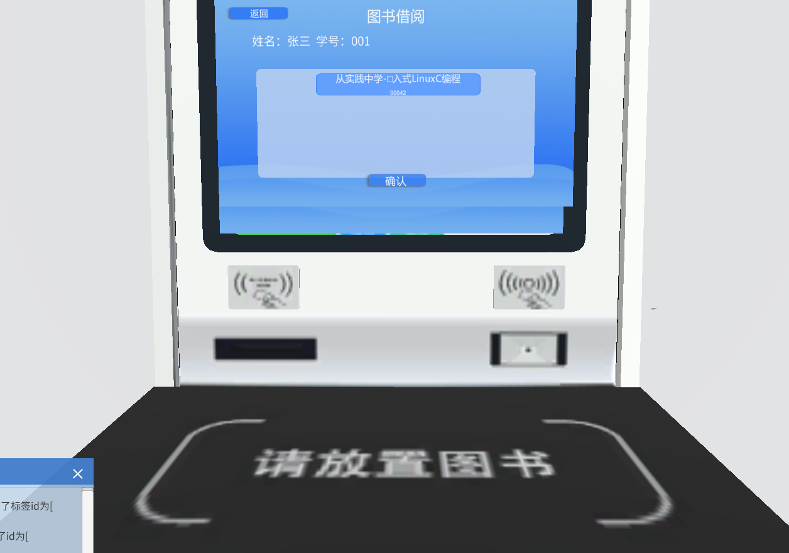
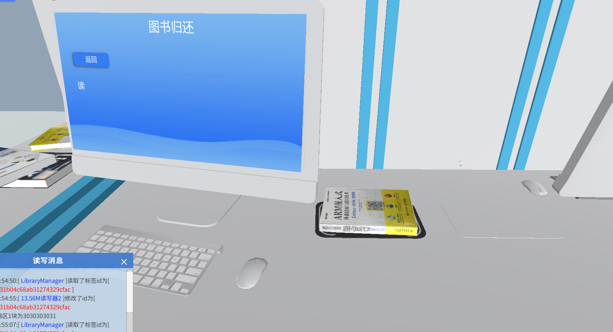
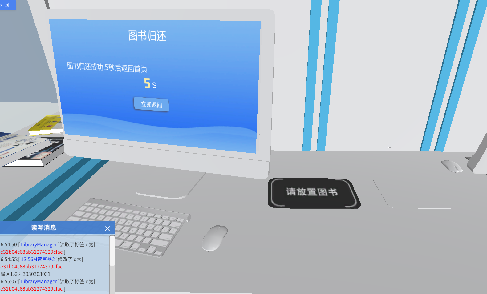
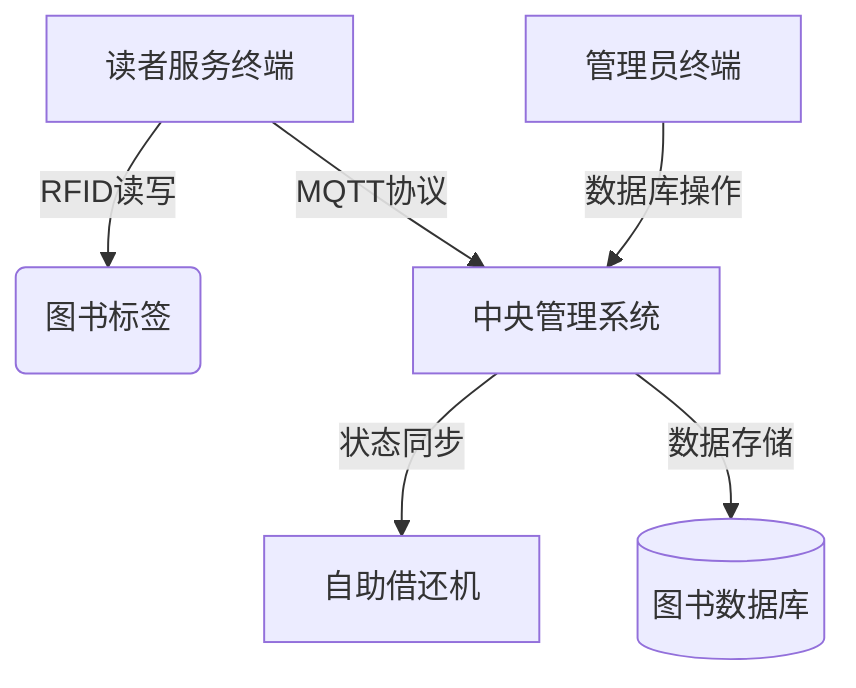

# lab_4 智能图书馆

## Author: liulanker   Date: 2025-03-31

---

## 实验目的

1. 掌握基于 RFID 的图书识别与追踪技术实现。
2. 理解 MQTT 协议在分布式图书馆管理系统中的应用。
3. 实现智能图书馆核心功能：
   - 图书自动借还流程。
   - 实时库存状态同步。
   - 读者服务自助化操作。
4. 构建完整的物联网图书馆系统架构：
   ```mermaid
   flowchart LR
       A[RFID标签] --> B(读写器)
       B --> C{MQTT Broker}
       C --> D[中央管理系统]
       D --> E[(云数据库)]
       D --> F[终端设备]
   ```
5. 验证图书馆管理系统的可靠性与实时性指标。

---

## 实验参考

 

[实验指导书P102](../../实验资料/物联网综合实验---华清远见/02-使用手册/物联网虚拟仿真系统用户手册220920.pdf)

---

## 实验步骤

1. 进入 3D 场景之前需要在 2D 实验界面（实验可选择如下图所示提供的“智慧图书馆”预设实验或者自定义的实验）将程序运行起来，然后选择“3D 场景”模块，选择“智慧图书馆”。

   

2. 进入之前配置对应的设备：

   

- 智慧图书馆中可以办理和销毁借阅卡，借阅者身份可以进行：图书借阅、归还、查询等一系列，管理员身份可以进行：登记，下架图书，盘点等操作，模拟了实际图书馆的管理过程。如为实验过程中一些功能的演示操作过程。

   

3. 进入前台，选择功能。

   

4. 办理借阅卡，登记信息。

   

5. 查询图书位置。

   

6. 在书架上存取图书，进行交互。

   

7. 在自助查询机上查询图书。

   

8. 自助借还机上交互，**p** 键打开背包，查看图书信息，取出图书。

   

   

   
   

9. 归还同理。

   

   

   

10. 总结了一个操作视频，以下为操作的 B 站链接：

    [视频操作](https://www.bilibili.com/video/BV1XNZdYFEkN/?share_source=copy_web&vd_source=2f23cead45b1fc3be9482192e18575ae)

    或者在项目的目录也可以找到

    [视频操作](./src/视频操作.mp4)

---

## 实验总结

### 1. 系统架构



### 2. 核心功能参数

```json
{
  "系统配置": {
    "RFID频率": "13.56MHz",
    "通信协议": "MQTT 3.1.1",
    "数据库类型": "SQLite",
    "数据更新间隔": "5秒"
  }
}
```

### 3. 关键技术实现

1. **RFID 数据采集**：
   - 标签信息自动识别。
   - 图书状态实时更新。
   
2. **借阅管理**：
   - 借还记录自动生成。
   - 逾期自动计算。

3. **库存管理**：
   - 自动盘点功能。
   - 图书定位精度优化。

4. **用户服务**：
   - 自助查询界面。
   - 实时库存显示。

### 4. 实验收获

通过本实验掌握：
- RFID 技术在图书管理中的应用。
- MQTT 协议在分布式系统中的作用。
- 数据库事务处理机制。
- 状态同步保障策略。
- 人机交互界面设计原则。

---

© 2025 liulanker | [联系作者](liulanker@gmail.com)
