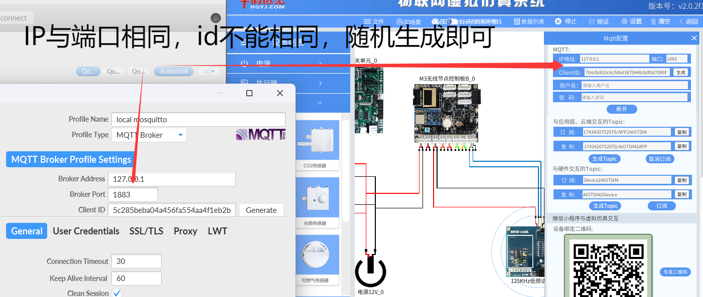
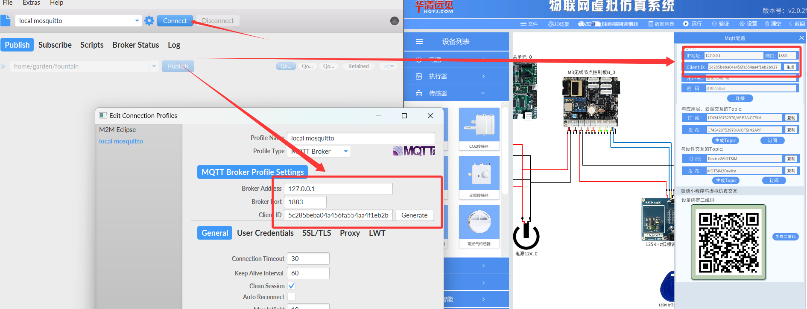
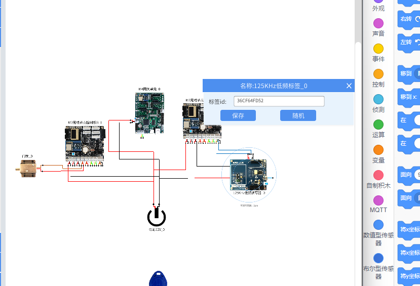
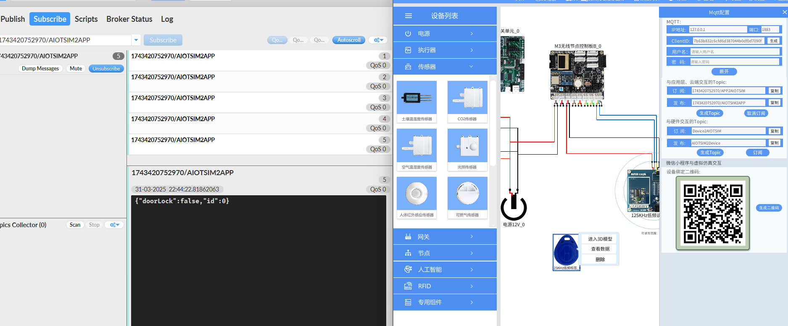
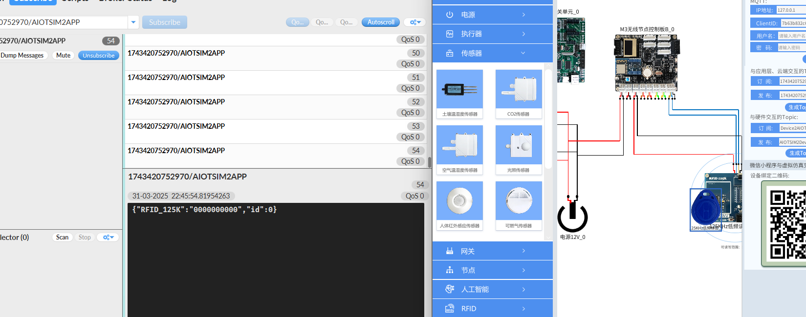
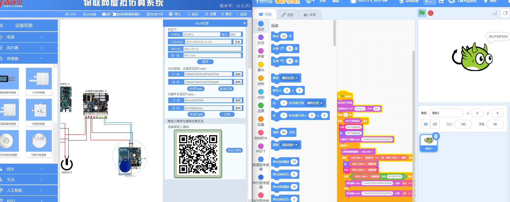
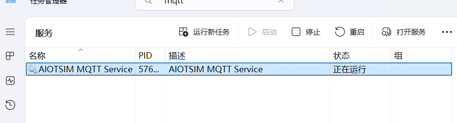

# lab_5 RFID门禁实验

## Author: liulanker   Date: 2025-03-31

---

## 实验目的

利用 Scratch 和 MQTT 获取 125KHz RFID 标签的信息，并根据标签信息进行门禁的控制。

---

## 实验参考

- [实验指导书P156](../../实验资料/物联网综合实验---华清远见/02-使用手册/物联网虚拟仿真实验-Scratch部分231220.pdf)

---

## 实验步骤

### 实验前准备：

因为 lab_5~9 实验是基于 RFID 来进行的，通过 MQTT 来建立通信连接，所以先要安装 MQTT 客户端。
步骤参考：
[实验指导书P10](../../实验资料/物联网综合实验---华清远见/02-使用手册/物联网虚拟仿真实验-MQTT部分240412.pdf)

软件位置在：
```win
物联网综合实验---华清远见\04-工具软件\mqttfx-1.7.1-windows-X86.exe
```
双击运行即可，打开后进行网关配置。
[实验指导书P15](../../实验资料/物联网综合实验---华清远见/02-使用手册/物联网虚拟仿真实验-MQTT部分240412.pdf)

具体 mqttfx 配置与 broker 中的配置如下：


1. 进入实验模拟。
2. 点击 M4 网关，配置 MQTT，同时在 MQTTfx 中设置对应 IP 与端口，如图：

   

3. 点击 Connect 连接。连接成功后右侧会变成绿灯。

4. 左键点击 125KHz 标签，选择查看数据，设置一个标签 ID，并保存：

   

### publish 部分

- 结果如下：

这个低频阅读器是每隔 1 秒作业主动扫描附近的 Tag，当我们不放置标签时，订阅会返回门锁关闭的信息如下：



当我们将 Tag 靠近 reader 时，订阅返回如下信息，代表阅读器识别成功，实验成功：



### Scratch 部分

1. 点击 Scratch 进行编写代码，具体可以参考：

   [代码参考](../../实验资料/物联网综合实验---华清远见/01-程序源码/预设实验Scartch/4.RFID门禁系统.ob)

   结果如下：

   

   

---

## 实验问题解决

#### **出现 mqttfx 客户端可以连接但是 broker 中无法连接**

- 检查 2 个配置的 ClientID 是不是一样的，如果一样，需要改不一样，在 MQTT 通信中，不允许相同 ID 同时存在。
- 打开任务管理器，检查本机服务中 MQTT 服务是否正常运行，否则用 TOOL 重新启动一下：

  

---

## 实验总结

### 1. 实验目标达成情况

本次实验成功利用 Scratch 和 MQTT 协议，完成 RFID 标签信息的读取和门禁控制的仿真，包括以下功能：
- 配置 MQTT 连接（IP 地址：127.0.0.1，端口：1883）。
- 订阅和发布与门禁相关的主题（如 `1743420752970/APP2AIOTSIM` 和 `1743420752970/AIOTSIM2APP`）。
- 使用 Scratch 控制门禁开关，通过模拟器展示 RFID 标签的实时数据。

### 2. 关键技术与方法

- **RFID 数据采集：** 利用 125KHz RFID 标签的唯一 ID，实现门禁设备控制。
- **MQTT 通信：** 使用发布/订阅模式传递门禁指令和传感器数据。
- **Scratch 编程：** 编写事件驱动逻辑代码，优化数据处理与执行器响应。
- 理解了 **RFID 标签与物联网协议** 的应用方法。
- 掌握了 **MQTT 通信与事件编程** 的实践经验。
- 提升了问题排查与代码优化能力。

---

© 2025 liulanker | [联系作者](liulanker@gmail.com)
