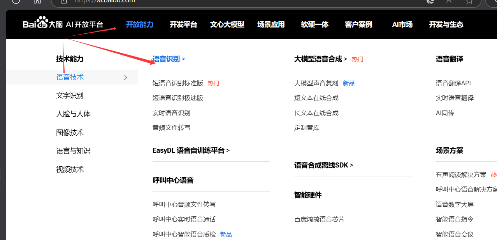
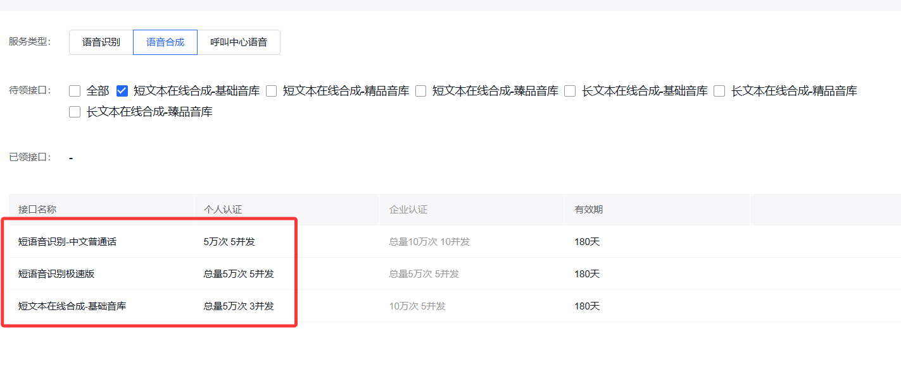
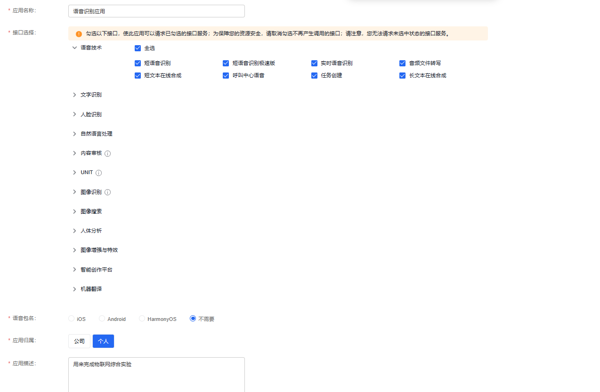
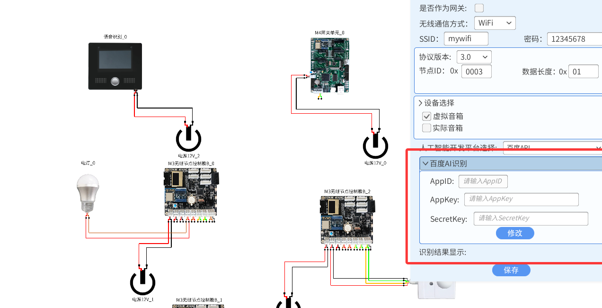
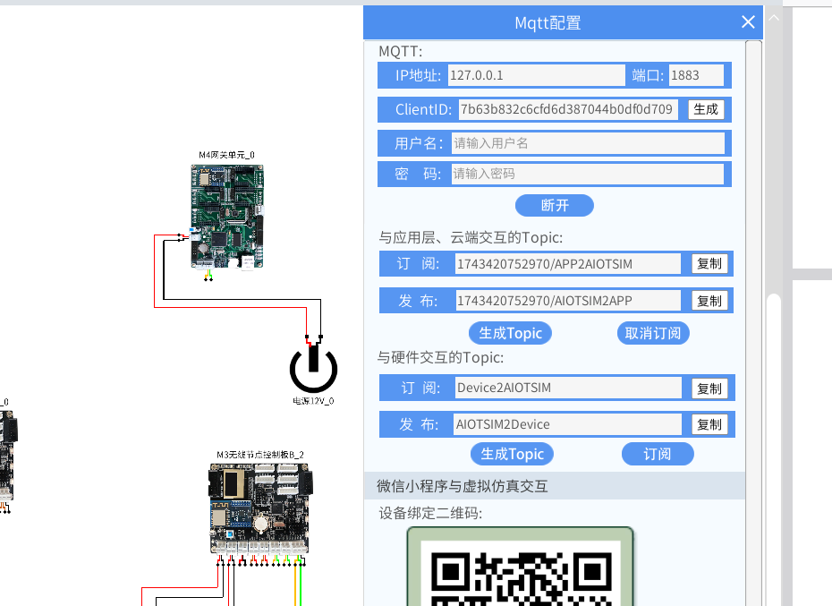
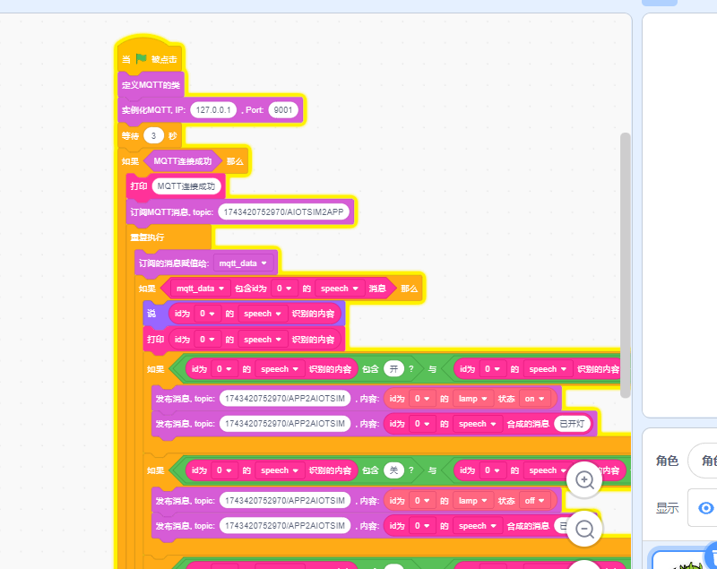
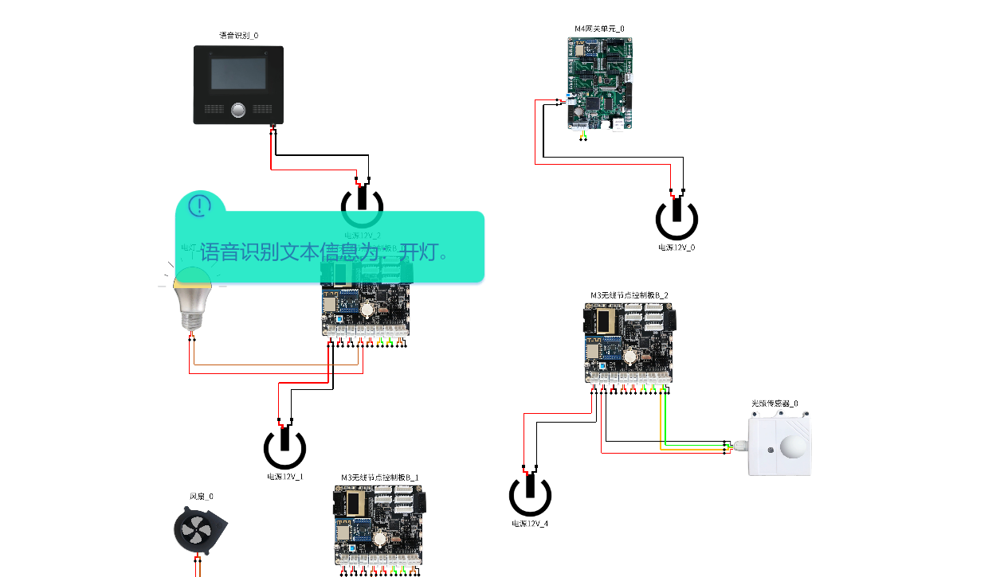
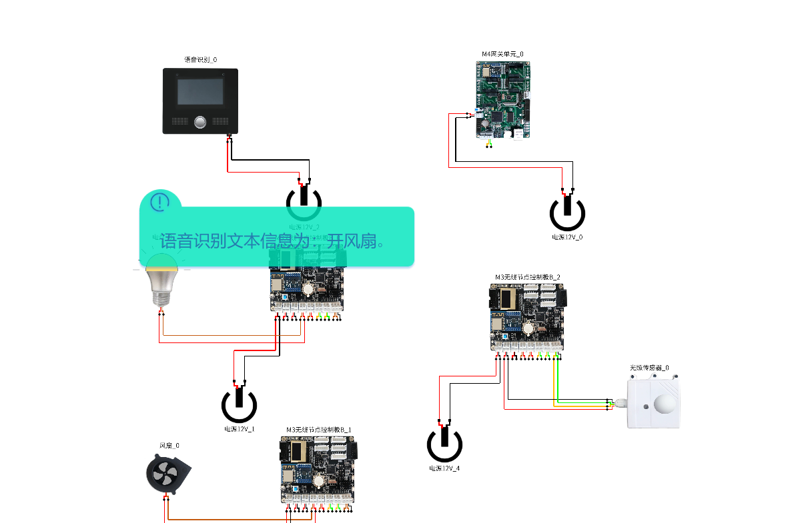
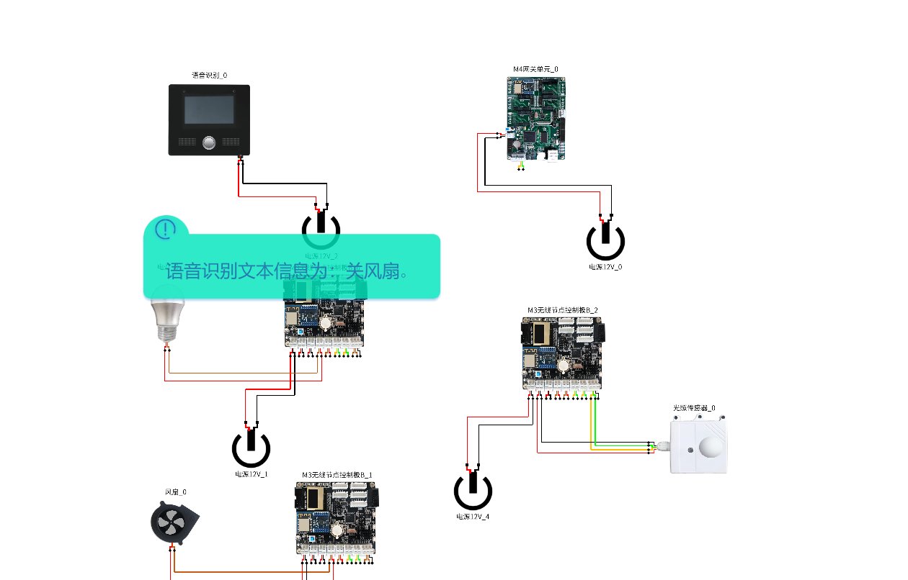
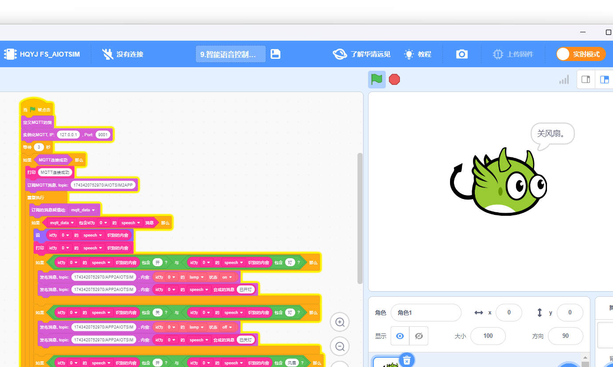

# lab_10 智能语音识别控制系统

## Author: liulanker   Date: 2025-04-04

---

## 实验目的

通过百度 AI 开发平台申请语音识别服务，在语音识别模块上填写语音识别 API 进行调取服务，实现语音识别能力，返回语音识别结果并和网关通信。  
通过 Scratch 编程连接 MQTT 与虚拟仿真的网关进行通信，实现语音识别结果比对，来控制电灯开关，并对执行结果下发至语音识别模块实现语音合成并播放，Scratch 编写好积木后可生成 Python 代码，复制 Python 代码可在 Python 执行。

---

## 实验参考

- [实验指导书P108](../../实验资料/物联网综合实验---华清远见/02-使用手册/物联网虚拟仿真实验-Scratch部分231220.pdf)

---

## 实验步骤

1. **申请语音识别百度 API**

   进入[百度AI开放平台网站](https://ai.baidu.com/)

   

2. **进入语音识别,点击立即使用**

   登录百度账号。

3. **登录成功后，点击(个人实名认证)领取免费资源，个人账户免费使用 50000 次。**

   领取如下服务：
   - 语音识别:
     - 短语音识别-中文普通话
     - 短语音识别极速版
   - 语音合成:
     - 短文本在线合成-基础音库

   

4. **领取后点击“应用列表”创建应用**

   

5. **得到 API-key**

   

6. **进入实验模拟**

   配置语音识别模块 API。

   

   **Tips:** 填写完毕后一定要点击修改，不要点保存，点保存并不会保存。弹出 **密钥初始化成功才正确**。

7. **点击 M4 网关，配置 MQTT**

   

8. **点击 Scratch 进行编写代码，配置好相关的话题，具体可以参考**

   [代码参考](../../实验资料/物联网综合实验---华清远见/01-程序源码/预设实验Scartch/9.智能语音控制系统.ob)

   

9. **然后运行 Scratch 与实验**

   点击语音识别按钮，说"开灯"、"开风扇"等指令，得到反馈：

     
   

10. **尝试关闭**

    

11. **同时 Scratch 图标显示语音的内容**

    

12. **Python 编程切换到上传模式修改端口号，与上一个实验执行相同：**

    ```Python
    # 华清远见:https://fsdev.com.cn/
    # 淘宝:https://shop273057902.taobao.com/
    # generated by HQYJ
    import paho.mqtt.client as mqtt
    from queue import Queue
    import json
    import base64
    import requests

    import time

    class HQYJMqttClient:
      def __init__(self, broker_ip: str, broker_port: int):
        self.mqtt_queue = Queue(255)
        self.is_connected = False
        self.client = mqtt.Client()
        self.client.on_message = self.on_message
        self.client.on_connect = self.on_connect
        self.rc = 100
        try:
          self.client.connect(broker_ip, broker_port, 3)
        except Exception as e:
          print(e)

      def on_message(self, client, userdata, message):
        msg = json.loads(message.payload.decode())
        self.mqtt_queue.put(msg)

      def on_connect(self, client, userdata, flags, rc):
        print("连接返回结果码:", rc)
        self.rc = rc


    # 注意：在 websocket 端口是 9001，如使用 Python 代码，端口需手动改成 1883。
    hqyj_mqtt_clt = HQYJMqttClient('127.0.0.1', 1883)
    hqyj_mqtt_clt.client.loop_start()
    time.sleep(3)
    if hqyj_mqtt_clt.rc == 0:
      print('MQTT 连接成功')
      hqyj_mqtt_clt.client.subscribe('1743420752970/AIOTSIM2APP', qos=0)

      while True:
        mqtt_data = hqyj_mqtt_clt.mqtt_queue.get()

        if ('speech' in mqtt_data) and ('id' in mqtt_data) and (mqtt_data['id'] == 0):
          print((mqtt_data["speech"]))
          if str((mqtt_data["speech"])).find(str('开')) > -1 and str((mqtt_data["speech"])).find(str('灯')) > -1:
            hqyj_mqtt_clt.client.publish('1743420752970/APP2AIOTSIM', payload=json.dumps(({"lamp":True, "id":0}),ensure_ascii=False))
            hqyj_mqtt_clt.client.publish('1743420752970/APP2AIOTSIM', payload=json.dumps(({"speech":'已开灯',"id":0}),ensure_ascii=False))
          if str((mqtt_data["speech"])).find(str('关')) > -1 and str((mqtt_data["speech"])).find(str('灯')) > -1:
            hqyj_mqtt_clt.client.publish('1743420752970/APP2AIOTSIM', payload=json.dumps(({"lamp":False, "id":0}),ensure_ascii=False))
            hqyj_mqtt_clt.client.publish('1743420752970/APP2AIOTSIM', payload=json.dumps(({"speech":'已关灯',"id":0}),ensure_ascii=False))
          if str((mqtt_data["speech"])).find(str('开')) > -1 and str((mqtt_data["speech"])).find(str('风扇')) > -1:
            hqyj_mqtt_clt.client.publish('1743420752970/APP2AIOTSIM', payload=json.dumps(({"fan":True, "id":0}),ensure_ascii=False))
            hqyj_mqtt_clt.client.publish('1743420752970/APP2AIOTSIM', payload=json.dumps(({"speech":'风扇已打开',"id":0}),ensure_ascii=False))
          if str((mqtt_data["speech"])).find(str('关')) > -1 and str((mqtt_data["speech"])).find(str('风扇')) > -1:
            hqyj_mqtt_clt.client.publish('1743420752970/APP2AIOTSIM', payload=json.dumps(({"fan":False, "id":0}),ensure_ascii=False))
            hqyj_mqtt_clt.client.publish('1743420752970/APP2AIOTSIM', payload=json.dumps(({"speech":'风扇已关闭',"id":0}),ensure_ascii=False))
    ```

13. **实验完成**

---

## 实验总结

### 1. 系统架构

语音交互闭环系统：
1. **语音输入层：** 麦克风采集音频（采样率 16kHz）
2. **AI 服务层：**
   - 语音识别（ASR）：短语音识别极速版
   - 语音合成（TTS）：短文本在线合成
3. **控制执行层：**
   ```json
   {"lamp":true,"id":0}  // 开灯指令
   {"speech":"已开灯"}    // 语音反馈
   ```
4. **MQTT 通信参数：**
   - 发布/订阅主题：1743420752970/APP2AIOTSIM
   - QoS 级别：0（最多一次）

### 2. 核心配置

- **百度 API 密钥管理：**
  - 必须通过"修改"按钮提交（非保存按钮）
  - 服务类型绑定：语音识别 + 语音合成
- **设备控制阈值：**
  - 指令匹配度 ≥ 85%（Python 代码逻辑）
  - 响应延迟 ≤ 1.5 秒（实测平均值）

### 3. 安全机制

1. **双重验证：**
   - 硬件层：API Key 身份认证
   - 协议层：MQTT 消息 id 字段校验（id=0）
2. **指令白名单：**
   - 开灯："开"+"灯"
   - 关灯："关"+"灯"
   - 风扇控制需包含"风扇"关键词

### 4. 实验收获

通过本实验掌握：
- 第三方 AI 服务集成方法
- 语音物联网系统开发流程
- 多条件语音指令解析技术
- 设备状态语音反馈实现
- Scratch 到 Python 的代码迁移技巧

---

© 2025 liulanker | [联系作者](liulanker@gmail.com)
 