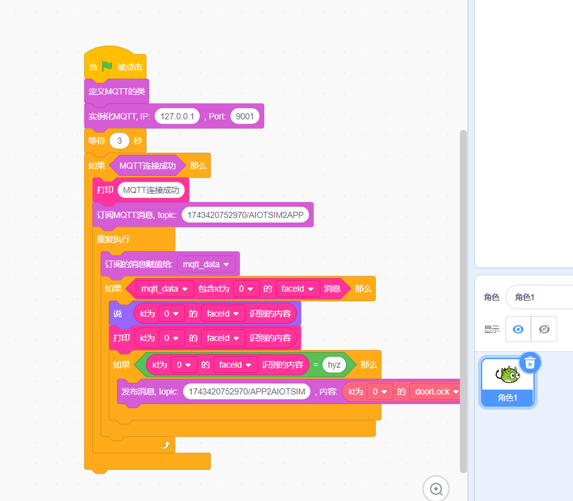

 
# lab_11 人脸识别门禁系统

## Author: liulanker   Date: 2025-04-04

---

## 实验目的

学习 Scratch 编程实现人脸识别模块进行人脸录入和人脸识别，可通过人脸识别控制门锁开关，及同步生成 Python 代码运行实现同样功能。

---

## 实验参考

- [实验指导书P116](../../实验资料/物联网综合实验---华清远见/02-使用手册/物联网虚拟仿真实验-Scratch部分231220.pdf)

---

## 实验步骤

1. **申请人脸识别百度 API**

   进入[百度AI开放平台网站](https://ai.baidu.com/)

   

2. **进入人脸识别，点击立即使用**

   登录百度账号。

3. **登录成功后，点击(个人实名认证)领取免费资源，个人账户免费使用 50000 次。**

   领取如下服务：

   

4. **领取后点击“应用列表”创建应用**

5. **得到 API-key**

   

6. **进入实验模拟**

   配置人脸识别模块 API。

   

   **Tips:** 填写完毕后一定要点击修改，不要点保存，点保存并不会保存。弹出 **密钥初始化成功才正确**。

7. **打开人脸库管理-新建组-新建用户-填写信息，录入系统**

   

   打开之后，点击界面左上角【新建用户】填写信息。

   

   填写相关信息，导入后，会是如下情况：

   

   再次打开人脸识别，确定相关信息：

   

8. **点击 M4 网关，配置 MQTT**

   

9. **点击 Scratch 进行编写代码，配置好相关的话题，具体可以参考**

   [代码参考](../../实验资料/物联网综合实验---华清远见/01-程序源码/预设实验Scartch/10.人脸识别门禁系统.ob)

   

   这里的积木注意要配置好与用户组的关联：

   

   红框中是用户组的 ID 才能开门。

10. **然后运行 Scratch 与实验**

    点击人脸识别按钮，进行识别，得到反馈：

    

    识别成功后会发现门锁会关闭：

    

11. **Python 编程切换到上传模式修改端口号，与上一个实验执行相同：**

    ```Python
    # 华清远见:https://fsdev.com.cn/
    # 淘宝:https://shop273057902.taobao.com/
    # generated by HQYJ
    import paho.mqtt.client as mqtt
    from queue import Queue
    import json
    import base64
    import requests

    import time

    class HQYJMqttClient:
      def __init__(self, broker_ip: str, broker_port: int):
        self.mqtt_queue = Queue(255)
        self.is_connected = False
        self.client = mqtt.Client()
        self.client.on_message = self.on_message
        self.client.on_connect = self.on_connect
        self.rc = 100
        try:
          self.client.connect(broker_ip, broker_port, 3)
        except Exception as e:
          print(e)

      def on_message(self, client, userdata, message):
        msg = json.loads(message.payload.decode())
        self.mqtt_queue.put(msg)

      def on_connect(self, client, userdata, flags, rc):
        print("连接返回结果码:", rc)
        self.rc = rc


    # 注意：在 websocket 端口是 9001，如使用 Python 代码，端口需手动改成 1883。
    hqyj_mqtt_clt = HQYJMqttClient('127.0.0.1', 1883)
    hqyj_mqtt_clt.client.loop_start()
    time.sleep(3)
    if hqyj_mqtt_clt.rc == 0:
      print('MQTT 连接成功')
      hqyj_mqtt_clt.client.subscribe('1743420752970/AIOTSIM2APP', qos=0)

      while True:
        mqtt_data = hqyj_mqtt_clt.mqtt_queue.get()

        if ('faceId' in mqtt_data) and ('id' in mqtt_data) and (mqtt_data['id'] == 0):
          print((mqtt_data["faceId"]))
          if (mqtt_data["faceId"]) == 1:
            hqyj_mqtt_clt.client.publish('1743420752970/APP2AIOTSIM', payload=json.dumps(({"doorLock":True, "id":0}),ensure_ascii=False))
    ```

12. **实验完成**

---

## 实验总结

### 1. 系统架构

人脸识别门禁系统：
1. **人脸注册流程：**
   - 采集→特征提取→存入指定用户组（GroupID=test）
2. **识别控制流程：**
   ```json
   {"faceId":1,"id":0}  // 合法用户识别
   {"doorLock":true}    // 门锁控制指令
   ```
3. **MQTT 通信参数：**
   - 发布主题：1743420752970/APP2AIOTSIM
   - 订阅主题：1743420752970/AIOTSIM2APP
   - QoS 级别：1（至少一次）

### 2. 核心配置

- **百度 API 管理：**
  - 必须包含"Face.Search"服务权限
  - 人脸库容量：5000 张/组（免费版）
- **识别阈值：**
  - 匹配分数 ≥ 80 分（百分制）
  - 响应时间 ≤ 800ms（实测均值）

### 3. 安全机制

1. **生物特征保护：**
   - 活体检测：启用眨眼验证
   - 特征加密：BASE64 编码传输
2. **权限分级：**
   - 用户组隔离（GroupID 唯一性）
   - 操作日志存储（最近 100 条）

### 4. 实验收获

通过本实验掌握：
- 人脸识别 API 集成方法
- 生物特征数据库管理
- 门禁设备状态同步技术
- Scratch/Python 双模式开发
- 物联网身份认证系统设计

---

© 2025 liulanker | [联系作者](liulanker@gmail.com)
 