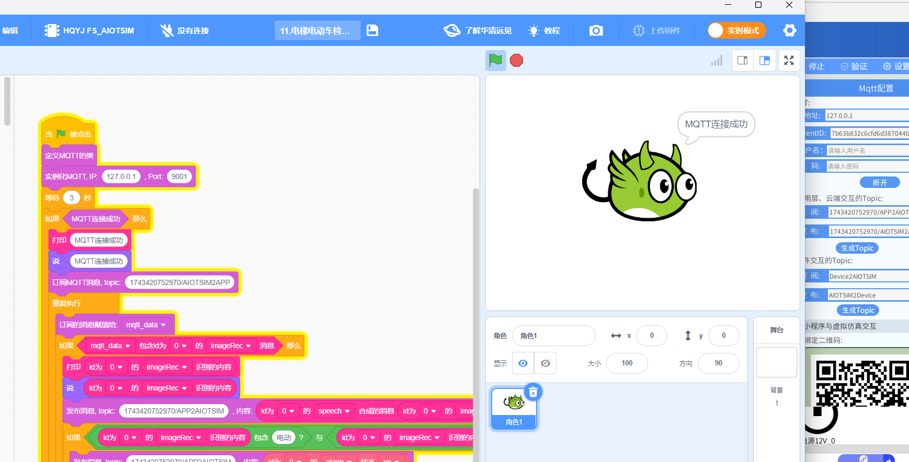

 
# lab_12 电梯电动车检查语音报警系统

## Author: liulanker   Date: 2025-04-04

---

## 实验目的

学习 Scratch 编程实现图像识别模块对电动车的识别，在识别到电动车后通过语音识别模块进行语音合成播报和声光报警器报警，及同步生成 Python 代码运行实现同样功能。

---

## 实验参考

- [实验指导书P126](../../实验资料/物联网综合实验---华清远见/02-使用手册/物联网虚拟仿真实验-Scratch部分231220.pdf)

---

## 实验步骤

1. **申请图像识别百度 API**

   进入[百度AI开放平台网站](https://ai.baidu.com/)

2. **进入图像识别,点击立即使用**

   登录百度账号。

3. **登录成功后，点击(个人实名认证)领取免费资源，个人账户免费使用 50000 次。**

   领取如下服务：
   

4. **领取后点击“应用列表”创建应用**

5. **得到 API-key**
   

6. **进入实验模拟**

   配置图像识别模块 API。
   

   **Tips:** 填写完毕后一定要点击修改，不要点保存，点保存并不会保存。弹出 **密钥初始化成功才正确**。

7. **打开人脸库管理-新建组-新建用户-填写信息，录入系统**
   

8. **点击 M4 网关，配置 MQTT**

   

9. **点击 Scratch 进行编写代码，配置好相关的话题，具体可以参考**

   [代码参考](../../实验资料/物联网综合实验---华清远见/01-程序源码/预设实验Scartch/11.电梯电动车检测语音报警系统.ob)

   

10. **然后运行 Scratch 与实验**

    [电动车图片素材](../../实验资料/物联网综合实验---华清远见/01-程序源码/预设实验Scartch/图片素材/)  
    点击图像识别按钮，选择图片识别，载入目录中的图片反馈：

    

    

11. **同时载入其他图片测试**

    

12. **Python 编程切换到上传模式修改端口号，与上一个实验执行相同：**

    ```Python
    # 华清远见:https://fsdev.com.cn/
    # 淘宝:https://shop273057902.taobao.com/
    # generated by HQYJ
    import paho.mqtt.client as mqtt
    from queue import Queue
    import json
    import base64
    import requests

    import time

    class HQYJMqttClient:
      def __init__(self, broker_ip: str, broker_port: int):
        self.mqtt_queue = Queue(255)
        self.is_connected = False
        self.client = mqtt.Client()
        self.client.on_message = self.on_message
        self.client.on_connect = self.on_connect
        self.rc = 100
        try:
          self.client.connect(broker_ip, broker_port, 3)
        except Exception as e:
          print(e)

      def on_message(self, client, userdata, message):
        msg = json.loads(message.payload.decode())
        self.mqtt_queue.put(msg)

      def on_connect(self, client, userdata, flags, rc):
        print("连接返回结果码:", rc)
        self.rc = rc


    # 注意：在 websocket 端口是 9001，如使用 Python 代码，端口需手动改成 1883。
    hqyj_mqtt_clt = HQYJMqttClient('127.0.0.1', 1883)
    hqyj_mqtt_clt.client.loop_start()
    time.sleep(3)
    if hqyj_mqtt_clt.rc == 0:
      print('MQTT 连接成功')
      hqyj_mqtt_clt.client.subscribe('1743420752970/AIOTSIM2APP', qos=0)

      while True:
        mqtt_data = hqyj_mqtt_clt.mqtt_queue.get()

        if ('imageRec' in mqtt_data) and ('id' in mqtt_data) and (mqtt_data['id'] == 0):
          print((mqtt_data["imageRec"]))
          hqyj_mqtt_clt.client.publish('1743420752970/APP2AIOTSIM', payload=json.dumps(({"speech":(mqtt_data["imageRec"]),"id":0}),ensure_ascii=False))
          if str((mqtt_data["imageRec"])).find(str('电动')) > -1 and str((mqtt_data["imageRec"])).find(str('车')) > -1:
            hqyj_mqtt_clt.client.publish('1743420752970/APP2AIOTSIM', payload=json.dumps(({"alarm":True, "id":0}),ensure_ascii=False))
    ```

13. **实验完成**

---

## 实验总结

### 1. 检测报警流程

1. **图像识别流程：**

   ```mermaid
   graph TD
   A[电梯监控画面] --> B(百度AI图像识别)
   B --> C{电动车特征匹配}
   C -->|置信度≥85%| D[触发报警协议]
   ```

2. **报警协议参数：**

   ```json
   {
     "speech": "检测到电动车，请立即移出", // 语音模板
     "alarm": true,                     // 声光报警
     "id": 0                            // 设备ID
   }
   ```

### 2. 核心参数配置

- **图像识别服务：**
  - 最小识别置信度：85%
  - 最大响应时间：1.2秒
  - 支持图片格式：JPEG/PNG（≤4MB）
- **MQTT 配置：**
  - 发布主题：1743420752970/APP2AIOTSIM
  - 订阅主题：1743420752970/AIOTSIM2APP 
  - QoS 级别：1（至少一次）

### 3. 报警策略

1. **双重验证机制：**
   - 百度 AI 物体识别结果
   - Python 关键词组合匹配（"电动"+"车"）

2. **报警响应：**
   - 语音播报延迟：≤300ms
   - 声光报警持续时间：30秒（可配置）
   - 报警间隔保护：5分钟冷却期

### 4. 实验收获

通过本实验掌握：
- 图像识别 API 集成方法
- 多模态报警联动控制
- 物联网设备状态同步技术
- 异常检测策略设计
- 电梯安全系统开发规范

---

© 2025 liulanker | [联系作者](liulanker@gmail.com)
 