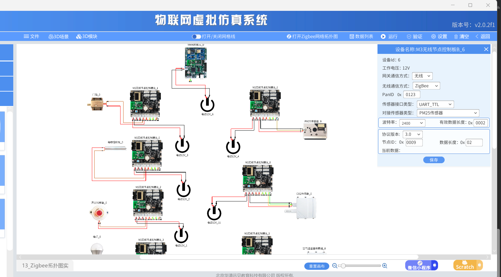

# Lab_13 Zigbee拓扑图实验

## Author: liulanker  
Date: 2025-04-04  

---

## 实验目的
了解 Zigbee 网络的网络拓扑结构，包括星状网、树状网和网状网的不同网络结构，及网络地址计算方式。

---

## 实验参考

- [实验指导书P42](../../实验资料/物联网综合实验---华清远见/02-使用手册/物联网虚拟仿真系统实验手册231226.pdf)

---

## Zigbee基础知识

### 1. Zigbee概述
Zigbee 是一种基于 IEEE 802.15.4 标准的低功耗、低速率的无线通信技术，主要应用于物联网和智能家居领域。其特点包括：
- **低功耗**：适合电池供电设备（如传感器）  
- **自组网**：支持网状网络，自动寻找最优路径  
- **安全性**：支持 AES-128 加密  
- **短距离**：典型覆盖范围 10-100 米  

### 2. Zigbee网络组成
| 设备类型       | 功能说明                                                                 |
|----------------|--------------------------------------------------------------------------|
| **协调器(Coordinator)** | 网络的核心，负责启动和管理网络，每个网络只有一个协调器                  |
| **路由器(Router)**     | 转发数据，扩展网络覆盖范围，需要持续供电                                |
| **终端设备(End Device)** | 低功耗设备（如传感器），不能转发数据，通过父节点通信                    |

### 3. Zigbee拓扑结构
| 拓扑类型 | 示意图              | 特点                                                                 |
|----------|---------------------|----------------------------------------------------------------------|
| **星型** | ○→●←○              | 所有设备直接连接协调器，结构简单但依赖中心节点                       |
| **网状** | ○─○─●─○─○         | 设备多跳通信，可靠性高，适合复杂环境                                 |
| **树状** | ○→○→●←○←○        | 分层结构，数据沿父子节点传输，平衡了星型和网状的特点                 |

---

## 实验步骤

### 1. 进入物联网虚拟仿真系统
- 打开系统   
- 进入仿真

### 2. 配置 Zigbee 网络
1. **打开网格线**：点击 "打开 Zigbee 网格长计算"  
2. **添加设备**：  
   - 选择设备 `M3无线节点控制柜`（设备ID:1）  
   - 配置参数：  
     - PanID: `0x0123`  
     - 节点ID: `0x0002`  
     - 通信方式: ZigBee  
     - 传感器类型: 电动遮阳板（GPIO接口）  

    - 其他设备的配置预设实验已经配置好

3. **扩展网络**：  
   - 添加其他设备（ID:1-13），观察自动形成的拓扑结构  

   

### 3. 生成拓扑图

1. 点击**"打开 Zigbee 网络拓扑图"**  
2. 系统将显示当前设备的连接关系（如网状结构）  
   - 协调器：通常为 ID 最小的设备  
   - 路由器：显示为中间节点  
   - 终端设备：显示为边缘节点  
   
   

   
   

### 4. 数据通信验证
1. 点击**"运行"**启动网络  
2. 在**数据列表**中查看 PM2.5 传感器上传的数据（数据长度:0x02）  
3. 使用**"验证"**功能测试节点间通信路径  

### 5. 实验分析

#### **星型拓扑结构**：
在图中可以看到，**协调器**（中心节点）负责与多个**终端设备**和**路由器**的通信，所有的设备都直接与协调器相连。这种拓扑结构简洁，但中心节点（协调器）是整个系统的关键，一旦协调器发生故障，整个网络的通信将受到影响。

#### **网状拓扑结构**：
从拓扑图中也展示了网状结构的实现。在网状网络中，各个设备不仅直接与协调器通信，还通过**路由器**进行中继数据传输。这种结构具备较高的可靠性，因为每个节点都可以选择多条路径进行通信，如果某个节点发生故障，系统能自动调整路径以保持网络连接。

#### **树型拓扑结构**：
树型结构则在多个路由器和终端设备之间形成层次结构。树型拓扑使得数据通过父节点传输至子节点，平衡了星型和网状的特点。它在网络较大时，可以有效避免由于过多设备造成的信号拥堵。

### 1. 数据通信验证
在实验中，通过虚拟仿真系统运行 ZigBee 网络，观察到各个设备的**数据上传**过程。例如，PM2.5 传感器上传数据时，能够通过网络中的路由器中转，最终由协调器接收并进行处理。这显示出网络的可靠性和各节点间的数据传输效率。

### 2. 网络拓扑自适应性
根据网络的自动配置和拓扑调整功能，系统能够根据设备的连接状态和距离自动优化拓扑结构。例如，使用网状网络拓扑时，节点间的连接和路由器选择会根据实时通信质量进行调整，确保数据传输的稳定性和有效性。这种自适应性在大规模物联网应用中尤为重要，可以保证设备在不同环境中的稳定运行。

### 3. Zigbee协议的扩展性
Zigbee 网络可以通过添加更多的路由器节点来扩展覆盖范围，这对于大范围的智能家居或工业控制系统尤为重要。在实验中，我们也可以通过增加设备数量来观察网络拓扑如何变化，验证了 ZigBee 协议的高扩展性和灵活性。

---

## 关键配置参数说明
| 参数               | 示例值      | 作用                               |
|--------------------|-------------|-----------------------------------|
| **PanID**          | 0x0123      | 网络标识，同一网络内设备必须一致   |
| **节点ID**         | 0x0009      | 设备唯一标识                       |
| **波特率**         | 2400        | 传感器与 Zigbee 模块的通信速率       |
| **协议版本**       | 3.0         | 决定通信规则和数据格式             |

---

## 实验总结

通过本次实验，我们深入理解了 ZigBee 网络的拓扑结构和工作原理。特别是通过仿真平台对星型、网状和树型拓扑的实现过程进行了观察和分析。ZigBee 在物联网应用中的低功耗特性和灵活的网络拓扑结构使其成为智能家居、环境监控等领域理想的无线通信解决方案。

通过虚拟仿真系统，能够更加直观地理解网络自组网、自动路径选择以及不同拓扑结构的优势和局限，为实际硬件部署和系统优化提供了重要参考。

---

## 问题解决

**Q：设备未出现在拓扑图中？**  
- 检查设备是否成功入网（确认 PanID 匹配）  
- 验证终端设备是否关联了父节点（路由器或协调器）  

**Q：数据通信中断？**  
- 检查路由器的供电状态  
- 使用"验证"功能检测信号强度  

---

© 2025 liulanker | [联系作者](liulanker@gmail.com)
