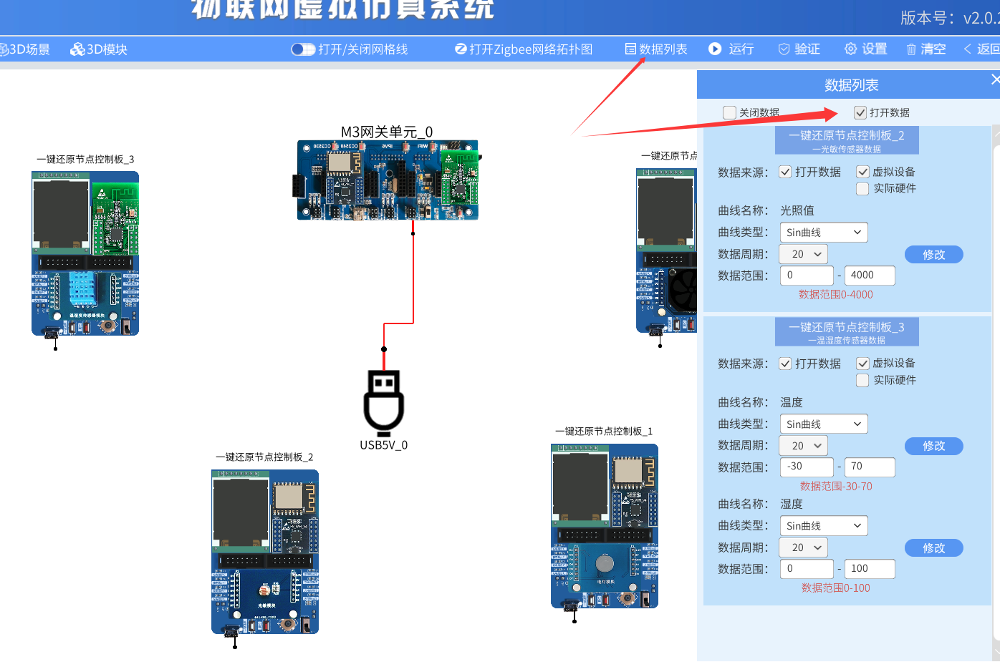
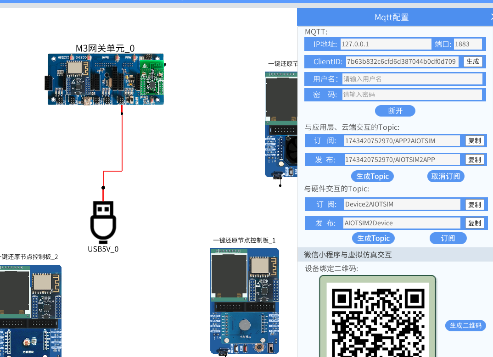
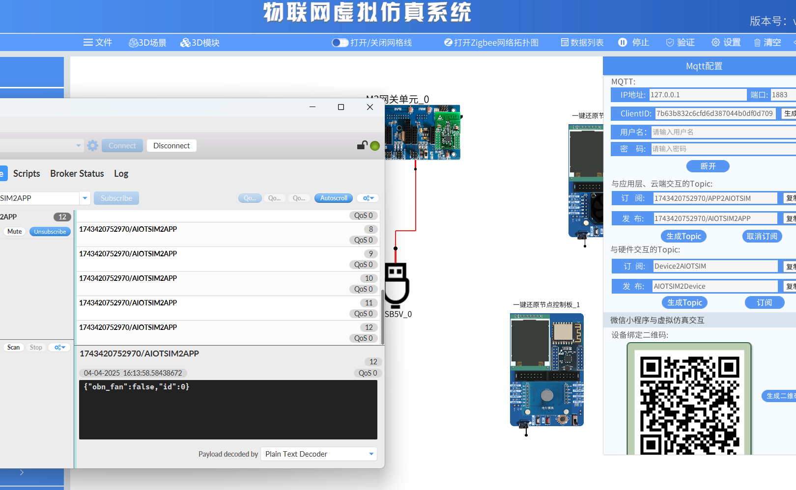
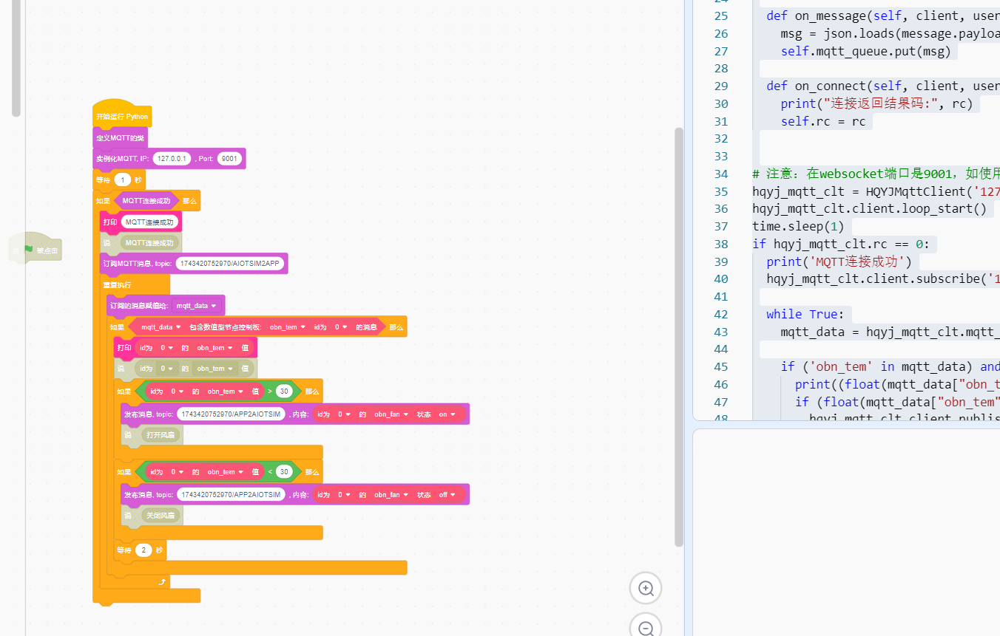
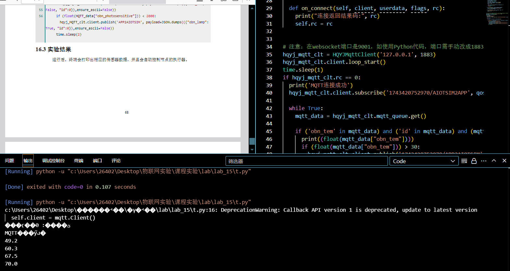
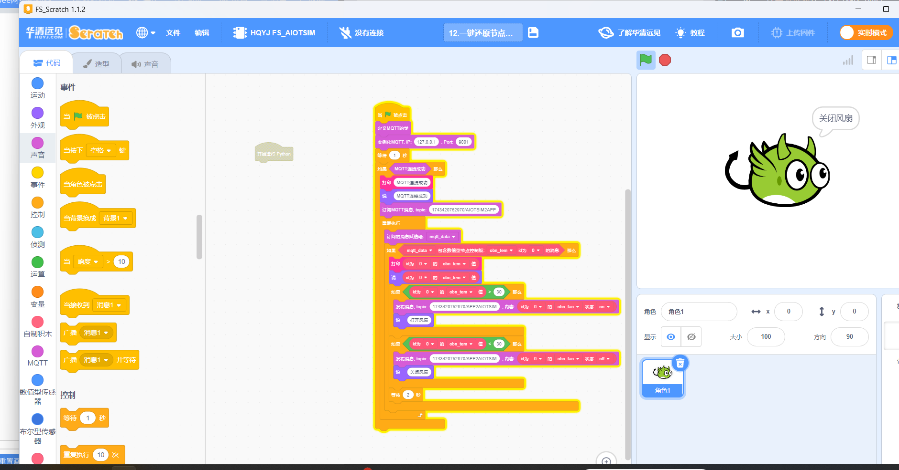
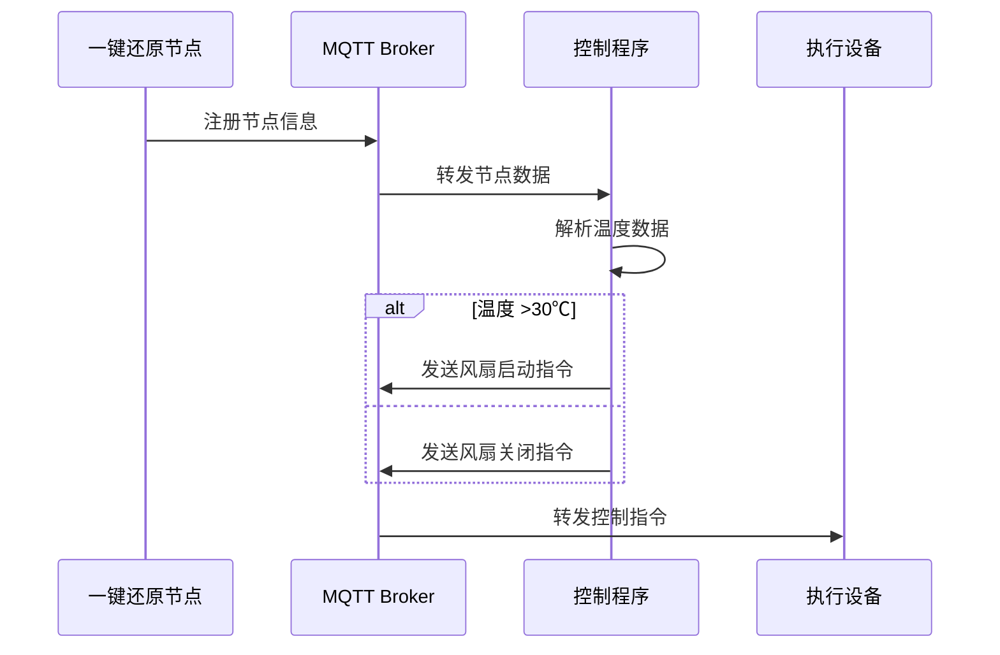

 
# Lab_15 基于一键还原节点控制的实验
## Author: liulanker  
Date: 2025-04-04  

---

## 实验目的

利用虚拟仿真系统中的一键还原节点设置多个传感器，并连接 MQTT，利用 MQTT 收集和控制多个传感器。

---

## 实验参考

- [实验指导书P65](../../实验资料/物联网综合实验---华清远见/02-使用手册/物联网虚拟仿真实验-MQTT部分240412.pdf)

---

## 实验步骤

1. **打开实验，进入仿真**

2. **点击数据列表，打开数据**
   

3. **点击 M3 网关，配置 MQTT**
   

4. **运行，并打开 mqttfx，配置 topic**
   

5. **编写 Python 程序，实现传感器数据的自动收集和控制**

   [Python 代码参考](../../实验资料/物联网综合实验---华清远见/01-程序源码/物联网虚拟仿真软件实验/08-MQTT实验/11_基于一键还原节点的多传感器控制实验.py)

6. **也可以开 Scratch，导入后上传，注意修改 topic**
   

   ```Python
   # 华清远见:https://fsdev.com.cn/
   # 淘宝:https://shop273057902.taobao.com/
   # generated by HQYJ
   import paho.mqtt.client as mqtt
   from queue import Queue
   import json
   import base64
   import requests

   import time

   class HQYJMqttClient:
     def __init__(self, broker_ip: str, broker_port: int):
       self.mqtt_queue = Queue(255)
       self.is_connected = False
       self.client = mqtt.Client()
       self.client.on_message = self.on_message
       self.client.on_connect = self.on_connect
       self.rc = 100
       try:
         self.client.connect(broker_ip, broker_port, 3)
       except Exception as e:
         print(e)

     def on_message(self, client, userdata, message):
       msg = json.loads(message.payload.decode())
       self.mqtt_queue.put(msg)

     def on_connect(self, client, userdata, flags, rc):
       print("连接返回结果码:", rc)
       self.rc = rc


   # 注意：在 websocket 端口是 9001，如使用 Python 代码，端口需手动改成 1883。
   hqyj_mqtt_clt = HQYJMqttClient('127.0.0.1', 1883)
   hqyj_mqtt_clt.client.loop_start()
   time.sleep(1)
   if hqyj_mqtt_clt.rc == 0:
     print('MQTT连接成功')
     hqyj_mqtt_clt.client.subscribe('1743420752970/AIOTSIM2APP', qos=0)

     while True:
       mqtt_data = hqyj_mqtt_clt.mqtt_queue.get()

       if ('obn_tem' in mqtt_data) and ('id' in mqtt_data) and (mqtt_data['id'] == 0):
         print((float(mqtt_data["obn_tem"])))
         if (float(mqtt_data["obn_tem"])) > 30:
           hqyj_mqtt_clt.client.publish('1743420752970/APP2AIOTSIM', payload=json.dumps(({"obn_fan":True, "id":0}),ensure_ascii=False))
         if (float(mqtt_data["obn_tem"])) < 30:
           hqyj_mqtt_clt.client.publish('1743420752970/APP2AIOTSIM', payload=json.dumps(({"obn_fan":False, "id":0}),ensure_ascii=False))
         time.sleep(2)
   ```

7. **Python 运行结果如下：**
   

8. **Scratch 运行结果如下：**
   

---

## 实验总结

### 1. 数据采集与控制流程



### 2. 核心参数配置

```json
{
  "通信协议": {
    "发布主题": "1743420752970/APP2AIOTSIM",
    "订阅主题": "1743420752970/AIOTSIM2APP",
    "QoS级别": 0,
    "端口配置": 1883
  },
  "控制参数": {
    "温度阈值": 30.0,
    "采样间隔": "2秒",
    "设备ID": 0
  }
}
```

### 3. 控制策略
1. **节点管理**：
   - 自动发现新接入节点
   - 动态维护设备状态表
2. **温度控制**：
   - 浮动阈值判断（>30℃启动/≤30℃关闭）
   - 防止频繁切换的延时保护
3. **状态同步**：
   - 设备状态实时更新
   - 异常状态自动恢复

### 4. 实验收获

通过本实验掌握：
- 分布式节点管理技术
- MQTT 协议在设备控制中的应用
- 阈值控制逻辑实现
- 设备状态同步机制
- 自动化控制系统开发规范

---

© 2025 liulanker | [联系作者](liulanker@gmail.com)
