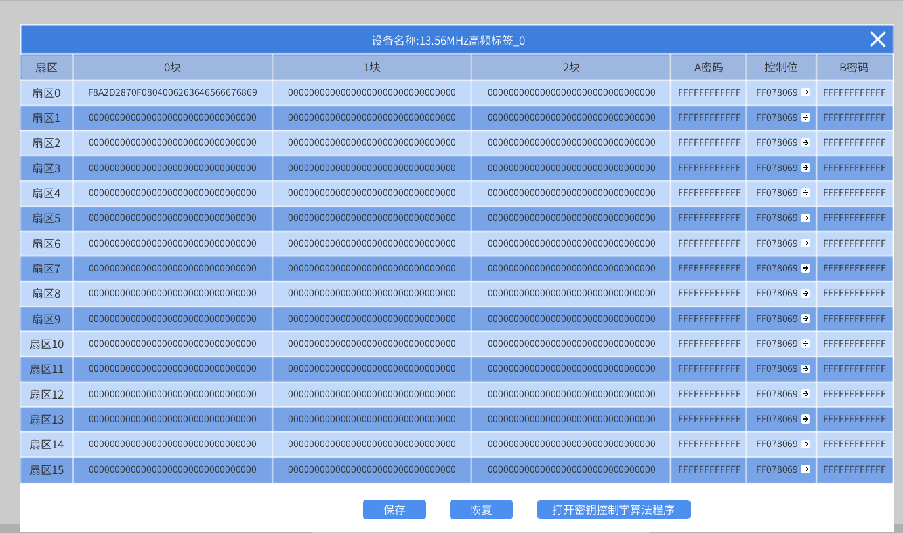

# lab_6 RFID读写卡实验

## Author: liulanker   Date: 2025-03-31

---

## 实验目的

利用 Scratch 和 MQTT 远程读取 13.56MHz 标签的特定扇区特定块。

---

## 实验参考

- [实验指导书P162](../../实验资料/物联网综合实验---华清远见/02-使用手册/物联网虚拟仿真实验-Scratch部分231220.pdf)

---

## 实验步骤

1. 进入实验模拟。
2. 点击 M4 网关，配置 MQTT。

   

   

3. 左键点击 **13.56MHz** 标签，选择查看数据，设置一个标签 ID，并保存：

   

4. 在 mqttfx 中进行配置：

   

5. 点击 Scratch 进行编写代码，具体可以参考：

   [代码参考](../../实验资料/物联网综合实验---华清远见/01-程序源码/预设实验Scartch/5.RFID读写卡实验%20.ob)

   结果如下：

   

   

---

## 实验总结

### 1. 实验目标达成情况

本次实验成功通过 Scratch 和 MQTT 协议，实现了 13.56MHz RFID 标签的远程读取与控制，特别是读取标签特定扇区和块的数据。主要实现了以下功能：
- 通过 MQTT 配置连接（IP 地址：127.0.0.1，端口：1883）。
- 使用 MQTT 协议对 13.56MHz 标签进行远程数据读取。
- 使用 Scratch 编写代码控制标签读取，模拟标签信息的实时处理。

### 2. 关键技术与方法

- **RFID 数据采集：** 使用 13.56MHz RFID 标签，远程读取特定扇区的特定块信息。
- **MQTT 通信：** 采用发布/订阅模式传递标签数据和控制指令。
- **Scratch 编程：** 通过事件驱动编程控制 RFID 数据的读取和处理。
- 理解了 **RFID 技术** 在物联网应用中的使用，特别是在数据远程访问和读取方面的优势。
- 掌握了 **MQTT 协议** 与 **Scratch 编程** 在硬件控制中的实践应用。

### 3. 实验收获

- 通过本次实验，进一步掌握了 RFID 标签的数据读取与控制方法。
- 深入理解了 MQTT 协议在物联网中，尤其是在设备间通信中的重要作用。
- 提升了在实际应用中配置设备、处理数据以及编写事件驱动代码的能力。
- 实验中成功演示了如何通过物联网技术实现对设备的远程控制。

---

© 2025 liulanker | [联系作者](liulanker@gmail.com)
