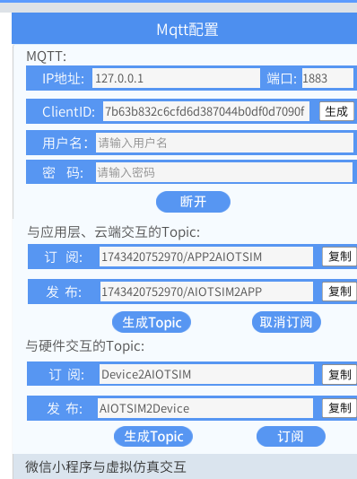
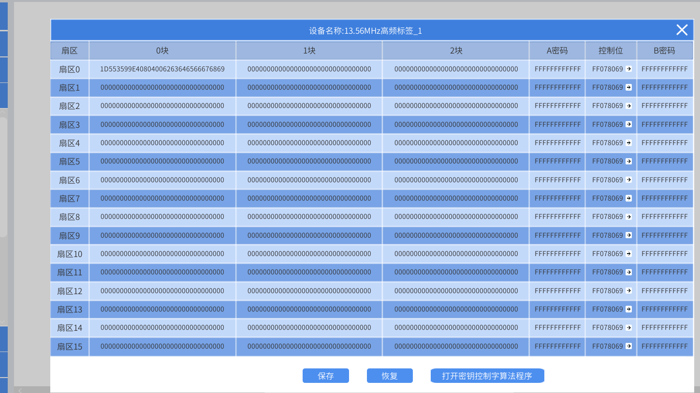
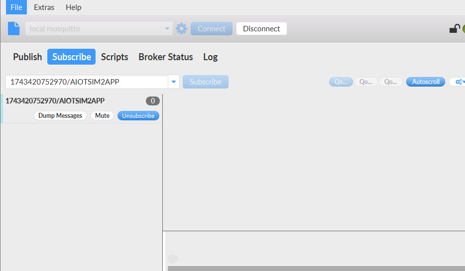
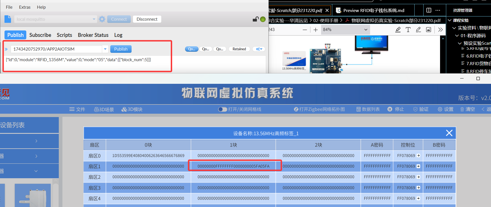
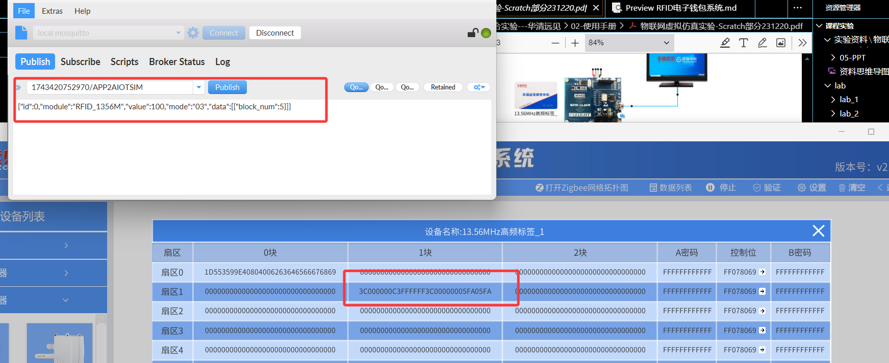
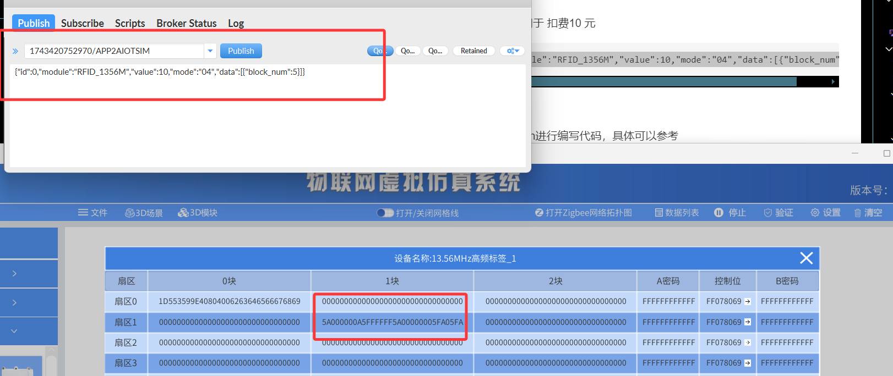
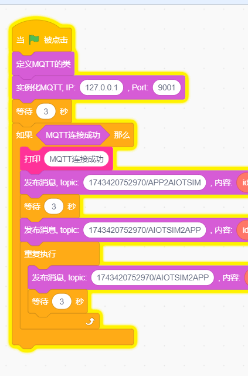
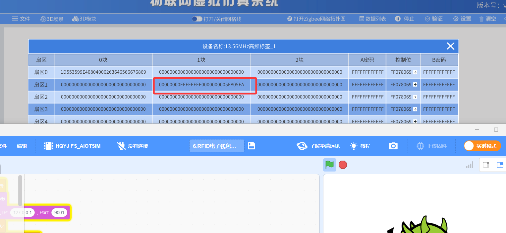
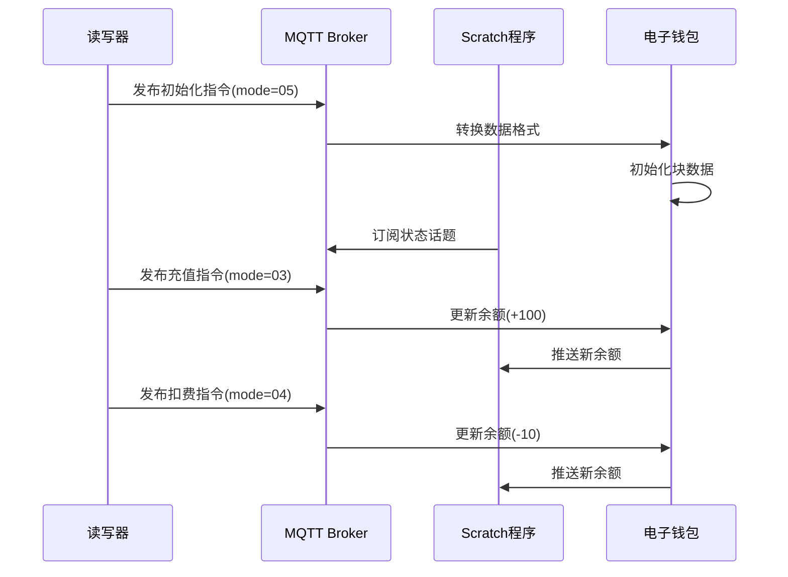

# lab_7 RFID电子钱包系统

## Author: liulanker   Date: 2025-03-31

---

## 实验目的

利用 Scratch 和 MQTT 远程读取 13.56MHz 标签的特定扇区特定块。

---

## 实验参考

- [实验指导书P162](../../实验资料/物联网综合实验---华清远见/02-使用手册/物联网虚拟仿真实验-Scratch部分231220.pdf)

---

## 实验步骤

1. 进入实验模拟。
2. 点击虚拟电脑_0网关，配置 MQTT：

   

3. 左键点击 **13.56MHz** 标签，选择查看数据，设置一个标签 ID，并保存：

   

4. 在 mqttfx 中进行配置：

   

5. 利用 MQTT.fx 向对应话题发布消息用于初始化：

   ```publish
   {"id":0,"module":"RFID_1356M","value":0,"mode":"05","data":[{"block_num":5}]}
   ```

   会发现对应扇区对应块的数据变成了 M1 S50 卡规范中电子钱包格式的数据：

   

6. 发布消息用于充值 100 元：

   ```publish
   {"id":0,"module":"RFID_1356M","value":100,"mode":"03","data":[{"block_num":5}]}
   ```

   

7. 发布消息用于扣费 10 元：

   ```publish
   {"id":0,"module":"RFID_1356M","value":10,"mode":"04","data":[{"block_num":5}]}
   ```

   

8. 点击 Scratch 进行编写代码，配置好相关的话题，具体可以参考：

   [代码参考](../../实验资料/物联网综合实验---华清远见/01-程序源码/预设实验Scartch/6.RFID电子钱包系统.ob)

   话题配置如下：

   

   会发现运行 Scratch 或 Python 程序后，不断查看标签内的数据，发现对应块内的数据会重新初始化：

   

---

## 实验总结

### 1. 系统工作流程



### 2. 关键操作验证

| 操作类型 | 指令模式 | 数据块 | 验证方法 | 预期结果 |
|---------|---------|-------|----------|----------|
| 初始化   | 05      | Block5 | 数据格式检查 | 符合ISO/IEC 14443-3标准 |
| 充值     | 03      | Block5 | 余额累加验证 | 金额增加精确到分 |
| 扣费     | 04      | Block5 | 余额递减验证 | 支持多次小额扣款 |

 
 

### 3. 实验收获

通过本实验掌握：
- RFID 电子钱包的金融级应用规范。
- MQTT 在物联网支付系统中的应用。
- 值块二进制操作原理（递增/递减/传输）。
- Scratch 与硬件设备的协议对接方法。

---

© 2025 liulanker | [联系作者](liulanker@gmail.com)
