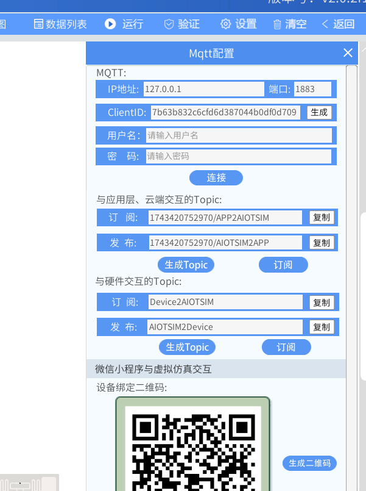
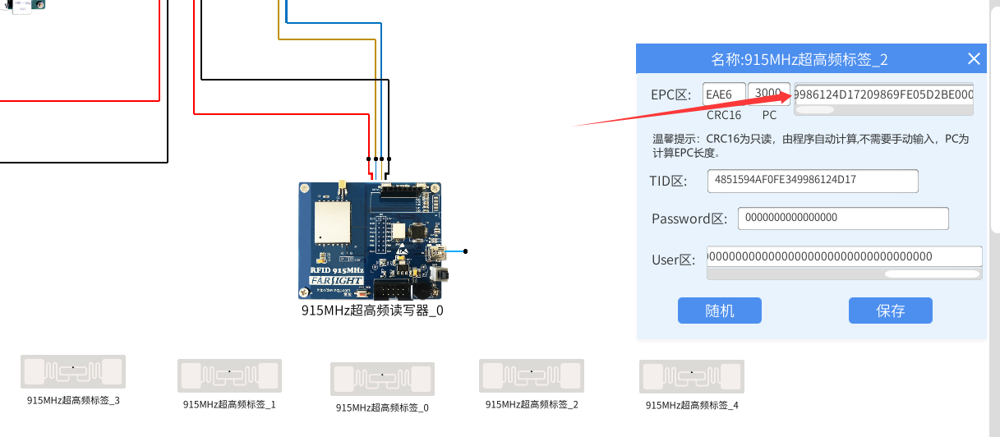
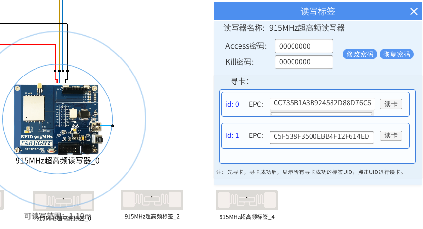
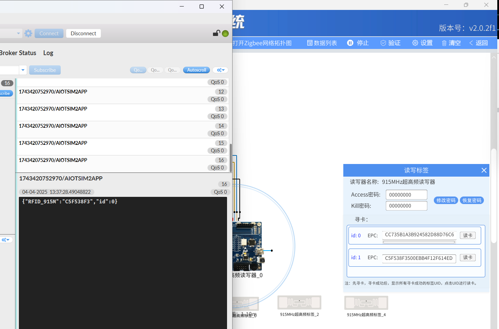
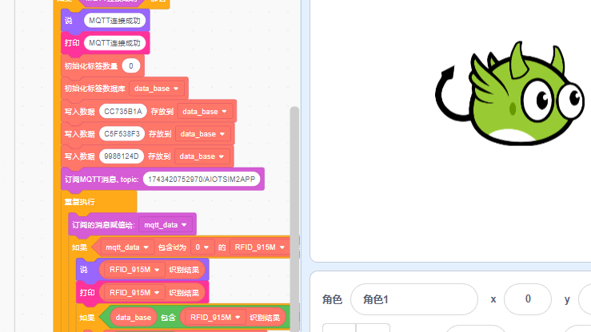
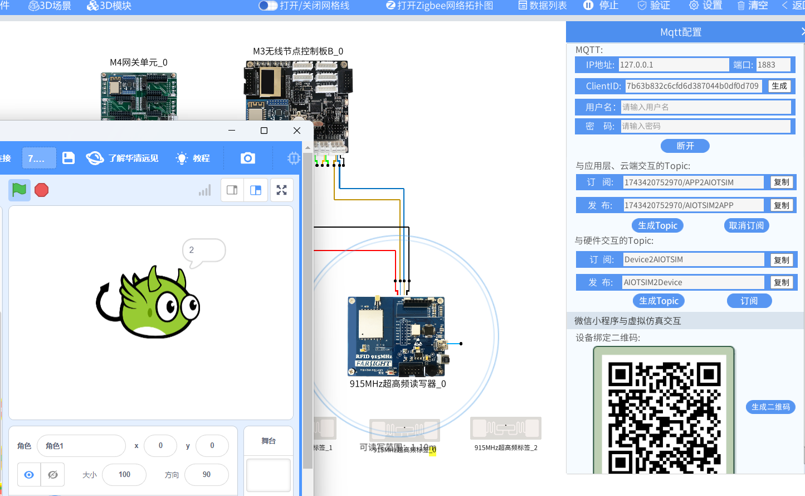
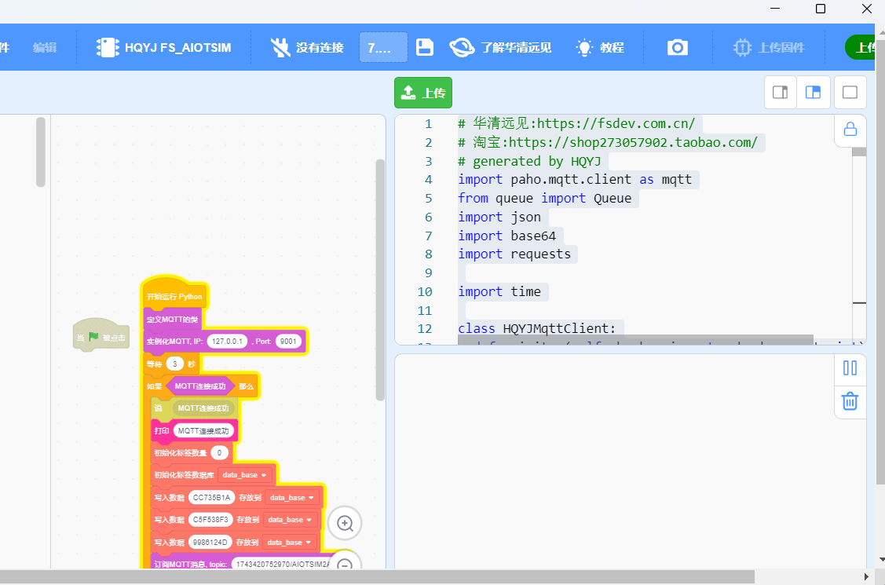

# lab_8 RFID货物自动盘点系统

## Author: liulanker   Date: 2025-04-04

---

## 实验目的

利用虚拟仿真里的 915MHz 读写器和多个标签模拟库存盘点，将识别到的标签的 EPC 发送给 MQTT 相应的话题，并打印识别到的标签数量。

---

## 实验参考

- [实验指导书P173](../../实验资料/物联网综合实验---华清远见/02-使用手册/物联网虚拟仿真实验-Scratch部分231220.pdf)

---

## 实验步骤

1. 进入实验模拟。
2. 点击 M4 网关，配置 MQTT：

   

3. 记住每个标签的 EPC 的前 4 个字节：

   

   本机对应为：
   ```tag
   0：CC73
   1：C5F5
   2: 9986
   3: AB25
   4：A652
   ```

4. 运行实验，点击读写器，可以看到多张卡的 EPC：

   

5. 在 mqttfx 上订阅 M4 的发布 topic，可以看到：

   

6. 点击 Scratch 进行编写代码，配置好相关的话题，具体可以参考：

   [代码参考](../../实验资料/物联网综合实验---华清远见/01-程序源码/预设实验Scartch/7.RFID货物自动盘点系统.ob)

   话题配置如下：

   

   **Tips:** 如果修改了标签的数据内容，那么需要修改积木中的数据。

7. 运行：

   

8. 可以将其保存为 Python 代码，点击变成上传模式，做如下调整：

   

9. 保存代码，改端口号为 **1883**，运行即可：

   ```Python
   # 华清远见:https://fsdev.com.cn/
   # 淘宝:https://shop273057902.taobao.com/
   # generated by HQYJ
   import paho.mqtt.client as mqtt
   from queue import Queue
   import json
   import base64
   import requests

   import time

   class HQYJMqttClient:
     def __init__(self, broker_ip: str, broker_port: int):
       self.mqtt_queue = Queue(255)
       self.is_connected = False
       self.client = mqtt.Client()
       self.client.on_message = self.on_message
       self.client.on_connect = self.on_connect
       self.rc = 100
       try:
         self.client.connect(broker_ip, broker_port, 3)
       except Exception as e:
         print(e)

     def on_message(self, client, userdata, message):
       msg = json.loads(message.payload.decode())
       self.mqtt_queue.put(msg)

     def on_connect(self, client, userdata, flags, rc):
       print("连接返回结果码:", rc)
       self.rc = rc


   # 注意：在websocket端口是9001，如使用Python代码，端口需手动改成1883。
   hqyj_mqtt_clt = HQYJMqttClient('127.0.0.1', 1883)
   hqyj_mqtt_clt.client.loop_start()
   time.sleep(3)
   if hqyj_mqtt_clt.rc == 0:
     print('MQTT连接成功')
     card_num = int('0')
     data_base = []
     data_base.append('CC735B1A')
     data_base.append('C5F538F3')
     data_base.append('9986124D')
     hqyj_mqtt_clt.client.subscribe('1743420752970/AIOTSIM2APP', qos=0)

     while True:
       mqtt_data = hqyj_mqtt_clt.mqtt_queue.get()

       if ('RFID_915M' in mqtt_data) and ('id' in mqtt_data) and (mqtt_data['id'] == 0):
         print((mqtt_data["RFID_915M"]))
         if str((data_base)).find(str((mqtt_data["RFID_915M"]))) > -1:
           card_num = int(((card_num) + 1))
           while not not str((data_base)).find(str((mqtt_data["RFID_915M"]))) > -1:
             data_base.remove((mqtt_data["RFID_915M"]))
         print((card_num))
   ```

---

## 实验总结

### 1. 实验原理

基于 UHF RFID 的仓储管理系统通过：
1. 915MHz 读写器批量读取标签 EPC（电子产品代码）。
2. MQTT 协议实现设备-云端数据交互。
3. Python 队列(queue)缓冲实时采集数据。
4. EPC 前 4 字节匹配算法（十六进制比对）。

### 2. 关键步骤分析

- **EPC 预存机制：** 建立标准 EPC 数据库（CC73/C5F5/9986 系列）。
- **动态匹配逻辑：** 采用 `str.find()` 实现快速 EPC 检索。
- **计数清空机制：** 通过 while 循环确保重复 EPC 不重复计数。
- **异常处理：** MQTT 连接状态码监控（rc==0 表示成功）。

### 3. 注意事项

1. **环境要求：**
   - 标签间距 ＞ 30cm（避免射频干扰）。
   - 读写器天线角度 45°（最佳读取范围）。

2. **代码规范：**
   - 必须修改 MQTT 端口为 1883。
   - EPC 需转换为大写十六进制格式。

3. **数据安全：**
   - 建议添加 Base64 编码（见代码注释处）。
   - 可启用 TLS 加密传输（需修改 connect 参数）。

### 4. 实验收获

通过本实验掌握：
- RFID 在智能仓储中的典型应用模式。
- 多标签防碰撞算法的实现原理。
- 物联网系统中 "端-管-云" 架构设计。
- Python 实时数据处理技巧（队列缓冲、字符串快速匹配）。

---

© 2025 liulanker | [联系作者](liulanker@gmail.com)
