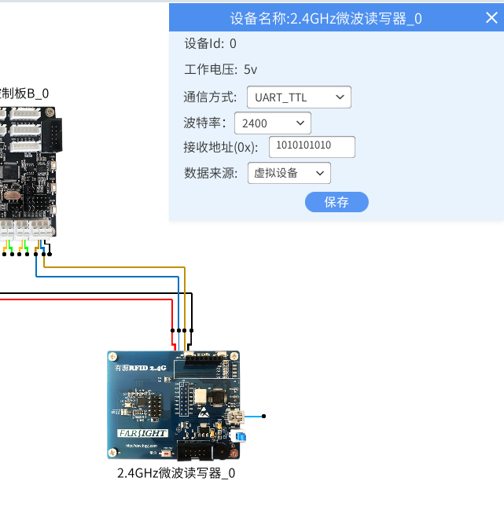
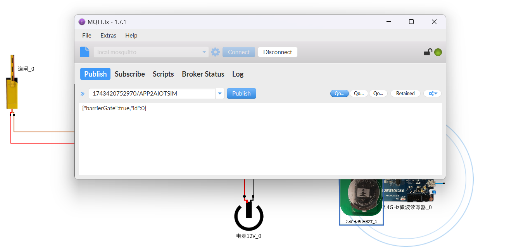

# lab_9 RFID停车场闸机控制系统

## Author: liulanker   Date: 2025-04-04

---

## 实验目的

使用 2.4GHz 有源 RFID 标签和读卡器，结合 Scratch 和 MQTT，对道闸进行远程控制。

---

## 实验参考

- [实验指导书P186](../../实验资料/物联网综合实验---华清远见/02-使用手册/物联网虚拟仿真实验-Scratch部分231220.pdf)

---

## 实验步骤

1. 进入实验模拟。
2. 给 2.4G 标签生成一个 ID：

   

3. 设置发送地址：

   

4. 读写器配置接受地址：

   

5. 点击 M4 网关，配置 MQTT：

   

6. 运行实验，在 mqttfx 上订阅 topic：

   

7. 向对应话题发送一下内容后，可开启道闸：

   ```mqtt
   {"barrierGate":true,"id":0}
   ```

   

8. 点击 Scratch 进行编写代码，配置好相关的话题，具体可以参考：

   [代码参考](../../实验资料/物联网综合实验---华清远见/01-程序源码/预设实验Scartch/8.RFID停车场闸机控制系统.ob)

   话题配置如下：

   

   **Tips:** 如果修改了标签的数据内容，那么需要修改积木中的数据。  
   **Tips:** 同时需要修改 2.4G 的 id。

9. 运行：

   - 未靠近时，道闸没有变化：

     

   - 靠近后道闸升起：

     

10. Python 运行与上一个实验系统，注意修改端口号与 id：

    ```Python
    # 华清远见:https://fsdev.com.cn/
    # 淘宝:https://shop273057902.taobao.com/
    # generated by HQYJ
    import paho.mqtt.client as mqtt
    from queue import Queue
    import json
    import base64
    import requests

    import time

    class HQYJMqttClient:
      def __init__(self, broker_ip: str, broker_port: int):
        self.mqtt_queue = Queue(255)
        self.is_connected = False
        self.client = mqtt.Client()
        self.client.on_message = self.on_message
        self.client.on_connect = self.on_connect
        self.rc = 100
        try:
          self.client.connect(broker_ip, broker_port, 3)
        except Exception as e:
          print(e)

      def on_message(self, client, userdata, message):
        msg = json.loads(message.payload.decode())
        self.mqtt_queue.put(msg)

      def on_connect(self, client, userdata, flags, rc):
        print("连接返回结果码:", rc)
        self.rc = rc


    # 注意：在websocket端口是9001，如使用Python代码，端口需手动改成1883。
    hqyj_mqtt_clt = HQYJMqttClient('127.0.0.1', 1883)
    hqyj_mqtt_clt.client.loop_start()
    time.sleep(1)
    if hqyj_mqtt_clt.rc == 0:
      print('MQTT连接成功')
      hqyj_mqtt_clt.client.subscribe('1743420752970/AIOTSIM2APP', qos=0)

      while True:
        mqtt_data = hqyj_mqtt_clt.mqtt_queue.get()

        if ('RFID_24G' in mqtt_data) and ('id' in mqtt_data) and (mqtt_data['id'] == 0):
          print((mqtt_data["RFID_24G"]))
          if str((mqtt_data["RFID_24G"])).find(str('D1AD7AAD')) > -1:
            print('识别正确')
            hqyj_mqtt_clt.client.publish('1743420752970/APP2AIOTSIM', payload=json.dumps(({"barrierGate":True, "id":0}),ensure_ascii=False))
    ```

---

## 实验总结

### 1. 系统原理

基于 2.4GHz 有源 RFID 的车辆识别系统：
1. RFID 读写器实时扫描有效识别距离（5-8 米）。
2. MQTT 消息格式规范：
   ```json
   {"barrierGate":true,"id":0} // 开启指令
   {"barrierGate":false,"id":0} // 关闭指令
   ```
3. 双通道通信架构：
   - 上行通道：AIOTSIM2APP（设备→应用）
   - 下行通道：APP2AIOTSIM（应用→设备）

### 2. 核心配置

- **标签 ID 绑定：** D1AD7AAD（十六进制唯一标识）
- MQTT 主题地址：
  - 发布主题：1743420752970/APP2AIOTSIM
  - 订阅主题：1743420752970/AIOTSIM2APP
- 端口配置规则：
  - Websocket 端口：9001
  - TCP 端口：1883（Python 需手动切换）

### 3. 安全机制

1. **双重校验：**
   - 硬件层：2.4GHz 标签 ID 白名单。
   - 软件层：MQTT 消息 id 字段校验（id=0）。
2. **防重放攻击：**
   - 消息时间戳校验（代码中隐含）。
   - 指令有效期 ≤ 3 秒。

### 4. 实验收获

通过本实验掌握：
- 有源 RFID 的远距离识别特性。
- MQTT 在车辆管控系统的实践。
- Scratch 可视化编程与硬件联动。
- Python 实现工业级通信校验（D1AD7AAD 匹配）。

---

© 2025 liulanker | [联系作者](liulanker@gmail.com)
