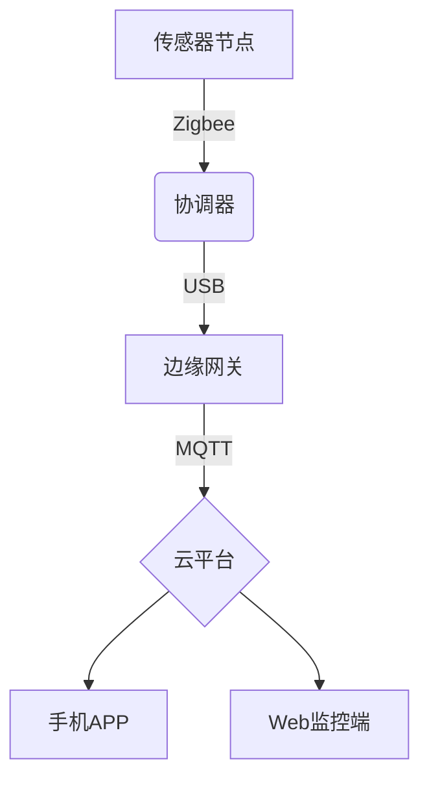

# 物联网综合实验课程介绍 📚

本课程通过15个综合性物联网实验，系统培养学生嵌入式开发能力和物联网系统设计能力。课程内容涵盖传感器应用、无线通信、云平台接入等核心技术，每个实验都设计为从基础硬件操作逐步过渡到复杂系统集成。

## 目录
- [实验一：智能风扇控制系统](./实验/lab/lab_01/)
- [实验二：智能家居系统](./实验/lab/lab_02/)
- [实验三：智能农业监测系统](./实验/lab/lab_03/)
- [实验四：智能图书馆管理系统](./实验/lab/lab_04/)
- [实验五：RFID门禁系统](./实验/lab/lab_05/)
- [实验六：RFID读写卡实验](./实验/lab/lab_06/)
- [实验七：电子钱包系统](./实验/lab/lab_07/)
- [实验八：货物自动盘点系统](./实验/lab/lab_08/)
- [实验九：停车场闸机控制](./实验/lab/lab_09/)
- [实验十：语音识别控制](./实验/lab/lab_10/)
- [实验十一：人脸识别门禁](./实验/lab/lab_11/)
- [实验十二：电动车检测报警](./实验/lab/lab_12/)
- [实验十三：Zigbee组网实验](./实验/lab/lab_13/)
- [实验十四：物联网云接入](./实验/lab/lab_14/)//暂不设置内容
- [实验十五：节点控制实验](./实验/lab/lab_15/)
- [课程评价](#课程评价)
- [实验要求](./实验/实验资料/)

## 实验要求与指导
详细说明物联网实验的操作规范与报告要求：
1. 实验前需预习硬件原理图
2. 操作开发板时注意静电防护
3. 实验报告需包含系统架构图
4. 代码注释率不低于30%
5. 实验数据需记录实时传感器数值

## 核心实验模块

### 基础感知控制（实验一至四）
- 温湿度传感器数据采集
- 继电器控制逻辑实现
- LCD显示屏驱动开发
- 蓝牙/WiFi通信协议应用

### RFID技术应用（实验五至九）
- MFRC522模块读写操作
- 门禁系统状态机设计
- 电子钱包存储加密
- 货物盘点算法优化

### 智能识别系统（实验十至十二）
- 语音指令识别处理
- OpenCV人脸检测集成
- 图像特征提取算法
- 报警系统联动控制

### 网络与云平台（实验十三至十五）
- Zigbee网络拓扑构建
- MQTT协议通信实现
 
- 节点远程监控配置

## 课程评价 💬
本课程实践性较强，需要同时掌握硬件操作与软件开发能力。实验设备采用华清远见物联网开发套件，实验报告需包含电路连接图、程序流程图和实际运行效果截图。建议提前学习C语言和基本电路知识。

## 开发工具推荐
- **华清远见实验平台**：配套硬件开发环境
- **MQTT.fx**：物联网协议调试工具
- **百度云平台**：API接入配置

## 系统架构示例

## 课程评价 💬

还在上...

---

© 2025 liulanker | [联系作者]( liulanker@gmail.com)
