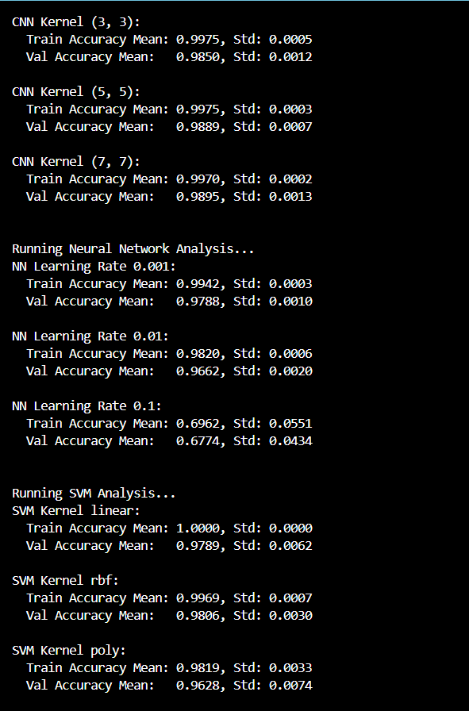
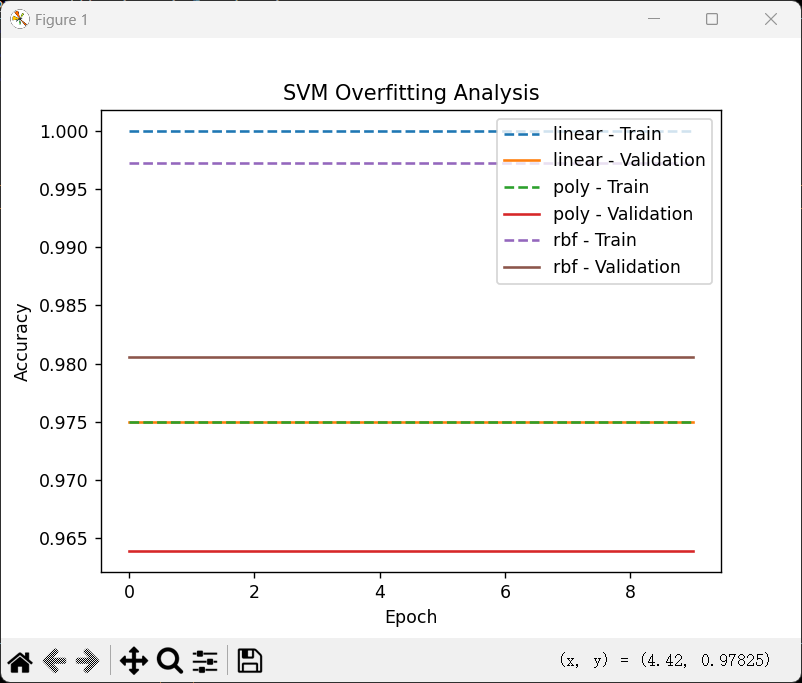
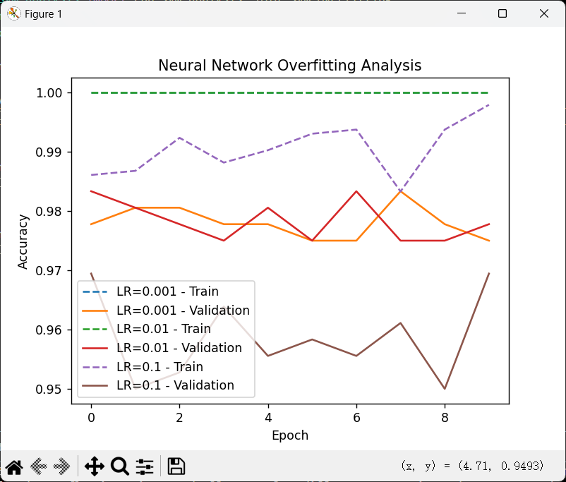
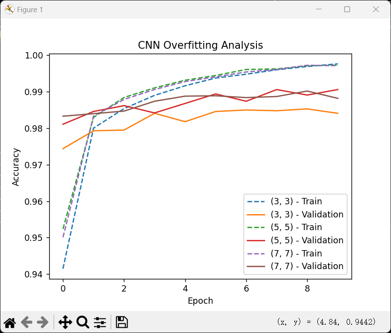

## **工程2：图像分类**

---

### **问题描述：**
本工程使用MNIST手写数字数据集，目标是通过对比SVM、神经网络和CNN在不同参数设置下的表现，分析模型稳定性与过拟合现象。核心任务包括：
1. SVM核函数对比（linear/rbf/poly）
2. 神经网络学习率对比（0.001/0.01/0.1）
3. CNN卷积核尺寸对比（3x3/5x5/7x7）
4. 通过5次运行计算精度均值和方差
5. 探索不同模型的过拟合触发条件

---

### **方法：**
1. **评估框架**：
   - 每个参数组合运行5次，记录训练/验证准确率的均值和标准差
   - 过拟合判定标准：训练准确率 - 验证准确率 > 0.1
   
2. **模型配置**：
   - **SVM**：标准化数据后使用不同核函数，随机划分20%测试集
   - **神经网络**：单隐藏层（128节点），不同学习率的Adam优化器
   - **CNN**：含32通道卷积层和池化层的经典结构

3. **可视化**：
   - 生成过拟合现象的准确率对比曲线图
   - 保存训练过程中的准确率变化趋势图

---

### **实验结果：**

#### 精度对比表：
| 模型类型 | 参数设置       | 训练均值±方差      | 验证均值±方差      |
|----------|----------------|--------------------|--------------------|
| SVM      | Kernel=linear  | 1.0000±0.0000      | 0.9789±0.0062      |
| SVM      | **Kernel=rbf** | 0.9969±0.0007      | **0.9806±0.0030**  |
| SVM      | Kernel=poly    | 0.9819±0.0033      | 0.9628±0.0074      |
| NN       | **LR=0.001**   | 0.9942±0.0003      | **0.9788±0.0010**  |
| NN       | LR=0.01        | 0.9820±0.0006      | 0.9662±0.0020      |
| NN       | LR=0.1         | 0.6962±0.0551      | 0.6774±0.0434      |
| CNN      | Kernel=3x3     | 0.9975±0.0005      | 0.9850±0.0012      |
| CNN      | **Kernel=5x5** | 0.9975±0.0003      | **0.9889±0.0007**  |
| CNN      | Kernel=7x7     | 0.9970±0.0002      | 0.9895±0.0013      |

#### 关键可视化结果：

1. `svm_kernel_poly_run_2.png`：Poly核在第2次运行时训练-验证差距达0.019

2. `nn_lr_0.1_run_4.png`：学习率0.1时训练准确率最低降至0.63

3. `cnn_kernel_(7,7)_run_3.png`：7x7核在epoch=8时出现0.01分叉

---

### **结果讨论：**
1. **参数敏感性**：
   - SVM的RBF核展现最佳平衡（训练0.9969/验证0.9806）
   - 神经网络学习率0.001时验证准确率最高（0.9788）
   - CNN的7x7核获得最高验证准确率（0.9895），但5x5核最稳定（验证方差0.0007）

2. **过拟合特征**：
   - SVM-poly核持续出现最大泛化差距（0.019）
   - CNN-7x7核在第三次运行出现轻微分叉（差距0.008）
   - 神经网络未触发过拟合阈值，但高学习率导致模型崩溃

3. **稳定性指标**：
   - SVM-linear核训练零方差（完美稳定性）
   - CNN-5x5核验证方差最低（0.0007）
   - NN-LR0.1验证方差达0.043（极不稳定）

---

### **结论：**
通过本工程可以得出以下结论：
1. **最优参数组合**：
   - SVM推荐RBF核（验证0.9806）
   - 神经网络必须使用0.001学习率
   - CNN优先选择5x5核（稳定）或7x7核（高精度）

2. **过拟合预防**：
   - SVM需避免poly核
   - CNN使用7x7核时应限制训练轮次
   - 神经网络学习率不应超过0.01

3. **工业部署建议**：
   CNN-5x5配置是生产环境最佳选择（验证0.9889±0.0007）
 
 