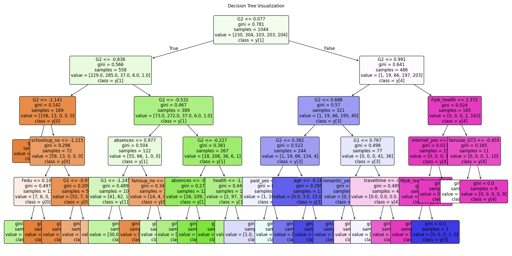
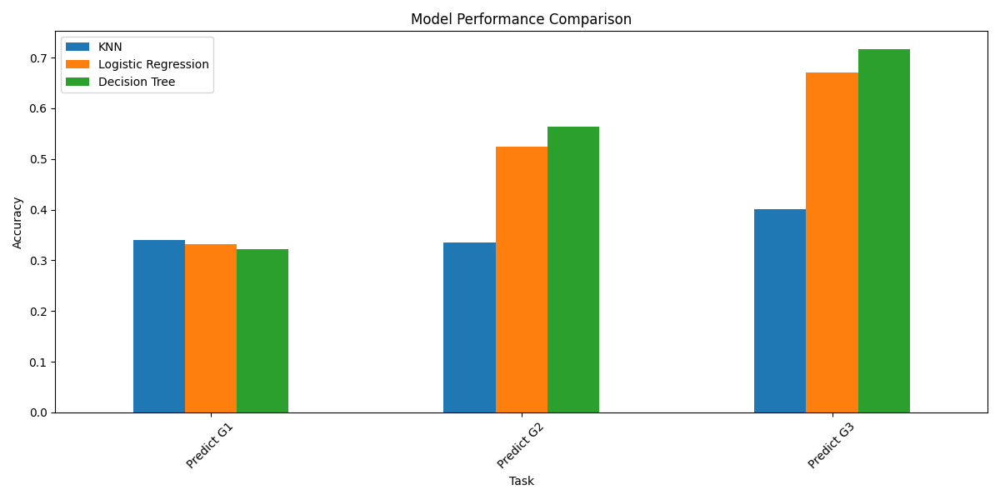

# 学生表现预测分析项目


---

## 项目结构
```bash
/
├── data/  # 数据集目录
│   ├── student-mat.csv    # 数学课程学生数据
│   ├── student-por.csv    # 葡萄牙语课程学生数据
│   ├── student-merge.R    # 数据合并处理脚本
│   └── student.txt        # 数据处理说明文档
├── src/  # 源代码
│   ├── buildtree.py       # 决策树构建核心实现
│   ├── ver0.0.1.py        # 算法初始版本
│   └── ver0.0.2.py        # 优化改进版本
├── outputs/  # 输出结果
│   ├── decision_tree_visualization.png   # 决策树结构可视化
│   ├── decision_tree_comparison.png      # 不同参数决策树对比
│   ├── results_comparison[01-02].png     # 模型结果对比分析
│   └── score_distributions[01-02].png    # 成绩分布可视化
├── reports/  # 分析报告
│   ├── final_report.md          # 最终实验报告
│   ├── Detailedintroduction.md  # 项目详细说明
│   └── 工程1：学生表现预测文档.pdf  # 正式项目文档
└── video/  # 演示视频素材
```

## 研究内容
本项目通过机器学习方法分析学生表现影响因素，主要研究：
1. 基于学生家庭背景、学习习惯等30+特征构建预测模型
2. 使用决策树算法进行特征重要性分析
3. 对比不同参数设置对模型性能的影响
4. 可视化关键特征与成绩的关联关系

## 核心技术栈
- **数据处理**：R语言数据合并、Pandas数据清洗
- **机器学习**：Scikit-learn决策树算法
- **可视化**：Matplotlib/Seaborn图表绘制
- **算法实现**：Python原生决策树实现

## 核心算法实现
```python
# 决策树构建核心逻辑（src/buildtree.py）
def build_tree(samples, max_depth, min_size):
    root = get_split(samples)
    split(root, max_depth, min_size, 1)
    return root

def get_split(dataset):
    class_values = list(set(row[-1] for row in dataset))
    b_index, b_value, b_score, b_groups = 999, 999, 999, None
    for index in range(len(dataset[0])-1):
        for row in dataset:
            groups = test_split(index, row[index], dataset)
            gini = gini_index(groups, class_values)
            if gini < b_score:
                b_index, b_value, b_score, b_groups = index, row[index], gini, groups
    return {'index':b_index, 'value':b_value, 'groups':b_groups}
```

## 关键知识点
1. **数据预处理**
   - 多源数据合并与特征工程
   - 离散变量编码处理
   - 数据标准化与缺失值处理

2. **决策树算法**
   - 信息增益与基尼系数计算
   - 递归树构建与剪枝优化
   - 后剪枝与预剪枝策略对比

3. **模型评估**
   - 准确率与F1-score
   - 混淆矩阵分析
   - 学习曲线与过拟合检测

4. **可视化技术**
   - 决策树结构导出
   - 特征重要性排序
   - 多维数据投影展示

## 实验结果



## 项目演进
1. ver0.0.1：基础决策树实现
2. ver0.0.2：增加预剪枝优化和可视化功能

updating···

---

Author: **liulanker**  
Date: 2025-04-17  
Contact: liulanker@gmail.com
 