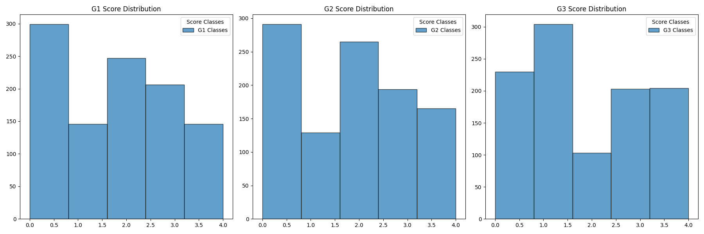

## **工程1：学生表现预测**

 
---

### **问题描述：**
本工程使用包含33个特征、649个样本的数据集，目标是通过学生的个人特征与历史成绩预测学生在G1、G2和G3上的表现。成绩按0-20的范围划分为五个类别，分别进行预测。任务采用以下模型：近邻法、逻辑回归和决策树

---

### **方法：**
1. **数据预处理**：
   - 将数据按成绩分箱，将成绩划分为5个类别。 
   - 特征选择：首先使用前30个特征预测G1；然后用前30个特征加G1预测G2；最后使用前30个特征加G1、G2预测G3。

2. **模型选择**：
   - **KNN**：选择10个近邻，使用加权距离进行预测。
   - **逻辑回归**：通过弹性网络正则化训练，先后采用2000-5000次迭代来确保优化。
   - **决策树**：使用决策树分类器（最大深度5，最小样本分裂数10），并进行交叉验证。

3. **评估方法**：
   - 使用5折交叉验证对每个模型进行评估，并记录每个任务（G1、G2、G3）的准确率。

---

### **实验结果：**
| Task        | KNN   | Logistic Regression | Decision Tree |
|-------------|-------|---------------------|---------------|
| Predict G1  | 0.340 | 0.329532            | 0.322828      |
| Predict G2  | 0.335 | 0.517225            | 0.563181      |
| Predict G3  | 0.401 | 0.647516            | 0.716447      |

#### 直方图展示：

#### 模型比较：
- **决策树模型**在预测G3时表现最好，准确率为0.716。
- **KNN模型**在预测G1和G2时表现较好，准确率接近0.34。
- **逻辑回归模型**整体表现较差，尤其在G1和G2的任务中，准确率较低。

---

### **结果讨论：**
- **KNN模型**适合于G1和G2的预测，特别是在数据特征不多时，它能较好地利用相似样本进行预测。
- **逻辑回归模型**在所有任务中表现较差，可能是由于特征之间缺乏足够的线性关系，限制了其在该数据集中的效果。
- **决策树模型**在G3预测任务中表现最好，可能是因为决策树能够更好地处理多特征和复杂的非线性关系，尤其在结合G1和G2作为特征时，效果尤为突出。

---

### **结论：**
通过本次实验可以得出以下结论：
- **KNN模型**适用于G1和G2任务，但性能较为一般。
- **逻辑回归**的表现不尽如人意，可能由于数据的非线性特征限制了其效果。
- **决策树模型**在多特征任务中表现出色，尤其在G3的预测中，表现最佳。