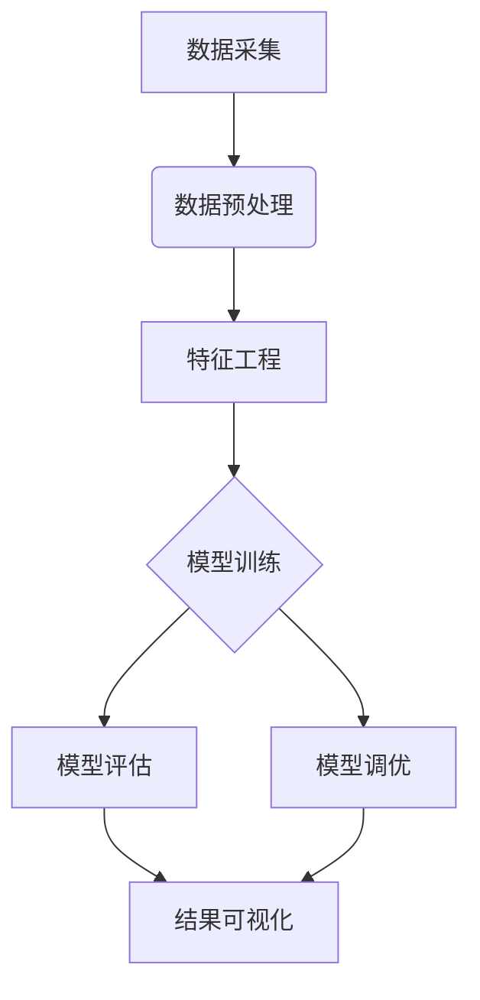

# 模式识别与机器学习课程介绍 📊

本课程系统介绍模式识别与机器学习的基础理论和实践应用，通过多个项目实战培养学生的数据处理、模型构建和算法调优能力。课程内容涵盖概率统计基础、经典机器学习算法和深度学习入门，注重理论与实践相结合的教学方法。

## 目录
- [项目一：学生表现预测](./projrct_1_Studentperformanceprojections/)
- [项目二：图像分类](./project_2_Imageclassification/)
- [最终项目：数据分布分析](./final_project/)
- [作业一：二项分布实验](./work_1_Binomialdistribution/)
- [课程说明](#课程说明)
 

## 实验要求与指导
详细说明机器学习实验的操作规范与报告要求：
1. 实验前需预习相关算法原理
2. 代码实现需遵循Python编程规范
3. 实验报告需包含算法流程图和结果分析
4. 代码注释率不低于30%
5. 实验结果需包含可视化图表和评估指标

## 核心实验模块

### 概率论与数理统计基础（作业一）
- 二项分布概率模型
- 概率密度函数分析
- 分布参数估计方法
- 随机变量生成与检验

### 机器学习算法应用（项目一）
- 决策树算法原理与实现
- 数据预处理与特征工程
- 模型评估与超参数调优
- 学生成绩预测系统构建

### 深度学习入门（项目二）
- 卷积神经网络(CNN)基础
- 支持向量机(SVM)分类器
- 神经网络模型构建
- MNIST手写数字识别

### 数据分析与可视化（最终项目）
- 数据分布特征提取
- 统计图表绘制方法
- 多种概率分布模型比较
- 数据挖掘与模式发现

## 课程评价 💬
本课程注重理论与实践相结合，需要掌握数学基础和编程技能。实验项目涵盖从基础概率模型到深度学习的多个层次，实验报告需包含算法原理解析、代码实现说明和结果可视化分析。建议提前学习Python编程和高等数学知识。

## 开发工具推荐
- **Python 3.x**：主要编程语言
- **Jupyter Notebook**：交互式开发环境
- **NumPy/Pandas**：数据处理库
- **Matplotlib/Seaborn**：数据可视化库
- **Scikit-learn**：机器学习算法库
- **TensorFlow/Keras**：深度学习框架

## 系统架构示例

---

© 2025 liulanker | [联系作者](liulanker@gmail.com)