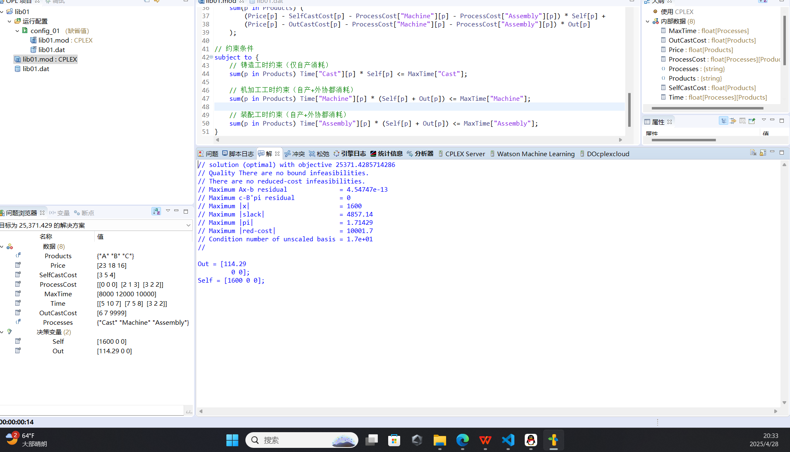
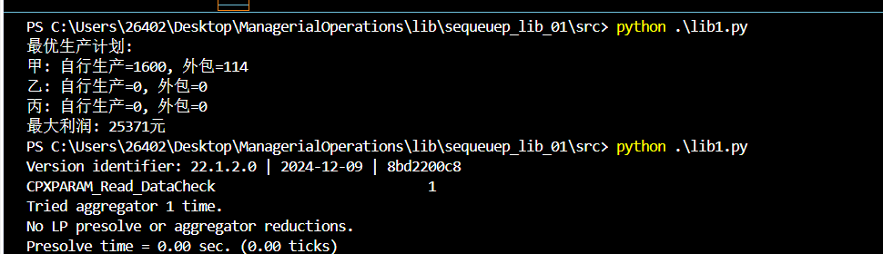
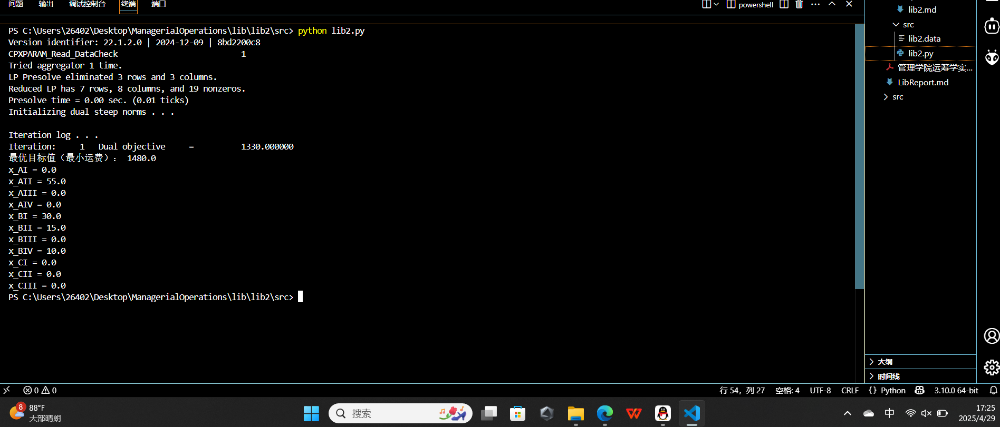
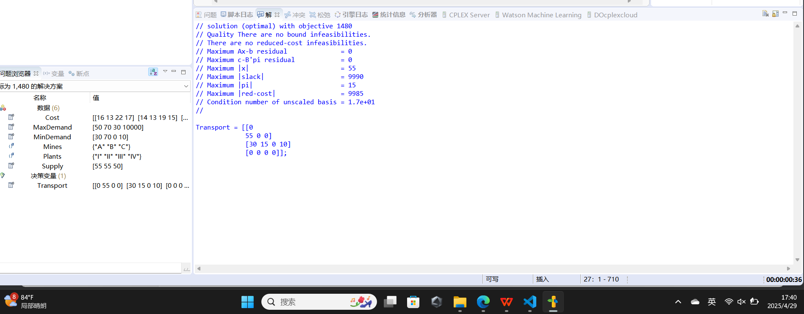
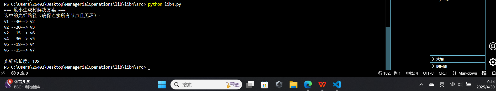
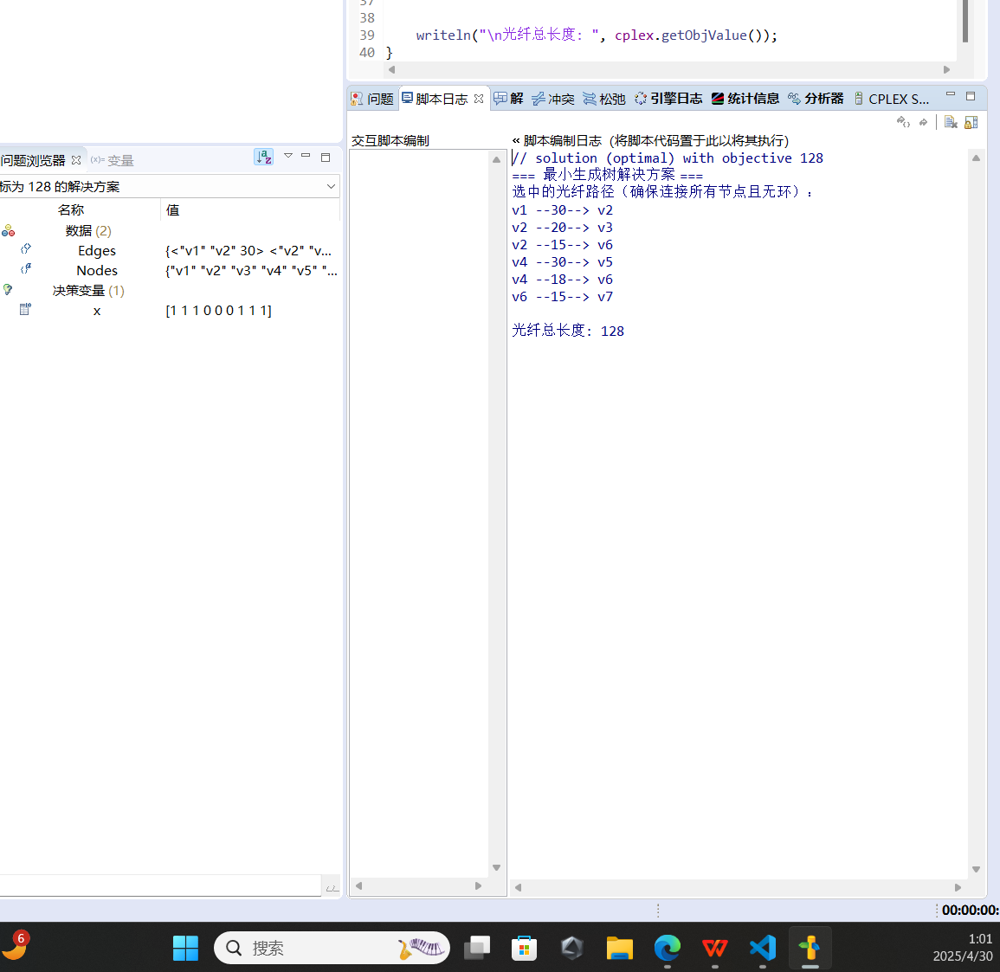

## <center><font size="5">实验一、线性规划</font></center>

### **一、实验目的：**

&nbsp;（1）理解线性规划的概念。

&nbsp;（2）对于一个问题，能够建立基本的线性规划模型。

&nbsp;（3）学会运用OPL语言解决线性规划问题。

&nbsp;（4）将不同问题转化为线性规划的数学模型。

### **二、实验内容：**

&nbsp;（1）完成实验手册给出的案例；

&nbsp;（2）针对实验手册的练习，建立数学规划模型、求解模型以及实验结果的分析。

### **三、操作步骤：**

#### （1）.建立数学规划模型

##### 1.问题分析

&nbsp;&nbsp;&nbsp;&nbsp;&nbsp;&nbsp;&nbsp;解决某公司关于甲、乙、丙三种产品的生产决策问题，涉及自行生产和外包协作的选择,目标最大化公司利润

- 1. 生产流程：三种产品都需要经过铸造、机加工和装配三个车间。


- 2. 外包限制：
     - 甲、乙产品的铸件可以外包或自行生产。
     - 丙产品的铸件必须自行生产。

- 3. 资源限制：
        - 铸造总工时：8000小时
        - 机加工总工时：12000小时
        - 装配总工时：10000小时

- 4. 成本与售价：
        - 自产铸件成本、外协铸件成本、机加工成本、装配成本。       
        - 每件产品的售价。


##### 2.决策变量定义

定义以下决策变量：

- \( x_1 \)：甲产品自行生产的数量。

- \( x_2 \)：乙产品自行生产的数量。

- \( x_3 \)：丙产品自行生产的数量（必须自行生产，因此不设置\(y_2）\)。

- \( y_1 \)：甲产品外协生产的数量。

- \( y_2 \)：乙产品外协生产的数量。


##### 3.目标函数:

目标是最大化利润，计算公式为：
\[
\text{利润} = \sum (\text{售价} - \text{总成本}) \times \text{数量}
\]

具体到每种产品：

- 甲产品：

  - 自行生产的总成本：铸造成本 + 机加工成本 + 装配成本 = 3 + 2 + 3 = 8 元

  - 外协生产的总成本：外协铸件成本 + 机加工成本 + 装配成本 = 6 + 2 + 3 = 11 元

  - 售价：23 元

  - 甲产品利润：自行生产 \( (23 - 8)x_1 = 15x_1 \)，外协生产 \( (23 - 11)y_1 = 12y_1 \)

  
- 乙产品：

  - 自行生产的总成本：5 + 1 + 2 = 8 元

  - 外协生产的总成本：7 + 1 + 2 = 10 元

  - 售价：18 元

  - 乙产品利润：自行生产 \( (18 - 8)x_2 = 10x_2 \)，外协生产 \( (18 - 10)y_2 = 8y_2 \)

  
- 丙产品：

  - 自行生产的总成本：4 + 3 + 2 = 9 元

  - 售价：16 元

  - 利润贡献：\( (16 - 9)x_3 = 7x_3 \)


总结上述相加,得到目标函数：

\[
\max z = 15x_1 + 12y_1 + 10x_2 + 8y_2 + 7x_3
\]

##### 4.约束条件

1. 资源约束：
   - 铸造工时：

     - 自行生产甲：5小时/件，乙：10小时/件，丙：7小时/件。

     - 外协生产甲、乙不占用铸造工时。

     - 约束：\( 5x_1 + 10x_2 + 7x_3 \leq 8000 \)

   - 机加工工时：

     - 甲：7小时/件，乙：5小时/件，丙：8小时/件。

     - 约束：\( 7(x_1 + y_1) + 5(x_2 + y_2) + 8x_3 \leq 12000 \)

   - 装配工时：

     - 甲：3小时/件，乙：2小时/件，丙：2小时/件。

     - 约束：\( 3(x_1 + y_1) + 2(x_2 + y_2) + 2x_3 \leq 10000 \)


2. 非负约束：
   - \( x_1, x_2, x_3, y_1, y_2 \geq 0 \)


#### （2）.分析模型并求解

##### 标准型总结
$$
\begin{aligned}
\max \quad & z = 15x_1 + 12y_1 + 10x_2 + 8y_2 + 7x_3 \\
\text{约束s.t.} \quad & 5x_1 + 10x_2 + 7x_3 \leq 8000 \\
& 7x_1 + 7y_1 + 5x_2 + 5y_2 + 8x_3 \leq 12000 \\
& 3x_1 + 3y_1 + 2x_2 + 2y_2 + 2x_3 \leq 10000 \\
& x_1, x_2, x_3, y_1, y_2 \geq 0
\end{aligned}
$$
 

我使用了2种求解方法，第一种为课程实验`ibm cplex`求解器,第二种为python代码导入`cplex`模块进行求解

##### IBM cplex求解：

.Mod 文件

```opl

// 决策变量
dvar float+ Self[Products];  // 自产量
dvar float+ Out[Products];   // 外协量（仅甲、乙可用）

// 外协限制（丙必须自产）
execute {
    Out["C"].UB = 0;
}

// 目标函数：最大化总利润
maximize
    sum(p in Products) (
        (Price[p] - SelfCastCost[p] - ProcessCost["Machine"][p] - ProcessCost["Assembly"][p]) * Self[p] +
        (Price[p] - OutCastCost[p] - ProcessCost["Machine"][p] - ProcessCost["Assembly"][p]) * Out[p]
    );

// 约束条件
subject to {
    // 铸造工时约束（仅自产消耗）
    sum(p in Products) Time["Cast"][p] * Self[p] <= MaxTime["Cast"];
    
    // 机加工工时约束（自产+外协都消耗）
    sum(p in Products) Time["Machine"][p] * (Self[p] + Out[p]) <= MaxTime["Machine"];
    
    // 装配工时约束（自产+外协都消耗）
    sum(p in Products) Time["Assembly"][p] * (Self[p] + Out[p]) <= MaxTime["Assembly"];
}

```

.Data 文件
```opl
// 定义集合
{string} Products = {"A", "B", "C"};  // 产品：甲(A)、乙(B)、丙(C)
{string} Processes = {"Cast", "Machine", "Assembly"}; // 工序

// 工时参数（小时/件）
float Time[Processes][Products] = [
    [5, 10, 7],   // 铸造工时
    [7, 5, 8],    // 机加工工时
    [3, 2, 2]     // 装配工时
];

// 成本与售价（元/件）
float SelfCastCost[Products] = [3, 5, 4];    // 自产铸件成本
float OutCastCost[Products] = [6, 7, 9999];  // 外协铸件成本（丙设为极大值表示不可外包）
float ProcessCost[Processes][Products] = [
    [0, 0, 0],      // 铸造成本已单独考虑
    [2, 1, 3],      // 机加工成本
    [3, 2, 2]       // 装配成本
];
float Price[Products] = [23, 18, 16];       // 产品售价

// 资源约束（小时）
float MaxTime[Processes] = [8000, 12000, 10000]; // 各工序最大工时

```
 
 
运行模型后，得到以下决策变量的最优解：

如图所示:

- 自行生产甲产品1600 件，乙产品0 件，丙产品 0 件。
- 外协生产甲产品114.29件，乙产品 0件。
- 最大利润为 25371.4285714286 元。

##### python `cplex`模块求解

我更习惯使用py调用库和通过json读data来解决数据

**tip:(征得老师同意，后面的问题求解更偏向于使用此方法)**

线性规划模型`.py`求解
```Python
# lib1.py
import cplex

# 读取lib1.data
import ast

data = {}
with open('lib1.data', 'r', encoding='utf-8') as f:
    for line in f:
        line = line.strip()
        if line and not line.startswith('#'):
            key, value = line.split('=')
            data[key.strip()] = ast.literal_eval(value.strip())

# 提取数据
profit_coefficients = data['profit_coefficients']
casting_hours = data['casting_hours']
machining_hours = data['machining_hours']
assembly_hours = data['assembly_hours']
casting_limit = data['casting_limit']
machining_limit = data['machining_limit']
assembly_limit = data['assembly_limit']

# 创建Cplex问题实例
problem = cplex.Cplex()

# 设置为最大化问题
problem.objective.set_sense(problem.objective.sense.maximize)

# 添加决策变量
variable_names = ['x1', 'y1', 'x2', 'y2', 'x3']
problem.variables.add(
    obj=profit_coefficients,
    names=variable_names,
    lb=[0.0] * len(variable_names)  # 非负约束
)

# 添加约束
# 1. 铸造工时
problem.linear_constraints.add(
    lin_expr=[[variable_names, casting_hours]],
    senses=['L'],
    rhs=[casting_limit]
)

# 2. 机加工工时
problem.linear_constraints.add(
    lin_expr=[[variable_names, machining_hours]],
    senses=['L'],
    rhs=[machining_limit]
)

# 3. 装配工时
problem.linear_constraints.add(
    lin_expr=[[variable_names, assembly_hours]],
    senses=['L'],
    rhs=[assembly_limit]
)

# 求解
problem.solve()

# 打印结果
print("最优目标值（最大利润）：", problem.solution.get_objective_value())
for var_name, value in zip(variable_names, problem.solution.get_values()):
    print(f"{var_name} = {value}")


```

定义`.data`文件

```json
# lib1.data

# 利润系数
profit_coefficients = [15, 12, 10, 8, 7]
# 铸造工时系数
casting_hours = [5, 0, 10, 0, 7]
# 机加工工时系数
machining_hours = [7, 7, 5, 5, 8]
# 装配工时系数
assembly_hours = [3, 3, 2, 2, 2]
# 资源总量
casting_limit = 8000
machining_limit = 12000
assembly_limit = 10000
```
 
运行求解得到：



与cplex求解得到了相同结果

#### （3）实验结果分析

##### 结果

2个模型求解得到了生产计划如下：
- 自行生产甲产品1600 件，乙产品0 件，丙产品 0 件。
- 外协生产甲产品114.29件，乙产品 0件。
- 最大利润为 25371.4285714286 元。

##### 利润构成
- 甲产品自行生产利润：1600 × 15 = 24,000元
- 甲产品外协生产利润：114.29 × 12 ≈ 1,371元
- **总利润**：25,371.43元


### **四、实验中遇到的主要问题及解决方法**

#### 1.**Q2: cplex报错运行` ÔËÐÐÅäÖá°配置 1¡±²»´æÔڡ£	 `未知	OPL 问题标**
 参考博客[解决cplex出现ÔËÐÐÅäÖá°配置 1¡±²»´æÔڡ£的问题](https://blog.csdn.net/qq_20412595/article/details/130985038?fromshare=blogdetail&sharetype=blogdetail&sharerId=130985038&sharerefer=PC&sharesource=LLH004&sharefrom=from_link)
将项目配置文件改为英文config1，（只要是英文就行）
其原因是因为cplexstdio中文兼容不好

#### 2.进行线性规划求解时候，获得的答案不是整数

引用本题结果得到

        自行生产甲产品1600 件，乙产品0 件，丙产品 0 件。
        外协生产甲产品114.29件，乙产品 0件。
       

虽然本体是线性规划，但是作为实际案例来讨论，进行外包选择小数114.29显然是不可行的，因此，需要对结果分析考量，做出优化

        自行生产甲产品1600 件，乙产品0 件，丙产品 0 件。
        外协生产甲产品114件，乙产品 0件。

如此得到最大利润为：

`25,377元`

使用整数规划加整数约束显然更符合


#### 3.约束条件的探究

本题的约束条件有：

    -  外包限制：
        - 甲、乙产品的铸件可以外包或自行生产。
        - 丙产品的铸件必须自行生产。

    -  资源限制：
            - 铸造总工时：8000小时
            - 机加工总工时：12000小时
            - 装配总工时：10000小时


&nbsp;&nbsp;&nbsp;&nbsp;&nbsp;&nbsp;&nbsp;需要区分的是，对外包的数量是没有限制的，但是后面的机加工和装配时长间接限制了外包数量，而机加工，装配本身不能使用外包运作，所以要考率到$y_1,y_2$变量在约束条件中的不同作用


---
<div style="page-break-after: always;"></div>


## <center><font size="5">实验二、运输问题</font></center>

### **一、实验目的：**

&nbsp;（1）掌握运输问题的基本模型；

&nbsp;（2）掌握不平衡运输问题的求解方法。

&nbsp;（3）将不同问题转化为运输问题进行求解。

&nbsp;（4）熟练使用OPL语言求解运输问题。

### **二、实验内容：**

&nbsp;（1）完成实验手册给出的案例；

&nbsp;（2）针对实验手册的练习，建立数学规划模型、求解模型以及实验结果的分析。

### **三、操作步骤：**

#### （1）.建立数学规划模型

##### 1.问题分析

&nbsp;&nbsp;&nbsp;&nbsp;&nbsp;&nbsp;该煤矿供应电厂的运输问题，涉及三个煤矿（A、B、C）和四个电厂（I、II、III、IV）。目标是找到运费最少的煤炭调拨方案。

- 煤矿产量：
  - A：55万吨
  - B：55万吨
  - C：50万吨
  - 总产量：160万吨

- 电厂需求：

  - 最低需求量：I（30）、II（70）、III（0）、IV（10）

  - 最高需求量：I（50）、II（70）、III（30）、IV（不限）

  - 总最低需求：110万吨

  - 总最高需求：150万吨（IV按最低需求计算）

- 运价表：

  - 煤矿到电厂的运价（元/吨）：

    - A：I（16）、II（13）、III（22）、IV（17）

    - B：I（14）、II（13）、III（19）、IV（15）

    - C：I（19）、II（20）、III（23）、IV（-，表示不允许运输）


##### 2.决策变量定义

定义决策变量：
- \( x_{ij} \)：从煤矿 \( i \) 运到电厂 \( j \) 的煤炭量（万吨），其中：

  - \( i \in \{A, B, C\} \)

  - \( j \in \{I, II, III, IV\} \)


3.目标函数

目标是最小化总运输成本：
\[
\min z = 16x_{AI} + 13x_{AII} + 22x_{AIII} + 17x_{AIV} + 14x_{BI} + 13x_{BII} + 19x_{BIII} + 15x_{BIV} + 19x_{CI} + 20x_{CII} + 23x_{CIII}
\]

4.约束条件

1. 煤矿供应约束：
   - A：\( x_{AI} + x_{AII} + x_{AIII} + x_{AIV} \leq 55 \)

   - B：\( x_{BI} + x_{BII} + x_{BIII} + x_{BIV} \leq 55 \)

   - C：\( x_{CI} + x_{CII} + x_{CIII} \leq 50 \)（C到IV不允许运输）


2. 电厂需求约束：
   - 最低需求：

     - I：\( x_{AI} + x_{BI} + x_{CI} \geq 30 \)

     - II：\( x_{AII} + x_{BII} + x_{CII} \geq 70 \)

     - III：\( x_{AIII} + x_{BIII} + x_{CIII} \geq 0 \)

     - IV：\( x_{AIV} + x_{BIV} \geq 10 \)（C不到IV）

   - 最高需求：

     - I：\( x_{AI} + x_{BI} + x_{CI} \leq 50 \)

     - II：\( x_{AII} + x_{BII} + x_{CII} \leq 70 \)

     - III：\( x_{AIII} + x_{BIII} + x_{CIII} \leq 30 \)

     - IV：\( x_{AIV} + x_{BIV} \) 不限（无上限）


3. 非负约束：
   - \( x_{ij} \geq 0 \) 对所有 \( i, j \)


#### （2）.分析模型并求解

##### 标准型总结

\[
\begin{aligned}
\min \quad & z = 16x_{AI} + 13x_{AII} + 22x_{AIII} + 17x_{AIV} + 14x_{BI} + 13x_{BII} + 19x_{BIII} + 15x_{BIV} + 19x_{CI} + 20x_{CII} + 23x_{CIII} \\
\text{约束s.t.} \quad & x_{AI} + x_{AII} + x_{AIII} + x_{AIV} \leq 55 \\
& x_{BI} + x_{BII} + x_{BIII} + x_{BIV} \leq 55 \\
& x_{CI} + x_{CII} + x_{CIII} \leq 50 \\
& x_{AI} + x_{BI} + x_{CI} \geq 30 \\
& x_{AI} + x_{BI} + x_{CI} \leq 50 \\
& x_{AII} + x_{BII} + x_{CII} \geq 70 \\
& x_{AII} + x_{BII} + x_{CII} \leq 70 \\
& x_{AIII} + x_{BIII} + x_{CIII} \geq 0 \\
& x_{AIII} + x_{BIII} + x_{CIII} \leq 30 \\
& x_{AIV} + x_{BIV} \geq 10 \\
& x_{ij} \geq 0 \quad \forall i, j
\end{aligned}
\]

由于使用py与json录入数据更加方便快捷，优先给出我的`Python`解决方案

##### 使用Python `cplex`模块求解

```python
import cplex
import json

def load_data(file_path):
    with open(file_path, 'r') as f:
        return json.load(f)

def build_model(data):
    problem = cplex.Cplex()
    problem.objective.set_sense(problem.objective.sense.minimize)
    
    # 添加变量
    problem.variables.add(
        obj=data["obj_coeff"],
        names=data["variables"],
        lb=[0.0] * len(data["variables"])
    )
    
    # 添加煤矿供应约束
    for coeff, limit in zip(data["supply_constraints"]["coefficients"], data["supply_constraints"]["limits"]):
        problem.linear_constraints.add(
            lin_expr=[[data["variables"], coeff]],
            senses=["L"],
            rhs=[limit]
        )
    
    # 添加电厂最低需求约束
    for coeff, limit in zip(data["demand_constraints"]["min"]["coefficients"], data["demand_constraints"]["min"]["limits"]):
        problem.linear_constraints.add(
            lin_expr=[[data["variables"], coeff]],
            senses=["G"],
            rhs=[limit]
        )
    
    # 添加电厂最高需求约束
    for coeff, limit in zip(data["demand_constraints"]["max"]["coefficients"], data["demand_constraints"]["max"]["limits"]):
        problem.linear_constraints.add(
            lin_expr=[[data["variables"], coeff]],
            senses=["L"],
            rhs=[limit]
        )
    
    return problem

def solve_and_print(problem):
    problem.solve()
    print("最优目标值（最小运费）：", problem.solution.get_objective_value())
    for var, value in zip(problem.variables.get_names(), problem.solution.get_values()):
        print(f"{var} = {value}")

if __name__ == "__main__":
    data = load_data("lib2.data")
    model = build_model(data)
    solve_and_print(model)

```


`.data`文件，采用json格式

```json
{
  "variables": [
    "x_AI", "x_AII", "x_AIII", "x_AIV",
    "x_BI", "x_BII", "x_BIII", "x_BIV",
    "x_CI", "x_CII", "x_CIII"
  ],
  "obj_coeff": [16, 13, 22, 17, 14, 13, 19, 15, 19, 20, 23],
  "supply_constraints": {
    "names": ["A", "B", "C"],
    "coefficients": [
      [1, 1, 1, 1, 0, 0, 0, 0, 0, 0, 0],
      [0, 0, 0, 0, 1, 1, 1, 1, 0, 0, 0],
      [0, 0, 0, 0, 0, 0, 0, 0, 1, 1, 1]
    ],
    "limits": [55, 55, 50]
  },
  "demand_constraints": {
    "min": {
      "names": ["I", "II", "III", "IV"],
      "coefficients": [
        [1, 0, 0, 0, 1, 0, 0, 0, 1, 0, 0],
        [0, 1, 0, 0, 0, 1, 0, 0, 0, 1, 0],
        [0, 0, 1, 0, 0, 0, 1, 0, 0, 0, 1],
        [0, 0, 0, 1, 0, 0, 0, 1, 0, 0, 0]
      ],
      "limits": [30, 70, 0, 10]
    },
    "max": {
      "names": ["I", "II", "III"],
      "coefficients": [
        [1, 0, 0, 0, 1, 0, 0, 0, 1, 0, 0],
        [0, 1, 0, 0, 0, 1, 0, 0, 0, 1, 0],
        [0, 0, 1, 0, 0, 0, 1, 0, 0, 0, 1]
      ],
      "limits": [50, 70, 30]
    }
  }
}
```
##### 使用`IBM cplex`求解器求解

同时为了契合实验要求，使用`ibm cplex`求解如下

`.data`文件

```data

Mines = {"A", "B", "C"};
Plants = {"I", "II", "III", "IV"};

Supply = [55, 55, 50];
MinDemand = [30, 70, 0, 10];
MaxDemand = [50, 70, 30, 10000];

Cost = [
    [16, 13, 22, 17],
    [14, 13, 19, 15], 
    [19, 20, 23, 10000]
];
```

`.mod`文件使用opl语言

```opl
//1. 定义决策变量
dvar float+ Transport[Mines][Plants]; // 运输量

// 2. 目标函数：最小化总运费
minimize sum(m in Mines, p in Plants) Cost[m][p] * Transport[m][p];

// 3. 约束条件
subject to {
    // 煤矿供应约束
    forall(m in Mines)
        sum(p in Plants) Transport[m][p] <= Supply[m];
    
    // 电厂需求约束
    forall(p in Plants) {
        // 最低需求
        sum(m in Mines) Transport[m][p] >= MinDemand[p];
        // 最高需求
        sum(m in Mines) Transport[m][p] <= MaxDemand[p];
    }
    
    // 特殊约束：C矿不能运到IV电厂
    Transport["C"]["IV"] == 0;
}

// 4. 输出结果
execute {
    writeln("最优运输方案：");
    for(var m in Mines) {
        for(var p in Plants) {
            if(Transport[m][p] > 0) {
                writeln("从煤矿", m, "运到电厂", p, ": ", Transport[m][p], "万吨");
            }
        }
    }
    writeln("最小总运费：", cplex.getObjValue(), "万元");
}

```


#### （3）实验结果分析


##### 求解结果

Python:


cplex:




最优解： 

| 运输路线 | 运量（万吨） | 运价（元/吨） | 运费（万元） |
|---------|------------|------------|------------|
| A→II    | 55         | 13         | 715        |
| B→I     | 30         | 14         | 420        |
| B→II    | 15         | 13         | 195        |
| B→IV    | 10         | 15         | 150        |
| 合计 | 110    | -          | 1480   |


约束满足情况：
| 电厂 | 最低需求 | 实际接收 | 满足状态 |
|-----|--------|--------|--------|
| I   | 30     | 30     | ✔      |
| II  | 70     | 70     | ✔      |
| III | 0      | 0      | ✔      |
| IV  | 10     | 10     | ✔      |
 

##### 结论

CPLEX求解器输出的1480万元方案是最优解。 

        煤矿C没有被使用；
        电厂Ⅰ、Ⅱ、Ⅳ的最小需求全部满足；
        电厂Ⅲ无最低需求，因此未分配煤；
        所有运输方案均在各自供需限制范围内；
        成本最小化已达成最优解。


### **四、实验中遇到的主要问题及解决方法**


#### 1.使用cplex设置二维变量问题

由于本题我在定义决策变量时候使用的是二维变量，在使用`cplex`求解器进行求解时候，对二维数组这个数据结构不是很理解,相较于c/c++/py中的二维数组，其下标都是`int`整型数据，而在cplex中，可以使用字符串来进行命名，这就便于数据的理解和运用，而我在通过学习`cplex使用手册了解到可以这样设置后`，修改了代码逻辑：

    Mines = {"A", "B", "C"};
    Plants = {"I", "II", "III", "IV"};

相较于使用json结构的data文件：

    "names": ["A", "B", "C"],
        "coefficients": [
          [1, 1, 1, 1, 0, 0, 0, 0, 0, 0, 0],
          [0, 0, 0, 0, 1, 1, 1, 1, 0, 0, 0],
          [0, 0, 0, 0, 0, 0, 0, 0, 1, 1, 1]
        ],
        "limits": [55, 55, 50]
      },
      "demand_constraints": {
        "min": {
          "names": ["I", "II", "III", "IV"],
          "coefficients": [
            [1, 0, 0, 0, 1, 0, 0, 0, 1, 0, 0],
            [0, 1, 0, 0, 0, 1, 0, 0, 0, 1, 0],
            [0, 0, 1, 0, 0, 0, 1, 0, 0, 0, 1],
            [0, 0, 0, 1, 0, 0, 0, 1, 0, 0, 0]
          ],
          "limits": [30, 70, 0, 10]
        },

cplex的变量设置更加简洁
因为`json`中维护了对应变量的一个系数矩阵
每个约束行的1/0值对应变量是否参与该约束
例如煤矿A的约束 [1,1,1,1,0...] 表示只包含$x_{AI}到x_{AIV}$四个变量


---


<div style="page-break-after: always;"></div>


## <center><font size="5">三、整数规划</font></center>

### **一、实验目的：**

&nbsp;（1）理解整数规划的概念。

&nbsp;（2）对于整数规划的问题，能够建立基本的整数规划模型，

&nbsp;（3）会运用OPL优化建模语言解决0-1整数规划问题。

### **二、实验内容：**

&nbsp;（1）完成实验手册给出的案例；

&nbsp;（2）针对实验手册的练习，建立数学规划模型、求解模型以及实验结果的分析。

### **三、操作步骤：**

#### （1）建立数学规划模型

 
##### 1.问题分析

某工厂使用三种资源（A、B、C）生产三种产品（I、II、III）。已知：

1. 资源限制：
   - A：600单位

   - B：400单位

   - C：250单位


2. 产品参数：
   - 单件可变成本：[5, 4, 6]

   - 固定成本：[100, 150, 200]

   - 销售价格：[8, 10, 14]

   - 资源消耗率：

     - I：A(2), B(2), C(1)

     - II：A(4), B(3), C(2)

     - III：A(8), B(4), C(3)


##### 2.决策变量

- 连续变量：$x_j$ = 产品j的产量（j=I,II,III）

- 0-1变量：$y_j$ = 是否生产产品j（1生产，0不生产）


##### 3. 目标函数
最大化总利润 = 总收入 - (可变成本 + 固定成本)
\[
\max z = \sum_{j=1}^3 (price_j - cost_j)x_j - \sum_{j=1}^3 fixed_j y_j
\]

3. 约束条件
- 1. 资源约束：
\[
\begin{cases}
2x_1 + 4x_2 + 8x_3 \leq 600 \\
2x_1 + 3x_2 + 4x_3 \leq 400 \\
x_1 + 2x_2 + 3x_3 \leq 250
\end{cases}
\]

- 2. 固定费用约束：
\[
x_j \leq M y_j \quad (j=1,2,3)
\]

- 3. 变量约束：
\[
x_j \geq 0,\ y_j \in \{0,1\}
\]


#### （2）分析模型并求解

##### **标准型总结**
\[
\begin{aligned}
\max \quad & z = (8 - 5)x_1 + (10 - 4)x_2 + (14 - 6)x_3 - 100y_1 - 150y_2 - 200y_3 \\
\text{约束s.t.} \quad & 2x_1 + 4x_2 + 8x_3 \leq 600 \\
& 2x_1 + 3x_2 + 4x_3 \leq 400 \\
& x_1 + 2x_2 + 3x_3 \leq 250 \\
& x_1 \leq 200 y_1 \\
& x_2 \leq 200 y_2 \\
& x_3 \leq 200 y_3 \\
& x_1, x_2, x_3 \geq 0 \\
& y_1, y_2, y_3 \in \{0, 1\}
\end{aligned}
\]


1. 固定费用约束（\( x_j \leq M y_j \)）确保：
   • 如果 \( y_j = 0 \)，则 \( x_j = 0 \)（不生产该产品）。

   • 如果 \( y_j = 1 \)，则 \( x_j \) 可以取任意非负值（但受资源限制）。


由于使用py与json录入数据更加方便快捷，优先给出我的`Python`解决方案

##### 使用Python `cplex`模块求解


`py`文件

```Python
import json
from docplex.mp.model import Model

def load_data(file_path):
    """加载数据文件"""
    with open(file_path, 'r') as f:
        return json.load(f)

def build_model(data):
    """构建生产规划模型"""
    model = Model(name="Production_Planning")
    
    # 创建决策变量
    x = {p: model.continuous_var(lb=0, name=f"x_{p}") for p in data["Products"]}
    y = {p: model.binary_var(name=f"y_{p}") for p in data["Products"]}
    
    # 目标函数：最大化利润
    model.maximize(
        model.sum(
            (data["Price"][i] - data["VariableCost"][i]) * x[p] - data["FixedCost"][i] * y[p]
            for i, p in enumerate(data["Products"])
        )
    )
    
    # 资源约束
    for r_idx, r in enumerate(data["Resources"]):
        model.add_constraint(
            model.sum(
                data["Consumption"][r][i] * x[p] 
                for i, p in enumerate(data["Products"])
            ) <= data["ResourceLimit"][r_idx],
            ctname=f"resource_{r}"
        )
    
    # 固定费用约束
    for i, p in enumerate(data["Products"]):
        model.add_constraint(
            x[p] <= data["ResourceLimit"][0] * y[p],  # 使用资源A的总量作为大M
            ctname=f"fixed_cost_{p}"
        )
    
    return model, x, y

def solve_and_print(model, x, y, data):
    """求解并打印结果（与求解器格式匹配）"""
    solution = model.solve()
    
    if solution:
        print("// solution (optimal) with objective", solution.get_objective_value())
        print("\n决策变量值:")
        for p in data["Products"]:
            print(f"x_{p}: {solution.get_value(x[p])}")
            print(f"y_{p}: {round(solution.get_value(y[p]))}")  # 四舍五入消除浮点误差
        
        print("\n生产计划:")
        for i, p in enumerate(data["Products"]):
            if solution.get_value(x[p]) > 1e-6:  # 忽略极小值
                print(f"产品{p}: 生产{solution.get_value(x[p])}单位 (固定成本支付: {round(solution.get_value(y[p]))})")
    else:
        print("未找到可行解")

if __name__ == "__main__":
    # 加载数据
    data = load_data("lib3.data")
    
    # 构建并求解模型
    model, x, y = build_model(data)
    solve_and_print(model, x, y, data)

```
对应的`.data`文件

```json

{
  "Products": ["I", "II", "III"],
  "Resources": ["A", "B", "C"],
  "Consumption": {
    "A": [2, 4, 8],
    "B": [2, 3, 4],
    "C": [1, 2, 3]
  },
  "ResourceLimit": [600, 400, 250],
  "VariableCost": [5, 4, 6],
  "FixedCost": [100, 150, 200],
  "Price": [8, 10, 14]
}
```

##### 使用`IBM cplex`求解器求解

同时为了契合实验要求，使用`ibm cplex`求解如下


`.data`文件

```data
// 定义集合和参数
{string} Products = {"I", "II", "III"};
{string} Resources = {"A", "B", "C"};

int ResourceLimit[Resources] = [600, 400, 250];
int Consumption[Products][Resources] = [[2,2,1], [4,3,2], [8,4,3]];
int VariableCost[Products] = [5, 4, 6];
int FixedCost[Products] = [100, 150, 200];
int Price[Products] = [8, 10, 14];


```

`.mod`文件使用opl语言

```opl
// 决策变量
dvar float+ Production[Products]; // 产量
dvar boolean Produce[Products];   // 是否生产

// 目标函数：最大化利润
maximize sum(p in Products) (Price[p] - VariableCost[p])*Production[p] 
         - sum(p in Products) FixedCost[p]*Produce[p];

// 约束条件
subject to {
    // 资源约束
    forall(r in Resources)
        sum(p in Products) Consumption[p][r] * Production[p] <= ResourceLimit[r];
    
    // 固定费用约束
    forall(p in Products) {
        Production[p] <= ResourceLimit["A"] * Produce[p]; // 使用最大可能产量作为M
        Production[p] >= 0;
    }
}

// 结果输出
execute {
    writeln("最优生产方案：");
    for(var p in Products) {
        if(Production[p] > 0) {
            writeln("生产产品", p, "：", Production[p], "件，固定成本", FixedCost[p]);
        }
    }
    writeln("最大利润：", cplex.getObjValue());
}
```


#### （3）实验结果分析

##### 求解结果

Python:


cplex:


 

最优解
最优生产方案：

| 产品 | 生产量（单位） | 是否生产（y_j） | 单位利润（元） | 总利润贡献（元） |
|------|----------------|----------------|----------------|------------------|
| II   | 125             | 1               | 6 (10-4)        | 750              |
| I    | 0               | 0               | 3 (8-5)         | 0                |
| III  | 0               | 0               | 8 (14-6)        | 0                |

总利润：600元  
总固定成本：150元（仅产品II）  
净最大利润：600元

 
 

##### 结论：

CPLEX求解器输出的600元方案是最优解：

        1. 仅生产产品II可最大化单位资源利润
        2. 资源C成为限制产量的关键瓶颈
        3. 避免生产产品I和III带来的固定成本支出
        4. 所有资源使用均在限制范围内
        5. 利润最大化目标已达成最优

 

### **四、实验中遇到的主要问题及解决方法**


#### 1. 二进制变量与连续变量的耦合问题

  在使用`Python`语言编程时，直接使用 \( y_j \in \{0,1\} \) 时，求解器偶尔会将 \( y_j \) 松弛为0.5等中间值，违反整数约束。

解决方法：  

• 显式声明变量类型为二进制：

  ```python
  model.variables.set_types([("y_I", "B"), ("y_II", "B"), ("y_III", "B")])
  ```
• 设置CPLEX的MIP强调参数：

  ```python
  model.parameters.mip.strategy.search.set(1)  # 强制使用精确算法
  ```

 
#### 2. 2种求解器结果冲突

起初在编写好python代码后，发现：
运行Python 和 OPL 模型对同一问题的求解结果不一致：

        OPL 模型：正确显示 y_II = 1（支付固定费用）

        Python 模型：错误显示 y_II = 0（未支付固定费用）

对Python和opl进行对比，发现是 Python 代码中的 BigM 约束实现有误，导致固定费用未被正确关联到生产决策。

`BigM` 值问题
源代码`BigM = 1000 `过大，导致约束失效（资源 A 总量仅 600）。

修正：使用资源 A 的总量作为 BigM（与 OPL 一致）：

```python
x[p] <= data["ResourceLimit"][0] * y[p],  # 使用资源A的总量作为大M
```

修改后运行得到与oplcplex一致的结果


---


<div style="page-break-after: always;"></div>


## <center><font size="5">实验四、图与网络分析</font></center>

### **一、实验目的：**

&nbsp;（1）掌握最短路问题、最大流问题和最小生成树问题的基本模型；

&nbsp;（2）熟练使用OPL语言求解最短路问题、最大流问题和最小生成树问题。

&nbsp;（3）学会建立最短路问题、最大流问题和最小生成树问题的模型。

### **二、实验内容：**

&nbsp;（1）完成实验手册给出的案例；

&nbsp;（2）针对实验手册的练习，建立数学规划模型、求解模型以及实验结果的分析。

### **三、操作步骤：**

#### （1）建立数学规划模型

 
##### 1. 问题描述
在给定连通无向图 $G=(V,E)$ 中，寻找连接所有节点的边集 $T \subseteq E$，使得：
- 总边权最小
- 无环路
- 连通所有节点

##### 2. 决策变量
定义二元决策变量：
$$
x_{ij} = 
\begin{cases} 
1, & \text{如果边}(i,j)\text{被选中} \\
0, & \text{否则}
\end{cases} \quad \forall (i,j) \in E
$$

##### 3. 目标函数
最小化总边权（光纤总长度）：
$$
\min \sum_{(i,j) \in E} w_{ij} x_{ij}
$$
其中 $w_{ij}$ 为边 $(i,j)$ 的权重。

##### 4. 约束条件

- 边数约束
生成树需包含 $|V|-1$ 条边：
$$
\sum_{(i,j) \in E} x_{ij} = |V| - 1
$$

- 连通性约束
确保图的连通性（避免环路）：
$$
\sum_{j:(i,j) \in E} x_{ij} + \sum_{j:(j,i) \in E} x_{ji} \geq 1 \quad \forall i \in V
$$

#### （2）分析模型并求解

##### **标准型总结**

模型转化为混合整数线性规划（MILP）：  
\[
\begin{aligned}
\min \quad & \sum_{(i,j) \in E} w_{ij} x_{ij} \\
\text{s.t.} \quad & \sum_{(i,j) \in E} x_{ij} = n-1 \\
 \\
& x_{ij} \in \{0,1\}, \quad f_{ij} \geq 0
\end{aligned}
\]

由于使用py与json录入数据更加方便快捷，优先给出我的`Python`解决方案

##### 使用Python `cplex`模块求解


`py`文件

```Python
import heapq

def prim_mst(nodes, edges):
    """使用Prim算法构建最小生成树"""
    # 构建邻接表
    graph = {node: [] for node in nodes}
    for edge in edges:
        graph[edge['from']].append((edge['to'], edge['weight']))
        graph[edge['to']].append((edge['from'], edge['weight']))  # 无向图
    
    # 初始化
    start_node = 'v1'
    visited = set([start_node])
    mst_edges = []
    heap = []
    
    # 将起始节点的边加入堆
    for neighbor, weight in graph[start_node]:
        heapq.heappush(heap, (weight, start_node, neighbor))
    
    # Prim算法主体
    while heap and len(visited) < len(nodes):
        weight, u, v = heapq.heappop(heap)
        if v not in visited:
            visited.add(v)
            mst_edges.append((u, v, weight))
            for neighbor, w in graph[v]:
                if neighbor not in visited:
                    heapq.heappush(heap, (w, v, neighbor))
    
    return mst_edges

def calculate_total_length(mst_edges):
    """计算最小生成树的总长度"""
    return sum(weight for _, _, weight in mst_edges)

# 网络图数据
network = {
    "nodes": ["v1", "v2", "v3", "v4", "v5", "v6", "v7"],
    "edges": [
        {"from": "v1", "to": "v2", "weight": 30},
        {"from": "v2", "to": "v3", "weight": 20},
        {"from": "v2", "to": "v6", "weight": 15},
        {"from": "v3", "to": "v4", "weight": 20},
        {"from": "v3", "to": "v5", "weight": 60},
        {"from": "v3", "to": "v6", "weight": 25},
        {"from": "v4", "to": "v5", "weight": 30},
        {"from": "v4", "to": "v6", "weight": 18},
        {"from": "v6", "to": "v7", "weight": 15}
    ]
}

# 构建最小生成树
mst = prim_mst(network["nodes"], network["edges"])
total_length = calculate_total_length(mst)

# 输出结果
print("=== 最小生成树解决方案 ===")
print("选中的光纤路径（确保连接所有节点且无环）：")
for u, v, weight in sorted(mst, key=lambda x: (x[0], x[1])):
    print(f"{u} --{weight}--> {v}")

print(f"\n光纤总长度: {total_length}")
```


- 使用Prim算法构建最小生成树
- 确保连接所有节点且无环路
- 保证总光纤长度最短
​​
算法关键部分：

- 从起始节点v1开始扩展
- 每次选择权重最小的边连接新节点
- 使用优先队列（堆）高效选择最小边


##### 使用`IBM cplex`求解器求解

同时为了契合实验要求，使用`ibm cplex`求解如下


`.data`文件

```data
Nodes = {"v1", "v2", "v3", "v4", "v5", "v6", "v7"};

Edges = {
    <"v1", "v2", 30>, <"v2", "v3", 20>, <"v2", "v6", 15>,
    <"v3", "v4", 20>, <"v3", "v5", 60>, <"v3", "v6", 25>,
    <"v4", "v5", 30>, <"v4", "v6", 18>, <"v6", "v7", 15>
};
```

`.mod`文件使用opl语言

```opl
// 最小生成树替代方案模型 - 兼容IBM CPLEX OPL
{string} Nodes = ...;
tuple Edge { 
    string from; 
    string tonode; 
    int weight; 
}
{Edge} Edges = ...;

dvar boolean x[Edges];

minimize sum(e in Edges) e.weight * x[e];

subject to {
    // 边数约束
    sum(e in Edges) x[e] == card(Nodes) - 1;
    
    // 连通性约束
    forall(n in Nodes)
        sum(e in Edges : e.from == n) x[e] + 
        sum(e in Edges : e.tonode == n) x[e] >= 1;
}

// 输出结果的脚本（不使用sort）
execute {
    writeln("=== 最小生成树解决方案 ===");
    writeln("选中的光纤路径（确保连接所有节点且无环）：");
    
    // 直接遍历所有边输出（保持原始顺序）
    var count = 0;
    for (e in Edges) {
        if (x[e] > 0.9) {
            writeln(e.from, " --", e.weight, "--> ", e.tonode);
            count += 1;
        }
    }
    
    
    writeln("\n光纤总长度: ", cplex.getObjValue());
}


```


#### （3）实验结果分析


##### 求解结果

Python:


cplex:


 

最优解
最优生产方案：
对于这个题，应该存在2个答案值相同但是路径不同的解，我分别用python
和cplex求解得到，如下：

第一个解

        v1 --30--> v2
        v2 --20--> v3
        v2 --15--> v6
        v4 --30--> v5
        v6 --18--> v4
        v6 --15--> v7

第二个解

        v1 --30--> v2
        v2 --20--> v3
        v2 --15--> v6
        v4 --30--> v5
        v4 --18--> v6
        v6 --15--> v7


光纤总长度: 128


##### 结论：

- 解的唯一性：

    该网络存在多个最优解（总长度均为128），差异主要体现在v4-v3和v3-v2边的选择上
    因为2个边的权值是相同的，所以2选1构造结果是一样的

- 2. **算法比较**：
        | 方法       | 总长度 | 边选择策略               | 计算效率 |
        |------------|--------|--------------------------|----------|
        | Prim算法   | 128    | 贪心选择最小边           | O(E log V) |
        | CPLEX MILP | 128    | 数学规划全局最优         | 取决于问题规模 |

- 3. **模型验证**：
   - 两种方法结果一致，验证了模型的正确性
   - 满足所有约束条件：
     - 边数 = 6 (7节点-1)
     - 无环路
     - 全连通
 

### **四、实验中遇到的主要问题及解决方法**

 
#### 1.输出结果排序混乱

边输出顺序随机,不好进行检查

在数据文件中预排序边集合
```opl
 // 直接遍历所有边输出（保持原始顺序）
    var count = 0;
    for (e in Edges) {
        if (x[e] > 0.9) {
            writeln(e.from, " --", e.weight, "--> ", e.tonode);
            count += 1;
        }
    }
```

#### 2.python优先队列（堆）的使用问题

本次python求解我使用的更偏向于启发式算法，使用Prim算法构建最小生成树
由于本身是写c++/c较多，一开始对优先队列的使用不是很熟练
通过查看csdn学习python相关语法库得以解决

```Python
#优先队列
for neighbor, weight in graph[start_node]:
        heapq.heappush(heap, (weight, start_node, neighbor))
    

```


---


Author：刘力豪 Data:2025-04-30

<div style="page-break-after: always;"></div>