```mermaid
gantt
    title 机器1加工时间线
    dateFormat  HH:mm
    axisFormat %H:%M
    section 机器运行时
    起始点:a0,07:00, 1min
    J1(20min) :a1, 07:00, 0.33h
    J2(33min) :a2, 07:20, 0.55h
    J5(38min) :a3, 07:53, 0.63h
    J3(45min) :a4, 08:31, 0.75h
    J4(44min) :a5, 09:16, 0.73h
    J4(19min) :a6, 10:00, 0.31h
    结束点:a9,11:00, 1min
```

```mermaid
gantt
    title 机器1加工时间线
    dateFormat  HH:mm
    axisFormat %H:%M
    section 机器运行时
    起始点:a0,07:00, 1min
    J5(38min) :a1, 07:00, 0.63h
    J1(20min) :a2, 07:38, 0.33h
    J2(33min) :a3, 07:58, 0.55h
    J3(45min) :a4, 08:31, 0.75h
    J4(44min) :a5, 09:16, 0.73h
    J4(19min) :a6, 10:00, 0.31h
    结束点:a9,11:00, 1min
```

```mermaid
gantt
    title 机器2加工时间线
    dateFormat  HH:mm
    axisFormat %H:%M
    section 机器运行时
    起始点:a0,07:00, 1min
    J1(32min) :a1, 07:20, 0.53h
    J2(34min):a2, 07:53, 0.56h
    J5(15min) :a3, 08:31, 0.25h
    J3(14min) :a4, 09:16, 0.23h
    J4(22min) :a5, 10:19, 0.36h
    结束点:a9,11:00, 1min
```

```mermaid
gantt
    title 机器2加工时间线
    dateFormat  HH:mm
    axisFormat %H:%M
    section 机器运行时
    起始点:a0,07:00, 1min
    J5(15min) :a1, 07:38, 0.25h
    J1(32min) :a2, 07:58, 0.53h
    J2(34min):a3, 08:31, 0.56h
    J3(14min) :a4, 09:16, 0.23h
    J4(22min) :a5, 10:19, 0.36h
    结束点:a9,11:00, 1min
```

```mermaid
gantt
    title 机器3加工时间线
    dateFormat  HH:mm
    axisFormat %H:%M
    section 机器运行时
    起始点:a0,07:00, 1min
    J1(14min) :a1, 07:52, 0.23h
    J2(20min) :a2, 08:27, 0.33h
    J5(35min) :a3, 08:47, 0.583h
    J3(30min) :a4, 09:30, 0.5h
    J4(16min) :a5, 10:41, 0.26h
    结束点:a9,11:00, 1min
```
 

---

---

 

 

```mermaid
gantt
    title 机器3加工时间线
    dateFormat  HH:mm
    axisFormat %H:%M
    section 机器运行时
    起始点:a0,07:00, 1min
    J5(35min) :a1, 07:53, 0.583h
    J1(14min) :a2, 08:30, 0.23h
    J2(20min) :a3, 09:05, 0.33h
    J3(30min) :a4, 09:30, 0.5h
    J4(16min) :a5, 10:44, 0.26h
    结束点:a9,11:00, 1min
```

**时段加工时间计算约束的线性化方法**

原约束：
\[
t_{jk} = \sum_{i=1}^n \max\left(0, \min(c_{ij}, E_k) - \max(s_{ij}, S_k)\right)
\]
表示机器 \( j \) 在时段 \( k \) 的总加工时间 \( t_{jk} \) 是所有工件 \( i \) 在该机器上、此时段内的加工时间之和。  
由于 \( \max \) 和 \( \min \) 是非线性函数，需通过引入辅助变量和约束进行线性化。

---

**线性化步骤**
**1. 分解非线性项**
定义工件 \( i \) 在机器 \( j \) 上时段 \( k \) 的加工时间为：
\[
\tau_{ijk} = \max\left(0, \min(c_{ij}, E_k) - \max(s_{ij}, S_k)\right)
\]
则原约束变为：
\[
t_{jk} = \sum_{i=1}^n \tau_{ijk}
\]
接下来需线性化 \( \tau_{ijk} \)。

---

**2. 引入辅助变量**
对每个 \( \tau_{ijk} \)，引入以下辅助变量和约束：
• 辅助变量：

  • \( \alpha_{ijk} = \min(c_{ij}, E_k) \)（工件 \( i \) 在机器 \( j \) 的完成时间与时段 \( k \) 结束时间的较小值）

  • \( \beta_{ijk} = \max(s_{ij}, S_k) \)（工件 \( i \) 在机器 \( j \) 的开始时间与时段 \( k \) 开始时间的较大值）

  • \( \tau_{ijk} = \max(0, \alpha_{ijk} - \beta_{ijk}) \)（有效加工时间）

• 线性化约束：

  \[
  \begin{aligned}
  \alpha_{ijk} &\leq c_{ij}, \\
  \alpha_{ijk} &\leq E_k, \\
  \alpha_{ijk} &\geq c_{ij} - M(1 - z_{ijk}^\alpha), \\
  \alpha_{ijk} &\geq E_k - M z_{ijk}^\alpha, \\
  \beta_{ijk} &\geq s_{ij}, \\
  \beta_{ijk} &\geq S_k, \\
  \beta_{ijk} &\leq s_{ij} + M(1 - z_{ijk}^\beta), \\
  \beta_{ijk} &\leq S_k + M z_{ijk}^\beta, \\
  \tau_{ijk} &\geq \alpha_{ijk} - \beta_{ijk}, \\
  \tau_{ijk} &\geq 0.
  \end{aligned}
  \]
  其中：
  • \( z_{ijk}^\alpha, z_{ijk}^\beta \) 是二元变量，用于指示 \( \alpha_{ijk} \) 和 \( \beta_{ijk} \) 的取值。

  • \( M \) 是足够大的常数（如 \( M = T \)，生产期限）。

---

**3. 解释辅助约束**
1. \( \alpha_{ijk} = \min(c_{ij}, E_k) \) 的线性化：
   • 通过二元变量 \( z_{ijk}^\alpha \) 选择 \( \alpha_{ijk} \) 的取值：

     \[
     z_{ijk}^\alpha = 
     \begin{cases} 
     1 & \text{如果 } c_{ij} \leq E_k, \\
     0 & \text{否则}.
     \end{cases}
     \]
   • 约束确保：

     ◦ 若 \( z_{ijk}^\alpha = 1 \)，则 \( \alpha_{ijk} = c_{ij} \)；

     ◦ 若 \( z_{ijk}^\alpha = 0 \)，则 \( \alpha_{ijk} = E_k \)。

2. \( \beta_{ijk} = \max(s_{ij}, S_k) \) 的线性化：
   • 类似地，用 \( z_{ijk}^\beta \) 选择 \( \beta_{ijk} \) 的取值：

     \[
     z_{ijk}^\beta = 
     \begin{cases} 
     1 & \text{如果 } s_{ij} \geq S_k, \\
     0 & \text{否则}.
     \end{cases}
     \]
   • 约束确保：

     ◦ 若 \( z_{ijk}^\beta = 1 \)，则 \( \beta_{ijk} = s_{ij} \)；

     ◦ 若 \( z_{ijk}^\beta = 0 \)，则 \( \beta_{ijk} = S_k \)。

3. \( \tau_{ijk} = \max(0, \alpha_{ijk} - \beta_{ijk}) \) 的线性化：
   • 直接通过不等式 \( \tau_{ijk} \geq \alpha_{ijk} - \beta_{ijk} \) 和 \( \tau_{ijk} \geq 0 \) 实现。

---

**完整线性化后的约束系统**
\[
\begin{aligned}
t_{jk} &= \sum_{i=1}^n \tau_{ijk}, \\
\alpha_{ijk} &\leq c_{ij}, \\
\alpha_{ijk} &\leq E_k, \\
\alpha_{ijk} &\geq c_{ij} - M(1 - z_{ijk}^\alpha), \\
\alpha_{ijk} &\geq E_k - M z_{ijk}^\alpha, \\
\beta_{ijk} &\geq s_{ij}, \\
\beta_{ijk} &\geq S_k, \\
\beta_{ijk} &\leq s_{ij} + M(1 - z_{ijk}^\beta), \\
\beta_{ijk} &\leq S_k + M z_{ijk}^\beta, \\
\tau_{ijk} &\geq \alpha_{ijk} - \beta_{ijk}, \\
\tau_{ijk} &\geq 0, \\
z_{ijk}^\alpha, z_{ijk}^\beta &\in \{0,1\}.
\end{aligned}
\]

---

**实际应用示例**
假设：
• 时段 \( k \) 的窗口为 \( [S_k, E_k] = [100, 200] \)（分钟）。

• 工件 \( i \) 在机器 \( j \) 的加工时间为 \( s_{ij} = 80 \), \( c_{ij} = 180 \)。

计算过程：
1. \( \alpha_{ijk} = \min(180, 200) = 180 \)（由 \( z_{ijk}^\alpha = 1 \) 实现）。
2. \( \beta_{ijk} = \max(80, 100) = 100 \)（由 \( z_{ijk}^\beta = 0 \) 实现）。
3. \( \tau_{ijk} = \max(0, 180 - 100) = 80 \)。

最终 \( t_{jk} \) 是所有工件 \( i \) 的 \( \tau_{ijk} \) 之和。

---

**总结**
通过引入辅助变量 \( \alpha_{ijk}, \beta_{ijk}, \tau_{ijk} \) 和二元变量 \( z_{ijk}^\alpha, z_{ijk}^\beta \)，将非线性约束转化为线性形式。  
优点：
1. 严格等价于原约束。
2. 适用于标准MIP求解器（如CPLEX、Gurobi）。
3. 可扩展至高维问题（如多机器、多时段）。  

计算代价：增加了 \( O(n \times m \times K) \) 的变量和约束，但现代求解器可高效处理。