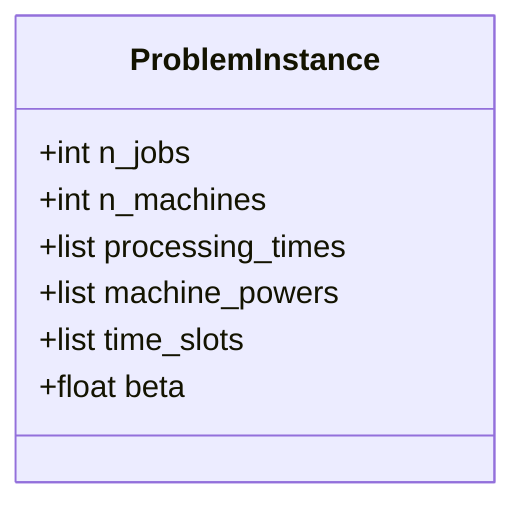
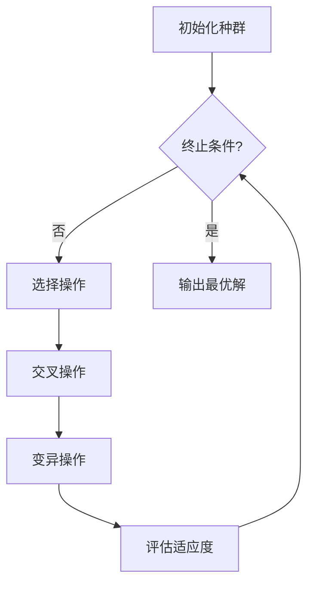

# 置换流水车间调度优化系统文档

---

## 1. 项目概述

详见[readme.md](./readme.md)

## 2. 问题建模
### 2.1 输入参数




### 2.2 约束条件


详见[readme.md](./readme.md)
1. 工序顺序约束：工件必须按机器1→机器2→机器3的顺序加工
2. 机器独占性：每台机器同时只能处理一个工件
3. 无抢占约束：工序开始后必须连续完成
4. 生产期限：总制造期 ≤ β×C（C为制造期上界）

## 3. 算法设计
### 3.1 遗传算法流程




### 3.2 关键算子
| 算子类型 | 实现方式 | 参数设置 |
|---------|---------|---------|
| 选择     | 轮盘赌选择 | 适应度=1/成本 |
| 交差     | 顺序交叉(OX) | Pc=0.8 |
| 变异     | 交换变异 | Pm=0.2 |

## 4. 核心类说明
### 4.1 GeneticAlgorithm类
```python
class GeneticAlgorithm:
    def __init__(self, pop_size, max_gen):
        # 初始化参数
        self.pop_size = pop_size  # 种群规模
        self.max_gen = max_gen    # 最大迭代次数
    
    def run(self) -> (list, float):
        # 返回最优序列和对应成本
```

### 4.2 Scheduler类
```python
class Scheduler:
    def generate_schedule(self):
        # 生成满足约束的调度方案
    
    def calculate_cost(self) -> (float, float):
        # 返回总成本和尖峰时段加工时间
```

## 5. 算法特性
| 特性 | 说明 |
|------|------|
| 时间复杂度 | O(pop_size × max_gen × n_jobs × n_machines) |
| 空间复杂度 | O(pop_size × n_jobs) |
| 最优性保证 | 通过精英保留策略避免最优解丢失 |


## 6. 示例输出 
 


## 7. 参考文献


 
## 附录：参数配置表
| 参数 | 取值 | 说明 |
|-----|-----|-----|
| pop_size | 50 | 种群规模 |
| max_gen | 200 | 最大迭代次数 |
| Pc | 0.8 | 交叉概率 |
| Pm | 0.2 | 变异概率 |
| β | 1.75 | 生产期限系数 |

 