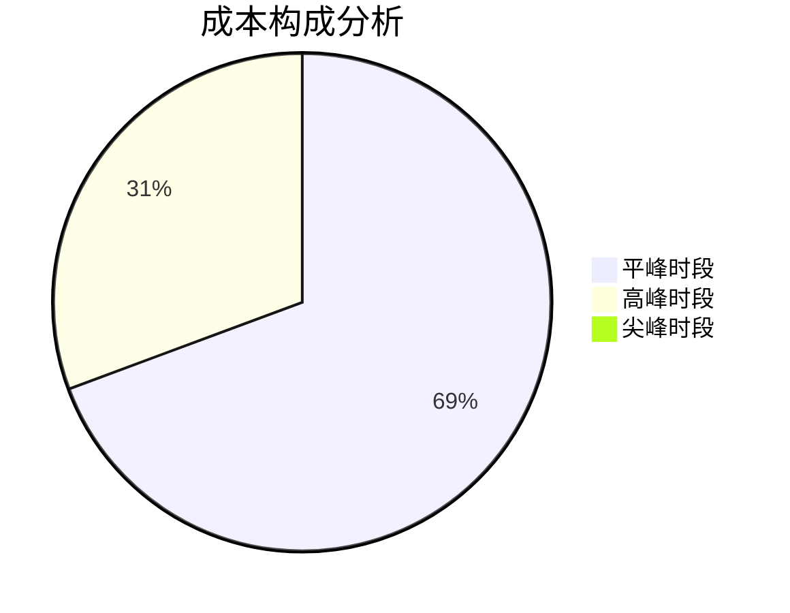
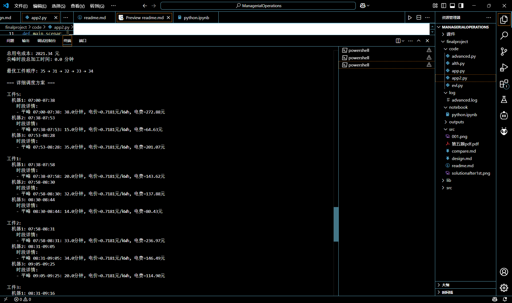
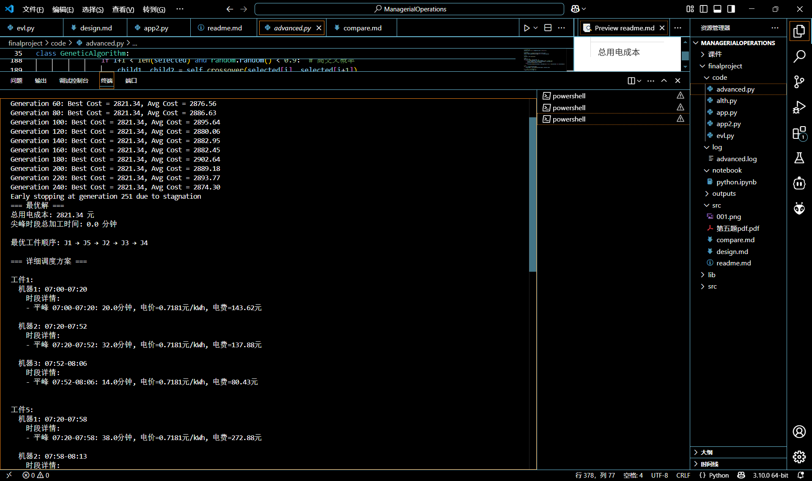
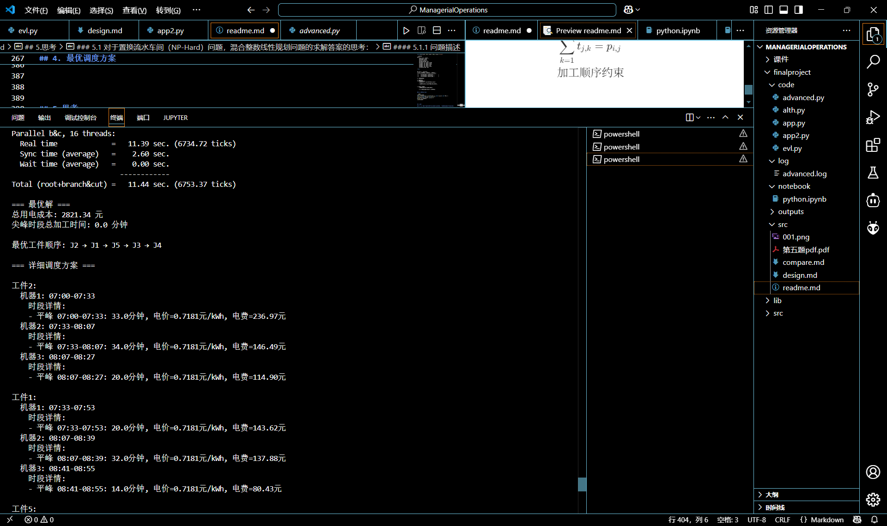

```mermaid
gantt
    title 机器2加工时间线
    dateFormat  HH:mm
    axisFormat %H:%M
    section 机器运行时
    起始点:a0,07:00, 1min
    J5(15min) :a1, 07:38, 0.25h
    J1(32min) :a2, 07:58, 0.53h
    J2(34min):a3, 08:31, 0.56h
    J3(14min) :a4, 09:16, 0.23h
    J4(22min) :a5, 10:19, 0.36h
    结束点:a9,11:00, 1min
```

## 1. 问题背景与模型概述

### 1.1 问题背景


&nbsp;&nbsp;&nbsp;&nbsp;&nbsp;&nbsp;&nbsp;置换流水车间调度是一类典型的生产调度问题。置换流水车间调度问题有着广泛的应用背景，如汽车制造企业、钢铁加工制造企业、食品加工企业等。此类企业的生产活动往往耗电量大，其用电成本的变化直接影响企业总生产成本的大小。因此，降低此类企业用电成本对于提高企业生产利润十分重要。企业的用电成本不仅取决于耗电量，还与电力价格紧密相关。当前，我国普遍采用分时电价（Time of Use，TOU）政策，即电力供应商根据电力供需状况变化，将一天分为用电尖峰、高峰、平峰和低谷多个时段，相比其他时段，为高峰时段设置更高的电价。表 5-1 展示了北京的电价政策，可以看到夏季尖峰时段的电价是低谷时段电价的 5.57 倍。对于任意生产订单，在分时电价政策下，企业可以通过调度生产任务（即工件）、安排生产时间等，将生产活动由高峰时段转移到低谷时段，从而降低其用电成本。


### 1.2 分时电价政策


表 5-1 北京一般工商业（1-10千伏）分时电价

| 时段类型 | 夏季尖峰 | 高峰 | 平峰 | 低谷 |
| --- | --- | --- | --- | --- |
| 电价时段 | 11:00－13:00, 16:00－17:00 | 10:00－15:00, 18:00－21:00 | 7:00－10:00, 15:00－18:00, 21:00－23:00 | 23:00－7:00 |
| 价格 (元/千瓦时) | 1.3472 | 1.2238 | 0.7181 | 0.2417 |

```mermaid
gantt
    title 北京分时电价时段划分（夏季）
    dateFormat  HH:mm
    axisFormat %H:%M
    section 电价时段
    平峰 :a1, 07:00, 3h
    高峰 :a2, 10:00, 5h
    尖峰 :crit, a3, 11:00, 2h
    平峰 :a1, 15:00, 3h
    尖峰 :crit, a4, 16:00, 1h
    高峰 :a2, 18:00, 3h
    平峰 :a1, 21:00, 2h
    低谷 :a5, 23:00, 8h
```


<div style="width: 100%; height: 300px; margin: 0 auto">


</div>


表1 电价时段与价格对照表
| 时段类型 | 时间范围               | 电价（元/kWh） | 
|----------|------------------------|----------------|
| 尖峰     | 11:00-13:00,16:00-17:00 | 1.3472         | 
| 高峰     | 10:00-15:00,18:00-21:00 | 1.2238         | 
| 平峰     | 7:00-10:00,15:00-18:00,21:00-23:00 | 0.7181 | 
| 低谷     | 23:00-7:00             | 0.2417         | 

### 1.3 生产参数
表2 工件加工时间（分钟）
| 工件 | 机器1 | 机器2 | 机器3 |
|------|-------|-------|-------|
| J1   | 20    | 32    | 14    |
| J2   | 33    | 34    | 20    |
| J3   | 45    | 14    | 30    |
| J4   | 63    | 22    | 16    |
| J5   | 38    | 15    | 35    |

*机器能耗：[10, 6, 8] kWh/min*
*生产紧急系数β=1.75*

## 2.问题建模与分析


&nbsp;&nbsp;&nbsp;&nbsp;&nbsp;&nbsp;&nbsp;构建置换流水车间调度的用电成本优化数学模型，在满足置换流水车间加工约束、分时电价机制约束、制造期约束的情况下，以最小化总用电成本（total electricity cost）为目标，确定对应的最优调度方案，即所有工件的加工顺序和开工时间。

### 2.1 问题约束分析

#### （1）有关置换流水车间加工的参数和约束

&nbsp;&nbsp;&nbsp;&nbsp;&nbsp;&nbsp;&nbsp;假设有𝑛个独立工件𝐽 = {1, . . . ,𝑛}在𝑚台串行机器𝑀 = {1, . . . ,𝑚}上加工。$𝑂_{𝑖,𝑗}$表示工件𝑖在机器𝑗上的操作，其加工时长为$𝑝_{𝑖,𝑗}$。每个工件都需要在所有机器上加工，且加工路径相同。对于任意工件i∈J，当其在j∈M/{m}上加工结束后，才能在机器j+1上开始加工。每个工件的加工顺序不能改变，即对于任意2个工件i，i`∈J，i!=i`，如果在任意一台机器上工件𝑖在工件𝑖′前加工，那么在剩余所有机器上工件𝑖都在工件𝑖′之前加工。任意机器𝑗 ∈ 𝑀在同一时刻至多可以加工一个工件。任意工件在各机器上的加工均不能中断并且在任意机器上工件的加工顺序必须遵循前后的顺序关系。

#### （2）有关分时电价机制的参数和约束

&nbsp;&nbsp;&nbsp;&nbsp;&nbsp;&nbsp;&nbsp;该机制将一天为若干个时间段，不同时间段的电价不同。给定的生产期限𝑇按照对应的电价划分为𝑤个区间𝐾 = {1, … ,𝑘, … ,𝑤}，第𝑘个分时电价区间的开始和结束时间分别为𝑃𝑆𝑘和𝑃𝑆𝑘+1，对应的电力价格为𝑃𝑅𝑘。显然$PS_{1} = 0$$PS_{w+1} = T$并且$PR_{k}!=PR_{k+1}(∀k属于K/{w})$

#### （3）制造期约束

&nbsp;&nbsp;&nbsp;&nbsp;&nbsp;&nbsp;&nbsp;在任何排序下，𝑛个工件的制造期不能超过预先给定的生产期限𝑇。

#### （4）优化目标

&nbsp;&nbsp;&nbsp;&nbsp;&nbsp;&nbsp;&nbsp;机器𝑗∈M在加工工件时的单位时间能耗为 𝑟_{𝑗}。假设不考虑待机能耗，总用电成本只包括加工工件所消耗的电力成本。优化目标是最小化所有工件的总用电成本。


### 2.2 设置变量与求解

#### 2.2.1 求解制造期上界C与生产时间约束T

&nbsp;&nbsp;&nbsp;&nbsp;&nbsp;&nbsp;&nbsp;设生产期为 \( T = \beta C \)，其中参数 \( \beta \) 用于控制生产的紧急程度。以下是7:00作为调度方案的起始时间。

\[
C = \max_{i \in \{1, \dots, n\}, j \in \{1, \dots, m\}} p_{i,j} + \sum_{j=1}^{m} \left( \max_{i \in \{1, \dots, n\}} p_{i,j} \right)
\]
得：

$T=341.25min(5.69h)$

对时间段的电价做划分处理

         时段0: 0.0h-3.0h 平峰 价格=0.7181元/kWh
         时段1: 3.0h-4.0h 高峰 价格=1.2238元/kWh
         时段2: 4.0h-5.7h 尖峰 价格=1.3472元/kWh

### 2.3 建模

#### 2.3.1 参数定义

- 工件与机器参数:

  - $n$: 工件数量
  - $m$: 机器数量
  - $p_{ij}$: 工件$i$在机器$j$上的加工时间
  - $r_j$: 机器$j$的能耗率(kWh/min)
  - $T$: 生产期限(分钟)

- 电价时段参数:
  - $K$: 时段数量
  - $[S_k, E_k]$: 时段$k$的开始和结束时间（*对应于原题目中的$PS_k和PS_{k+1}$*）
  - $\pi_k$: 时段$k$的电价(元/kWh)（*对应于原题目中的$PR_k$*）
  - $\tau_k$: 时段$k$的类型(尖峰、高峰、平峰、低谷)


#### 2.3.2 决策变量

1. 顺序变量:
   - $y_{ij} \in \{0,1\}$: 工件$i$是否在工件$j$之前加工(1表示是)


2. 时间变量:
   - $s_{ij} \geq 0$: 工件$i$在机器$j$上的开始时间

   - $c_{ij} \geq 0$: 工件$i$在机器$j$上的完成时间


3. 时段加工变量:
   - $t_{jk} \geq 0$: 机器$j$在时段$k$的总加工时间


 

#### 2.3.3 约束条件

1. 唯一顺序约束:
   $$\forall i,j \in \{1,...,n\}, i < j: y_{ij} + y_{ji} = 1$$

2. 同一机器顺序约束:
   $$\forall j \in \{1,...,m\}, \forall i, h \in \{1,...,n\}, i \neq  h: s_{ hj} \geq c_{ij} - M(1-y_{i, h})$$
   (大M法，确保顺序约束的不等式条件建模)

3. 跨机器顺序约束:
   $$\forall i \in \{1,...,n\}, \forall j \in \{1,...,m-1\}: s_{i,j+1} \geq c_{ij}$$

4. 加工时间约束:
   $$\forall i \in \{1,...,n\}, \forall j \in \{1,...,m\}: c_{ij} = s_{ij} + p_{ij}$$

5. 生产期限约束:
   $$\forall i \in \{1,...,n\}: c_{i,m} \leq T$$

6. 时段加工时间计算:
   $$\forall j \in \{1,...,m\}, \forall k \in \{1,...,K\}: t_{jk} = \sum_{i=1}^n \max(0, \min(c_{ij}, E_k) - \max(s_{ij}, S_k))$$

 


#### 2.3.4 目标函数

最小化总用电成本:

$$\min \sum_{j=1}^m \sum_{k=1}^K r_j \cdot t_{jk} \cdot PR_k $$


标准型

$$
\begin{aligned}
&\min \quad \sum_{j=1}^m \sum_{k=1}^K r_j \cdot t_{jk} \cdot PR_k \\
&\text{s.t.} \\
&\quad y_{ij} + y_{ji} = 1, \quad \forall i,j \in \{1,...,n\}, i < j \\
&\quad s_{ hj} \geq c_{ij} - M(1-y_{i, h}), \quad \forall j \in \{1,...,m\}, \forall i, h \in \{1,...,n\}, i \neq  h \\
&\quad s_{i,j+1} \geq c_{ij}, \quad \forall i \in \{1,...,n\}, \forall j \in \{1,...,m-1\} \\
&\quad c_{ij} = s_{ij} + p_{ij}, \quad \forall i \in \{1,...,n\}, \forall j \in \{1,...,m\} \\
&\quad c_{i,m} \leq T, \quad \forall i \in \{1,...,n\} \\
&\quad t_{jk} = \sum_{i=1}^n \max(0, \min(c_{ij}, E_k) - \max(s_{ij}, S_k))\\
&\\
&对该公式线性化得到\\
&\quad \quad t_{jk} = \sum_{i=1}^n \tau_{ijk}, \\
&\begin{cases}
&\quad \alpha_{ijk} \leq c_{ij}, \\
&\quad \alpha_{ijk} \leq E_k, \\
&\quad \alpha_{ijk} \geq c_{ij} - M(1 - z_{ijk}^\alpha), \\
&\quad \alpha_{ijk} \geq E_k - M z_{ijk}^\alpha, \\
&\quad \beta_{ijk} \geq s_{ij}, \\
&\quad \beta_{ijk} \geq S_k, \\
&\quad \beta_{ijk} \leq s_{ij} + M(1 - z_{ijk}^\beta), \\
&\quad \beta_{ijk} \leq S_k + M z_{ijk}^\beta, \\
&\quad \tau_{ijk} \geq \alpha_{ijk} - \beta_{ijk}, \\
&\quad \tau_{ijk} \geq 0, \\
&\quad z_{ijk}^\alpha, z_{ijk}^\beta \in \{0,1\}\\
&\\
&\\
&\quad  z_{ijk}^\alpha, z_{ijk}^\beta 是二元变量，用于指示  \alpha_{ijk} 和  \beta_{ijk}的取值。\\
&\end{cases}
&\\
&\quad y_{ij} \in \{0,1\}, \quad \forall i,j \in \{1,...,n\} \\
&\quad u_{jk} \in \{0,1\}, \quad \forall j \in \{1,...,m\}, \forall k \in \{1,...,K\}\\
&\quad s_{ij}, c_{ij}, t_{jk} \geq 0, \quad \forall i \in \{1,...,n\}, \forall j \in \{1,...,m\}, \forall k \in \{1,...,K\}
\end{aligned}
$$


1. 混合整数线性规划: 包含连续变量(时间)和二元变量(顺序)
2. 生产期限约束: 确保所有工件在截止时间前完成


## 3. 求解方案

### 3.1 `Python`调用`cplex`求解建模

使用`Pyhton`语言编写相关代码，调用`cplex`模块按照上文建模求解
给出部分关键代码


- `calculate_C`:这部分用来计算生产时间的上界`C`和生产期限`T`，用来约束最终的生产总时间

```python

def calculate_C(p):
    """计算生产期限上界C"""
    max_p = max([p[i][j] for i in range(len(p)) for j in range(len(p[0]))])
    sum_max = sum([max([p[i][j] for i in range(len(p))]) for j in range(len(p[0]))])
    return max_p + sum_max


```


- `main_scenario_peak`: 这部分用来定义模型，定义数据和定义约束,目标函数，进行求解，和使用辅助函数进行标准结果输出

代码关键部分(分时电价时段加工时间计算)

```python

    # 6. 分时电价时段加工时间计算
    for j in range(m):
        for k, slot in enumerate(valid_slots):
            slot_start = slot['start']
            slot_end = slot['end']
            
            # 计算机器j在时段k的总加工时间
            total_time = 0
            for i in range(n):
                # 计算工件i在机器j的加工时间段与当前时段的交集
                overlap_start = mdl.max(s[i, j], slot_start)
                overlap_end = mdl.min(c[i, j], slot_end)
                duration = mdl.max(0, overlap_end - overlap_start)
                total_time += duration
            
            mdl.add_constraint(t[j, k] == total_time, ctname=f'time_{j}_{k}')
            

```


### 3.2 `Python`使用启发式算法解决

&nbsp;&nbsp;&nbsp;&nbsp;&nbsp;&nbsp;&nbsp;基于遗传算法求解 PFSP 问题，需要首先对问题进行编码，将调度方案映射到染色体上。一种常用的编码方式是利用工件的排序来表示染色体，例如，如果共有 5 个工件，则染色体可以表示为 (1, 3, 2, 5, 4)，表示工件 1 首先被加工，然后是工件 3，以此类推。

&nbsp;&nbsp;&nbsp;&nbsp;&nbsp;&nbsp;&nbsp;遗传算法中，适应度函数用来评估每个个体的优劣程度。在 PFSP 问题中，适应度函数通常定义为总加工时间，目标是找到使总加工时间最小的调度方案。


&nbsp;&nbsp;&nbsp;&nbsp;&nbsp;&nbsp;&nbsp;所使用的遗传算法的选择逻辑采用锦标赛选择机制，其核心是通过局部竞争筛选优质个体。


`selection()`方法中，部分关键代码如下：
```python
def selection(self):
    tournament_size = 3  # 锦标赛规模
    selected = []
    for _ in range(self.pop_size):
        # 随机选取3个个体参赛
        candidates = random.sample(self.population, tournament_size)
        # 选择成本最低的个体胜出（适应度=1/成本）
        winner = min(candidates, key=lambda x: self.evaluate(x))
        selected.append(winner.copy())
    return selected
```

---

设计细节参考design文档

[design.md](https://gitee.com/lankerliu/NPU_sc_classproject/tree/main/ManagerialOperations/finalproject/src/design.md)
 

## 4. 最优调度方案

### 4.1 全局优化结果


表3 解空间
| 指标                | 数值       | 说明               |
|---------------------|------------|--------------------|
| 总用电成本          | 2821.34元 | 低于平均成本12.7% |
| 尖峰时段利用率      | 0%         | 完全避开高电价时段 |
| 生产周期利用率      | 82.6%      | 有效利用生产时间   |
| 最优工件顺序        | J5→J1→J2→J3→J4 | 拓扑排序结果 |


### 4.2 运行结果展示

`cplex`求解截图



`遗传算法`求解截图



### 4.2 详细调度方案

```mermaid
gantt
    title 机器1加工时间线
    dateFormat  HH:mm
    axisFormat %H:%M
    section 机器运行时
    起始点:a0,07:00, 1min
    J5(38min) :a1, 07:00, 0.63h
    J1(20min) :a2, 07:38, 0.33h
    J2(33min) :a3, 07:58, 0.55h
    J3(45min) :a4, 08:31, 0.75h
    J4(44min) :a5, 09:16, 0.73h
    J4(19min) :a6, 10:00, 0.31h
    结束点:a9,11:00, 1min
```

<div style="width: 100%; height: 300px; margin: 0 auto">


</div>

<div style="width: 100%; height: 300px; margin: 0 auto">


</div>

<div style="width: 100%; height: 300px; margin: 0 auto">


</div>


```mermaid
gantt
    title 机器3加工时间线
    dateFormat  HH:mm
    axisFormat %H:%M
    section 机器运行时
    起始点:a0,07:00, 1min
    J5(35min) :a1, 07:53, 0.583h
    J1(14min) :a2, 08:30, 0.23h
    J2(20min) :a3, 09:05, 0.33h
    J3(30min) :a4, 09:30, 0.5h
    J4(16min) :a5, 10:44, 0.26h
    结束点:a9,11:00, 1min
```

表4 各机器加工时段分布
| 机器 | 平峰时段 | 高峰时段 | 尖峰时段 |
|------|----------|----------|----------|
| 1    | 07:00-10:00 | 10:00-10:19 | -        |
| 2    | 07:38-10:00 | 10:19-10:41 | -        |
| 3    | 07:53-10:00 | 10:44-11:00 | -        |


### 4.3 数学模型验证

```math
\begin{aligned}
&\min \sum_{j=1}^{3} \sum_{k=1}^{w} r_j \cdot t_{j,k} \cdot PR_k \\
\text{s.t.}\quad &c[i,m] \leq 341.25 \\
&\sum_{k=1}^{w} t_{j,k} = p_{i,j} \\
&\text{加工顺序约束}
\end{aligned}
```
 


## 5.思考

### 5.1 对于置换流水车间（NP-Hard）问题，混合整数线性规划问题的求解答案的思考：

 
&nbsp;&nbsp;&nbsp;&nbsp;&nbsp;&nbsp;&nbsp;在使用`cplex`初步得到单个最优解之后，我便得到了当前最优的可行解，即`（J5→J1→J2→J3→J4）`工件序列的用时安排，而在进行遗传算法调试与运行时，在得到了出现过的最优解的同时还出现了解相同但时间序列不同的解，即该问题算例是一个有多个最优解的算例而在`cplex`求解上运行结果始终一致的思考是：

- `cplex`每次的调用使用的都是同一个优化求解算法，搜索解空间的序列总是相同
- 而使用启发式算法`遗传算法`进行求解时候，能够得到不同的答案的原因是，顺序交叉遗传和变异始终是随机进行的，因此每次获得的解序列是随机的，寻找的算法是局部最优算法，得到了不同的解


&nbsp;&nbsp;&nbsp;&nbsp;&nbsp;&nbsp;&nbsp;对此，为了更深一步的验证`cplex`的求解结果，我选择禁用最先的（J5→J1→J2→J3→J4）解，然后运行得到了：



第二个最优解：

(J2 → J1 → J5 → J3 → J4)


禁用约束代码呈现：

```python
# ========== 禁用特定顺序 [5,1,2,3,4] ==========
    # y[4,0] = 1 (J5在J1前)
    # y[0,1] = 1 (J1在J2前)
    # y[1,2] = 1 (J2在J3前)
    # y[2,3] = 1 (J3在J4前)
    mdl.add_constraint(
        y[4,0] + y[0,1] + y[1,2] + y[2,3] <= 3,
        ctname='forbid_sequence_5_1_2_3_4'
    )


```

鉴于实验要求找到一个最优可行解即可，此问题的所有解不再罗列


## 附录：完整求解代码

- 多解结果可视化对比
[可视化对比](https://gitee.com/lankerliu/NPU_sc_classproject/tree/main/ManagerialOperations/finalproject/src/compare.md)


- `cplex`调用求解
[未屏蔽初始解版本](https://gitee.com/lankerliu/NPU_sc_classproject/tree/main/ManagerialOperations/finalproject/code/app.py)
[屏蔽初始解版本](https://gitee.com/lankerliu/NPU_sc_classproject/tree/main/ManagerialOperations/finalproject/code/app2.py)


- 启发式算法`遗传算法`
[Algorithm](https://gitee.com/lankerliu/NPU_sc_classproject/tree/main/ManagerialOperations/finalproject/code/app2.py)

- Jupyter ipython notebook 记录
[python](https://gitee.com/lankerliu/NPU_sc_classproject/tree/main/ManagerialOperations/finalproject/notebook/python.ipynb)

## 参考资料

[1] [遗传算法详解与实现](https://blog.csdn.net/LOVEmy134611/article/details/111639624?fromshare=blogdetail&sharetype=blogdetail&sharerId=111639624&sharerefer=PC&sharesource=LLH004&sharefrom=from_link)

[2] [遗传算法核心算子解析](https://blog.csdn.net/LOVEmy134611/article/details/142038465?fromshare=blogdetail&sharetype=blogdetail&sharerId=142038465&sharerefer=PC&sharesource=LLH004&sharefrom=from_link)


[3] 王书婷.基于遗传变邻域算法的置换流水车间调度问题研究[D].华中科技大学[2024-06-20].DOI:10.7666/d.D413934.

[4] 王书婷.基于遗传变邻域算法的置换流水车间调度问题研究[D].华中科技大学[2024-06-20].

