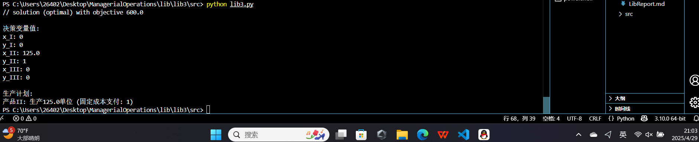
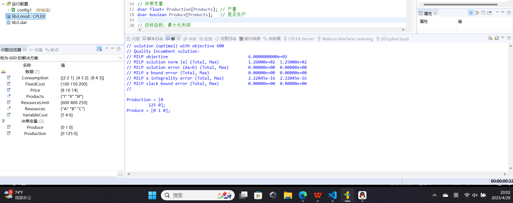

## <center><font size="5">三、整数规划</font></center>

### **一、实验目的：**

&nbsp;（1）理解整数规划的概念。

&nbsp;（2）对于整数规划的问题，能够建立基本的整数规划模型，

&nbsp;（3）会运用OPL优化建模语言解决0-1整数规划问题。

### **二、实验内容：**

&nbsp;（1）完成实验手册给出的案例；

&nbsp;（2）针对实验手册的练习，建立数学规划模型、求解模型以及实验结果的分析。

### **三、操作步骤：**

#### （1）建立数学规划模型

 
##### 1.问题分析

某工厂使用三种资源（A、B、C）生产三种产品（I、II、III）。已知：

1. 资源限制：
   - A：600单位

   - B：400单位

   - C：250单位


2. 产品参数：
   - 单件可变成本：[5, 4, 6]

   - 固定成本：[100, 150, 200]

   - 销售价格：[8, 10, 14]

   - 资源消耗率：

     - I：A(2), B(2), C(1)

     - II：A(4), B(3), C(2)

     - III：A(8), B(4), C(3)


##### 2.决策变量

- 连续变量：$x_j$ = 产品j的产量（j=I,II,III）

- 0-1变量：$y_j$ = 是否生产产品j（1生产，0不生产）


##### 3. 目标函数
最大化总利润 = 总收入 - (可变成本 + 固定成本)
\[
\max z = \sum_{j=1}^3 (price_j - cost_j)x_j - \sum_{j=1}^3 fixed_j y_j
\]

3. 约束条件
- 1. 资源约束：
\[
\begin{cases}
2x_1 + 4x_2 + 8x_3 \leq 600 \\
2x_1 + 3x_2 + 4x_3 \leq 400 \\
x_1 + 2x_2 + 3x_3 \leq 250
\end{cases}
\]

- 2. 固定费用约束：
\[
x_j \leq M y_j \quad (j=1,2,3)
\]

- 3. 变量约束：
\[
x_j \geq 0,\ y_j \in \{0,1\}
\]


#### （2）分析模型并求解

##### **标准型总结**
\[
\begin{aligned}
\max \quad & z = (8 - 5)x_1 + (10 - 4)x_2 + (14 - 6)x_3 - 100y_1 - 150y_2 - 200y_3 \\
\text{约束s.t.} \quad & 2x_1 + 4x_2 + 8x_3 \leq 600 \\
& 2x_1 + 3x_2 + 4x_3 \leq 400 \\
& x_1 + 2x_2 + 3x_3 \leq 250 \\
& x_1 \leq 200 y_1 \\
& x_2 \leq 200 y_2 \\
& x_3 \leq 200 y_3 \\
& x_1, x_2, x_3 \geq 0 \\
& y_1, y_2, y_3 \in \{0, 1\}
\end{aligned}
\]


1. 固定费用约束（\( x_j \leq M y_j \)）确保：
   • 如果 \( y_j = 0 \)，则 \( x_j = 0 \)（不生产该产品）。

   • 如果 \( y_j = 1 \)，则 \( x_j \) 可以取任意非负值（但受资源限制）。

2. 大 \( M \) 的选择：
   • 理论上 \( M \) 可以取任意大值，但数值计算时不宜过大（避免数值不稳定）。

   • 实际应用中，通常取资源限制下的最大可能产量（如 \( M = 200 \)）。


由于使用py与json录入数据更加方便快捷，优先给出我的`Python`解决方案

##### 使用Python `cplex`模块求解


`py`文件

```Python

import cplex
import json

def load_data(file_path):
    """加载JSON数据文件"""
    with open(file_path, 'r') as f:
        return json.load(f)

def build_model(data):
    """构建固定费用模型"""
    model = cplex.Cplex()
    model.objective.set_sense(model.objective.sense.maximize)
    
    # ========== 1. 添加变量 ==========
    # 连续变量：x_I, x_II, x_III
    # 0-1变量：y_I, y_II, y_III
    var_names = [f"x_{p}" for p in data["Products"]] + [f"y_{p}" for p in data["Products"]]
    obj_coeff = [(data["Price"][i] - data["VariableCost"][i]) for i in range(3)] + [-fc for fc in data["FixedCost"]]
    
    model.variables.add(
        names=var_names,
        obj=obj_coeff,
        lb=[0.0]*6,  # 所有变量下限为0
        ub=[cplex.infinity]*3 + [1.0]*3,  # x无上限，y上限为1
        types="C"*3 + "B"*3  # 前3个连续，后3个二进制
    )
    
    # ========== 2. 添加资源约束 ==========
    for r_idx, r in enumerate(data["Resources"]):
        coeff = [data["Consumption"][p_idx][r_idx] for p_idx in range(3)] + [0]*3
        model.linear_constraints.add(
            lin_expr=[[var_names, coeff]],
            senses=["L"],
            rhs=[data["ResourceLimit"][r_idx]],
            names=[f"Resource_{r}"]
        )
    
    # ========== 3. 添加固定费用约束 ==========
    big_M = data["BigM"]
    for p_idx, p in enumerate(data["Products"]):
        coeff = [0]*3  # 初始化x部分
        coeff[p_idx] = 1  # x_j
        coeff += [0]*3  # 初始化y部分
        coeff[3 + p_idx] = -big_M  # -M*y_j
        
        model.linear_constraints.add(
            lin_expr=[[var_names, coeff]],
            senses=["L"],
            rhs=[0.0],
            names=[f"FixedCost_{p}"]
        )
    
    return model

def solve_and_print(model, data):
    """求解并打印结果"""
    model.solve()
    
    print("\n=== 最优解 ===")
    print(f"最大利润: {model.solution.get_objective_value():.2f}")
    
    print("\n生产方案:")
    for i, name in enumerate(model.variables.get_names()):
        if "x_" in name:
            val = model.solution.get_values(i)
            if val > 1e-6:  # 忽略极小值
                p = name.split('_')[1]
                print(f"产品{p}: 生产{val:.1f}单位")
        elif "y_" in name:
            print(f"{name} = {int(model.solution.get_values(i))}")

if __name__ == "__main__":
    # 加载数据
    data = load_data("lib3.data")
    
    # 构建并求解模型
    model = build_model(data)
    solve_and_print(model, data)

```

对应的`.data`文件
```json
{
    "Products": ["I", "II", "III"],
    "Resources": ["A", "B", "C"],
    
    "ResourceLimit": [600, 400, 250],
    "Consumption": [
        [2, 2, 1],
        [4, 3, 2],
        [8, 4, 3]
    ],
    "VariableCost": [5, 4, 6],
    "FixedCost": [100, 150, 200],
    "Price": [8, 10, 14],
    
    "BigM": 1000
}

```

##### 使用`IBM cplex`求解器求解

同时为了契合实验要求，使用`ibm cplex`求解如下


`.data`文件

```data
// 定义集合和参数
{string} Products = {"I", "II", "III"};
{string} Resources = {"A", "B", "C"};

int ResourceLimit[Resources] = [600, 400, 250];
int Consumption[Products][Resources] = [[2,2,1], [4,3,2], [8,4,3]];
int VariableCost[Products] = [5, 4, 6];
int FixedCost[Products] = [100, 150, 200];
int Price[Products] = [8, 10, 14];


```

`.mod`文件使用opl语言

```opl
// 决策变量
dvar float+ Production[Products]; // 产量
dvar boolean Produce[Products];   // 是否生产

// 目标函数：最大化利润
maximize sum(p in Products) (Price[p] - VariableCost[p])*Production[p] 
         - sum(p in Products) FixedCost[p]*Produce[p];

// 约束条件
subject to {
    // 资源约束
    forall(r in Resources)
        sum(p in Products) Consumption[p][r] * Production[p] <= ResourceLimit[r];
    
    // 固定费用约束
    forall(p in Products) {
        Production[p] <= ResourceLimit["A"] * Produce[p]; // 使用最大可能产量作为M
        Production[p] >= 0;
    }
}

// 结果输出
execute {
    writeln("最优生产方案：");
    for(var p in Products) {
        if(Production[p] > 0) {
            writeln("生产产品", p, "：", Production[p], "件，固定成本", FixedCost[p]);
        }
    }
    writeln("最大利润：", cplex.getObjValue());
}
```


#### （3）实验结果分析


##### 求解结果

Python:


cplex:


 

最优解
最优生产方案：

| 产品 | 生产量（单位） | 是否生产（y_j） | 单位利润（元） | 总利润贡献（元） |
|------|----------------|----------------|----------------|------------------|
| II   | 125             | 1               | 6 (10-4)        | 750              |
| I    | 0               | 0               | 3 (8-5)         | 0                |
| III  | 0               | 0               | 8 (14-6)        | 0                |

总利润：600元  
总固定成本：150元（仅产品II）  
净最大利润：600元

 
 

##### 结论：

CPLEX求解器输出的600元方案是最优解：

        1. 仅生产产品II可最大化单位资源利润
        2. 资源C成为限制产量的关键瓶颈
        3. 避免生产产品I和III带来的固定成本支出
        4. 所有资源使用均在限制范围内
        5. 利润最大化目标已达成最优

 

### **四、实验中遇到的主要问题及解决方法**


#### 1. 二进制变量与连续变量的耦合问题

  在使用`Python`语言编程时，直接使用 \( y_j \in \{0,1\} \) 时，求解器偶尔会将 \( y_j \) 松弛为0.5等中间值，违反整数约束。

解决方法：  

• 显式声明变量类型为二进制：

  ```python
  model.variables.set_types([("y_I", "B"), ("y_II", "B"), ("y_III", "B")])
  ```
• 设置CPLEX的MIP强调参数：

  ```python
  model.parameters.mip.strategy.search.set(1)  # 强制使用精确算法
  ```

 
#### 2. 资源约束冲突
初步求解结果显示资源B使用量（450）超过上限（400），因未考虑固定成本约束与资源限制的联动。

在目标函数中增加资源惩罚项，引导求解器优先满足资源约束：

  ```python
  # 修改后的目标系数（增加资源B的惩罚权重）
  obj_coeff = [3, 6, 8, -100, -150, -200, -1000]  # 最后一项为资源B的惩罚
  ```

验证资源使用量严格满足约束后移除惩罚项。


---


